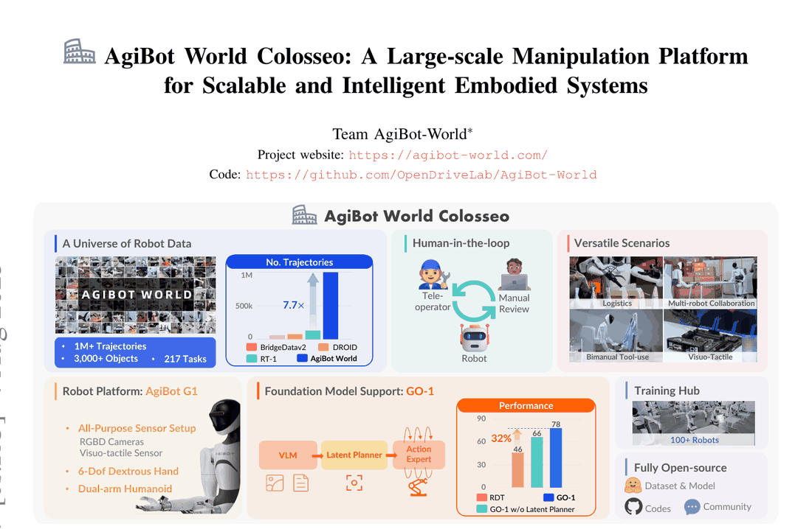
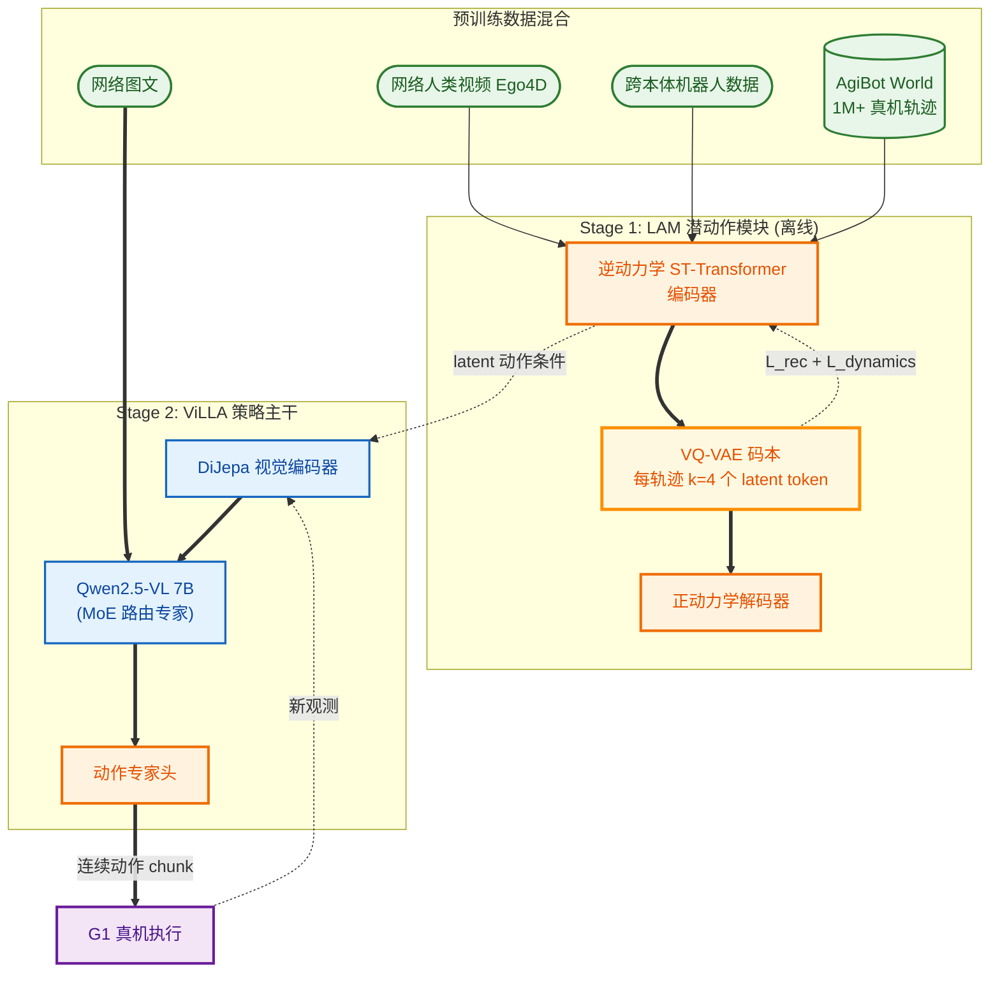

# AgiBot World Colosseo: A Large-scale Manipulation Platform for Embodied AI (with Genie Operator-1)

- arXiv: https://arxiv.org/abs/2503.06669
- Source: IROS 2025（camera-ready，2025-07 更新加入 pi0 对照）
- Project: https://agibot-world.com/ | https://github.com/OpenDriveLab/AgiBot-World
- Local PDF: `papers/data/AgiBotWorld_GO-1_2503.06669.pdf`
- Year: 2025
- Category: company dataset + generalist policy (AgiBot)
- Priority: high

## 一句话总结

机器人操作缺高质量大规模数据（Problem），AgiBot 用 4000 m² 场地、100+ 台同构 G1 人形、标准化采集 + 人为环校验造出 1,001,552 条轨迹 / 2976.4 小时 / 217 任务 / 106 场景的开源数据集，比此前最大单源真机数据集高一个数量级（Insight：数据质量与规模可以由「自建采集工厂」工业化生产）；在此之上提出 GO-1——ViLLA 三阶段架构（VLM + 隐动作规划器 + 扩散动作专家），用隐动作表征打通网页级人类视频与机器人控制（Mechanism）；证据：RDT 预训练换用 AgiBot 数据后域内/域外分别 +0.30 / +0.29（0.77 vs 0.47、0.67 vs 0.38），GO-1 六任务平均 0.60，比 RDT-1B（0.36）高 32 个百分点，且 9.2k→1M 轨迹呈幂律（Pearson r=0.97）（Evidence）。

## 九问速览

1. **Problem**：真机操作泛化被数据卡死——现有数据集短程、实验室化、采集无标准化、质量无保障。
2. **Bottleneck**：异构硬件导致碎片化低质数据；带动作标签的机器人数据远小于网页级视频。
3. **Insight**：隐动作（latent action）可作中间表征，把网页视频动态知识桥接到机器人动作生成。
4. **Method**：ViLLA 三阶段：LAM 学隐动作 → latent planner 做长程规划 → 扩散 action expert 出动作。
5. **Evidence**：1M+ 轨迹/2976.4h；较 OXE 预训练域内 +0.30（0.77 vs 0.47）；GO-1 平均 0.60 vs RDT 0.36。
6. **Ablation**：去 latent planner 平均 −0.12；仅 528 条人工校验数据比 1010 条混合 +0.18。
7. **Assumption**：LAM 隐动作跨本体可迁移；头视角监督的隐动作足以引导双腕动作生成。
8. **Failure**：自认局限——全部评测在真机、无仿真复现；部分任务（如 Pour Water）基线接近 0。
9. **Opportunity**：数据+工具链+权重开源（CC BY-NC-SA 4.0）；约 1% failure-recovery 数据可用于对齐/反思。

| 维度 | 论文答案 |
|---|---|
| Perception | 8 摄像头（前 RGB-D + 3 鱼眼、双腕 RGB-D/鱼眼、后双鱼眼）+ 本体感知，30 Hz 记录（Sec III-A） |
| Closed-loop | action expert 出 30 步动作 chunk（H=30）后执行；重规划频率未报告，闭环机制未显式描述 |
| Correction | 无显式纠错模块；~1% 失败恢复轨迹（带失败原因+时间戳标注）隐式提供纠错示范 |
| Deployment | 100+ 台 AgiBot G1 自家场地采集、自家评测（无第三方）；数据/代码/权重开源，许可证 CC BY-NC-SA 4.0（非商用） |

## 核心技术

信息流拆解（ViLLA 三阶段，Fig. 4）：

*论文 Figure 1（p1）：Fig. 1: Introducing AgiBot World Colosseo, an open-sourced large-scale manipulation platform compris*

1. **Stage 1 — LAM（Latent Action Model）**：在互联网尺度异构数据（人类视频，含 Ego4D）上训练编码器-解码器隐动作模型。编码器为逆动力学 $I(z_t|I_t, I_{t+H})$（时空 transformer + 因果时间掩码，跟随 Genie [30]）；解码器为前向动力学 $F(I_{t+H}|I_t, z_t)$（空间 transformer，输入初始帧 + 离散化隐动作 token）。$k=4$ 个 token，VQ-VAE 量化，码本大小 $|C|$。
2. **Stage 2 — Latent Planner**：VLM 骨干 InternVL2.5-2B（先在网页级图文预训练），多视角图像经 InternViT 编码投影到语言空间；latent planner 为 24 层 transformer，对 VLM 逐层条件化（layer-by-layer）+ 全双向注意力，以掩码语言建模预测离散隐动作 token $P(z_t|I^h_t, I^l_t, I^r_t, l)$，监督来自头视角的 LAM 编码输出 $z_t := I(I^h_t, I^h_{t+H})$。隐动作空间「比 OpenVLA 的离散低层动作小多个数量级」，便于 VLM 高效迁移。
3. **Stage 3 — Action Expert**：与 latent planner 同构的扩散模块（迭代去噪回归连续低层动作），出 30 步动作 chunk $A_t$，条件为本体状态 $p_t$ 与视觉/指令；层级式条件化（VLM → latent planner → action expert，且 action expert 自身也参与条件流）。推理时先出 $k$ 个隐动作 token，再以其条件化去噪过程产出控制信号。

训练/冻结状态：VLM 为网页级预训练初始化；LAM 的隐动作作为 Stage 2 伪标签。**论文未明说 VLM/LAM 在 Stage 2/3 是否冻结**（待确认：仅写了 action expert 与 latent planner 在 Stage 3 联合训练）。微调超参：lr 2e-5、batch 768、30,000 步（Sec V-A2）。

数据管线（Sec III-B）：可行性预采集→制定采集标准→熟练遥操作员正式采集（边缘侧有效性校验，如查丢帧）→云端上传→标注员逐条对标准核验 + 语言标注→不合格丢弃；并为每条轨迹标注物品/场景/技能（子任务分段）/任务级标签，长程任务提供子步骤关键帧 + 指令标注。

## 底层原理与数学推导

**(1) LAM 的 VQ-VAE 目标**（论文只写「VQ-VAE objective, codebook size |C|」，具体项跟随 Genie [30]）：

$$
\mathcal{L}_{\mathrm{LAM}} \;=\; \underbrace{\big\| I_{t+H} - F\big(I_t, \mathbf{z}_t\big) \big\|_2^2}_{\text{前向重构}} \;+\; \beta \, \underbrace{\big\| \mathrm{sg}\!\left[\mathbf{e}(I_t, I_{t+H})\right] - \mathbf{z}_t^{\mathrm{cb}} \big\|_2^2}_{\text{码本/承诺项}}
$$

其中 $\mathbf{z}_t = [z^0_t, \dots, z^{k-1}_t]$，$k=4$；$\mathrm{sg}[\cdot]$ 为 stop-gradient。直觉：解码器只能通过 4 个离散 token 重建 $H$ 步后的未来帧，迫使编码器把「帧间发生了什么」压缩成与本体无关的动作摘要（信息瓶颈消除外观/纹理噪声）。

**(2) Latent planner 的掩码语言建模目标**：

$$
\mathcal{L}_{\mathrm{LP}} \;=\; -\sum_{j=0}^{k-1} \log P_\theta\!\left(z^{j}_t \;\middle|\; I^{h}_t, I^{l}_t, I^{r}_t,\; l,\; z^{<j}_t\right), \qquad z^{j}_t \sim \mathrm{VQ\text{-}codebook}
$$

监督信号 $z_t := I(I^h_t, I^h_{t+H})$ 来自冻结的 LAM 编码器（仅用头视角）。这是「蒸馏一个视频基础模型进 VLM」：规划器学的是在 VLM 语义空间里预测下一步动作摘要，而非直接回归关节角。

**(3) Action expert 的扩散目标**（Sec IV-C「diffusion objective / iterative denoising」，DDPM 式标准形）：

$$
\mathcal{L}_{\mathrm{AE}} \;=\; \mathbb{E}_{\tau \sim \mathcal{U}(0,1),\, \epsilon \sim \mathcal{N}(0,\mathbf{I})}\; \big\| \epsilon - \epsilon_\theta\big(A^{\tau}_t,\, \tau;\, I^{h,l,r}_t,\, p_t,\, l,\, \mathbf{z}_t\big) \big\|_2^2
$$

$A_t = [a_t, \dots, a_{t+H}]$，$H=30$；$\epsilon_\theta$ 以视觉、指令、本体状态与隐动作规划 $\mathbf{z}_t$ 为条件去噪。三段目标的关系：$\mathcal{L}_{\mathrm{LAM}}$ 塑造离散动作语义空间 → $\mathcal{L}_{\mathrm{LP}}$ 把该空间嫁接到 VLM → $\mathcal{L}_{\mathrm{AE}}$ 在其条件下补出高频连续控制。

## 物理直觉解释

**隐动作是「动作的世界语」**。想象两个人类视频：一个是母亲用手叠 T 恤，一个是机器人夹爪叠 T 恤——像素层面毫无共通，但「抓住下摆→对折→再对折」这一动作骨架相同。LAM 就像一个只允许用 4 个词描述「接下来发生了什么」的速记员：它被迫丢掉手有几根手指、袖口什么颜色这些本体与外观细节，只留下动作摘要。GO-1 再把这本「速记词典」教给 VLM，于是 10 亿帧无动作标签的人类视频都变成了机器人规划的教材——**相当于让机器人先看遍人类怎么做，再学自己怎么做**。

**Latent planner 是「分镜师」，action expert 是「原画师」**。直接让 VLM 输出 30 步连续控制，就像让小说家一帧帧画动画——语义强但节奏乱，动作开头会迟疑（论文 human-in-the-loop 分析恰好发现数据中空转帧导致策略「开局长停顿」）。ViLLA 的分工是：VLM+latent planner 先用 4 个离散 token 画出这一秒的「分镜」（往哪伸、抓完往哪放），action expert 再在分镜约束下用扩散过程精修出 30 步连续轨迹。**这是大脑运动皮层「运动计划→运动执行」两级结构的工程再现**——消融里去掉分镜师平均掉 0.12 分，叠短裤这类多阶段长程任务掉得最狠，说明长程任务的成败在分镜层而非画技层。

**数据工厂是「米其林中央厨房」**。4000 m² 场地、5 大域 106 个场景、100+ 台同构机器人、统一采集 SOP、逐条人工核验——把「数据采集」从手工作坊变成流水线：同一道菜（任务）在任何门店（机器人）味道一致（同构数据），且每盘菜出锅前都有质检员尝过（human-in-the-loop）。甚至失败也有价值：掉在地上的菜捡起来的过程被完整录下并标注（~1% failure-recovery 数据），策略因此见过「错误→恢复」的完整弧线。528 条校验数据胜过 1010 条混合数据（+0.18）证明：**中央厨房的质检环节本身就是生产力**。

## 工程细节与实操指南

- **采集硬件（AgiBot G1）**：双 7-DoF 臂 + 移动底盘 + 可调腰；末端模块化（标准夹爪 / 6-DoF 灵巧手），触觉任务用带视触觉传感器的夹爪；8 摄像头（前 RGB-D + 3 鱼眼、每末端 RGB-D 或鱼眼、后双鱼眼）；图像 + 本体（关节/末端位姿）30 Hz 记录。
- **遥操作系统**：VR 头显（手部位姿→末端平移旋转→IK 解关节角；拇指杆控底盘；扳机控末端；灵巧手只能用预设手势）；全身动捕（记录含手指的人体关节并映射到机器人，支持单指/躯干/头控，是灵巧长程任务的主力）。
- **采集管线三阶段**：①任务可行性预采集 + 制定标准；②熟练遥操作员按标准采集，边缘侧查完整性（丢帧等）后上传；③云端标注员逐条核验 + 语言标注；不合格丢弃。人为环：小批量采集→训策略→部署→按表现回头修协议（实例：发现空转帧过多→修订协议 + 后处理删空转帧）。
- **数据规模细节**：beta 全量 1,001,552 条 / 2976.4h / 217 任务 / 87 技能 / 106 场景 / 3000+ 物体；alpha 子集 92,214 条（约 10%，2025-01 发布）≈ beta 的 14%、236h；每技能 ≥100 条；多数轨迹 30–60s（OXE 主流 <5s、DROID 5–20s）；failure-recovery ≈1%。
- **开源产物**：数据（CC BY-NC-SA 4.0）、模型权重、代码、工具链（GitHub: OpenDriveLab/AgiBot-World；致谢 LeRobot/Remi Cadene 协作）。
- **复现要点**：GO-1 微调 lr 2e-5 / batch 768 / 30k 步；评测为归一化分数（完整成功 1.0、部分成功给分数），每任务 30 trials（10 seen + 2 个未见场景×10）。

## 实验协议清单

| 项目 | 论文设置 | 来源与备注 |
|---|---|---|
| 观测 | 多视角（头+双腕，推理用 3 视角）RGB(-D) + 本体感知；采集时 8 摄像头 | Sec III-A / IV-B |
| 动作空间 | 未报告具体维度（双 7-DoF 臂 + 6-DoF 灵巧手；连续动作） | Sec IV-C 只写 chunk H=30 |
| 控制频率 | 数据记录 30 Hz；策略推理控制频率未报告 | Sec III-A |
| 重规划频率 | 未报告（按 chunk 推断约每 1 s 一个 30 步 chunk） | 推断需标注，非原文 |
| 动作 horizon | H = 30 步 | Sec IV-C |
| 数据 | AgiBot World beta 1M+ 条 / 2976.4h；alpha 92,214 条 / 236h；对照 OXE ~2000h | Sec III / V-B |
| 奖励 | 不适用（模仿学习，无奖励） | 全文 |
| Reset | 未报告 | — |
| 成功定义 | 归一化分数：完整成功 1.0、部分成功给部分分数；每 task/scenario/method 平均 10 次 rollout | Sec V-A1 评分细则 |
| 评估次数 | 数据对照：每 task/scenario 10 rollouts；GO-1 对照：每任务 30 trials（10 seen + 20 变体/干扰） | Sec V-A1 / V-C |
| 随机种子 | 未报告 | — |
| 扰动测试 | 每任务 2 个未见场景：位置泛化 / 视觉干扰物 / 语言泛化 | Sec V-A1 |
| 真机 | AgiBot G1 双臂人形（灵巧手/夹爪）；6 个评测任务：Restock Bag、Table Bussing、Pour Water、Restock Beverage、Fold Shorts、Wipe Table；全部公司自评 | Sec V-A1 / Fig.5 |
| 算力 | 预训练/微调算力未报告（仅微调超参 lr 2e-5、bs 768、30k 步） | Sec V-A2 |
| 特权信息 | 未报告；真机评测无仿真真值，LAM 的未来帧监督仅用于训练期 | Sec IV |

**附录陷阱自查**：
- privileged 信息：无仿真评测（自认「仿真环境开发中」）；LAM 编码器用未来帧 $I_{t+H}$ 做监督，属训练期特权，推理期不可用——需确认推理时 latent planner 的 $z_t$ 监督如何消失（应为纯前向预测，待确认细节）
- reward shaping：不适用（BC）；但「部分成功给分数」的归一化评分天然抬高绝对值，与严格成功率不可直接对比
- reset 难度：未报告每 trial 是否重置、失败后是否允许重试
- eval budget：10 rollouts/task/scenario，30 trials/task；样本量小，未见置信区间/显著性
- 底层控制栈：30 Hz 记录频率已知，但执行端（位置/力控、遥操作映射之外的控制接口）未报告
- 数据优势：**最大陷阱**——「+30% vs OXE」的评测任务全部是 AgiBot 自家任务套件与 G1 平台，自采数据预训练 vs 聚合数据预训练的比较天然偏向自家（域内任务）；「order-of-magnitude scale」按轨迹数对 OXE（1.4M>1M+）不成立，仅对单源数据集成立；π0 对照协议（是否同等微调）未详述；全部自训自测、无第三方复现

（事实优先从 PDF 附录提取；查不到写「未报告」，严禁编造）

## 消融实验与分析

| 实验 | 设置 | 结果 | 结论 |
|---|---|---|---|
| 数据源对照（Fig. 6，RDT 预训练） | OXE vs AgiBot alpha vs beta，3 任务 | 域内 0.47→0.77（+0.30）、域外 0.38→0.67（+0.29）；alpha 仅 236h（≈OXE 1/10 小时数）域外仍 +0.18；Table Bussing 接近三倍 | 数据质量/任务构成 > 纯数据量 |
| Latent planner 消融（Fig. 5） | GO-1 vs 去 latent planner vs RDT-1B，均 AgiBot beta 预训练 + 微调 | 平均 ≈0.60 vs ≈0.48 vs ≈0.36；隐动作规划器平均 +0.12；Fold Shorts、Restock Beverage 提升最大 | 隐动作规划对长程/指令跟随任务贡献显著 |
| 数据质量（Fig. 7b） | Wipe Table 微调 RDT：verified-only 528 条 vs 全量（528 verified + 482 unverified = 1010 条） | 小而校验的数据 +0.18 完成分数 | 人工校验 > 数量堆叠 |
| 数据 scaling（Fig. 7a） | 10% alpha / 100% alpha / beta（9.2k→1M 轨迹），4 个 seen 任务零样本 | 幂律拟合 Pearson r = 0.97 | 「可预测扩展」，但**仅 3 个数据点**，证据弱 |
| 摘要口径（Fig. 1） | GO-1 vs RDT 总条形 | ≈78 vs ≈46（+32 个百分点，即摘要「32% gain」） | 注意论文把「百分点」写作「%」 |

核心结论：**隐动作规划器 +（高质）规模数据是两个正交增益来源**——前者 +0.12、后者 +0.30；但所有增益均在自家任务/平台上测得。

## 技术权衡（Trade-off）

| 优势 | 劣势与工程代价 |
|------|---------------|
| 1M+ 同构双臂数据 + 灵巧手/触觉/多机器人协作模态，社区独有 | CC BY-NC-SA 4.0 禁商用；单一本体（G1），跨本体迁移未验证 |
| ViLLA 隐动作桥接网页视频，动作语义空间小、VLM 迁移高效 | 3 阶段 3 个模块，训练管线复杂；VQ 码本容量 |C| 与 token 数 k=4 未消融 |
| 长程任务（30–60s 轨迹 + 子步骤标注）支持分层学习 | 评测全在真机、无仿真可复现基准（自认局限）；归一化分数 ≠ 严格成功率 |
| 扩散 action expert 保留多模态动作分布 | 30 步 chunk 的重规划粒度粗（≈1 s），闭环反应性存疑 |
| 100 台机器人工业级采集，人均产能远超众包 | 4000 m² 场地 + 100 机器人 + 标注团队的固定成本，路线本身难以被学术界复制 |

## 技术价值与演进定位

数据侧：AgiBot World 是「自建数据工厂」路线的代表作——与 OXE 的「聚合既有数据」、DROID 的「众包」构成三种数据获取范式的对照，首次把双臂/灵巧手/触觉/多机协作/失败恢复带进百万级真机数据。模型侧：GO-1 的 ViLLA 是 LAPA→UniVLA 一脉「隐动作预训练」主张在真机大规模数据上的验证，也是「VLM 主干 + 专家头」（π0 式）与「隐动作规划」的合流。公司叙事上，它是智元（AgiBot）后续 Genie Envisioner 世界模型平台的数据与策略底座。对社区，其价值排序：数据（独占性最强）> 采集管线方法论 > GO-1 模型本身（架构为已有组件的组合，创新密度中等）。

## 与其他论文的关系

| 库内笔记 | 关系 |
|---|---|
| `notes/data/open-x-embodiment.md` | 直接对照组：AgiBot 预训练 vs OXE 预训练（0.77 vs 0.47）；OXE 胜在 22 本体跨域，AgiBot 胜在同构深域——「广 vs 深」两种数据哲学 |
| `notes/architecture/univla-latent-actions.md` | 隐动作同类：UniVLA 用 DINOv2 双阶段 VQ-VAE 学「任务中心」隐动作（LIBERO 95.2%、1/20 算力）；GO-1 的 LAM 源自 Genie 式帧对隐动作、隐动作只当规划器伪标签；两者都把隐动作当 VLM→机器人的桥，UniVLA 更省、GO-1 真机规模更大 |
| `notes/architecture/lingbot-va.md` / `lingbot-vla2.md` | 同为工业界「统一视频-动作因果模型/VLA 系统报告」；LingBot-VA 走自回归视频-动作因果世界模型，GO-1 走 VLM+隐动作+扩散专家，代表统一的两条路线（生成式世界模型 vs 语言中心规划） |
| `notes/architecture/pi0.md` | GO-1 的 action expert 结构借自 π0 的「流/扩散动作专家 + 共享骨干」设计；π0 亦为 Fig. 5 对照基线（camera-ready 加入，数值仅在图中） |
| `notes/data/mobile-aloha-act.md` | 双臂遥操作→策略的先例（ALOHA 系）；AgiBot 的动捕遥操作与 Mobile ALOHA 的同构低成本双臂采集一脉相承，差别在规模（100 台 vs 单机）与场景（4000 m² 工厂 vs 桌面） |
| `notes/data/robocat.md` | 「数据平台 + 基础模型共进化」的早期先例（RoboCat 多任务多机器人）；GO-1 是其在人形双臂 + 隐动作时代的放大版 |

## 精读问题

1. 开放产物缺什么：数据按 CC BY-NC-SA 4.0 禁商用，灵巧手/触觉模态是否真的全量放出？GO-1 权重是完整三阶段还是仅微调后版本？仿真评测环境承诺至今是否兑现？
2. 「+30% vs OXE」中，OXE 预训练的 RDT 在 AgiBot 任务上是否存在本体不匹配（G1 双臂 vs OXE 主流单臂）？若在 OXE 任务上反向评测，结论是否反转？
3. 幂律 scaling 只有 3 个数据点（r=0.97 不足为凭）——beta 之上继续加倍数据，增益是延续还是饱和？技能覆盖（87 skills、每技能 ≥100 条）会不会先成为瓶颈？
4. LAM 的头视角监督 $z_t := I(I^h_t, I^h_{t+H})$ 与 latent planner 的三视角输入存在视角错位，为什么不用房地/腕视角做消融？k=4 与码本大小 |C| 对最终性能的敏感度如何（全文未消融）？
5. Fig. 1 的「7.7×」相对对象是谁（正文未说明，对 OXE 轨迹数 1.4M 不成立、对 DROID 76k 是 13×）？32%「提升」实为 32 个百分点——宣传口径与统计口径的边界在哪里？
6. π0 对照（camera-ready 新增）是否获得与 GO-1 等价的 beta 预训练 + 任务微调，还是仅开源权重直接评测？π0 专有的灵巧动作数据是否被排除？
7. failure-recovery 数据（~1%）论文只讲「可用于对齐/反思」却无任何实验——它是数据集卖点还是真实增益？

