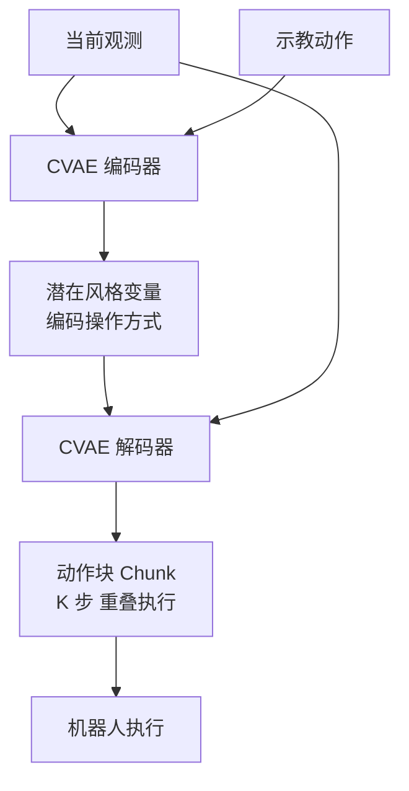

# Mobile ALOHA / ACT

- 本地 PDF：`papers/data/Mobile_ALOHA_ACT_2401.02117.pdf`
- arXiv：https://arxiv.org/abs/2401.02117
- 年份：2024
- 阶段：低成本遥操作与动作分块

## 一句话总结

Mobile ALOHA 与 ACT 提供了低成本全身遥操作硬件方案与动作分块（Action Chunking）Transformer 架构，通过 CVAE 建模多模态示教分布并抑制复合误差累积，引爆了具身智能的规模化落地热潮。

## 核心技术

1. **条件变分自编码器（CVAE）** — 对人类示教的多模态动作分布进行概率建模，通过潜在变量编码不同操作风格，输出未来 K 步的连续动作序列
2. **动作分块（Action Chunking）** — 一次性预测未来 K 步动作组成的"块"，从根本上抑制单步自回归预测的复合误差累积
3. **低成本全身遥操作硬件方案** — Mobile ALOHA 以 $32k 总成本（含机载电源与算力）实现全尺寸双臂 + 移动底座的全身遥操作，对比 PR2/TIAGo 等 $200k+ 的整机方案，把移动操作研究门槛降低一个数量级

## 底层原理与数学推导

ACT 的核心突破是解决了单步自回归预测的**复合误差（Compounding Errors）**问题，同时通过 CVAE 对人类示教的多模态不确定性进行建模，完美适配机器人操作的多峰动作分布，是 2024 年开源 VLA 模型的标配技术。

**1. 复合误差问题的本质**

在纯模仿学习中，单步自回归预测每一步都依赖上一步的输出，一旦某一步出现微小误差，后续的误差会呈平方级放大。理论证明，若单步预测误差概率为 $\epsilon$，执行 $T$ 步后总误差的上界为 $O(T^2 \epsilon)$，长程任务的成功率会急剧下降。

ACT 的解决方案是：**一次性预测未来 K 步动作组成的"块（Chunk）"**，而非单步预测，从根本上抑制复合误差的累积。

**2. CVAE 核心数学推导**

ACT 采用条件变分自编码器，对人类示教的多模态动作分布进行建模，输入为当前图像观测 $x$，输出为未来 K 步的动作序列 $y$，潜在变量 $z$ 编码了人类操作的隐藏"风格"（如从左侧/右侧抓取）。

模型的优化目标为证据下界（ELBO），损失函数如下：

$$
\mathcal{L} = \mathbb{E}_{z\sim q(z|x,y)} \left[ \log p(y|x,z) \right] - \beta \cdot D_{KL} \left( q(z|x,y) || p(z|x) \right)
$$

其中：
- 第一项为动作重构损失，衡量模型预测动作与人类示教动作的拟合程度；
- 第二项为 KL 散度正则项，约束潜在变量 $z$ 的分布，$\beta$ 为权重系数；
- $q(z|x,y)$ 为编码网络，从示教轨迹中提取潜在风格变量；
- $p(y|x,z)$ 为解码网络，根据当前观测与风格变量，预测未来 K 步的动作序列。

## 物理直觉解释

**动作分块（Action Chunking）的直觉：开车不看眼前一米，而是提前看好几十米的路线**。单步自回归预测就像蒙眼开车——每一步都依赖上一步的输出，任何微小偏差都会在长序列中平方级放大（复合误差 $O(T^2\epsilon)$）。一次性预测未来 K 步动作组成的"块"，相当于提前规划好接下来一段路的完整操作：哪怕当前位置偏了一点，块内的轨迹本身依然连贯，机器人还能在块与块的交接处（temporal ensembling）用新观测修正。Mobile ALOHA 的实践还发现了分块的额外红利：移动底座的速度控制有延迟（目标速度与实际速度差 d 步），而手臂是位置控制延迟很小——分块长度为 k 时，执行"前 k−d 个手臂动作 + 后 k−d 个底座动作"，就能让异构硬件的延迟差异被优雅地吸收，这是单步策略做不到的。

**CVAE 的直觉：同一道菜，有人左手拿锅有人右手拿锅，模型必须学会"多风格共存"而不是平均**。回归式行为克隆会对所有示教取均值——左右手拿锅的示教被平均成"双手悬空"，这在多模态示教分布下是致命的。CVAE 引入潜在变量 z 编码操作风格，解码器在给定 z 时输出连贯的动作序列，模型"选择一种风格"而非"平均所有风格"。ELBO 中的 KL 项（权重 β）约束 z 不过度自由，防止模式坍塌。这正是 2024 年后开源 VLA 模型把 CVAE/扩散/flow 作为动作头的共同动机。

**"50 次示教 + 静态数据协同训练"是 Mobile ALOHA 的数据杠杆**。7 个移动操作任务每个只采 50 条示教，单独训练时精细子任务几乎学不会——Call Elevator 的按电梯按钮（2cm×2cm 按钮、15m 导航）协同训练前成功率 0%，Rinse Pan 开水龙头 0%；把已有的静态 ALOHA 桌面操作数据（2.7K 条级）按 0.5/0.5 概率混合采样后，这些子任务分别跳到 95%/85%，整任务成功率提升最高达 90%（摘要）。这背后的道理是"共用表征、互补技能"：静态数据教模型精细操作的手腕技巧，移动数据教全身协调——迁移的不是动作而是视觉-动作表征。**协同训练的收益不是均匀的**：对已有静态数据覆盖好的子任务（如 Grasp Towel 100/100）无增益，对精确操作瓶颈子任务增益最大（0→95、0→85），这为"该采什么数据"提供了直接的工程指导。

## 工程细节与实操指南

- **硬件方案**：$32k 总成本（对比 PR2/TIAGo 的 $200k+），含 1.26kWh/14kg 机载电池、3 个 Logitech C922x 摄像头（480×640@50Hz，双腕 + 前进）、消费级笔记本（Nvidia 3070 Ti 8GB + i7-12800H）完成全部数据采集与推理；垂直可达 65-200cm、前伸 100cm、单臂负载 750g（双臂合力举起 1.4kg 锅）
- **动作分块超参（本文实验）**：ACT chunk size 45、Diffusion Policy 64、VINN 100；块内延迟补偿——底座延迟 d 步时执行"前 k−d 个手臂动作 + 后 k−d 个底座动作"
- **协同训练**：静态 ALOHA 数据与移动数据按 0.5/0.5 概率混合采样；ACT 超参 lr 2e-5、batch 16、encoder 4 层 / decoder 7 层、ResNet18 backbone、β=10
- **落地场景**：炒虾、开双门柜存锅、乘电梯、开水龙头冲锅等 7 个长视界全身操作任务

## 消融实验与分析

**Table 1: 协同训练（co-training）对 ACT 的提升（成功率 %）**

| 子任务 | No Co-train | Co-train | 提升 |
|--------|------------|----------|------|
| Wipe Wine 整任务 | 5 | 100 | +95 |
| Call Elevator 按按钮 | 0 | 95 | +95 |
| Rinse Pan 开水龙头 | 0 | 85 | +85 |
| Push Chairs 整任务 | 50 | 95 | +45 |
| Unseen Attire / Unseen Human | 0 / 0 | 95 / 85 | +95 / +85 |
| Grasp Towel（静态数据已覆盖） | 100 | 100 | 0 |

**Table 2: Mobile ALOHA 与三种模仿学习方法兼容（Wipe Wine / Push Chairs 整任务 %）**

| 方法 | No Co-train | Co-train |
|------|------------|----------|
| VINN + Chunking | 50 / 40 | 85 / 60 |
| Diffusion Policy | 75 / 80 | 90 / 100 |
| ACT | 95 / 100 | 100 / 100 |

**其他关键结果**：

- **动作分块必要性**：本文所有方法（含 VINN）都采用 action chunking——"crucial for manipulation"，提升轨迹连贯性并降低每步策略推理延迟
- **开环回放误差**：180° 转弯（半径 1m）后底座速度开环回放平均偏左 ~10cm、散布 ~20cm，但学到的策略无需 SLAM 即可实时纠正
- **数据量**：每个任务仅 50 条示教（约 2.7K 条静态数据协同），抽象摘要声明协同训练可提升成功率最高 90%

**核心结论**：Mobile ALOHA 的消融证据链回答了两个问题——(1) "协同训练值不值得"：对精确操作瓶颈子任务（按按钮 0→95、开水龙头 0→85）和未见过场景（Unseen Attire 0→95）增益巨大，而对静态数据已覆盖的子任务（Grasp Towel 100/100）无增益——说明迁移的是"视觉-动作表征"而非具体技能，数据杠杆来自表征复用；(2) "架构兼容性"：ACT/Diffusion Policy/VINN 三种不同动作范式（CVAE 连续 / 扩散 / 检索）都受益于协同训练（如 DP 整任务 75→90、80→100），证明增益来自数据而非特定架构。加上分块长度跨方法不同（45/64/100）都工作，说明 action chunking 的收益是鲁棒的、对块长不敏感。

## 技术权衡（Trade-off）

| 优势 | 劣势与工程代价 |
|------|----------------|
| 动作分块从根本上抑制了复合误差的累积，长程任务成功率远超单步预测模型 | 动作块长度 K 过大会导致模型无法实时响应环境变化，动态场景适应性下降 |
| CVAE 完美适配多模态动作分布，避免了回归方法的"平均动作"问题，无需离散分箱即可实现连续动作生成 | CVAE 的训练稳定性对超参敏感，KL 散度权重 $\beta$ 需要精细调优，否则容易出现模式坍塌 |
| 配套低成本遥操作硬件，大幅降低了 VLA 模型的数据采集与落地门槛，推动了开源生态的爆发 | 依然以模仿学习为核心，分布外场景的鲁棒性不足，无法自主纠正严重的轨迹偏离 |

## 技术价值与演进定位

ACT 与 Mobile ALOHA 是 VLA 模型从实验室走向工业落地的关键推手。动作分块技术成为了后续所有开源 VLA 模型的标配，而低成本遥操作硬件解决了行业数据稀缺的核心痛点，直接催生了 Open X-Embodiment 等大规模数据集的诞生，开启了 VLA 模型的开源生态时代。

## 与其他论文的关系

- **Diffusion Policy** 同样预测动作序列，但采用扩散生成范式替代 CVAE，在更复杂的多模态分布上拟合能力更强。
- **Octo** 将动作序列生成融入更通用的 Transformer 扩散策略架构，在 Open X-Embodiment 数据上预训练。
- **Open X-Embodiment** 需要 Mobile ALOHA 这类低成本数据采集生态来扩充数据规模。
- **RT-1/RT-2** 使用离散动作 Token 化，而 ACT 通过 CVAE 实现连续动作生成，两者在动作表示范式上形成互补。

## 精读问题

1. Action chunk 的长度 K 如何影响长程任务的稳定性与动态场景的响应性？本文三种方法块长 45/64/100 都工作——是否存在最优 K 的理论上界，还是仅需一个宽区间？
2. CVAE 中的 $\beta$ 权重（本文 ACT 用 β=10）如何平衡重构精度与潜在空间的正则化？模式坍塌发生时如何判断与恢复？
3. 协同训练的"表征迁移"机制——静态数据与移动数据在 ResNet18 特征空间如何对齐？是否 0.5/0.5 的采样比例就是最优，更大比例是否增益饱和？
4. 开环回放误差 ~10cm（底座速度控制）能被策略隐式纠正的机制——视觉伺服如何在无 SLAM 下补偿？误差超过什么量级会不可恢复？
5. 动作分块与 Diffusion Policy 的扩散生成在复合误差抑制上本质区别是什么？CVAE 的连续潜变量 vs 扩散的迭代去噪，在长块长（100 步）下谁的误差累积更可控？
6. 底座延迟 d 的异构补偿（前 k−d 手臂 + 后 k−d 底座）在延迟动态变化时（如负载变化）是否失效？是否需要在线估计 d？
