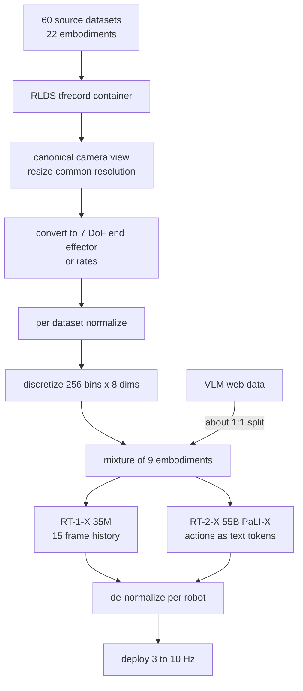

# Open X-Embodiment: Robotic Learning Datasets and RT-X Models

- 本地 PDF：`papers/data/Open_X_Embodiment_RT-X_2310.08864.pdf`
- arXiv：https://arxiv.org/abs/2310.08864
- 年份：2023（本地 PDF 为 2025-05 更新的 arXiv v9）
- 团队：Open X-Embodiment Collaboration——21 个机构联合（Google DeepMind、Stanford、UC Berkeley、CMU、UT Austin 等 34 个实验室）
- 阶段：22 种机器人 / 100 万+ 轨迹的跨具身数据集 + RT-X 正迁移实证

## 一句话总结

OXE 把全球 21 个机构的 60 个数据集统一成 RLDS 格式，拼出 100 万+ 真机轨迹、22 种机器人形态、527 种技能（160266 任务实例）的数据底座，并用最小改动的 RT-1-X 与 RT-2-X 证明：不加任何跨机型对齐机制、只做「7 维末端执行器动作粗对齐 + 逐数据集归一化」的直接混合训练就能带来正迁移——小数据域平均成功率提升约 50%，55B 的 RT-2-X 在 Google Robot 上做出只在 WidowX 数据里出现过的技能（75.8% vs 单机 RT-2 的 27.3%）。

## 核心技术

1. **粗对齐（coarse alignment）而非精细投影**：每个数据集取一个 canonical 相机视角、缩放到统一分辨率；动作统一转成 7 维末端执行器向量（$x,y,z,\text{roll},\text{pitch},\text{yaw}$ 加 gripper 开度或对应速率），逐数据集归一化后再离散化为 256 bins x 8 维（第 8 维为终止位）。刻意不做的两件事：不跨数据集对齐坐标系，保留原始控制方案（绝对/相对位姿或速度照原样）
2. **RLDS 标准化数据容器**：序列化 tfrecord 格式，兼容不同数量 RGB 相机、深度相机与点云，支持主流框架的并行加载——这是让 60 个异构数据集能被一个 dataloader 吃下的关键
3. **RT-X 两个模型族做实证载体**：RT-1-X 是 35M 参数的机器人专用 Transformer（FiLM EfficientNet + USE 句嵌入，15 帧图像历史），RT-2-X 基于 RT-2-PaLI-X（VLM 底座 + 动作写成文本 token），两者都用 categorical cross-entropy；实验混合 9 种操纵臂的数据（RT-1、QT-Opt、Bridge、TARP、Jaco Play、Cable Routing、RoboTurk、NYU VINN、Austin VIOLA、Berkeley Autolab UR5、TOTO、Language Table）
4. **零机制的直接共训**：论文明言不引入任何减小 embodiment gap 的机制（无共享动作表征学习、无本体条件化模块、无声学解耦），正迁移全部由数据本身产生——这正是与既有跨本体迁移文献最大的方法论差异

## 底层原理与数学推导

**第一层：把所有机器人的语言统一成同一套字母表。** 设数据集 $d$ 中第 $k$ 维原始动作为 $a_k^{(d)}$，其在该数据集内的物理范围是 $[m_k^{(d)}, M_k^{(d)}]$。训练前先做逐数据集 min-max 归一化，再均匀离散到 256 个 bin：

$$\tilde{a}_k^{(d)} = \frac{a_k^{(d)} - m_k^{(d)}}{M_k^{(d)} - m_k^{(d)}}, \qquad b_k^{(d)} = \left\lfloor 255 \cdot \mathrm{clip}(\tilde{a}_k^{(d)},\, 0,\, 1) \right\rfloor \in \{0,\dots,255\}$$

这个两步操作等价于声明：**每个机器人都有一个自己的坐标系，但它们都是同一个抽象动作空间的合法坐标表示**。部署时模型输出的 bin 编号 $\hat{b}_k$ 按目标机型的参数反解回真实命令：

$$u_k^{(r)} = \frac{\hat{b}_k}{255}\left(M_k^{(r)} - m_k^{(r)}\right) + m_k^{(r)}, \qquad r \in \{\text{WidowX}, \text{Google Robot}, \dots\}$$

也就是说，同一个输出向量在不同机型上被「不同地解释」（论文原文：the same action vector may induce very different motions for different robots）——语义的解歧被推到了数据分布层面而不是模型结构层面。

**第二层：共享参数的条件策略拟合混合分布。** 设机器人数据混合为 $\mathcal{M}$（9 种具身），样本包含观测 $o^{(d)}$（历史图像 + 语言指令）与动作 token 序列。RT-X 用单一参数 $\theta$ 直接拟合整个混合分布下的 8 维离散动作：

$$\mathcal{L}(\theta) = -\,\mathbb{E}_{d \sim p(\mathcal{M})}\,\mathbb{E}_{(o^{(d)}, \ell^{(d)}, \mathbf{a}^{(d)}) \sim d}\left[\sum_{k=1}^{8} \log p_\theta\!\left(b_k \mid o^{(d)}, \ell^{(d)}\right)\right]$$

注意这里没有任何 per-embodiment 头、没有 episode 级的 embedding、也没有 codec 式的动作翻译器。语言指令 $\ell^{(d)}$ 与图像 $o^{(d)}$ 必须隐式携带「我在控制哪台机器人」的信息，模型才能产出正确口径的动作 token。这是该设计最脆弱也最精妙的地方：它完全依赖**任务-场景-机构风格的相关性**（例如 Bridge 的桌面配置总是伴随 WidowX）来让模型自行区分机体。

**第三层：容量决定吸收上限。** 论文用 Table I 揭示了一个非平凡的规律：在数据量大的域（Bridge、RT-1 数据），35M 的 RT-1-X 反而欠拟合（Google Robot 上 73% vs 单机 RT-1 的 92%）；换成 55B 的 RT-2-X 后恢复超越（91%）。直觉是：混合分布在同一观测流形上叠加了多套动作映射，参数量不足时模型只能折中到一个「平均策略」，恰好是离散化表达力本来要避免的那个陷阱——这与 RT-1 消融中连续高斯头崩塌是同一个机制的两面。

## 物理直觉解释

**这是一座没有设翻译官的图书馆。** 此前的跨本体迁移研究都在造「翻译器」：共享动作表征、形态条件化模块、本体感知编码器……相当于给每本外文书配一个译员再让读者阅读。OXE 反其道而行——先把所有书改写进统一的记法（7 维末端执行器 + 归一化 + 256 bin 字母表），然后让一个读者直接通读全部馆藏。之所以敢这么做，是因为「抓起一个杯子需要靠近、下压、闭合」这件事的几何结构对所有夹爪型机械臂是相同的，差异只落在尺度（行程范围）和表达（绝对还是增量）上，而这恰好就是 min-max 归一化能消掉的那部分。

**迁移红利按数据的贫富分层兑现。** 小数据域像只有几百个单词的小语种——自学者怎么都凑不出完整语法；混入百万级其他机型的语料后，RT-1-X 在 Kitchen Manipulation、Cable Routing、NYU Door Opening、AUTOLab UR5、Robot Play 这 5 个小域中赢了 4 个，平均成功率比各自领域的特化方法高约 50%。而在数据富足的域，就像母语本身已有海量教材，35M 的小模型反而被混合分布里的干扰拖垮（Google Robot 上 92% 掉到 73%）——只有 55B 这样的大容器才装得下「既要精通本机、又要会从别机借招」的双重要求。**结论不是「混合永远更好」，而是混合收益必须由足够容量来解锁。**

**Emergent skills 是最有力的一锤定音。** RT-2-X 55B 在 Google Robot 上执行的某些任务（物体与技能组合）根本不存在于 Google Robot 自己的数据里，只出现在另一个机型 WidowX 的 Bridge 数据中——成功率却达到 75.8%，是只用本机数据训练的 RT-2（27.3%）的近 3 倍；把 Bridge 从训练集中剔除后立刻跌到 42.8%。这说明技能不是「Google Robot 本来就会只是没被激发」，而是通过共享视觉-动作表征真正从另一个机体的经验中搬了过来。类比一位厨师从未做过粤菜，但在川菜后厨练出的火候手感让他看一遍粤菜谱就能上手——**手上的基本功跨菜系共享，缺的只是菜谱本身**。

## 工程细节与实操指南

**数据集规格速查**
- 规模：1M+ 真实轨迹；22 种具身（单臂到双臂再到四足）；60 个源数据集；21 机构 / 34 实验室
- 多样性度量方法：用 PaLM 语言模型从指令中抽取物体与行为清单做统计分析（Fig. 2d/e），发现多数 skill 属于 pick-place 家族，长尾含 wiping、assembling 等；Franka 的数据集数最多（场景多样性最高），xArm 与 Google Robot 贡献轨迹最多
- 格式：RLDS（序列化 tfrecord），天然容纳不同相机数量/深度/点云模态

**自己组混合数据集时的可抄步骤**
1. 为每个源数据集固定一个 canonical 相机视角，统一分辨率——不要试图融合多视角
2. 动作转 7 维末端执行器向量（开度可用速率形式），保留各家的绝对/相对与位置/速度语义，不要强行统一成一种
3. 逐数据集 min-max 归一化后切 256 bin，并把归一化参数随数据一起存档，部署时按机型反解
4. 坐标系不做全局对齐——模型靠场景风格隐式判别机体；若你的多个数据集场景高度相似而机型不同，需额外加入机体标识（此为本文未覆盖的风险点）
5. 训练比例参考：RT-2-X 采用 web 数据与机器人数据约 1:1 的 co-fine-tuning；推理频率按机器人需求 3-10 Hz，RT-1-X 本地跑、RT-2-X 云端查询

**评测设计**
- 全文共计 3600 次真机评测 trial、覆盖 6 种机器人；对照组两类：「Original Method」= 数据原作者在自己数据上调好的专用模型，「RT-1 solo」= 同一架构只吃本域数据
- 泛化评估沿用 RT-2 协议（unseen objects / backgrounds / environments），emergent skills 评估专门挑「Bridge 有、Google Robot 无」的任务作为跨机型探针

## 消融实验与分析

### 大数据域的容量瓶颈（Table I）

| 模型 | Bridge @ IRIS (Stanford, WidowX) | Bridge @ RAIL (UCB, WidowX) | RT-1 paper 6 skills (Google Robot) |
|---|---|---|---|
| Original Method（LCBC，仅作 Bridge 对照） | 13% | 13% | - |
| RT-1（单域数据训练） | 40% | 30% | 92% |
| RT-1-X（35M，混合 9 具身） | 27% | 27% | 73% |
| RT-2-X（55B，混合 + web 数据） | 50% | 30% | 91% |

**核心结论**：同为混合训练，35M 与 55B 得出相反结局——RT-1-X 在两个大数据域全面低于单域 RT-1（Bridge IRIS 40% 到 27%、Google Robot 92% 到 73%），属欠拟合；RT-2-X 则能在 Bridge IRIS 上反超到 50%（单域 RT-1 为 40%）、在 Google Robot 保持 91%。跨具身共训不是无条件增益，而是有一条容量门槛。

### 设计决策对泛化与 emergent skills 的影响（Table II）

| 配置 | Size | History | 数据 | Co-train w/ Web | 初始权重 | Emergent Skills | 泛化 |
|---|---|---|---|---|---|---|---|
| RT-2（仅 Google Robot 数据） | 55B | none | 单机 | Yes | Web-pretrained | 27.3% | 62% |
| RT-2-X（全机器人数据） | 55B | none | 混合 | Yes | Web-pretrained | 75.8% | 61% |
| RT-2-X 移除 Bridge | 55B | none | 混合-Bridge | Yes | Web-pretrained | 42.8% | 54% |
| RT-2-X | 5B | 2 帧 | 混合 | Yes | Web-pretrained | 44.4% | 52% |
| RT-2-X | 5B | none | 混合 | Yes | Web-pretrained | 14.5% | 30% |
| RT-2-X | 5B | 2 帧 | 混合 | No | From scratch | 0% | 1% |
| RT-2-X | 5B | 2 帧 | 混合 | No | Web-pretrained | 48.7% | 47% |

**核心结论**：(1) emergent skills 的来源被干净地隔离——同样的 55B 模型，仅因混入他机数据就从 27.3% 升至 75.8%，且移除 Bridge 后跌去一半以上，证明跨机型技能迁移真实存在；(2) 两帧图像历史的贡献异常巨大（14.5% 到 44.4%，泛化 30% 到 52%），说明动态信息是动作预测的前置条件；(3) web 预训练仍是底线（from scratch 只有 0%/1%）；(4) 与 RT-2 论文的结论不同，此处 fine-tune（web 权重起点但不共训 web 数据，48.7%/47%）与 co-fine-tune（44.4%/52%）打平，作者归因于 RT-2-X 的机器人数据本身就足够多样——**当机器人数据够大时，防遗忘的需求变弱**。
（补充：小数据域 Fig. 4 显示 RT-1-X 在 5 个域中的 4 个胜过 Original Method，平均成功率比 Original Method 或 RT-1 高约 50%；与 Table I 合起来构成「小域受益、大域看容量」的完整图景。）

### 小数据域汇总（Fig. 4 标题所述）

| 评估维度 | 结果 |
|---|---|
| RT-1-X vs Original Method | 5 个小数据域（Kitchen Manipulation / Cable Routing / NYU Door Opening / AUTOLab UR5 / Robot Play）中赢 4 个 |
| 平均幅度 | RT-1-X 平均成功率比 Original Method 或 RT-1 高约 50% |

**核心结论**：数据稀缺的域是跨具身混合的第一受益者，其收益来源是他机数据带来的先验补全——这正是 OXE 作为公共数据底座对中小实验室的核心价值。

## 技术权衡（Trade-off）

| 收益 | 代价 |
|------|------|
| 粗对齐方案成本极低（选一视角 + 7 维转换 + 归一化），让 60 个异构数据集在几周内可合并使用 | 不对齐坐标系意味着同一 token 向量在不同机型上是不同物理量，语义全靠场景线索判别；对场景同质化严重的新混合可能失效 |
| 小数据域拿到约 50% 白送的精度提升，中型实验室无需自采海量数据 | 大数据域上小模型反而受损（Google Robot 92% 到 73%），带宽与算力不足的团队可能吃到负收益 |
| RLDS 格式成为事实标准，配套开源 checkpoints 可直接微调 | 实验只用 9 种操纵臂子集训练（当时数据规模），与宣称的 22 具身之间有差距；四足、双臂等形态未被实测覆盖 |
| emergent skills 显示「买一送多」效应：为本机加数据等于给全网所有机型添技能 | 尚不能预测正迁移何时发生——作者列出的开放问题之一就是缺少判断 transfer 成败的准则 |

## 技术价值与演进定位

OXE 解决的是 RT-1/RT-2 留下的结构性缺口：两篇工作都只能在单一厨房场景内证明泛化，而「语义泛化要靠数据广度」这件事没有被真正的数据基础设施支撑。OXE 把这件事拆成了两层交付物——可复用的公共数据资产（RLDS 格式 + 22 具身 + checkpoints），和一份可复现的可行性论证（3600 次真机试验证明直接共训可行且有大额正迁移）。

在本库演进链上，OXE 是「数据侧的承重墙」：RT-1 的「多样性比数量重要」在这里被放大到跨机构尺度；RT-2 的 VLA 范式在这里获得了 9 具身验证并暴露了容量门槛；其后的 Octo（975K轨迹开源预训练）与 OpenVLA（970K 轨迹、机器人与网络图文 97:3 混合）都是在这份数据底座上的第一次规模化收成。它自己也点明了边界：不含异构感知/驱动模态、不测试泛化到「全新机器人」，这两条分别由后来的 embodied foundation model 与 meta-learning 路线接手。

## 与其他论文的关系

- **RT-1** — 架构与部分数据来源的双重前身：RT-1-X 就是加了 15 帧（而非 6 帧）历史、换了混合数据的 RT-1；同时 RT-1 的 130k 厨房数据是混合池中的大数据域成员，其专属评估项在 RT-1-X 下从 92% 掉到 73%
- **RT-2** — 提供 VLM 共训配方（co-fine-tune + 动作即文本 token）与泛化评估协议；OXE 在其上做了两组对方没有的实验——9 具身混合的 emergent skills 迁移测量，以及推翻「co-fine-tune 优于 fine-tune」的原结论（48.7%/47% 打平 44.4%/52%）
- **Octo / OpenVLA** — OXE 数据底座的直接下游消费者：Octo 用 OXE 子集做通用策略预训练，OpenVLA 以 OXE 为主的 970K 轨迹复现并开源了 RT-2 式 VLA；没有 RLDS 统一格式就没有这两篇的低成本迭代
- **RoboCat** — 同期另一条跨本体路线对照：RoboCat 靠自生成数据闭环扩大覆盖面，OXE 靠机构间数据拼盘；Table II 的 emergent skills 评估方式（A 机型的任务考 B 机型）与 RoboCat 的 fine-tune-and-transfer 协议互为印证
- **Bridge / QT-Opt / TARP 等 12 个源数据集** — 组成实际训练用的 9 具身混合；其中 Bridge 因「独占若干任务」成为 emergent skills 的因果探针（移除后 75.8% 到 42.8%），也说明单个高质量数据集在混合中可以贡献远超其体量的技能面

## 精读问题

1. **粗对齐的信息损失边界**：7 维末端执行器表示丢弃了什么？对于腕部冗余自由度、灵巧手多点接触这类超出现有词汇表的本体，是被静默截断还是根本无法入池？如果未来要纳入全身移动操作（如 humanoid），这套记法是否需要推倒重做？
2. **容量的确切门槛在哪里**：Table I 只测了 35M 和 55B 两端，「跨具身收益解锁所需的最小参数量」曲线长什么样？5B 的 RT-2-X 在 Google Robot 大数据域上表现如何（Table II 未报该域单独成绩），是否存在某个中间规模刚好吃下 9 具身混合？
3. **「零机制」到底是不是零机制**：canonical 相机选择、min-max 归一化、按机型去归一化本身就是一层手工设计的对齐管线。如果把这三步也算进去，真实的 prior knowledge 注入量有多少？与显式的 body-conditioning 方法相比孰优孰劣？
4. **Emergent skills 的归因完整性**：Table II 第 (3) 行移除 Bridge 使 75.8% 跌到 42.8%，但没有做逐数据集 leave-one-out——其余 8 个具身各贡献多少？「技能来自 WidowX 数据」这一表述是否能排除 task 相似性（Google Robot 评估任务的描述与 Bridge 指令措辞相近）带来的泄漏？
5. **fine-tune 与 co-fine-tune 结论翻转的解释力**：作者把 RT-2-X 中两者的持平归因于机器人数据更丰富。能否设计一个「机器人数据量从少到多」的扫描实验，精确画出 web 数据价值衰减的曲线？这对预算有限的实验室（没法共训 web 数据）是最直接的决策依据。
6. **3600 次 trial 的置信度结构**：分散在 6 种机器人、多个数据域的单次评估组合下，哪些对比已经统计显著、哪些仍需更多重复？特别是 Table II 中 44.4% vs 48.7% 这类小于 5 个点的差异，是否足以支撑「打平」的结论？
