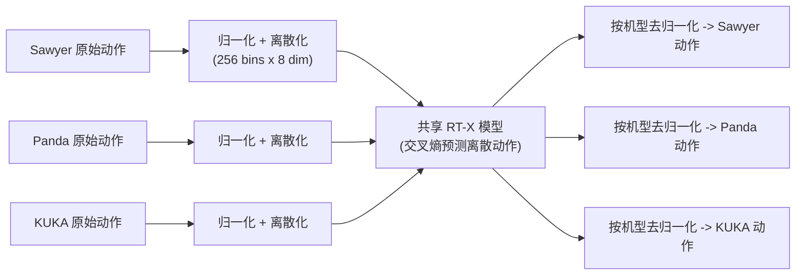

# Open X-Embodiment / RT-X

- 本地 PDF：`papers/data/Open_X_Embodiment_RT-X_2310.08864.pdf`
- arXiv：https://arxiv.org/abs/2310.08864
- 年份：2023
- 阶段：机器人数据规模化

## 一句话总结

Open X-Embodiment 汇聚全球 22 种机器人、100 万+条真实轨迹（60 个数据集、34 个实验室、527 种技能/160,266 个任务实例），通过 7-DoF 动作空间的粗对齐 + 逐数据集归一化，证明无需任何对齐机制、直接跨机型混合训练即可显著提升泛化能力，是机器人领域的"ImageNet 时刻"。

## 核心技术

1. **动作/观测空间粗对齐（Coarse Alignment）** — 把每个数据集的原始动作统一转换为 7-DoF 末端执行器动作（x, y, z, roll, pitch, yaw, gripper 开合或对应速率），每个数据集选一个规范相机视角、缩放到统一分辨率，归一化后再离散化为 256 bins × 8 维动作 token
2. **大规模多机构数据融合** — 60 个既有数据集（34 个实验室、21 个机构）统一为 RLDS 格式，22 种机器人形态从单臂到双臂再到四足
3. **无对齐损失的直接跨具身训练** — 论文明言"直接在多具身数据上训练策略，不使用任何减小 embodiment gap 的机制"，正迁移全部来自数据本身；每个数据集训练时归一化、推理时按机型去归一化

## 底层原理与数学推导

Open X-Embodiment 的核心突破，是解决了机器人领域"数据孤岛"的核心痛点：将全球 22 种不同形态、不同自由度的机器人、100 万+条真实轨迹融合到同一个数据集，证明**即使不做任何专门的对齐机制**，跨机型混合训练也能带来显著正迁移——物理操作的底层逻辑在不同硬件之间是相通的。

**1. 动作空间的粗对齐（Coarse Alignment），而非精细投影**

论文的工程哲学是"粗对齐 + 归一化 + 去归一化"三步走，而非学习投影层：

- **粗对齐**：把每个数据集的原始动作统一转换为 7-DoF 末端执行器动作 $(x, y, z, \text{roll}, \text{pitch}, \text{yaw}, \text{gripper})$（或对应速率），从每个数据集选取一个规范相机视角并缩放到统一分辨率；
- **归一化 + 离散化**：每个数据集的动作先归一化，再离散化为 256 bins × 8 维（7-DoF + episode 终止位）的动作 token，模型用交叉熵预测离散动作；
- **去归一化**：推理时同一个模型输出，按部署机型各自的归一化参数反变换回真实动作——"模型的输出根据使用的机型被（去归一化后）不同地解释"。

关键在于：**不做任何显式的跨机型对齐损失**。论文明确写道："我们直接在 X-embodiment 数据上训练策略，不使用任何减小 embodiment gap 的机制"（"we directly train a policy on X-embodiment data, without any mechanisms to reduce the embodiment gap"）——正迁移完全来自数据规模与多样性的收益。RT-1 与 RT-2 这两种架构（前者 35M 参数、EfficientNet + FiLM + decoder-only Transformer、81 个视觉-语言 token；后者把离散动作直接写作文本 token，如 "1 128 91 241 5 101 127"）都只需最小改动即可吃下混合数据。

**2. 核心工程发现**

- **小数据域**：RT-1-X 在 Kitchen Manipulation、Cable Routing、NYU Door Opening、AUTOLab UR5、Robot Play 这 5 个小数据集中有 4 个超越原论文特化方法，平均成功率比 Original Method 和单机 RT-1 高 **50%**（图 4 标题）；
- **大数据域**：RT-1-X 无法超越单机 RT-1（容量不足、欠拟合），但 55B 的 RT-2-X 在数据富集域也能超越 Original Method 与 RT-1——跨具身训练收益需要足够高容量的架构才能兑现；
- **Emergent skills**：RT-2-X 55B 在 Google Robot 上完成 Bridge 数据（WidowX 机型）才有的任务，成功率 75.8% vs RT-2 的 27.3%（约 3 倍），且移除 Bridge 数据后掉到 42.8%——技能真的从别的机型"迁移"了过来。

## 物理直觉解释

**Open X-Embodiment 的直觉：给机器人建一座"全球图书馆"，但不搞翻译官**。之前的机器人只能学自己家的经验，就像一个人只读过一本书；跨机型训练就是让机器人读遍全馆的书。最反直觉的工程决定是：**不做任何"翻译"（对齐损失）**——所有书都用同一套"通用动作字母表"（7-DoF 末端执行器动作 + 逐数据集归一化）写下，模型直接一起读。这就像把全世界菜谱都改写成统一的"食材-步骤"格式：不需要翻译菜系，只要格式统一，一个厨师就能同时学川菜和法餐。动作被离散成 256 个箱子 × 8 维（7 维末端执行器 + 1 维终止位），推理时按部署机型去归一化——同一个输出，在 Sawyer 上解释为 Sawyer 的动作，在 WidowX 上解释为 WidowX 的动作，模型自己学会了"每种机型的动作长什么样"。

**"50% 更高的成功率"来自小数据机型的迁移红利**。Kitchen Manipulation、Cable Routing 这类只有几千条数据的小数据集，单独训练时模型学不精；混入 100 万条其他机型的数据后，RT-1-X 平均成功率比原论文特化方法高 50%（5 个域中 4 个胜出）。这像学生学第二外语：只学法语资源太少，但已经会英语（大语料）后再学法语就快得多——因为底层语法（物体如何被抓取、如何放置、如何与桌面交互）是共享的。但**迁移红利不是免费的**：在大数据域（Bridge、RT-1 数据），35M 的 RT-1-X 反而比单机 RT-1 差（容量不够，欠拟合），只有 55B 的 RT-2-X 才能同时吃下所有数据——"先有足够大的模型，跨具身数据才有意义"。

**"Emergent skills"证明技能可以跨机身"凭空长出来"**。RT-2-X 在 Google Robot 上做 Bridge 数据集（WidowX 机器人采集）才有的任务：倒水、开抽屉等——Google Robot 自己的数据里根本没有这些任务，成功率却达 75.8%，是只用自家数据训练的 RT-2（27.3%）的近 3 倍；把 Bridge 数据从训练集中拿掉，立刻掉到 42.8%。这证实了技能的迁移机制是"数据混合让模型把 WidowX 上学会的操作常识，通过共享的视觉-动作表征套用到 Google Robot 上"。同时 TABLE II 的消融给出两个关键前提：web 预训练不可省（从零训练只有 0%/1%，web 预训练后 48.7%/47%），历史帧不可省（无历史 14.5%/30% vs 2 帧历史 44.4%/52%）——跨具身迁移是"预训练表征 + 观测上下文 + 海量混合数据"三者共同作用的结果。

## 工程细节与实操指南

- **数据集规格**：1M+ 真实轨迹、22 种机器人（单臂/双臂/四足）、60 个数据集、34 个实验室、21 个机构、527 种技能（160,266 个任务实例）；语言标注用 PaLM 抽取物体与行为分析多样性
- **数据格式**：RLDS（Reinforcement Learning Datasets）序列化 tfrecord 格式，兼容不同相机数量/深度/点云模态，支持主流深度学习框架的并行加载
- **动作处理**：统一为 7-DoF 末端执行器动作（或速率），逐数据集归一化后离散化为 256 bins × 8 维（7 维动作 + 1 维终止位），推理时按机型去归一化
- **训练范式**：RT-1-X（35M，EfficientNet + FiLM + decoder-only Transformer，15 帧历史，81 个视觉-语言 token）/ RT-2-X（55B，动作写成文本 token，web 数据与机器人数据约 1:1 协同微调）；实验用 9 种机型的混合数据（当时数据集规模），共 3600 次真实评估试验、6 种机器人
- **推理**：RT-1 本地运行、RT-2 云端查询，按机器人所需频率 3-10 Hz 运行

## 消融实验与分析

**TABLE II：设计决策对泛化与 emergent skills 的影响（% 成功率）**

| 模型配置 | Emergent Skills | 泛化（未见过物体/背景/环境） |
|---------|----------------|------------------------------|
| RT-2 55B（仅 Google Robot 数据） | 27.3% | 62% |
| RT-2-X 55B（全机器人数据，web 预训练） | **75.8%** | 61% |
| RT-2-X 55B（移除 Bridge 数据） | 42.8% | 54% |
| RT-2-X 5B（2 帧历史，web 预训练） | 44.4% | 52% |
| RT-2-X 5B（无历史帧，web 预训练） | 14.5% | 30% |
| RT-2-X 5B（2 帧历史，**从零训练**） | 0% | 1% |
| RT-2-X 5B（2 帧历史，web 预训练） | 48.7% | 47% |

**小数据域（图 4）与大模型容量**

| 设置 | 结果 |
|------|------|
| 5 个小数据域（Kitchen/Cable Routing/NYU Door/AUTOLab UR5/Robot Play） | RT-1-X 在 4/5 上超越原论文特化方法，平均成功率高 50% |
| 大数据域（Bridge、RT-1 数据） | RT-1-X 不如单机 RT-1（欠拟合）；55B RT-2-X 超越两者 |
| Emergent skills 数据来源 | 移除 Bridge（WidowX 数据）后 75.8%→42.8%，技能迁移确实来自其他机型数据 |

**核心结论**：Open X-Embodiment 的消融链条确立了"跨具身正迁移的充分条件"——(1) 数据混合本身有效：RT-2-X 55B 的 emergent skills 75.8% vs 单机 RT-2 的 27.3%（约 3 倍），且移除 Bridge 数据掉到 42.8%，证明技能确实跨机身迁移；(2) 容量是前提：35M 的 RT-1-X 在小数据域有 50% 平均增益、在大数据域却欠拟合，55B 才能同时兼顾——"跨具身收益随模型容量解锁"；(3) 预训练与观测历史是必要条件：从零训练 0%/1% vs web 预训练 48.7%/47%，无历史帧 14.5%/30% vs 2 帧历史 44.4%/52%——迁移建立在预训练表征与时间上下文的共同基础上。这三点共同回答了论文的核心问题"X-embodiment 训练何时带来正迁移"。

## 技术权衡（Trade-off）

| 优势 | 劣势与工程代价 |
|------|----------------|
| 打破了机器人领域的数据孤岛，构建了全球最大的机器人操作数据集，为 VLA 模型的规模化训练奠定了数据基础 | 不同机构的数据集标注规范、坐标系定义、动作空间格式差异极大，数据清洗与对齐的工作量极大 |
| 证明了跨机型混合训练的有效性，显著提升了模型的泛化能力与小样本场景的成功率 | 异构动作空间的投影对齐会损失部分机型的专属动作特性，高精度专用任务的性能可能出现下降 |
| 定义了 RLDS 标准化数据格式，统一了行业的数据规范，推动了开源生态的标准化发展 | 数据集规模极大，全量训练需要极高的算力成本，普通开发者仅能使用子集进行微调 |

## 技术价值与演进定位

Open X-Embodiment 是 VLA 模型发展的"ImageNet 时刻"。它彻底解决了 VLA 模型训练的数据规模化问题，定义了行业的标准化数据格式，证明了通用物理操作隐空间的存在，为后续所有开源通用 VLA 模型（Octo、OpenVLA）提供了核心的数据底座。

## 与其他论文的关系

- **Octo** 和 **OpenVLA** 均以 Open X-Embodiment 数据集作为核心预训练数据底座，是其最直接的下游受益者。
- **RT-1/RT-2** 的架构被用于训练 RT-X 模型变体，验证跨机型泛化的有效性。
- **RoboCat** 的自生成数据路线与 Open X-Embodiment 的真实数据路线形成互补，前者解决数据多样性，后者解决数据规模。
- **Mobile ALOHA** 等低成本遥操作方案为 Open X-Embodiment 的数据扩充提供了可复制的采集范式。

## 精读问题

1. "粗对齐 + 归一化 + 去归一化"而不做显式对齐损失——7-DoF 末端执行器表示是否足以表达不同机器人的运动学差异？腕部旋转、灵巧手等超出 7-DoF 的动作空间如何被压缩、损失了什么？
2. 离散化为 256 bins 的量化误差对不同机型的影响——高精度任务（插拔、装配）在粗 bin 下的精度损失是否可接受？bin 数与模型容量的关系？
3. 数据规模、数据多样性、数据质量三者中，哪一个对跨机型泛化贡献最大？Bridge 移除实验（75.8→42.8）只隔离了单数据集——能否设计"按机型留一"的完整迁移矩阵？
4. 从零训练 0%/1% vs web 预训练 48.7%/47% 的机制——web 预训练提供的是视觉常识还是"动作即语言"的归纳偏置？RT-2-X 的动作 token 与语言 token 是否在共享语义空间？
5. 大数据域 RT-1-X 欠拟合 vs RT-2-X 超越——容量阈值在哪？中间规模（如 5B）是否在数据富集域达到 RT-2-X 水平？"跨具身收益随容量解锁"是否存在 scaling law？
6. RLDS 格式下不同采样频率、不同坐标系定义的轨迹如何保持一致？7-DoF 粗对齐对非末端执行器控制（移动底座、全身控制）的适用性边界？
