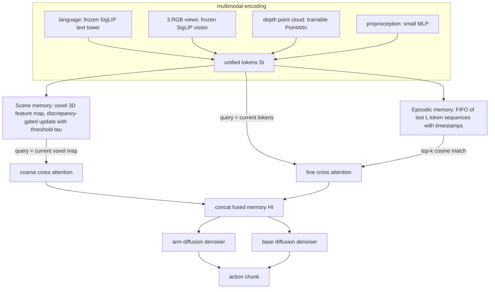

# EchoVLA：面向 VLA 移动操作的协同陈述性记忆（Synergistic Declarative Memory）

- 本地 PDF：`papers/memory/EchoVLA_2511.18112.pdf`
- arXiv：https://arxiv.org/abs/2511.18112
- 年份：2025（arXiv v1 2025-11；v2 2026-03 为 LNCS 排版，会议未注明，待确认：正文未标注录用 venue）
- 团队：中山大学（深圳校区）+ 上海交通大学 + 华为诺亚方舟实验室
- 阶段：移动操作（mobile manipulation）层的记忆增强 VLA——空间+情景双记忆直接进扩散控制回路，附自动化数据引擎 MoMani

## 一句话总结

把人脑陈述性记忆的双系统搬进 VLA：scene memory 维护跨 episode 持久演化的 voxel 3D 特征图提供缓慢变化的空间结构，episodic memory 用时间索引 FIFO token 缓冲记录近期任务进度，二者经 coarse/fine 两级 cross-attention 检索融合成条件 $H_t$，驱动 base/arm 分部扩散策略——在 RoboCasa 上平均 SR 从 π0.5 的 0.32 提到 0.52，移动操作从 0.20 提到 0.31（Abstract + Table 2）。

## 核心技术

1. **双记忆库（Sec 3.3）**
   - Scene Memory：voxel 化 3D 特征图 $\mathbf{V}^{3D}$，新环境中初始化为空网格，随 episode 反复交互逐步累积深度观测（经 PointAttn 编码）；**discrepancy-driven 更新规则**——当前 voxel 特征先与"由既有记忆重建出的版本"比对，重建误差超过阈值 τ 的区域才写入新特征，其余区域保留旧值；推理期同一规则继续生效，因此环境被重新布置时可在线自适应。
   - Episodic Memory：固定容量 FIFO 缓冲，存最近 $k$ 个时刻的**原始统一 token 序列**（不做摘要压缩），每条带时间戳索引；保留抽屉开没开、物体抓没抓、end-effector 最近姿态这类细粒度时序线索。
2. **多模态统一 token 表示（Sec 3.2）**：语言与三路固定相机 RGB 用**冻结** SigLIP 编码，深度融合点云用**可训练** PointAttn 编码（拿到 free-space 结构、支撑面、物体边界等几何线索），本体感知走小 MLP，拼接成 $\mathbf{S}_t=[\mathbf{L},\mathbf{V}_t,\mathbf{P}_t,\mathbf{R}_t]$。
3. **两级检索与融合（Sec 3.3）**：两个记忆都先用 cosine 相似度匹配、取 top-k 子集；scene 分支以当前 voxel 图为 query 做 **coarse cross-attention**（空间粒度粗），episodic 分支以当前 $\mathbf{S}_t$ 为 query 做 **fine cross-attention**（时间粒度细），输出拼成记忆增强表征后条件化扩散策略。层级结构来自两种记忆的语义粒度差异，而不是手工设计的先后流水线。
4. **Per-part 扩散策略（Sec 3.4）**：base 和 arm 各自一个独立 denoiser，共享同一个 $H_t$ 条件；继承自 π0.5 的分部分解思路，叠加记忆条件以处理非马尔可夫歧义。
5. **MoMani 数据基准（Sec 4）**：MLLM 引导的两阶段管线。Stage I 在线候选生成（Target-Aligned Sampling、Safety-Aware Navigation、Nav-Manip 连续拼接），过硬质量闸门（零碰撞、对齐误差 Δpos < 0.05 m 且 Δori < 5°、任务 100% 成功）；Stage II 离线字典序排序（路径长度 + 规划代价）选出 Top-K 并做 scene-camera audit，最终产出 5,000+ 条多模态轨迹；另有 TidyBot++ 平台 30 Hz 遥操作采集 1,200 条真机数据。

## 底层原理与数学推导

问题被形式化为非马尔可夫决策：视觉上几乎相同的两帧可能对应完全不同的进度（论文原例："cabinet opened" vs "about to open"），单帧观测不足以定姿。因此策略显式吃下整个历史：

$$(\mathbf{a}_t^{\text{arm}},\ \mathbf{a}_t^{\text{base}})=\pi_\theta(\mathcal{I},\ \mathcal{O}_{1:t},\ \mathbf{s}_{1:t})$$

历史无法原样塞进上下文，于是被拆成两类摘要再检索：

$$\mathbf{S}_t=[\mathbf{L},\ \mathbf{V}_t,\ \mathbf{P}_t,\ \mathbf{R}_t],\qquad \mathcal{M}^{\mathrm{epi}}=\{(\mathbf{S}_{t-k},t-k),\dots,(\mathbf{S}_{t-1},t-1)\}$$

$$\mathbf{V}^{3D}_t\in\mathbb{R}^{X\times Y\times Z\times C}$$

两级注意力检索是全文的核心算子。注意两支的 query 不同：空间记忆用体素图查自己（空间对齐），事件记忆用当前 token 查历史 token（语义对齐）：

$$\mathbf{Z}^{\mathrm{scene}}_t=\mathrm{CrossAttn}(\mathbf{q}=\mathbf{V}^{3D}_t,\ \mathrm{k/v}=\mathcal{M}^{\mathrm{scene}}_{\mathrm{sel}})$$

$$\mathbf{Z}^{\mathrm{epi}}_t=\mathrm{CrossAttn}(\mathbf{q}=\mathbf{S}_t,\ \mathrm{k/v}=\mathcal{M}^{\mathrm{epi}}_{\mathrm{sel}}),\qquad \mathbf{H}_t=[\mathbf{Z}^{\mathrm{scene}}_t,\ \mathbf{Z}^{\mathrm{epi}}_t]$

再看 scene memory 的更新门控：设当前观测经 PointAttn 得到的体素特征为 $\mathbf{V}^{3D}_t$，既有记忆的重建为 $\hat{\mathbf{V}}^{3D}_t=g(\mathcal{M}^{\mathrm{scene}})$（论文文字描述，未给公式），则更新集合是残差超阈值的位置：

$$U_t=\{x:\|\mathbf{V}^{3D}_t(x)-\hat{\mathbf{V}}^{3D}_t(x)\|>\tau\},\qquad \mathcal{M}^{\mathrm{scene}}_t=\begin{cases}\text{new features} & x\in U_t\\ \text{previous features} & \text{else}\end{cases}$$

这在形式上是预测编码（predictive coding）：系统只为"预测失准的地方"付费存储，从而跨 episode 收敛出稳定的几何骨架。动作侧沿用标准去噪目标，base/arm 两个子空间各训一个去噪器：

$$\mathcal{L}=\sum_{p\in\{\text{base},\text{arm}\}}\mathbb{E}_{t,\mathbf{z}_t}\Big[\big\|\epsilon-\epsilon_\theta^{(p)}(\mathbf{z}_t,\mathbf{H}_t,t)\big\|^2\Big]$$

推导层面值得注意的三点：
- **粒度决定分工**：coarse 对应"房间长什么样"这类慢变量，fine 对应"上一秒刚做了什么"这类快变量。若只用单一记忆，要么让空间结构被时间流稀释，要么让事件细节淹死在大尺度地图里。消融（Table 3 第 c/d 行）显示去掉任一支都会掉点，且掉的方式不同（见下）。
- **存储复杂度可控性来自两条不同机制**：scene memory 靠 discrepancy 门控抑制冗余写，episodic memory 靠 FIFO 定长截断防无限增长。前者控"写得对不对"，后者控"存多少"。窗口大小 $L$ 与阈值 $\tau$ 正好对应这两个旋钮（Table 4 敏感性分析）。
- 论文符号中扩散时间步与观测时间步都写作 $t$（Eq. 8 中的 $\mathbf{z}_t$ 与 Eq. 4 中 buffer 索引重名），阅读时需区分；未给出去噪步数、$\mathbf{H}_t$ 注入去噪器的具体方式（拼接还是 FiLM 层）等实现细节，待确认：正文仅到伪代码级别描述。

## 物理直觉解释

**第一段｜图书馆的两个部门**。论文用脑科学的双系统作类比：parahippocampal cortex（PHC）及其邻近脑区负责场景的空间-语义骨架——相当于图书馆的**书架布局平面图**，什么时候进馆都不会变；hippocampus 则把这些情境整合成带时间戳的事件痕迹——相当于你昨天借了哪本书的**借阅登记簿**。EchoVLA 把这两个角色分别派给 voxel map 和 FIFO buffer：前者告诉你"微波炉在那个角落"，后者告诉你"你已经把杯子从架子上拿下来了"。任务执行出错往往不是不知道世界长什么样，而是忘了刚才干到哪一步——所以单靠布局图不够，还得有登记簿。

**第二段｜地形图与行车记录仪**。两种记忆的本质区别是更新速率：scene memory 像**地形图**，绘制成本高但一年才修订一次，所以只在地貌真的变了（重建误差超阈值）时局部刷新；episodic memory 像**行车记录仪**，循环覆写、只保留最近一段。如果反过来用地形图记录"我刚刚转了个弯"，成本爆炸；只用行车记录仪回答"这个城市哪里有河"，则永远凑不全景。移动操作恰好同时需要这两种回答——导航要地形图，抓取要记录仪。

**第三段｜为什么非马尔可夫必须外置记忆**。考虑两个几乎相同的画面：柜门已打开 vs 即将去打开。像素层面的差异只有几个百分点，任何基于单帧的 policy 都会在这两个状态之间来回切换，表现为"开了又关、关了又开"的震荡。EchoVLA 的解法是把判别信息放到 episodic buffer 里——因为"几步之前确实执行过开门动作"这条信息存在于历史 token 序列中，而不在当前帧里。这相当于人类在没有便签时靠**最近几分钟的记忆残留**避免重复劳动，而不是每次重新推断世界状态。

**第四段｜门控更新等于只修坏掉的墙**。discrepancy 门控的意思是：先问既有的地图能不能"解释"眼前这帧，能解释的部分一笔不动，解释不了的区域才重画。像粉刷一面墙前先**手电筒斜照找裂缝**——只有裂缝处补漆，整面墙不用铲平重刷。好处是抗噪（相机瞬时噪声不会污染整张图）、省算力（每次只更新少数量化区域）、以及支持在线迁移：环境中途被人为改动时，改动区域的重建误差自然升高而被替换，其余区域保持稳定的空间参照系。

## 工程细节与实操指南

- **训练配置**：8 张 NVIDIA A100；输入为多视角 RGB-D + 机器人状态；动作空间按 base/arm 分部分解。评测 SR 为三个随机种子 × 每任务 50 episode 的均值（Sec 5.1/5.2）。
- **编码器取舍**：SigLIP 语言塔与视觉塔全部冻结（保住预训练跨模态对齐），只训 PointAttn 点云塔与策略头——3D 几何是 embodiment 相关的，必须可训练适配具体平台（Sec 3.2）。
- **超参数选型（Table 4）**：episodic 窗口 $L=8$ 最优（$L\in\{2,4,8,16\}$ 对应 SR 0.08/0.12/0.17/0.15）；scene 更新阈值 $\tau=0.5$ 最优（$\tau\in\{0.1,0.3,0.5,0.7\}$ 对应 0.11/0.14/0.17/0.13）。小窗口导致 plan forgetting 与震荡，大窗口引入延迟收益递减；低阈值导致表征不稳定，高阈值导致场景记忆过时。
- **MoMani 数据构成（Fig 4）**：仿真 7,889 条 episode，其中 nav-only 占 57.0%，PnPC2S 10.8%、PnPS2C 10.7%、TOS 10.7%、TOF 10.7%；真机 1,200 条，OR/CM/OD/PCIS 各 20.8%，EnP/RK 各 8.3%。质量闸门的硬指标：零碰撞、Δpos < 0.05 m、Δori < 5°、任务成功率 100%（Sec 4.1）。
- **真机平台**：TidyBot++（holonomic 底盘 + Kinova Gen3 7-DoF 臂），前置 RGB-D + 顶部立体相机经 ROS 同步，web 遥操作 30 Hz 采数，轨迹切分为 motion primitives，成功轨迹经 replay 校验、失败轨迹丢弃（Sec 4.2）；评测在 7 m × 7 m 场地，每任务 20 次独立 trial，底盘初始位置随机化（Sec 5.4）。
- **待确认**：论文未公开 voxel 分辨率、网格尺寸 $X\times Y\times Z$ 与通道数 $C$ 的具体取值，也未给出 episodic top-k 中 $k$ 的数值与 DiT 块数、去噪步数等架构规模参数；正文仅有公开的 L/τ 两组敏感性数值可用。

## 消融实验与分析

**主消融：观测模态 × 记忆模块（Table 3，两列分别是 PnPC2S 的 Mobile 变体 M 与静态桌面变体 S，SR@50 episodes）**

| 配置 | RGB | 点云 PC | Episodic | Scene | SR (Mobile M) | SR (Static S) |
|---|---|---|---|---|---|---|
| (a) 去 RGB | ✗ | ✓ | ✓ | ✓ | 0.02 | 0.13 |
| (b) 去点云 | ✓ | ✗ | ✓ | ✓ | 0.08 | 0.15 |
| (c) 去 Scene Memory | ✓ | ✓ | ✓ | ✗ | 0.09 | 0.16 |
| (d) 去 Episodic Memory | ✓ | ✓ | ✗ | ✓ | 0.14 | 0.13 |
| 完整模型 | ✓ | ✓ | ✓ | ✓ | 0.17 | 0.21 |

**核心结论**：损伤方向随任务设定翻转——Mobile 设定下砍 RGB 最致命（0.17 → 0.02，相对损失 88%，说明跨房间导航高度依赖图像语义定位），而在 Static 设定下砍 episodic memory 伤害最大（0.21 → 0.13，桌面精细操作主要靠"刚才做到哪一步"的时间线索，场景记忆反而是次要的：去 SM 只降到 0.16）。三维几何（点云）在两种设定下贡献一致且居中（M 降 0.09 / S 降 0.06）。也就是说双记忆不是绑定的整体，SM 主导"空间一致性"、EM 主导"进度一致性"，各自的边际价值取决于任务的时间跨度与空间跨度之比。

**敏感性分析（Table 4，PnPC2S Mobile）**

| 超参数 | 取值 1 | 取值 2 | 取值 3 | 取值 4 | 最优 |
|---|---|---|---|---|---|
| EM 窗口 L（SR） | 2 → 0.08 | 4 → 0.12 | 8 → 0.17 | 16 → 0.15 | L = 8 |
| SM 更新阈值 τ（SR） | 0.1 → 0.11 | 0.3 → 0.14 | 0.5 → 0.17 | 0.7 → 0.13 | τ = 0.5 |

**核心结论**：两组超参数都呈单峰形态且最优值恰好是各自扫描区间的内点，说明性能曲线两侧的失败模式对称——记忆太少丢任务进度（"plan forgetting"），太多引延迟与漂移；门控太松图谱被噪声反复重写，太紧则环境变化后再也学不进来。这正好实证了上文"存量稳定性 vs 新鲜度"的权衡不是一个可以端到端学出来的量，目前仍要网格搜索定（这是该方法的实际使用成本之一）。

**基线对比（Table 2 / Table 5 节选，SR）**

| 方法 | RoboCasa Avg（Manip./Nav） | RoboCasa Avg（Mobile Manip） | 真机 Avg SR（6 任务） | 真机 EnP（最长程任务） |
|---|---|---|---|---|
| π0.5 | 0.32 | 0.20 | 0.33 | 0.00 |
| Diffusion Policy | 0.01 | –（表中未报） | 0.32 | 0.03 |
| EchoVLA | **0.52** | **0.31** | **0.44** | 0.10 |

**核心结论**：难度从桌面抬升到移动时全体方法的 SR 都塌了一档（论文文字称 π0.5 由 0.47 降至 0.36，但按 Table 2 实际均值应为 0.32 → 0.20，待确认：正文叙述与表格口径不一致，无法还原其统计方式），而 EchoVLA 在两档设定下都保持第一。真机上最能区分方法的是 EnP——需要跨房间导航后再放置物体，π0.5 彻底失败（0.00），Diffusion Policy 仅 0.03，EchoVLA 达 0.10；绝对值仍低，说明长时程问题远未解决，只是相对优势明显。值得注意的反例是 Open refrigerator（OR）：π0.5 拿到 0.50 而 EchoVLA 只有 0.40——冰箱门开启瞬间剧烈变化的几何使显式 3D 场景记忆反而成为干扰源，论文在失败分析中承认这一点（Sec 5.4-3）。

## 技术权衡（Trade-off）

- **显式 3D 记忆 vs 隐式肌肉记忆**：显式 voxel 图带来可解释的空间一致性与在线更新能力，但在快速结构变化（开冰箱门造成的动态遮挡）面前会"见鬼"（odometry 漂移导致的 ghosting），反而不如 π0.5 这类隐式策略鲁棒（Limitations + 失败分析）。代价不是免费的。
- **深度/位姿流依赖**：整个 scene memory 构建在高质深度与位姿之上；真机部署中里程计累计漂移会直接转化为空间错位。作者提出的路线是引入 loop closure 或 visual SLAM——相当于承认当前方案缺一层传统 SLAM 的纠错。
- **per-part 解耦 vs 协同**：base/arm 分部扩散降低学习难度、利于跨任务迁移，但协调控制的难度仍真实存在——所有方法从桌面向 mobile 迁移都大幅掉点（0.32 → 0.20 for π0.5），EchoVLA 的缓解来自记忆而非更强的耦合建模。
- **FIFO 定长 vs 长程事件留存**：episodic buffer 只覆盖 $L=8$ 个 token 帧，超出窗口的事件（例如很久以前在该房间完成的同类任务）不留痕；场景记忆没有语义级的"上次我把杯子放哪了"条目。它的"经验"停留在秒级时间尺度，谈不上终身记忆。
- **数据工程质量 vs 可复现性**：MoMani 的高质量门控（100% 成功率、碰撞为零）意味着喂给模型的都是专家级轨迹，这提升了绝对性能但也意味着失败数据的修复信号没有被利用——与库内 self-improvement 线（利用失败 rollout）形成方法论分歧。

## 技术价值与演进定位

这篇工作把 VLA 记忆研究从"往上下文里塞更多帧"推进到"按认知功能分类的外置存储"。在此之前的谱系是：BSC-Nav 用 landmark + cognitive map 服务 LLM 推理规划（记忆不在控制回路里）；MemoryVLA 建 perceptual/cognitive 双缓存条件扩散策略（隐式感知缓存，无显式空间表征，无法回答"桌子在哪"）；π0.5 引入 per-part 分解与部分 episodic 机制但没有场景级记忆。EchoVLA 的位置是第一次把"空间记忆"与"事件记忆"作为两套独立管理（存储、更新、检索规则都不同）的系统放进同一个 VLA 控制回路，并用 coarse/fine 双注意力定义了两者的接入协议。配套的 MoMani 则说明作者的真正目标偏向落地管线： nav-manip 联合数据的自动化生产，而非单纯刷 benchmark。局限同样清晰：环境是近乎静态的家庭场景、显式 3D 对动态结构敏感、时间记忆只有秒级视窗——它与库内 RoboTTT（权重内记忆）、MemoryWAM（时间分层记忆）共同构成"记忆该怎么拆"这一问题的三个候选答案。

## 与其他论文的关系

- **π0.5 — 基座与直接 baseline**：per-part diffusion（base/arm 分部去噪）继承自 π0.5 的部分分解设计；EchoVLA 只是在其上加入双记忆条件，就把 RoboCasa 平均 SR 从 0.32 提到 0.52、Mobile Manip 从 0.20 提到 0.31——增益可归因于记忆注入而非动作头本身。
- **MemoryVLA — 最接近的同时期工作**：同为"记忆条件化 VLA 扩散策略"，但其 perceptual-cognitive memory 本质是视觉特征缓存；EchoVLA 论文明确指出它缺少显式空间表征与任务级经验存储，无法支撑长程推理。两者差异是"隐式缓存 vs 显式结构化存储"的教科书对照。
- **BSC-Nav — 上游范式对照**：landmark memory + cognitive map 是给 LLM 推理规划用的外部知识库，与连续控制脱节；EchoVLA 让地图直接参与 diffusion 条件生成，完成了"记忆从规划层下沉到控制层"的一步。
- **SERF（库内 `notes/memory/serf.md`）— 空间记忆的另一条路线**：SERF 用连续 neural points + object-level SE(3) tracking 更新地图并把机器人本体也放进去；EchoVLA 用离散 voxel grid + discrepancy 门控，不跟踪物体刚体运动、只累积环境几何。SERF 更精确但依赖特权实例标签，EchoVLA 更简单但精度受限；两文在 BEHAVIOR/RoboCasa 不同基准上评测，不可直接比数值。
- **MemoryWAM（库内 `notes/memory/memorywam.md`）— 组织维度的分野**：MemoryWAM 按时间分层压缩记忆（近期细、远期粗），EchoVLA 按"内容类型"切分（空间结构 vs 时间事件）。前者回答"多久之前的记忆保留多细"，后者回答"哪些种类的信息应该分开存"。
- **RoboTTT（库内 `notes/memory/robottt.md`）— 参数记忆 vs 结构记忆**：RoboTTT 用 test-time training fast weights（8K 上下文）把记忆写进网络权重，模型自身变化；EchoVLA 外置独立存储、冻结基座，两者互斥的工程选择——前者改行为先验难审计，后者易审计但容量受显存限制。
- **Diffusion Policy / DP3 — 动作头血统**：per-part 扩散动作头直接源于 diffusion policy 家族；sim 中 Diffusion Policy 接近零成功（0.01）而真机却有 0.32，说明纯模仿策略对 sim-to-real 与域差异极其敏感，也反衬出这类 paper 都得依托大数据骨干才能在仿真评价中站住脚。

## 精读问题

1. **双记忆间的横向通信**：当前 $\mathbf{Z}^{\mathrm{scene}}_t$ 与 $\mathbf{Z}^{\mathrm{epi}}_t$ 只在最后 concat，从不交互——如果 scene 先告诉 episodic"你现在在水槽边"、episodic 再反馈 scene"这个水槽的门经常卡住"，是否能涌现空间-事件联合推理（例如避开已知有问题的抽屉）？需要什么样的双向注意力或门控机制，代价是多大？
2. **动态几何下的场景记忆失效边界**：失败分析表明冰箱门开合就能让显式 3D 图退化，那么"物体可动但结构静止"的家庭场景边界在哪？如果把 movable 物体改用 object-level SE(3) 跟踪（SERF 的做法）混合 voxel 背景，能否兼得两边的鲁棒性？
3. **跨 episode 的 episodic 经验缺失**：FIFO 只保留单次任务内的窗口，第二次进入同一房间时要重新积累"哪个抽屉卡"的经验。若在 episode 结束时把 buffer 蒸馏成分图表（如 key-value 摘要注入 scene memory 或单独技能库），是否能把秒级记忆升级为日级经验？
4. **τ 门控与 SLAM 漂移的耦合**：由于更新与否由重建残差决定，当里程计缓慢漂移时整张图的残差会缓慢升高——它是被当作"环境变了"错误地大面积重写，还是积累到阈值造成突变失效？有没有办法把 drift 补偿与物体变更区分开（这正是作者提出接 loop closure 的原因）？
5. **π0.5 正文口径矛盾**：文字给出的移动操作衰减（0.47 → 0.36）与表格均值（0.32 → 0.20）不一致——是否意味着存在未披露的第二套评测协议（例如含 nav-only 的加权、或不同种子集）？复现时应以哪套为准？
