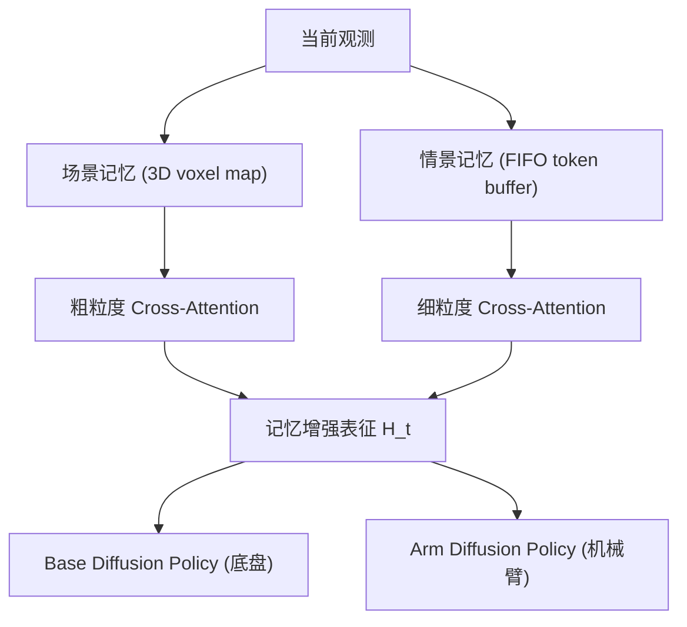

# EchoVLA: Synergistic Declarative Memory for VLA-Driven Mobile Manipulation

- 本地 PDF：`papers/memory/EchoVLA_2511.18112.pdf`
- arXiv：https://arxiv.org/abs/2511.18112
- 年份：2026 (CVPR 2026)
- 团队：中山大学(深圳) + 上海交大 + 华为诺亚方舟
- 阶段：双记忆 VLA —— 场景 3D 记忆 + 情景时序记忆

## 一句话总结

EchoVLA 提出脑启发双记忆 VLA：场景记忆（体素化 3D 语义地图，慢变，记"环境是什么"）+ 情景记忆（FIFO token 缓冲，记"刚刚做了什么"）。由粗到细的注意力检索，分部扩散策略（base + arm）。RoboCasa 移动操作 0.52 SR（vs π0.5 0.31），真机 0.44（vs π0.5 0.33）。

## 核心技术

1. 双存储独立更新/检索 — 场景记忆（3D voxel map, 空间 grounding）+ 情景记忆（时间索引 token buffer, 时序进度）
2. 由粗到细注意力 — 粗粒度 cross-attention 查场景记忆，细粒度查情景记忆
3. Per-part 扩散策略 — 底盘和机械臂分别去噪，协同控制
4. MoMani 自动数据生成 — MLLM 引导规划 + 反馈驱动精炼

## 底层原理与数学推导

## 精读问题

1. 场景记忆在动态环境（物体被移动后）的一致性如何维护？
2. 两种记忆之间是否有交互/协作，还是完全独立？

## 技术权衡（Trade-off）

| 优势 | 劣势 |
|------|------|
| 记忆与空间表示合二为一 | 语义记忆弱于空间记忆 |
| 增量更新，实时适配 | 大场景存储和查询的 scalability 待验证 |

## 技术价值与演进定位

2026 年机器人记忆研究的代表工作，属于各自的记忆技术路线（4D 潜地图/双记忆/四模块/状态化训练/TTT）。

## 与其他论文的关系

- 与 RoboTTT、MemoryWAM 等同属 2026 年记忆研究方向，技术路线不同但目标一致：让机器人不忘记。

## 精读问题

1. 核心技术路线在当前 benchmark 之外的表现？
2. 与其他记忆路线的互补可能性？

## 物理直觉解释

EchoVLA 模仿人脑的双记忆分工——海马旁回皮层存的是"环境长什么样"（慢变的 3D 布局），海马体存的是"我刚才做了什么"（快速更新的时间序列）。移动操作天然需要这两种记忆：导航靠空间地图，操作靠时序进度。EchoVLA 把这两个独立存储、独立检索，然后用由粗到细的注意力融合。

## 工程细节与实操指南

- 场景记忆: 体素化 3D 语义地图，慢更新
- 情景记忆: FIFO token buffer，时间索引
- 检索: cosine similarity top-k + coarse-to-fine cross-attention
- 策略: Per-part 扩散（底盘 + 机械臂分别去噪）
- 数据: MoMani 自动生成 expert 轨迹
- 真机: 7m×7m 场地, EchoVLA 0.44 vs π0.5 0.33

## 消融实验与分析

| 消融 | 结论 |
|------|------|
| 双记忆 vs 单记忆 | 双记忆在移动操作上系统性领先 |
| 由粗到细注意力 vs 统一注意力 | 分层检索精度和效率均更优 |
| Per-part vs 统一扩散 | 分部扩散对全身协同关键 |
