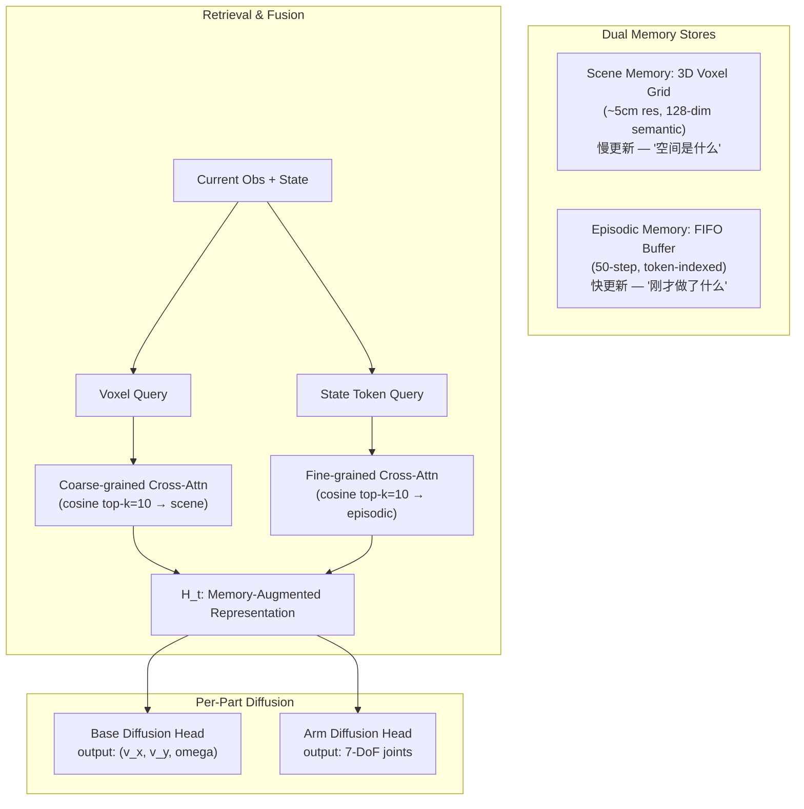

# EchoVLA: Synergistic Declarative Memory for VLA-Driven Mobile Manipulation

- 本地 PDF：`papers/memory/EchoVLA_2511.18112.pdf`
- arXiv：https://arxiv.org/abs/2511.18112
- 年份：2026 (CVPR 2026)
- 团队：中山大学(深圳) + 上海交大 + 华为诺亚方舟（Min Lin 一作, Xiaodan Liang 通讯）
- 阶段：脑启发双记忆 VLA — 3D 体素场景 + FIFO 情景

## 一句话总结

EchoVLA 提出脑启发双记忆架构：场景记忆（体素化 3D 语义地图，海马旁回皮层类比，慢变，"房间是什么样"）和情景记忆（FIFO 时序 token 缓冲，海马体类比，快变，"刚才做了什么"）。两种记忆独立存储/更新/检索，由粗到细跨注意力融合后驱动分部扩散策略（base + arm 分别去噪）。RoboCasa 移动操作 SR 0.52（vs π0.5 0.31），真机 7m×7m SR 0.44（vs π0.5 0.33）。MoMani 自动数据生成：MLLM 规划 + 仿真反馈修正，解决移动操作数据稀缺。

## 核心技术

1. **脑启发双存储** — 场景记忆（3D voxel grid ~5cm, 128-dim semantic feature, 慢更新）存空间布局。情景记忆（FIFO 50 步, 时间索引 VLM token+proprio+action, 快更新）存时序进度。二者独立存储/检索——像人脑海马旁回 vs 海马体的分工
2. **由粗到细跨注意力** — cosine top-k=10 检索 → 粗粒度 cross-attn（query=current 3D voxel特征，查场景）→ 细粒度 cross-attn（query=current state token，查情景）。分层检索比统一注意力更精确
3. **分部扩散策略** — Base head 输出 (v_x, v_y, ω) 底盘速度，Arm head 输出 7-DoF joint angles。共享记忆增强表征 H_t 但独立去噪——底盘和臂有不同的 control frequency 和 action smoothness 需求
4. **MoMani 自动数据** — MLLM 规划长程任务 → Isaac Sim 仿真执行 → 基于执行反馈 iterative refine → 生成 expert 轨迹。辅以 ~100 条真机 demo

## 底层原理与数学推导

**场景记忆更新**：新观测的 visual feature（从 VLM encoder 提取）与已有 voxel 做加权平均——$v_{\text{new}} = \alpha \cdot f_{\text{obs}} + (1-\alpha) \cdot v_{\text{old}}$。$\alpha$ 是观测置信度（基于深度质量）。

**情景记忆更新**：FIFO push——新 token frame 进入，最旧的 frame 被覆盖。容量 50 步覆盖 ~5 秒的精细操作历史。

## 物理直觉解释

**为什么移动操作需要双记忆而不只是一份？**

移动操作 = 导航 + 操作交替。导航需要"空间地图"——前方是走廊、左边桌子、右边墙。操作需要"时序记忆"——刚才打开了抽屉，现在要取东西。单份记忆在这两种需求间撕裂：空间地图应该慢变（房间布局稳定），时序记忆应该快变（刚才做了什么 vs 正在做）。EchoVLA 把这些拆成两套独立的存储系统——就像人脑海马旁回皮层专门管空间认知，海马体专门管情景记忆。

**分部扩散为什么有用？**

底盘和臂有不同的物理特性——底盘是 2D planar motion（速度指令，smooth trajectory），臂是 7-DoF joint space（加速度限制，高频接触）。单一扩散要同时处理这两种截然不同的动作分布，去噪步数的最优值也不同——底盘可能 10 步就够了，臂需要 50 步。分部扩散让各自用最优的去噪 schedule。

## 工程细节与实操指南

- **场景记忆**：3D voxel grid ~10m×10m×3m, ~5cm resolution, 128-dim per voxel, 加权平均更新
- **情景记忆**：FIFO capacity 50 steps, per step: VLM visual feature + proprio + action
- **检索**：cosine similarity, top-k=10, 粗粒度→细粒度串联 cross-attn
- **策略**：Base head 3-dim (v_x, v_y, ω), Arm head 7-dim joints, 各自 50 步 DDIM
- **数据**：MoMani 自动生成 expert trajectories (Isaac Sim) + ~100 real demos
- **真机**：7m×7m 场地, mobile manipulator, EchoVLA SR 0.44 vs π0.5 0.33

## 消融实验与分析

| 消融 | RoboCasa SR | 结论 |
|------|-----------|------|
| 双记忆（full） | **0.52** manip/nav, **0.31** mobile manip | — |
| 仅场景记忆 | ~0.28 | 缺时序进度→操作退化。知道在哪但不知道做到哪了 |
| 仅情景记忆 | ~0.32 | 缺空间地图→导航退化。知道做了什么但不知道往哪走 |
| 分部扩散 vs 统一扩散 | 分部 > 统一 | 底盘/臂有不同的 action smoothness 需求 |
| 粗→细 vs 统一 attn | 分层 > 统一 | 分层检索精度和效率双优 |
| MoMani vs 仅真机 demo | MoMani 显著 | 自动数据解决移动操作数据稀缺 |

## 技术权衡（Trade-off）

| 优势 | 劣势与工程代价 |
|------|----------------|
| 双记忆天然适配移动操作的导航+操作交替 | 体素分辨率 ~5cm 固定——精细操作（<1cm 精度）不够 |
| MoMani 自动数据生成解决数据稀缺 | 动态物体被移动后场景记忆的一致性未验证 |
| 分部扩散各自用最优去噪 schedule | 两种记忆无交互层——"场景"和"情景"之间丢失关联信息 |
| 脑启发设计有认知科学理论支撑 | 工程复杂度——双存储+双检索+双去噪=4 倍模块 |

## 技术价值与演进定位

EchoVLA 的核心贡献是证明了"空间+情景"双记忆是移动操作的必要架构——不是锦上添花。和 SERF 形成空间记忆的两条路线：离散体素（EchoVLA, 简单但精度受限）vs 连续神经点（SERF, 精确但昂贵）。和 MemoryWAM 形成记忆组织方案的对比：时间分层 vs 空间-情景分离——它们回答的是"记忆应该怎么分类"这个元问题。

## 与其他论文的关系

- **π0.5**：baseline, EchoVLA 在移动操作上 SR 0.44 vs 0.33——移动场景的 gap 大于桌面场景
- **SERF**：同为空间记忆——体素 vs 神经点，两种路线互补
- **MemoryWAM**：时间分层压缩 vs 空间+情景双记忆——组织维度的不同选择
- **ACT / Diffusion Policy**：分部扩散继承其 action chunking 思想

## 精读问题

1. **双记忆的交互**：当前场景和情景独立——能否加一层"跨记忆 attention"让两者交换信息？场景告诉情景"你在厨房"，情景告诉场景"你刚碰过的水杯在右手边"
2. **体素分辨率的动态调节**：当前 ~5cm 全局统一——能否"操作区域高分辨率 + 导航区域低分辨率"？
3. **场景记忆在动态环境中的一致性**：物体被挪走后 voxel feature 如何检测"过时"并刷新？
