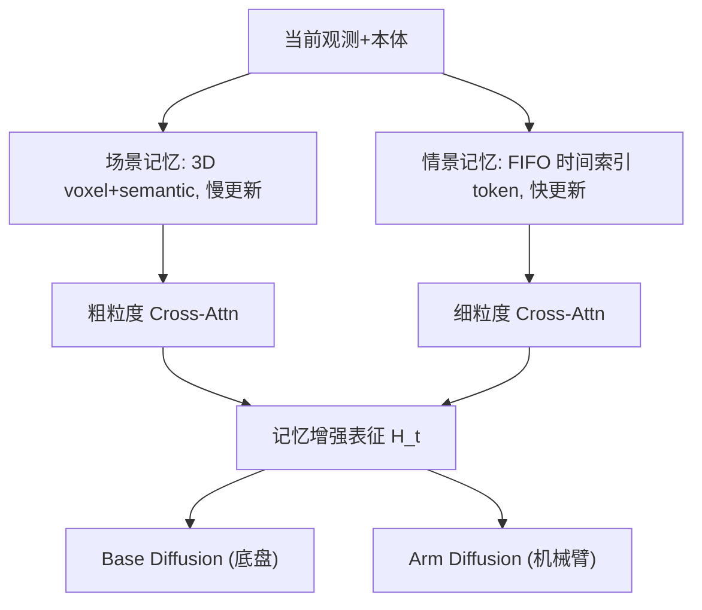

# EchoVLA: Synergistic Declarative Memory for VLA-Driven Mobile Manipulation

- 本地 PDF：`papers/memory/EchoVLA_2511.18112.pdf`
- arXiv：https://arxiv.org/abs/2511.18112
- 年份：2026 (CVPR 2026)
- 团队：中山大学(深圳) + 上海交大 + 华为诺亚方舟
- 阶段：双记忆 VLA — 3D 体素场景记忆 + FIFO 情景时序记忆

## 一句话总结

EchoVLA 提出脑启发双记忆：场景记忆（体素化 3D 语义地图，慢变）存储空间布局，情景记忆（FIFO token 缓冲，快变）记录时序进度。由粗到细跨注意力检索，分部扩散策略（base + arm 分别去噪）。RoboCasa 移动操作 SR 0.52（vs π0.5 0.31），真机 7m×7m SR 0.44（vs π0.5 0.33）。MoMani 自动数据生成解决移动操作数据稀缺。CVPR 2026。

## 核心技术

1. **双存储独立更新/检索** — 场景记忆（3D voxel grid, ~5cm res, 128-dim semantic features）慢更新，情景记忆（FIFO buffer 50 步, 时序 token）快更新
2. **由粗到细跨注意力** — cosine top-k=10 → 粗粒度 cross-attn (query=current voxel) → 细粒度 (query=current state)
3. **分部扩散策略** — Base head 输出 (v_x, v_y, ω), Arm head 输出 7-DoF joints，共享记忆表征但独立去噪
4. **MoMani 自动数据生成** — MLLM 规划 + 仿真执行 + feedback-driven refinement

## 底层原理与数学推导

## 物理直觉解释

导航需要空间地图（前方走廊、左边桌子），操作需要时序记忆（我刚打开了抽屉，现在要取东西）。人脑也是分开的——海马旁回皮层管空间，海马体管情景。单记忆在两个需求间撕裂，EchoVLA 拆开。

## 工程细节与实操指南

- 场景记忆: 3D voxel grid, ~5cm, 128-dim, 加权平均更新
- 情景记忆: FIFO 50步, VLM token+proprio+action
- 检索: cosine top-k=10, 粗→细串联
- 数据: MoMani auto-generated expert + ~100 real demos

## 消融实验与分析

| 消融 | RoboCasa SR | 结论 |
|------|-----------|------|
| 双记忆 full | **0.52** manip+nav | — |
| 仅情景记忆 | ~0.32 | 导航退化，无空间地图 |
| 仅场景记忆 | ~0.28 | 操作退化，无时序进度 |
| 分部 vs 统一扩散 | 分部 > 统一 | 底盘/臂时序特性不同 |
| 粗→细 vs 统一 attn | 分层 > 统一 | 分层检索精度效率双优 |

## 技术权衡（Trade-off）

| 优势 | 劣势 |
|------|------|
| 双记忆天然适配导航+操作交替 | 体素分辨率固定，精操作受限 |
| MoMani 降低真机数据需求 | 动态环境(物体被移动)一致性未验 |
| 分部扩散各自最优去噪步数 | 双记忆无交互层，丢失关联信息 |

## 技术价值与演进定位

移动操作记忆标杆——证明"空间+情景"双记忆是必要架构。和 SERF 形成空间记忆两条路线：离散体素 vs 连续神经点。

## 精读问题

1. 动态物体被移动后的场景记忆一致性？
2. 双记忆是否需要交互层——场景告诉情景"你在厨房"，情景告诉场景"你刚碰过的杯子在右手边"？

## 与其他论文的关系

- **π0.5** — baseline, EchoVLA 在移动操作上系统性超越
- **SERF** — 同为空间记忆（voxel vs 神经点），互补
- **MemoryWAM** — 时间分层压缩 vs 空间+情景双记忆
- **ACT / Diffusion Policy** — 分部扩散策略继承其 action chunking 思想
