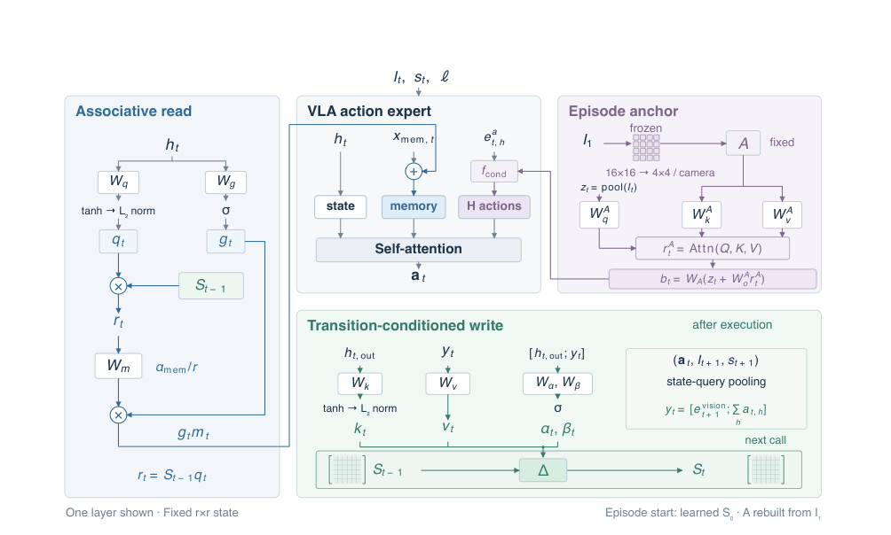
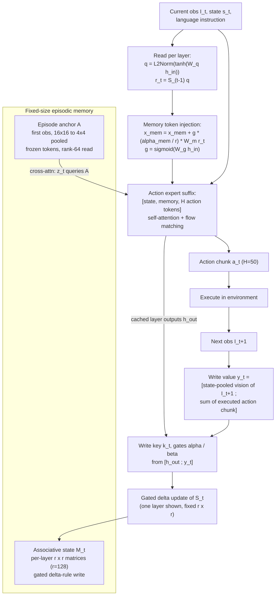
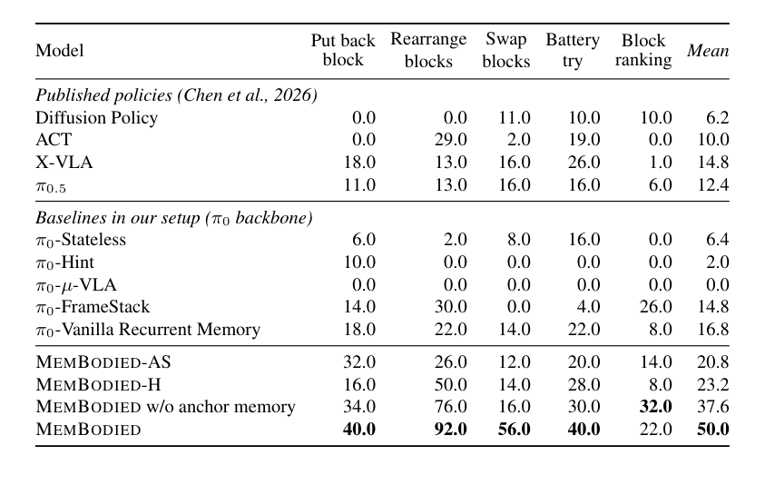

# MemBodied: Recurrent Associative Memory for Vision-Language-Action Models

- 本地 PDF：`/Users/luogu/physical_intelligence/papers/memory/MemBodied_2609.28256.pdf`
- arXiv：https://arxiv.org/abs/2609.28256
- Source：https://arxiv.org/abs/2609.28256
- Project：https://declare-lab.github.io/MemBodied
- Year：2026
- Category：memory
- Priority：high

## 一句话总结

MemBodied（NTU declare-lab + Griffin Labs + École Centrale de Lyon，2026-09-23，Soujanya Poria 组）给 VLA 装上**固定容量的情节记忆**，两条互补通路：逐层关联矩阵状态 $M_t$（动作专家每层一个 $r\times r$ 矩阵，$r=128$，用 gated delta rule 把「执行的动作 chunk + 事后视觉后果」写成交互事件）+ 情节锚点 $\mathcal{A}$（首帧冻结视觉 token 从 16×16 池化到 4×4，当前状态经 rank-64 交叉注意力选择性检索初始场景）。记忆读出经专用 memory token 注入动作专家后缀 [state, memory, H action tokens]，上下文长度全程不变。RMBench 五个记忆任务平均成功率 50.0%——是 stateless π0（6.4%）的 7.81 倍、vanilla recurrent（16.8%）的 2.98 倍、压缩历史强基线 NativeMEM（38.4%）的 1.30 倍，而新增参数仅 40M（π0 的 1.26%，约为 NativeMEM 415M 的十分之一），推理延迟 129.2 ms vs NativeMEM 1593.7 ms（降 91.9%）；换 π0.5 骨干 12.4%→48.0%（3.87 倍），真机双臂三任务 3.33%→26.67%（8 倍）；全观测 LIBERO 不退化（均值 95.1% vs π0 94.2%），长程 LIBERO-Long 90.6% 反超 π0 5.4 个百分点。

## 核心技术

*论文 Figure 1（p3）：Figure 1: MEMBODIED architecture. An associative state records interactions, while the episode ancho*

1. **逐层关联矩阵状态（recurrent associative state）** — 动作专家 L 层各持一个矩阵 $S^{(l)}_t \in \mathbb{R}^{B\times r\times r}$（$r=128$），episode 开始重置为可学习初始态，之后原地更新而非追加历史 token——记忆占用与访问成本和 episode 长度无关
2. **写值构造（transition-conditioned write）** — 写入的不是孤立观测而是交互事件：投影机器人状态 $s_{t+1}$ 作 query 对执行后观测 $I_{t+1}$ 的各相机 patch tokens 做交叉注意力（state-query pooling），逐相机池化后取平均得视觉后果编码，与动作 chunk 汇总拼接 $y_t$；patch tokens 上 stop-gradient，冻结视觉通路不被记忆目标污染
3. **Gated delta-rule 写入** — 写 key 由层输出 $h_{t,\text{out}}$ 经 tanh + L2Norm 得到；保留门 $\alpha$、写入门 $\beta$ 由 $[h_{t,\text{out}}; y_t]$ 生成；更新量是「新值 − 该 key 已关联的旧值」的误差修正，可改写既有关联而不无差别累积
4. **关联读取 + memory-token 注入** — 层输入 $h_{t,\text{in}}$ 生成读 query，读出 $r_t = S_{t-1}q_t$ 投影到动作网络宽度、乘 $\alpha_{\text{mem}}/r=2$、经标量门 $g_t$ 加进专用 memory token（token 本身不跨 policy call 持久，持久的是矩阵）；此接口实测优于 attention-steering 变体（50.0 vs 20.8 均值）与 hierarchical 变体（23.2）
5. **固定情节锚点（episode anchor）** — delta 写入会覆盖 episode 早期的细粒度细节，锚点通路保留首帧压缩参考：冻结 vision tokens 16×16 patch grid 平均池化到 4×4、跨相机拼接成 $\mathcal{A}$；当前状态池化出 $z_t$ 以 rank $r_A=64$ 交叉注意力检索，读出跨 action horizon 复制并经动作网络自身的条件化函数 $f_{\text{cond}}$ 融合进动作 token——prefix 长度、token 位置、attention mask 结构全部不动
6. **因果读写调度（延迟写）** — read $M_{t-1}$（用 $I_t,s_t,\ell$）→ 出动作 $a_t$ → 执行 → 环境给 $I_{t+1}$ → write $M_t$：存下的值包含动作后果，但未来观测从未暴露给造成它的动作；推理时缓存末个去噪步的各层状态与采样动作 chunk，下一观测到达时补写——训练与推理用同一因果解释
7. **序列训练** — 延迟写要求序列级 BPTT：每样本 N 对观测-动作、相邻对间隔一个 $H=50$ 步 horizon 模拟连续 policy call；图像编码在 batch/sequence 维并行、记忆状态沿序列串行传播，梯度穿过全序列；记忆参数仅靠策略原生动作目标端到端学习，没有独立记忆预测损失

## 底层原理与数学推导

问题形式化：历史依赖操作任务上，策略以完整情节记忆 $\mathcal{E}_t = (M_t, \mathcal{A})$ 为条件预测动作 chunk（$\mathcal{A}$ 由首帧构建、episode 内不变）：

$$a_t = [a_{t,1},\dots,a_{t,H}] \sim p_\theta\!\left(\cdot \mid I_t,\ s_t,\ \ell,\ \mathcal{E}_{t-1}\right)$$

**写值构造**：对每个相机 $c$，投影后的下一时刻机器人状态对视觉 patch tokens 做缩放点积注意力（$D$ 为特征维），逐相机独立后跨相机平均，再与因果动作 chunk 的汇总拼接、投影成各层写值：

$$e^{\text{vision}}_{t+1} = \frac{1}{C}\sum_{c=1}^{C}\,\mathrm{softmax}\!\left(\frac{(W^q_p\,\phi_s(s_{t+1}))(W^k_p X^{(c)}_{t+1})^{\top}}{\sqrt{D}}\right) W^v_p X^{(c)}_{t+1},\qquad y_t = \left[e^{\text{vision}}_{t+1};\ \sum_{h=1}^{H} a_{t,h}\right],\qquad v^{(l)}_t = W^{(l)}_v\, y_t$$

**Gated delta-rule 写入**（继承 Gated DeltaNet，Yang et al. 2025）。写 key $k^{(l)}_t=\mathrm{L2Norm}(\tanh(W^{(l)}_k h^{(l)}_{t,\text{out}}))$，两门 $\beta^{(l)}_t=\sigma(W^{(l)}_\beta[h^{(l)}_{t,\text{out}};y_t])$、$\alpha^{(l)}_t=\sigma(W^{(l)}_\alpha[h^{(l)}_{t,\text{out}};y_t])$：

$$S^{(l)}_t = \mathrm{Diag}(\alpha^{(l)}_t)\,S^{(l)}_{t-1} + \mathrm{Diag}(\beta^{(l)}_t)\Big(v^{(l)}_t - \mathrm{Diag}(\alpha^{(l)}_t)\,S^{(l)}_{t-1}k^{(l)}_t\Big)\,(k^{(l)}_t)^{\top}$$

第二项的括号正是「新值减去该 key 当前已召回的关联值」——**误差修正写入**。把更新式两边右乘刚写的 key（$k$ 经 L2Norm 故 $k^{\top}k=1$，由更新式直接代数推出，论文未显式写出）：

$$S_t\,k_t = \mathrm{Diag}(\beta_t)\,v_t + \big(I-\mathrm{Diag}(\beta_t)\big)\,\mathrm{Diag}(\alpha_t)\,S_{t-1}k_t$$

即刚写 key 的读出在旧关联与新值之间按 $\beta$ 逐维插值，$\beta=1$ 时一步精确关联 $S_tk_t=v_t$；近似正交的 key 集合则可无串扰地叠加存储，容量由秩 $r$ 控制（附录 D.2 的 rank 消融 27.0%→42.0%→55.0% 单调上升与此一致）。$\alpha$ 单独控制旧记忆逐维衰减——这是对纯加性线性注意力写入（无误差修正、无门）的两处关键改造。

**读取与 memory-token 注入**：$q^{(l)}_t=\mathrm{L2Norm}(\tanh(W^{(l)}_q h^{(l)}_{t,\text{in}}))$，$r^{(l)}_t=S^{(l)}_{t-1}q^{(l)}_t$，缩放因子 $\alpha_{\text{mem}}/r=256/128=2$ 补偿大秩矩阵读出的能量衰减：

$$x^{(l)}_{\text{mem},t} \leftarrow x^{(l)}_{\text{mem},t} + g^{(l)}_t\, m^{(l)}_t,\qquad m^{(l)}_t=\frac{\alpha_{\text{mem}}}{r}\,W^{(l)}_m r^{(l)}_t,\qquad g^{(l)}_t=\sigma\!\left(W^{(l)}_g h^{(l)}_{t,\text{in}}\right)$$

**锚点通路**：$z_t$（当前状态对当前视觉 token 的池化读出）以 rank $r_A=64$ 查询锚点，输出跨 horizon 复制后经 $f_{\text{cond}}$ 融合进每个动作 token：

$$c_t = z_t + W^A_o\,\mathrm{softmax}\!\left(\frac{(W^A_q z_t)(W^A_k \mathcal{A})^{\top}}{\sqrt{r_A}}\right) W^A_v \mathcal{A},\qquad b_{t,h}=W_A c_t,\qquad e^a_{t,h}=f_{\text{cond}}\!\left(e^a_{t,h};\,b_{t,h}\right),\ h=1,\dots,H$$

## 物理直觉解释

**MemBodied 的关联矩阵是一块固定大小的白板，delta rule 是「擦掉重写」而不是「再贴一张便利贴」。** 普通注意力上下文像不停往白板上贴便利贴——贴得越多板越满、找东西越慢（上下文与延迟随 episode 增长）；纯加性线性注意力像只许在旧字迹上描新字，写多了字迹糊成一团（叠加噪声）；delta rule 写入前先查「这个 key 底下原来写着什么」，只写差值——如同修改字典词条时先读旧释义再改写，而不是在旁边补一行。$\beta$ 门是笔尖力度（写多深），$\alpha$ 门是橡皮力度（旧条目留几成），两个门都由「当前层状态 + 要写的内容」共同决定，让策略自己学会哪里该改写、哪里该保留。这块白板的面积（rank 128）固定，所以无论任务做 30 秒还是 5 分钟，翻板子和写板子的成本不变。

**锚点是钉在工位隔板上的「开工前照片」。** 组装任务做完一半，桌上已经乱成一团，但「零件原来摆在哪」只需要瞟一眼照片——锚点把首帧 256 个 patch token 压成每相机 16 个 token 的小照片，贴在动作网络旁边；每一步策略用当前机械臂状态当手电筒，只照亮照片上和现在有关的那个角落（rank-64 选择性交叉注意力），而不是整张铺开。论文的对照实验精确量化了这一点：把完整首帧直接塞进 policy prefix（相当于把整张海报铺满桌面挡住工作区）只有 22.0%，锚点检索式参考 40.0%，差距 18 个点。而 Block Ranking 这类「按顺序试排列、记住哪些组合失败过」的任务，翻开工照片没用——进度在演化、不在起点——锚点反而拖后腿 10 个点，说明锚点救的是「初始状态记忆」而非「过程记忆」，后者只能靠白板上的交互记录。

**延迟写是实验员的操作日志：做完一步、看到结果，才落笔。** Battery Try 里插入电池、仪表盘没反应，这一步的日志才有信息量——「试过正反组合 A，失败」；如果动作还没执行就预写日志，等于偷看了明天的报纸，训练时会造成因果泄漏。MemBodied 的调度是先读记忆出动作、执行拿到 $I_{t+1}$、再把「动作汇总 + 视觉后果」写进矩阵——写的永远是完整的因果片段，而造成该后果的动作在生成时从未见过这个后果。定性分析显示增益精确落在这类决策上：stateless π0 插错电池后平均再盲试 4 次（20 轮里只成 8 轮），MemBodied 通常一次重试解决（23 轮成 20）；wrong-pad return 从 37/50 降到 13/50。至于读取接口，memory token 像把白板内容「念给」动作 token 听——作为它们自注意力里的上下文内容，而不是去掰它们的注意力计算（attention steering），实测前者均值高出近 30 个点。

## 工程细节与实操指南

- **主超参**：关联秩 $r=128$、$\alpha_{\text{mem}}=256$（读出乘子 2）；锚点秩 $r_A=64$；三路相机 224×224；动作 horizon $H=50$、10 步 flow-matching 去噪；bfloat16、seed 42、EMA 0.99、梯度裁剪 1.0；AdamW $(\beta_1,\beta_2)=(0.9,0.95)$、$\epsilon=10^{-8}$、weight decay $10^{-10}$；cosine 衰减 + 1000 步 warmup，峰值 $2.5\times10^{-5}$、终值 $2.5\times10^{-6}$
- **RMBench 训练**：PaliGemma LoRA rank/alpha 16，动作专家 LoRA rank/alpha 32；10,000 步、batch 8；序列长度按任务定——M(1) 三任务 8、Battery Try 14、Block Ranking 18；相邻序列元素间隔 50 环境步；梯度穿过完整采样序列
- **LIBERO 训练**：为对齐已发表 π0 基线用全量微调，batch 32、30,000 步、序列长 6；评测 5 步 replan 与 50 步记忆写间隔的错位用 **10 个 round-robin 记忆槽**调和——每个 5 步 policy call 读一个槽，该槽 50 步后回访时用新观测 + 完整 50 步动作 chunk 汇总做延迟写（汇总包含未执行的预测动作）
- **π0.5 适配**：π0.5 无专用 state token，改用 memory token 自身隐表征承担读 query（pre-attention）与写 key（post-layer）；token 每 call 重建、矩阵跨 call 持久；锚点读出直接融合进动作 token
- **真机**：2× AgileX PiPER 双臂 + Orbbec Gemini 336L 顶摄 + 2× Intel RealSense D405 腕摄；状态/动作各 14 维（每臂 6 关节 + 1 夹爪）；每任务 50 条遥操作演示，清洗后保留 41/50/49 条（Put Back/Rearrange/Swap），30 Hz；每任务 20 次物理 rollout，部分完成不计分；结果 3.33%→26.67%
- **效率剖析口径**：A100 80GB、bfloat16、单卡、只计模型侧耗时；每任务-策略前 3 次 query 作 warm-up 剔除；NativeMEM 2,548 个 cycle vs MemBodied 2,563 个 cycle，均值 1593.7 ms vs 129.2 ms（−91.9%），JAX allocator 峰值 20.57 GiB vs 18.61 GiB（−9.5%）；NativeMEM 额外要跑 per-frame 视频历史编码并维护增长队列
- **基线实现要点**（同 backbone/LoRA/步数对齐）：FrameStack 为 4 帧间隔 50 步拼接、不足补齐；π0-µ-VLA 用 64 个 recurrent memory token、每 2 个 recurrent 步截断梯度（共享预算下五任务全 0%，论文明言只说明该适配未学出有效循环策略，不能代表 µVLA 原设定）；Vanilla Recurrent 用 Delta-Mem 机制（rank 128、scale 256、query/输出注意力修正、隐状态写入）；NativeMEM 两阶段——memory tokenizer 训 50,000 步 + 离线缓存 token，冻结后策略再训 20,000 步，队列 stride 1
- **代码**：https://github.com/declare-lab/MemBodied

## 消融实验与分析

*论文 Table 1（p7）：Table 1: Success rates (%) on the five evaluated RMBench tasks. Published policy values are taken*

**主表消融（Table 1，RMBench 五任务成功率 %，共享 π0 backbone 训练配方）**：

| 变体 | Put back | Rearrange | Swap | Battery | Block Rank | 均值 |
|------|---------|-----------|------|---------|------------|------|
| MEMBODIED（完整） | 40.0 | 92.0 | 56.0 | 40.0 | 22.0 | **50.0** |
| w/o anchor memory | 34.0 | 76.0 | 16.0 | 30.0 | 32.0 | 37.6 |
| MEMBODIED-H（层级） | 16.0 | 50.0 | 14.0 | 28.0 | 8.0 | 23.2 |
| MEMBODIED-AS（注意力转向） | 32.0 | 26.0 | 12.0 | 20.0 | 14.0 | 20.8 |
| π0-Vanilla Recurrent | 18.0 | 22.0 | 14.0 | 22.0 | 8.0 | 16.8 |
| π0-FrameStack | 14.0 | 30.0 | 0.0 | 4.0 | 26.0 | 14.8 |
| π0-Stateless | 6.0 | 2.0 | 8.0 | 16.0 | 0.0 | 6.4 |

**写值成分（Fig. 4b，三任务，成功率 %）**：

| 写值内容 | Put back | Rearrange | Battery | 三任务均值 |
|----------|---------|-----------|---------|------------|
| 视觉 + 动作（完整） | 34 | 76 | 30 | 46.7 |
| 仅视觉 | 32 | 72 | 24 | 42.7 |
| 仅动作 | 18 | 64 | 22 | 34.7 |

**记忆秩与跨 episode 携带（Fig. 6 / Table 6）**：anchor-free 变体上 rank 32→64→128 两任务均值 27.0%→42.0%→55.0%（单调未饱和）；把关联状态跨 rollout 携带（锚点仍每集重置）均值 50.0%→36.8%，Put Back −22、Swap −20，仅 Block Ranking +6。另：首帧直接进 prefix（Put Back）22.0% vs anchor-free 34.0% vs 完整锚点 40.0%。

**核心结论**：记忆公式与接口都重要——同为固定循环状态，gated delta 关联矩阵 + memory-token 注入（50.0%）比 Delta-Mem 式 vanilla recurrent（16.8%）高 33.2 点，比注意力转向接口（20.8%）高 29.2 点，证明「读出以上下文内容暴露给动作 token」优于「修正注意力计算」；锚点贡献 12.4 点且增益集中于初始场景回忆类任务（Swap 16→56），但对进度追踪类任务为负（Block Ranking 32→22）；写值必须含视觉后果（去掉动作汇总 −12.0，去掉视觉 −4.0，Put Back 上动作成分独占 16 点差距）；容量是硬约束（rank 单调升）；跨 episode 直接携带记忆有害（−13.2），干扰大于迁移。

## 技术权衡（Trade-off）

| 优势 | 劣势与工程代价 |
|------|----------------|
| 固定 $r\times r$ 状态：显存、延迟与 episode 长度解耦（129.2 ms、18.61 GiB） | 秩容量上限：多试错长任务（Block Ranking 22%）最先受覆盖影响；rank 到 128 仍未饱和但更大秩未测，训练显存随之涨 |
| 端到端只用动作目标训练，无记忆辅助损失、无检索管线、无 VLM 依赖 | 记忆内容隐式不可读——写错无检测无回滚，可解释性远弱于符号化记忆（RoboMemory / Notes-to-Self 路线） |
| 锚点防止 delta 写冲掉初始场景，且不动 prefix 长度 | 锚点效应任务依赖且读出无 per-layer 门控（memory token 有 $g_t$ 门、锚点没有），Block Ranking 被拖累 10 点 |
| 延迟写保证因果一致：训练=推理的交互事件解释 | 代价是必须序列级 BPTT（序列 8–18 × stride 50），训练开销与实现复杂度显著高于单步 BC；LIBERO 5 步 replan 还需 round-robin 槽位补丁 |
| 参数开销 40M（1.26%），骨干无关地移植到 π0/π0.5 均有效 | 全观测场景无增益甚至微降（Spatial −0.6、Object −1.0），收益只集中在 Long（+5.4）；π0.5 适配需重造接口（无 state token） |

## 技术价值与演进定位

MemBodied 的核心贡献是把 fast-weight 关联记忆（Schmidhuber 1992 → 线性注意力即快权重编程器 → DeltaNet → Gated DeltaNet → δ-mem）这条 LLM 线**完整迁移到连续机器人控制**，且解决了三个迁移特有问题：(1) 写什么——不是 token 而是「动作 chunk + 执行后视觉后果」的交互事件，靠 state-query pooling 从原始观测里免费萃取；(2) 怎么读给动作网络——memory token 注入接口以近 30 点优势胜过 δ-mem 式注意力转向，说明在 flow-matching 动作专家里记忆应当作为上下文内容而非注意力偏置；(3) delta 写覆盖早期细节——用不增长的锚点通路兜底。它在 VLA 记忆谱系里立住第四条路：压缩历史 token（HAMLET/NativeMEM，上下文仍会涨）、固定 recurrent latent（µVLA/ReMem-VLA/AVA-VLA，靠携带 embedding 隐式保存）、记忆库/检索/语言记录（SAM2Act/MemoryVLA/MAP-VLA/Notes-to-Self，需额外组件）之外的「显式读写结构 + 纯动作目标学习」。对本库记忆线而言，它补上了「矩阵状态快权重」分支：与 RoboTTT（参数空间梯度 TTT）、StateLinFormer（加性线性注意力状态）、MemoryWAM（WAM 内 gist token）、EchoVLA（陈述性双记忆）、RoboMemory（符号记忆）共同构成 VLA 记忆的设计空间坐标。RQ3 的 LIBERO 结果（Long +5.4、其余持平）还提示：记忆机制在完全可观测任务上近乎免费，长程子任务链本身就在制造瞬时不可观测。

## 与其他论文的关系

- **MemoryWAM**（notes/memory/memorywam.md）— 同期同赛道的两条解法：都在 RMBench 类记忆任务上验证、都强调恒定推理开销，且 MemoryWAM 的 2 帧任务起始锚帧（N_init=2）与 MemBodied 的 episode anchor 概念同源——「初始场景要单独保存」成为共识；差异在载体：MemoryWAM 在 WAM 视频-动作 DiT 内用 Gist token 压缩历史（token 记忆），MemBodied 在 π0 动作专家内用 delta 矩阵（权重化记忆），且后者给锚点配了选择性检索而非全量注意力
- **RoboTTT**（notes/memory/robottt.md）— 快权重记忆的两极实现：RoboTTT 用内循环 SGD 把 8K 步历史写进 TTT 层参数（$W_t = W_{t-1}-\eta\nabla\mathcal{L}$，梯度写入），MemBodied 用 gated delta rule 一步闭式写矩阵（$S_t = \mathrm{Diag}(\alpha)S_{t-1}+\dots$，免梯度写入）；RoboTTT 上下文是 scaling 轴（8K 比 1K +62%），MemBodied 证明固定 40M 状态也能拿 7.81 倍——「写入计算量换记忆容量」的两种定价
- **StateLinFormer**（notes/memory/statelinformation.md）— 数学直系：线性注意力状态 $M_t = M_{t-1}+\varphi(k_t)v_t^{\top}$ 正是 delta rule 去掉误差修正项与门的纯加性特例；StateLinFormer 主张「训练协议要对齐部署时的记忆状态分布」（stateful training），MemBodied 的序列训练 + 全序列梯度传播是同一主张在 VLA 上的实现——都在「模型自身递归动力学诱导的状态分布」上优化记忆参数
- **EchoVLA**（notes/memory/echovla.md）— 双记忆结构的平行设计：EchoVLA 的 scene memory（跨 episode 持久 voxel 图）+ episodic memory（FIFO token 缓冲）对 MemBodied 的 associative state（episode 内演化）+ anchor（episode 内固定），都用「慢/快两种记忆分工」；检索方式对照鲜明——EchoVLA 显式两级 cross-attention 查库，MemBodied 矩阵读出隐式检索；EchoVLA 的场景记忆设计为跨 episode 持久，而 MemBodied 实测跨 episode 携带有害（50.0→36.8），两种哲学的实验证据值得对读
- **RoboMemory**（notes/memory/robomemory.md）— 显式符号记忆（KG + RAG + VLM 摘要，工作在高层规划层）vs 隐式矩阵记忆（工作在动作专家层内）：前者可解释可审计但依赖 VLM 质量且延迟高，后者零额外推理成本但内容不可读——两者实为记忆栈的不同层，天然互补
- **WAM-TTT**（notes/memory/wam-ttt.md）— fast weight 的时间尺度谱：WAM-TTT 把人类视频写进世界模型的 TTT fast weights（分钟-小时级适应）、RoboTTT 是策略层秒-分钟级，MemBodied 补上最短时距——episode 内秒级的情节状态；三者的「写入目标」分别是世界模型参数、策略参数、显式矩阵状态
- **SERF**（notes/memory/serf.md）— 持久状态表示的两个极端：SERF 用显式 4D 神经点图（坐标显式、特征离线冻结、执行期只挪点）作为 π0.5 的结构化输入，MemBodied 用端到端学习的隐式矩阵 + 锚（内容与寻址全学出来）；SERF 强在可几何推理与跨任务复用，MemBodied 强在无需跟踪/配准管线

## 精读问题

1. **rank 32→64→128 单调上升（27.0%→42.0%→55.0%）且未见饱和——继续加到 256/512 是容量红利延续，还是序列级 BPTT 的梯度传播先成为瓶颈？**
2. **LIBERO 上 5 步 replan 与 50 步写间隔的错位要靠 10 个 round-robin 槽调和（每槽 50 步才写一次）——这种近因稀释是否解释了 Long 只有 +5.4 点而 RMBench 是数倍提升？直接按 5 步 horizon 重训能否消掉槽位补丁？**
3. **跨 episode 携带记忆均值掉 13.2 点但 Block Ranking 反升 6 点——是训练时从未见过跨 episode 状态分布所致，还是 delta 状态本质上无法区分 episode 边界？给 key 注入 episode 相关偏置能否把试错类任务的经验变成增益？**
4. **锚点在 Block Ranking 上 −10 点，而 memory token 读出有 per-layer 标量门 $g_t$、锚点融合却没有——给锚点读出加同样的门控能否消除负效应？**
5. **π0-µVLA 适配在共享训练预算下五任务全 0%——是每 2 步截断的 TBPTT 与 50 步 stride 序列协议根本不兼容，还是 64 个 recurrent token 需要远超 10K 步的训练（论文自己的猜测），抑或 LoRA 容量不够学循环动力学？**
6. **NativeMEM + MemBodied 组合（45.2%）反而低于 standalone（50.0%），论文归因于历史 token 争夺注意力——若给 NativeMEM 的历史 token 加可学习衰减或注意力温度，组合能否超过两者？这是「压缩历史」与「关联状态」能否叠加的关键判据？**
