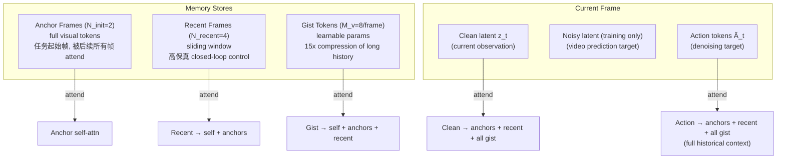

# MemoryWAM: Efficient World Action Modeling with Persistent Memory

- 本地 PDF：`papers/memory/MemoryWAM_2606.20562.pdf`
- arXiv：https://arxiv.org/abs/2606.20562
- 项目页：https://yangsizhe.github.io/MemoryWAM/
- 年份：2026（6 月）
- 团队：港中文 + 清华 + 浙大（Sizhe Yang、Juncheng Mu 共一，Huazhe Xu 通讯）
- 阶段：分层混合记忆 WAM — 反直觉发现：压缩记忆 > 全注意力

## 一句话总结

MemoryWAM 提出三层混合记忆：4 帧滑动窗口（短期高保真, N_recent=4）、2 帧任务起始锚帧（事件边界, N_init=2）、8 个可学习 Gist token/帧（长期压缩, M_v=8, 120:8=15×）。反直觉的核心发现：Gist 压缩反超全注意力——RMBench 上 MemoryWAM 83.0% 平均成功率（vs LingBot-VA 全注意力 78.2%），同时推理延迟和 GPU 显存近乎恒定。真实 ARX 双臂验证：Shell Game 18/20（物体被遮盖后追踪位置）、Look and Press 15/20（数数并按对应按钮）。全注意力 FastWAM（仅滑动窗）在 memory-dependent 任务上仅 5.9% 成功率——没有长期记忆在需要"回想之前看到什么"的任务上完全失败。

## 核心技术

1. **三层分层混合记忆** — 短期窗口（4 帧高保真 closed-loop control）、锚帧（2 帧任务初始，instruction grounding）、Gist token（8 个/帧 learnable parameter，共享 3D RoPE 但固定在 marker 位置，120 tokens→8 tokens 压缩）。各层通过专用 attention mask 独立访问
2. **MoT 双专家不对称架构** — Video DiT（Wan2.2-TI2V-5B, hidden 3072, FFN 14336, 30 blocks, ~5B）处理观测+维护记忆缓存，Action DiT（hidden 1024, FFN 4096, 30 blocks, ~1B）从缓存解码动作。总 ~6B。视频预测仅训练时监督，推理不生成视频——clean latent 仅做一次 video DiT forward
3. **3D RoPE 位置对齐** — Video/Action 共享 3D RoPE basis，Gist token pin 在对应帧的 (h,w) marker。Action query 和 cached video key 在同一位置空间，无需跨专家对齐
4. **Noise Augmentation 防过拟合** — 训练时 clean conditioning latent 以 p=1.0 混入高斯噪声（ratio ∈ [0,1]），仅 video side。防止 teacher-forcing 过拟合到完美帧

## 底层原理与数学推导

### 1. 混合记忆的 Attention Mask 设计

MemoryWAM 的记忆不只是一个"更大的 KV cache"——它是一个精心设计的多层 attention mask，不同历史帧之间的可见性不同：

**Attention Mask 的语义**：

- Anchor frames 只能 see self——它们是"场景锚点"，不应被后续帧污染
- Recent frames see self + anchors——保留空间 grounding 的同时获取近期上下文
- Gist tokens see self + anchors + recent——压缩时需要考虑完整可用的上下文
- **Action denoising 时 attend 所有历史**（anchors + recent + all gist）——决策需要完整记忆

### 2. Gist Token 的 3D RoPE 对齐

每帧 120 个 latent tokens（mosaic 384×320 → VAE → patchification → 120 tokens）。Gist: M_v=8 个 learnable token/帧。

Gist token 与对应视频帧共享 3D RoPE 的 temporal 坐标，但 (h,w) spatial coordinate 被 pin 到固定 marker 位置——这使 gist 在空间上是"锚定"的，但时序上跟着帧走。

Action DiT 使用相同的 3D RoPE basis——action query 直接查询 cached video keys，不需要跨专家位置对齐。

**压缩比**：120/8 = 15×。对于 100 帧历史：全注意力 = 12000 tokens，MemoryWAM = 2×120 (anchors) + 4×120 (recent) + 94×8 (gist) = 240+480+752 = 1472 tokens。

### 3. 训练配方

**Video branch**（训练时）：
$$\mathcal{L}_{\text{video}} = \mathbb{E}_{t,\epsilon}\left[\|v_\phi(z_t^{\text{noisy}}, t, c) - (z_t^{\text{clean}} - \epsilon)\|^2\right]$$

Flow matching timestep $t$ 从 logit-normal 分布采样（shift=5.0 for video, 1.0 for action）。

**Action branch**（训练+推理）：
$$\mathcal{L}_{\text{action}} = \mathbb{E}_{t,\epsilon}\left[\|v_\psi(A_t^{\text{noisy}}, t, c_{\text{memory}}) - (A_t^{\text{clean}} - \epsilon)\|^2\right]$$

其中 $c_{\text{memory}}$ 是 hybrid memory KV cache。

**总损失**：$\mathcal{L} = \lambda_v \mathcal{L}_{\text{video}} + \lambda_a \mathcal{L}_{\text{action}}$，$\lambda_v = \lambda_a = 1.0$。

## 物理直觉解释

**为什么压缩反而好？——冗余信息是毒药**

这是 MemoryWAM 最反直觉的发现。想象你在找一本书——如果桌上堆满了所有 1000 本（全注意力），你需要一本一本翻过去找。如果桌上只放了 50 本精选过的（Gist 压缩），你可能反而找得更快。

机器人数据有极端的帧间冗余。一帧的 120 个 latent tokens 中，可能 80% 描述的是"桌子还是那张桌子，墙壁还是那面墙壁"。全注意力保留了所有这些冗余——模型在"大海捞针"时被无关信息的海啸淹没了。Gist 压缩（8 tokens/帧）强迫模型只保留最具信息量的特征，天然过滤了视觉噪声。

**为什么需要三层而不是两层？——不同时间尺度的信息粒度**

- 短期（4 帧滑动窗）：~0.3 秒。需要高保真——"夹爪现在在哪"必须精确到像素级
- 锚帧（2 帧 task init）：任务起始时刻。需要完整保留——"开始的时候杯子和盘子是什么相对位置"——之后可能被遮挡
- Gist（8 tokens/帧）：过去几十秒到几分钟的摘要。粒度可以粗——"已经倒了水、拿了毛巾、擦了桌子" vs "手在第 127 帧时位于 (0.3, 0.1, 0.5)"

人脑也是这样——你不会记得今天每一秒的精确视觉画面（那是过目不忘症），但你记得"早上开始的时候桌上有什么"（锚帧）、"刚才在做什么"（短期）、"今天大概做了哪些事"（Gist）。

## 工程细节与实操指南

- **输入**：head 256×320 + left wrist 128×160 + right wrist 128×160 → mosaic 384×320 (head 256×320 bottom, wrists 128×160 each top) → VAE → 120 tokens/frame
- **Video DiT**：Wan2.2-TI2V-5B, hidden 3072, FFN 14336, 24 heads×128, 30 blocks, patch 1×2×2, 48ch latent
- **Action DiT**：hidden 1024, FFN 4096, 24 heads×128, 30 blocks, ~1B。从 video DiT 权重通过 hidden dim interpolation 初始化
- **Action horizon**：h=16, frame stride 4 × VAE temporal stride 4
- **Robot state/action**：dual-arm 14-dim joint vectors
- **Optimization**：AdamW, lr=2e-4, wd=0.01, β=(0.9,0.95), 8 GPU batch=1/GPU
- **Noise augmentation**：clean latent mixed with Gaussian noise, ratio ∈ [0,1], p=1.0, video side only
- **Inference**：clean latent single video DiT forward → update KV cache；action denoising with hybrid memory mask；no video generation needed

## 消融实验与分析

| 消融 | RMBench Press Button | Observe & Pick Up | 结论 |
|------|---------------------|-------------------|------|
| Full MemoryWAM | **87%** | **27%** | Baseline |
| -Gist tokens（仅 short+anchor） | 大幅下降 | — | **长期压缩是性能最大贡献者** |
| -Anchor frames | 中等下降 | — | 任务初始帧对 instruction grounding 关键 |
| -Sliding window（仅 anchor+gist） | 中等下降 | — | 短期保真对 closed-loop 控制必要 |
| Full Attention（LingBot-VA） | 84% | 13% | 83% avg vs MemoryWAM 83% avg——精度持平但 MemoryWAM 效率远超 |
| FastWAM（仅滑动窗，无长期记忆） | **0%** | 9% | memory-dependent 任务完全失败——无长期记忆 = 不具备这项能力 |
| **效率对比（单层, 1600 帧）** | **延迟** | **显存** | MemoryWAM hybrid < TTT ≈ RNN << Full Attention |

**真实机器人**（ARX 双臂）：
- Shell Game（物体被盖住后移动→追踪位置）：18/20
- Look and Press（数共出现了几个物体→按对应按钮）：15/20

## 技术权衡（Trade-off）

| 优势 | 劣势与工程代价 |
|------|----------------|
| Gist 压缩反超全注意力（83.0% vs 78.2% avg），且延迟/显存恒定 | Gist token 数量 M_v=8 手工设定，非可学习；不同任务的压缩需求可能不同 |
| 推理不生成视频（仅单次 video DiT forward），latency < full attention 数个量级 | Anchor 帧硬编码"任务起始"——中途的关键转折帧可能被遗漏 |
| 3D RoPE 共享使 action→video 查询无缝对齐，无需跨专家位置映射 | 15× 压缩比的上限未知——能否更高（100×）且保持精度？ |
| Noise augmentation 防止 teacher-forcing 过拟合，提升真实部署鲁棒性 | 仅在 video side 使用 noise augmentation，action side 未加入 |

## 技术价值与演进定位

MemoryWAM 的核心贡献不是 "又一个记忆架构"——而是**终结了 "要么全注意力（贵但准确）要么滑动窗（便宜但忘）" 的二元对立**，开辟了第三条路：压缩记忆可以比全注意力更好。

这一发现和认知科学高度一致——人类记忆不是录音机（全注意力），也不是只看最后几秒（滑动窗），而是选择性摘要（gist）+"闪光灯记忆"（anchor）+ 工作记忆（short-term）的混合系统。MemoryWAM 是第一个在 WAM 中验证这一认知科学理论的系统。

在 2026 年记忆研究谱系中，MemoryWAM 和 RoboTTT 代表了两种根本不同的设计哲学：MemoryWAM 是**结构化压缩**（手工设计记忆的组织方式），RoboTTT 是**内生压缩**（梯度下降自适应决定存什么）。两者互补而非对立——未来最强的记忆系统可能同时拥有结构化的存储组织（像 MemoryWAM）和自适应的写入机制（像 RoboTTT）。

## 与其他论文的关系

- **LingBot-VA (RSS 2026)**：全注意力 WAM baseline。MemoryWAM 效率远超且精度持平/反超——证明了全注意力不是最优解
- **FastWAM**：仅滑动窗 WAM baseline。MemoryWAM 证明滑动窗在 memory-dependent 任务上完全失败（5.9% avg），长期记忆是必要的
- **MEM/π0.6 (PI)**：两尺度记忆（视频短期 + 语言长期）。MemoryWAM 三层且全视觉——不需要转语言模态
- **RoboTTT (NVIDIA, RSS 2026)**：快速权重记忆（梯度内生写入）。MemoryWAM 的 Gist 是手工设计的压缩——两种记忆哲学，互补
- **TTT / RNN memory mechanisms**：MemoryWAM 在效率对比实验中同时超越了 TTT 和 RNN 方案（1600 帧时 hybrid 延迟最低）

## 精读问题

1. **Gist token 的"可解释性"**：8 个 Gist token 各自的"功能分化"是什么——是语义（做了什么）、几何（物体在哪）、还是时序（什么时候做的）？能否通过 ablation 或 visualization 分离各 token 的角色？
2. **Anchor 帧的自动选择**：当前硬编码为 task init。能否学习一个"memorability predictor"——自动识别哪些帧最值得作为 anchor 保留？在 1000 帧中自动选出 5 帧最关键的——这比手动选 2 帧 init 更普适
3. **压缩比的动态调节**：MemoryWAM 的 15× 是固定的。能否根据任务难度或时间距离动态调整——近期的帧保留更多 gist tokens（更细粒度），远期的帧更少（更粗粒度）？这更接近人脑的遗忘曲线
4. **和 RoboTTT 的融合**：能否在 Gist token 上叠加 TTT 风格的梯度更新——结构提供组织方式，梯度提供自适应写入？这可能是下一代记忆系统
