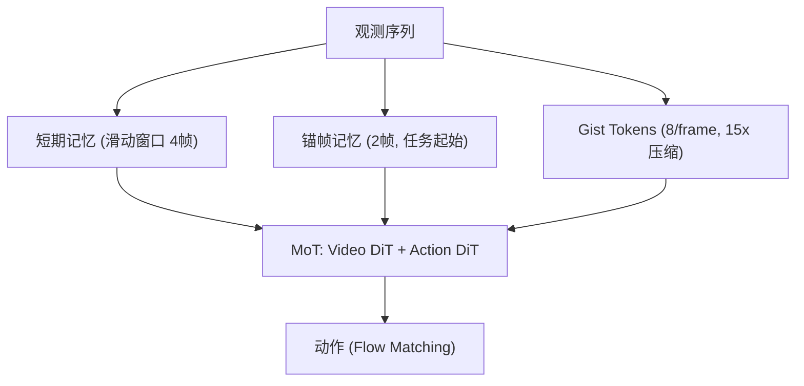

# MemoryWAM: Efficient World Action Modeling with Persistent Memory

- 本地 PDF：`papers/memory/MemoryWAM_2606.20562.pdf`
- arXiv：https://arxiv.org/abs/2606.20562
- 年份：2026（6 月）
- 团队：清华/上海 AI Lab (Sizhe Yang, Juncheng Mu, Huazhe Xu 等)
- 阶段：分层混合记忆 —— 近期帧 + 事件锚帧 + Gist Token

## 一句话总结

MemoryWAM 提出三层混合记忆：近期帧（滑动窗口，细节）、事件锚帧（任务起始关键帧）、Gist Tokens（8 token/帧，15× 压缩）。在 RMBench 上 83.0% 平均成功率，超越全历史注意力 LingBot-VA (78.2%)，且推理延迟几乎恒定。Gist 压缩居然优于全注意力——说明过滤了无关视觉噪声。

## 核心技术

1. **三层混合记忆** — Short-term (4 帧滑动窗口) + Anchor (2 帧任务起始) + Gist (8 learnable tokens/帧, 15× 压缩)
2. **MoT 架构** — Video DiT 处理观测+维护记忆，Action DiT 去噪动作 token 并 attend 记忆缓存
3. **推理时不生成视频** — 训练时学 video prediction，推理时仅用 latent 缓存做 action 条件

## 底层原理与数学推导

## 消融实验

| 消融 | RMBench SR | 结论 |
|------|-----------|------|
| Full MemoryWAM | **83.0%** | 三层混合最优 |
| Full attention (LingBot-VA) | 78.2% | Gist 压缩过滤噪声反超 |
| Sliding window only (FastWAM) | 5.9% | 没有长期记忆完全不行 |
| 移除 Gist | — | 长期压缩是效率关键 |
| 移除 Anchor | — | 任务起始帧对 grounding 重要 |

## 精读问题

1. Gist tokens 到底保留了哪些信息？语义压缩的粒度如何确定？
2. Anchor 帧的选择策略是否可学习？目前硬编码"任务起始帧"是否最优？

## 技术权衡（Trade-off）

| 优势 | 劣势 |
|------|------|
| Gist 压缩反超全注意力（83% vs 78%） | Anchor 帧选择策略硬编码，非可学习 |
| 推理延迟几乎恒定 | Gist tokens 的信息保留粒度需手动设定 |
| 真实 ARX 双臂验证 | 仅验证了 2 个真实任务 |

## 技术价值与演进定位

MemoryWAM 证明了一个反直觉结论：压缩记忆 > 全注意力记忆。Gist tokens 过滤了视觉噪声，使模型更聚焦任务相关信息。这是 WAM（世界动作模型）记忆效率方向的标杆。

## 与其他论文的关系

- **LingBot-VA** — WAM baseline, MemoryWAM 在效率和精度上双超越
- **MEM (π0.6)** — MemoryWAM 的三层结构是 MEM 两层的精细化扩展
- **RoboTTT** — 不同的记忆机制（快速权重 vs 分层压缩），互补

## 精读问题

1. Gist tokens 保留了哪些信息？量化分析语义/几何的保留比例
2. Anchor 帧选择是否可学习？自动选择"任务关键帧"
3. Gist 压缩比的上限？能否达到 100× 级别？

## 物理直觉解释

MemoryWAM 像人脑记忆——你不会记住今天每一秒的细节，但你会记得今天早上发生了什么事（锚帧），刚才几分钟在做什么（短期），今天大概做了什么（Gist 摘要）。三层各司其职：需要细节看短期，需要转折点看锚帧，需要全局看 Gist。

## 工程细节与实操指南

- 短期: 4 帧滑动窗口，全分辨率 latent
- Anchor: 2 帧任务起始，硬编码选择
- Gist: 8 learnable tokens/帧, 15× 压缩比 (120→8)
- 推理: 不生成视频，仅用 latent 缓存，延迟恒定
- 真机: ARX 双臂机器人, Shell Game + Look and Press

## 消融实验与分析

| 消融 | 结论 |
|------|------|
| Full vs 全注意力 (LingBot-VA) | 83% vs 78.2% — Gist 压缩反超 |
| Full vs 仅滑动窗口 | 83% vs 5.9% — 无长期记忆完全失败 |
| 有/无 Anchor | 锚帧对任务初始 grounding 重要 |
| 有/无 Gist | Gist 是效率和精度的关键平衡点 |
