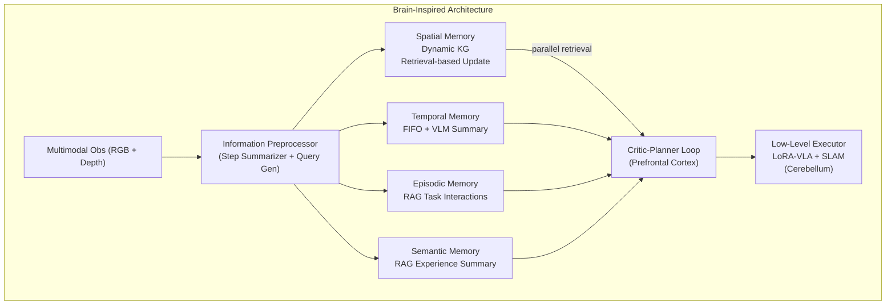

# RoboMemory: A Brain-inspired Multi-memory Agentic Framework for Interactive Environmental Learning

- 本地 PDF：`papers/memory/RoboMemory_2508.01415.pdf`
- arXiv：https://arxiv.org/abs/2508.01415
- 项目页：https://sp4595.github.io/robomemory/
- 年份：2025.08（2026.03 v7）
- 团队：港中深 (CUHK-Shenzhen, FNii-Shenzhen/SSE) + 港大 + NUS + 港中文 + Ising AI（一作 Mingcong Lei；通讯 Yiming Zhao / Yatong Han）
- 阶段：四模块脑启发记忆 — KG + FIFO + 情景 RAG + 语义 RAG，并行架构

## 一句话总结

RoboMemory 提出脑启发四模块并行记忆架构：空间记忆（动态 KG，检索式增量更新）、时间记忆（FIFO buffer + VLM 摘要压缩）、情景记忆（RAG 任务交互历史）、语义记忆（RAG 经验总结）。四模块并行独立更新/检索——避免传统串行设计中多次调用 VLM 的累积延迟（实测并行更新延迟 ≈ 单模块更新延迟）。Critic-Planner 闭环（第一步免 Critic 评估防无限重规划）+ 低层 LoRA 微调 π0 VLA + SLAM 执行。EmbodiedBench 上 Qwen2.5-VL-72B 实例化版本平均 SR 62.0%、GC 74.0%，摘要口径称相对强基线平均成功率提升 26.5%，且超过闭源 SOTA Claude-3.5-Sonnet（SR 58.0%、GC 63.3%）与全部 agent 框架基线（最高 Cradle 30.0%）。真机 5 个导航点、8 个交互物体的厨房场景中，第二次执行成功率 46.67% > 第一次 26.67%——验证终身学习能力。

## 核心技术

1. **四模块并行架构** — 空间/时间/情景/语义四个记忆独立并行更新检索。串行设计每步多次调用 VLM → 延迟累积；并行让多模块记忆的更新延迟与单模块相当
2. **检索式增量 KG 更新** — 不是全量重建 knowledge graph：先检索相关子图（top N=3 顶点 + K=2 hop traversal）→ 局部冲突检测（VLM resolver 判定 add/delete/modify）→ selective merge + 剪枝孤立顶点。每步更新顶点数 O(DK)（n 顶点、最大度 D、检索跳数 K），解决动态环境下 KG 一致性维护的 scalability 问题
3. **Critic-Planner 闭环** — Planner 生成动作计划 → Critic 根据视觉反馈和记忆状态评估 → 不通过则重规划。第一步豁免 Critic 检查——原版 Planner-Critic 机制会被"还没开始做就被要求重来"卡成无限循环
4. **低层 LoRA-VLA + SLAM** — 记忆在高层规划层面工作，执行层面用 LoRA 微调的 π0 VLA（操作）+ SLAM（导航）

## 底层原理与数学推导

记忆系统的统一更新-检索接口（L 个模块并行执行），其中 $s_t$ 是当前步摘要、$q_t$ 是预处理器生成的检索 query：

$$M_t = U(M_{t-1}, s_t), \quad r_t = R(M_t, q_t)$$

评测指标沿用 EmbodiedBench 定义：SR 是整任务完成率，GC 是中间条件达成率（100% = 完全成功），其中 $SCN_x$ 为任务 x 已完成条件数、$GCN_x$ 为总条件数：

$$\text{SR} = \mathbb{E}_{x \in X}\left[ \mathbf{1}\{SCN_x = GCN_x\} \right], \quad \text{GC} = \mathbb{E}_{x \in X}\left[ \frac{SCN_x}{GCN_x} \right]$$

KG 增量更新的可扩展性保证（n 顶点、最大度 D、检索跳数 K 的图上每步只处理 O(DK) 个顶点而非全图），以及检索比率随探索的下降规律（$E_{retrieved}$ 为当步检索到的边集合，$E_{total}$ 为全图边集合）：

$$\text{每步更新顶点数} = O(DK), \quad R(t) = \frac{|E_{retrieved}(t)|}{|E_{total}(t)|}$$

## 物理直觉解释

RoboMemory 的核心洞察是**机器人记忆的瓶颈不在"存多少"而在"怎么查"**。就像手机里存了 5000 张照片——问题不是存储容量（还有 200GB 空闲），而是找特定一张照片时要翻很久。四模块设计本质上是给记忆建了四个并行的索引——查空间信息走 KG、查刚发生的走 FIFO、查类似经验走 RAG——各有各的最优索引结构。更关键的是更新也并行：好比四个人各管一个档案柜，同时整理各自的抽屉，而不是一个人依次开四个柜子（串行 VLM 调用）——论文实测并行更新延迟与只更新一个模块相当。

**"知道自己查什么 vs 不知道自己存了什么"**——与 MemoryWAM/EchoVLA 的根本区别：后者是端到端记忆（memory 通过 attention 隐式检索），RoboMemory 是显式符号化记忆（query + index 显式检索）。前者像凭感觉找东西——说不上来在哪，但"感觉在附近"；后者像图书馆索书号——每次查找都有明确路径，可解释、可审计。代价是系统复杂度和对 VLM 摘要质量的依赖：摘要错了，后面所有检索和规划都建立在错误信息上。

**"修订百科全书而不是重抄全书"**——动态 KG 的检索式增量更新，类比修订百科全书时只在相关词条页粘贴修订条，而不是把整本书重抄一遍。论文的检索比率曲线（76% → 28%）量化了这一点：随着 KG 增长，每次更新只碰越来越小的一小部分——这才是空间记忆能扩展到真实场景的关键。大脑层面则对应海马体（空间+情景巩固）、前额叶（规划+评估）、小脑（执行）的分工：RoboMemory 的四模块 + Critic-Planner + 低层执行器恰好映射这一层级。

## 工程细节与实操指南

- **预处理器**：Step Summarizer（单步观测→文本摘要，充当感觉记忆）+ Query Generator（生成针对四模块的检索 query），两个 VLM 并行
- **时间记忆**：线性 FIFO buffer，容量 4 条逐步摘要；满时用 VLM 把最老的 N 条压缩为一条摘要插回队首（多次压缩后旧信息逐步丢失）
- **空间记忆**：动态 KG（objects/positions 为顶点、空间关系为边；实现库论文未公开 待确认），检索 top N=3 顶点 + K=2 hop traversal，VLM 冲突检测 + selective merge + 孤立顶点剪枝
- **情景/语义记忆**：vector DB（Qwen3-Embedding 编码），情景检索 top N=5 条过去经验；语义记忆维护行动级 + 任务级层次摘要；更新只涉及 top-S 相似条目，VLM updater 判定 add/update/remove/noop
- **Critic**：基于视觉反馈和记忆一致性评估 plan 质量，step 1 exempt 防循环（原版 Planner-Critic 会无限重规划）
- **真机**：5 navigable points, 8 interactive objects, 10+ 干扰物, 15 个任务（3 类 × 5）；低层执行器为 LoRA 微调 π0 + SLAM

## 消融实验与分析

**模块消融（Table II，EB-ALFRED Base + Long 子集，成功率 SR）**：

| 消融变体 | Base SR (%) | Long SR (%) | 平均 SR (%) | 相对完整版 |
|----------|-------------|-------------|-------------|------------|
| RoboMemory（完整） | 68 | 66 | 67 | — |
| w/o Critic | 60 | 50 | 55 | −12 |
| w/o Spatial Memory | 52 | 42 | 47 | −20 |
| w/o Episodic Memory | 68 | 56 | 62 | −5 |
| w/o Semantic Memory | 66 | 50 | 58 | −9 |
| w/o Long-term Memory（情景+语义全去掉） | 66 | 48 | 57 | −10 |

**真机终身学习（Fig. 5，厨房场景）**：

| 配置 | 成功率 (%) |
|------|-------------|
| RoboMemory 第一次尝试 | 26.67 |
| RoboMemory 第二次尝试（不清理长期记忆） | 46.67 |
| RoboOS (RoboBrain2-32B) | 6.67 |
| RoboOS (Qwen2.5-VL-72B) | 20.0 |

**KG 增量更新效率（Fig. 7，EB-ALFRED 前 20 次迭代）**：

| 时刻 | 每次迭代更新检索的关系数 | 占全图关系比例 |
|------|--------------------------|----------------|
| 第 1 次迭代 | 约 10 条边 | 76% |
| 第 20 次迭代 | 约 10 条边 | 28% |

**核心结论**：四模块各司其职但贡献不均——空间记忆最重要（去掉后平均 SR 67% → 47%，−20 pts），Critic 次之（−12），长期记忆整体 −10、语义 −9、情景 −5；真机第二次尝试比第一次高 20 个百分点（26.67% → 46.67%），KG 检索比率 20 次迭代内从 76% 降到 28%——终身学习能力与增量更新的可扩展性都得到定量验证。

## 技术权衡（Trade-off）

| 优势 | 劣势与工程代价 |
|------|----------------|
| 四模块分工明确，可解释性强 | 模块间协调开销——query 生成器 + 多检索器的系统复杂度高 |
| 并行设计避免串行 VLM 延迟累积 | 低层 VLA 感知错误是主要 failure source——记忆再好也补不了"看错了" |
| Run2>Run1（26.67% → 46.67%）验证终身学习 | 高层严重依赖 VLM——hallucination 会污染记忆，错误信息写入 KG/RAG 后无检测回滚机制 |
| KG 增量更新 O(DK)，无需全量重建 | 真机场景简单（5 点 8 物体），规划错误仍是最主要失败类型——记忆正确但规划器没用对 |

## 技术价值与演进定位

RoboMemory 代表了记忆研究的"模块化高层路线"——与 MemoryWAM/EchoVLA 的"端到端路线"形成对比。核心价值在于证明：即使只用现有 VLM + RAG + KG 这些非专用组件，只要组织得当（四模块并行 + Critic 闭环 + 检索式 KG 增量更新），就能在终身学习上取得可验证、量化的效果——EmbodiedBench 平均 SR 62.0% 超过闭源 SOTA Claude-3.5-Sonnet（58.0%）与全部 agent 框架基线（最高 Cradle 30.0%），真机 Run2 比 Run1 提升 20 个百分点。对后续研究的启示：显式记忆系统的工程组织方式（并行化、局部更新、闭环评估）可能比记忆容量本身更决定成败；同时它暴露了 VLM 规划器的上限——规划错误是最主要失败类型，这为世界模型验证器、更强推理器等接口留下了空间。

## 精读问题

1. **消融显示空间记忆贡献最大（−20 pts）——增益来自 KG 的结构化查询，还是仅仅来自"物体位置"这类可被 RAG 替代的语义信息？**
2. **真机 Run2 比 Run1 高 20 pts（26.67% → 46.67%）——终身学习增益在任务序列继续拉长时是单调累积，还是会出现记忆冲突导致的回退？**
3. **语义与情景记忆共用 vector DB 机制但消融贡献不同（−9 vs −5）——行动级与任务级层次摘要的结构差异是否是差距来源？**
4. **KG 检索比率从 76% 降到 28% 且每步只处理约 10 条边——场景规模继续增大时 O(DK) 保证是否仍然成立，冲突检测的 VLM 调用是否会成为新瓶颈？**
5. **规划错误是最主要失败类型而感知（hallucination）错误次之——换成更强推理模型、或引入世界模型做动作验证，能否消除"记忆正确但规划错误"的案例？**

## 与其他论文的关系

- **MemoryWAM / EchoVLA** — 端到端隐式记忆（attention 检索）vs RoboMemory 显式符号化记忆（query + index）——两种根本不同的设计哲学
- **RoboOS** — 场景图空间记忆的具身 agent 框架；真机对比 RoboMemory 第二次尝试 46.67% vs RoboOS(Qwen) 20.0%、RoboOS(RoboBrain) 6.67%
- **Voyager / Reflexion / Cradle** — 技能库/反思/情景过程记忆框架，EmbodiedBench 平均 SR 22.0 / 15.0 / 30.0，远低于 RoboMemory 的 62.0
- **Claude-3.5-Sonnet / GPT-4o 等单 VLM Agent** — 无记忆系统强基线（平均 SR 58.0 / 64.0、GC 63.3 / 72.2），RoboMemory 平均 GC 74.0 超过全部单 VLM 基线
- **SayCan / Code as Policies** — VLM 作为机器人规划器的早期范式，RoboMemory 在其之上加四模块记忆 + Critic 闭环
