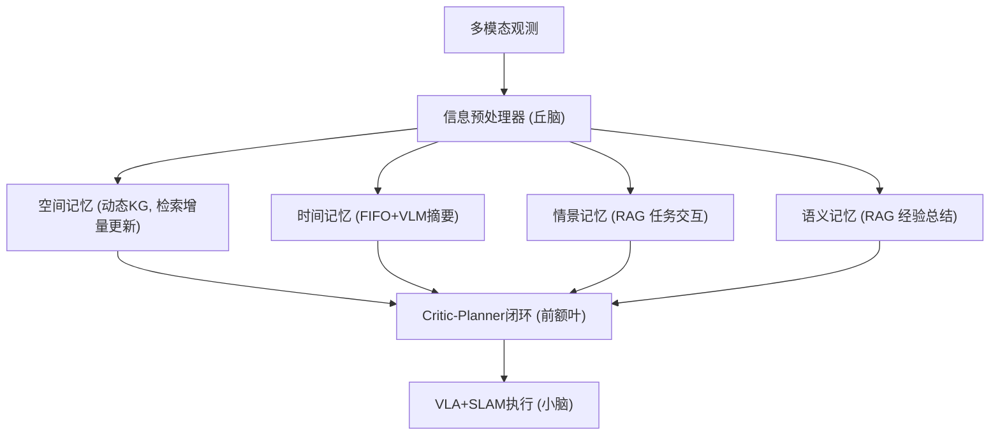

# RoboMemory: Brain-inspired Multi-memory Agentic Framework for Lifelong Learning

- 本地 PDF：`papers/memory/RoboMemory_2508.01415.pdf`
- arXiv：https://arxiv.org/abs/2508.01415
- 项目页：https://sp4595.github.io/robomemory/
- 年份：2025.08 (2026.03 v5)
- 团队：港中深 + 港大 + NTU + 哈工大(深圳)
- 阶段：四模块脑启发记忆 — KG + 时序 + 情景 + 语义并行

## 一句话总结

RoboMemory 提出脑启发四模块并行记忆架构：空间记忆（动态 KG，检索式增量更新）、时间记忆（FIFO + VLM 摘要）、情景记忆（RAG 任务交互）、语义记忆（RAG 经验总结）。并行独立更新避免串行 4 次 VLM 调用的累积延迟，Critic-Planner 闭环防死循环。EmbodiedBench Qwen2.5-VL-72B 实例化版本比基线高 25%，超越 Claude 3.5 Sonnet ~5%。真机第二次执行 > 第一次——验证终身学习。

## 核心技术

1. **四模块并行** — 空间/时间/情景/语义独立并行更新检索，避免串行 VLM 调用延迟
2. **检索式增量 KG** — 先检索相关子图，局部冲突检测+合并，替代全量重建
3. **Critic-Planner** — 第一步免 Critic 评估防无限重规划
4. **LoRA-VLA + SLAM** — 高层记忆规划，低层执行

## 底层原理与数学推导

## 物理直觉解释

人脑不是只有一个记忆模块——海马体管情景、前额叶管规划、小脑管执行。RoboMemory 模拟这种分工：KG 存"环境里有什么"，FIFO 记"刚刚发生了什么"，RAG 存"上次怎么成功的"。四个并行=同时回忆，而不是一个一个回想。

## 工程细节与实操指南

- 预处理器: 多模态→文本, Step Summarizer + Query Generator
- KG: 检索式增量, 局部冲突检测+合并
- 时间记忆: FIFO + VLM 摘要压缩
- 情景/语义: RAG, extractor-updater 架构
- Critic: step 1 免评估
- 低层: LoRA VLA + SLAM

## 消融实验与分析

| 消融 | 结论 |
|------|------|
| 四模块 vs 单模块 | 多模块在复杂任务上系统性领先 |
| 有/无 Critic | 无 Critic 出现死循环 |
| 有/无空间 KG | 空间记忆对 grounding 关键 |
| Run1 vs Run2 | Run2 > Run1 验证终身积累 |

## 技术权衡（Trade-off）

| 优势 | 劣势 |
|------|------|
| 四模块分工明确，可解释 | 工程复杂度高，模块间协调开销 |
| 并行避免延迟 | 低层 VLA 感知错误是主要失败源 |
| Run2 > Run1 验证终身学习 | 高层规划严重依赖 VLM 质量 |

## 技术价值与演进定位

将脑启发多记忆从概念变成实际可跑系统。和 MemoryWAM/EchoVLA 互补——RoboMemory 高层符号记忆 + 低层 VLA（模块化路线），后者端到端记忆（联合训练路线）。

## 精读问题

1. 四模块信息冗余度？定量消融贡献分布？
2. KG 增量更新长期运行 consistency？

## 与其他论文的关系

- **MemoryWAM / EchoVLA** — 端到端记忆 vs RoboMemory 模块化高层记忆
- **Code as Policies** — VLM 作为规划器，RoboMemory 加了四模块记忆
- **SayCan** — LLM 任务规划 baseline，RoboMemory 在记忆维度超越
