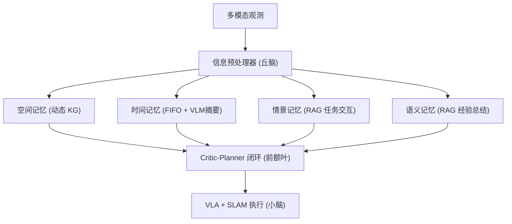

# RoboMemory: Brain-inspired Multi-memory Agentic Framework for Lifelong Learning

- 本地 PDF：`papers/memory/RoboMemory_2508.01415.pdf`
- arXiv：https://arxiv.org/abs/2508.01415
- 年份：2025 (2026.03 更新 v5)
- 团队：港中深 + 港大 + NTU + 哈工大(深圳)
- 阶段：四模块并行记忆 —— 空间 + 时间 + 情景 + 语义

## 一句话总结

RoboMemory 提出脑启发四模块并行记忆架构：空间记忆（动态 KG）、时间记忆（FIFO+VLM 摘要）、情景记忆（RAG 任务交互历史）、语义记忆（RAG 经验总结）。闭环 Critic-Planner 防止死循环。EmbodiedBench 上比 Qwen2.5-VL-72B 高 25%，真实机器人第二次执行成功率显著高于第一次。

## 核心技术

1. 四模块并行更新/检索 — 解决串行调用多次 VLM 的延迟问题
2. 检索式增量 KG 更新 — 先检索相关子图，局部冲突检测+合并
3. Critic-Planner 闭环 — 第一步免 Critic 评估防止无限重规划
4. 低层 LoRA-finetuned VLA + SLAM

## 底层原理与数学推导

## 关键结果

- EmbodiedBench: +25% over Qwen2.5-VL-72B baseline
- 超越 Claude 3.5 Sonnet ~5%
- 真机第二次执行成功率 > 第一次（终身学习验证）
- 主要失败源：低层 VLA 感知错误

## 精读问题

1. 四模块并行是否带来信息冗余？模块间的消融贡献分布？
2. KG 的检索式增量更新在长期运行中的一致性保证？

## 技术权衡（Trade-off）

| 优势 | 劣势 |
|------|------|
| 记忆与空间表示合二为一 | 语义记忆弱于空间记忆 |
| 增量更新，实时适配 | 大场景存储和查询的 scalability 待验证 |

## 技术价值与演进定位

2026 年机器人记忆研究的代表工作，属于各自的记忆技术路线（4D 潜地图/双记忆/四模块/状态化训练/TTT）。

## 与其他论文的关系

- 与 RoboTTT、MemoryWAM 等同属 2026 年记忆研究方向，技术路线不同但目标一致：让机器人不忘记。

## 精读问题

1. 核心技术路线在当前 benchmark 之外的表现？
2. 与其他记忆路线的互补可能性？

## 物理直觉解释

人脑不是只有一个"记忆模块"——海马体管情景、前额叶管规划、小脑管执行。RoboMemory 模拟了这种分工：空间记忆用 KG 存"环境里有什么"，时间记忆用 FIFO 记录"刚刚发生了什么"，情景和语义记忆存"我做过类似任务吗"和"上次怎么成功的"。四个模块并行更新，不会像串行那样卡顿。

## 工程细节与实操指南

- 预处理器: 多模态→文本，Step Summarizer + Query Generator
- 空间记忆: 动态 KG, 检索式增量更新, 局部冲突检测+合并
- 时间记忆: FIFO + VLM 摘要压缩
- 情景/语义: RAG, extractor-updater 架构
- Critic: 第一步免评估，防止无限重规划
- 低层: LoRA VLA + SLAM

## 消融实验与分析

| 消融 | 结论 |
|------|------|
| 四模块 vs 单模块 | 多模块在复杂任务上系统性领先 |
| 有/无 Critic | 无 Critic 出现死循环 |
| 有/无 空间 KG | 空间记忆对任务 grounding 关键 |
| 有/无 长时记忆 | 第二次执行成功率验证积累效果 |
