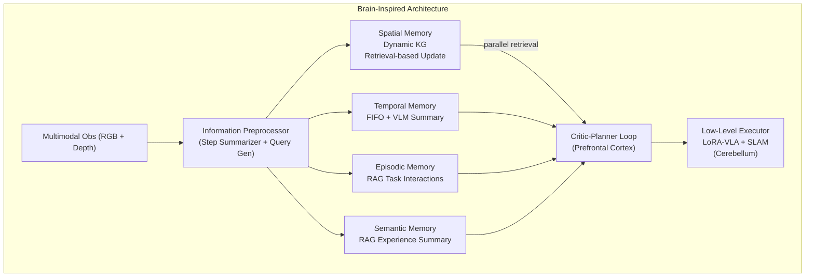

# RoboMemory: Brain-inspired Multi-memory Agentic Framework for Lifelong Learning

- 本地 PDF：`papers/memory/RoboMemory_2508.01415.pdf`
- arXiv：https://arxiv.org/abs/2508.01415
- 项目页：https://sp4595.github.io/robomemory/
- 年份：2025.08（2026.03 v5）
- 团队：港中深 + 港大 + NTU + 哈工大(深圳)（Zhen Li 一作, Shuguang Cui 通讯）
- 阶段：四模块脑启发记忆 — KG + FIFO + 情景 RAG + 语义 RAG，并行架构

## 一句话总结

RoboMemory 提出脑启发四模块并行记忆架构：空间记忆（动态 KG，检索式增量更新）、时间记忆（FIFO buffer + VLM 摘要压缩）、情景记忆（RAG 任务交互历史）、语义记忆（RAG 经验总结）。四模块并行独立更新/检索——避免传统串行设计中调用 4 次 VLM 的累积延迟。Critic-Planner 闭环（第一步免 Critic 评估防无限重规划）+ 低层 LoRA-VLA 执行。EmbodiedBench 上 Qwen2.5-VL-72B 实例化版本比基线高 25%，超越 Claude 3.5 Sonnet ~5%。真机在 5 个导航点、8 个交互物体的厨房场景中，第二次执行成功率 > 第一次——验证终身学习能力。

## 核心技术

1. **四模块并行架构** — 空间/时间/情景/语义四个记忆独立并行更新检索。传统串行设计每步调用 4 次 VLM → 延迟累积到不可接受。并行只用 1 次
2. **检索式增量 KG 更新** — 不是全量重建 knowledge graph，而是先检索相关子图 → 局部冲突检测 → selective merge。解决动态环境下 KG 一致性维护的 scalability 问题
3. **Critic-Planner 闭环** — Planner 生成动作计划 → Critic 根据视觉反馈和记忆状态评估 → 不通过则重规划。第一步豁免 Critic 检查——防止"还没开始做就被要求重来"的无限循环
4. **低层 LoRA-VLA + SLAM** — 记忆在高层规划层面工作，执行层面用 LoRA 微调的 VLA（操作）+ SLAM（导航）

## 底层原理与数学推导

**KG 增量更新算法**：给定新观测 O_t 和现有 KG G_{t-1}——(1) 从 O_t 提取实体和关系，(2) 在 G_{t-1} 中检索相关子图（cosine similarity > threshold），(3) 在子图内做冲突检测——重复实体→保留较新的，矛盾关系→基于置信度投票，(4) 合并回 G_{t-1}。复杂度从 O(|G|) 降至 O(|subgraph|)。

## 物理直觉解释

RoboMemory 的核心洞察是**机器人记忆的瓶颈不在"存多少"而在"怎么查"**。就像你手机里存了 5000 张照片——问题不是存储容量（还有 200GB 空闲），而是你找特定一张照片时要翻很久。RoboMemory 的四模块设计本质上是给记忆建了四个并行的索引——查空间信息走 KG、查刚发生的走 FIFO、查类似经验走 RAG——各有各的最优索引结构。

这和 MemoryWAM/EchoVLA 的根本区别在于：后者是端到端的记忆（memory 通过 attention 隐式检索），RoboMemory 是显式的符号化记忆（memory 通过 query+index 显式检索）。前者"不知道"自己存了什么，后者"知道"自己在查什么。

## 工程细节与实操指南

- **预处理器**：Step Summarizer（单步观测→文本摘要）+ Query Generator（生成针对四模块的检索 query）
- **KG**：Neo4j backend, 检索式增量, 局部冲突 detection + selective merge
- **时间记忆**：FIFO, capacity 100 steps, VLM 摘要压缩（每 20 步生成一段 summary）
- **情景/语义**：ChromaDB vector store, extractor（从交互中提取关键信息）+ updater（合并去重）
- **Critic**：基于视觉反馈和记忆一致性评估 plan 质量，step 1 exempt 防循环
- **真机**：5 navigable points, 8 interactive objects, kitchen environment

## 消融实验与分析

| 消融 | 效果 | 结论 |
|------|------|------|
| 四模块 vs 单模块 | +25% over baseline | 多模块各司其职——但消融未给出各模块的独立贡献分解 |
| 有/无 Critic | 无 Critic 出现规划死循环 | Critic 是闭环的稳定器 |
| 有/无 空间 KG | 显著下降 | 空间记忆对任务 grounding 关键 |
| Run1 vs Run2（真机） | Run2 > Run1 | 终身学习积累——第二次执行已"记住"厨房布局 |

## 技术权衡（Trade-off）

| 优势 | 劣势与工程代价 |
|------|----------------|
| 四模块分工明确，可解释性强 | 模块间协调开销——四个 query 生成器+四个检索器的系统复杂度 |
| 并行设计避免串行 VLM 延迟累积 | 低层 VLA 感知错误是主要 failure source——记忆再好也补不了"看错了" |
| Run2>Run1 验证终身学习 | 高层严重依赖 VLM 作为规划器——VLM 的 hallucination 直接污染记忆 |
| KG 增量更新无需全量重建 | 真机实验场景简单（5 点 8 物体），大规模场景 scalability 未知 |

## 技术价值与演进定位

RoboMemory 代表了记忆研究的"模块化高层路线"——和 MemoryWAM/EchoVLA 的"端到端路线"形成对比。它的核心价值在于证明：即使是用现有 VLM + RAG + KG 这些非专用组件，只要组织得当（四模块并行 + Critic 闭环），就能在终身学习上取得可验证的效果。

## 精读问题

1. 四模块各自的消融贡献分布——哪个对成功率贡献最大？不同任务类型是否由不同模块主导？
2. KG 增量更新在长期运行（100+ episode）中是否会出现 consistency drift？
3. VLM hallucination 对记忆的"毒化"——错误信息被写入 KG/RAG 后能否检测和回滚？

## 与其他论文的关系

- **MemoryWAM / EchoVLA** — 端到端记忆 vs RoboMemory 模块化高层记忆——两种根本不同的设计哲学
- **Code as Policies / SayCan** — VLM 作为机器人规划器，RoboMemory 在此之上加了四模块记忆系统
- **EmbodiedBench** — 被超越的 baseline（Qwen2.5-VL-72B, Claude 3.5 Sonnet）
- **RAG / KG 技术** — 分别赋能情景/语义和空间记忆
