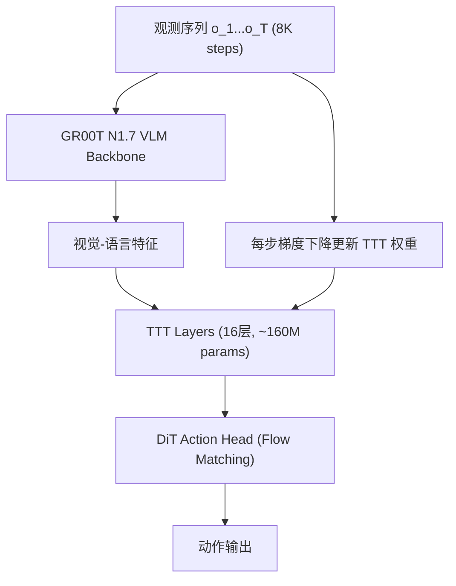

# RoboTTT: Context Scaling for Robot Policies via Test-Time Training

- 本地 PDF：`papers/memory/RoboTTT_2607.15275.pdf`
- arXiv：https://arxiv.org/abs/2607.15275
- 年份：2026（7 月）
- 团队：NVIDIA GEAR + Stanford + UT Austin (Jim Fan, 李飞飞, Yuke Zhu 等联合指导)
- 阶段：快速权重记忆 —— 梯度下降写入记忆，VLA 基础模型

## 一句话总结

RoboTTT 将 Test-Time Training (TTT) 引入机器人 VLA：在 DiT 动作头中加入 TTT 层，每帧观测通过梯度下降更新快速权重（fast weights），将长序列历史写入模型参数。8K 时间步上下文（~5 分钟），比 SOTA 高 3 个数量级，推理延迟恒定（30Hz, RTX 5090），8K 比 1K 性能提升 +62% 且未饱和。10 阶段齿轮装配唯一完整完成的方法。

## 核心技术

1. **TTT 快速权重记忆** — 16 个 TTT 层插入 DiT 动作头，每层含两层 MLP (~10M 参数/层)，总 690M 参数。每帧观测通过内循环梯度下降更新 MLP 权重，将历史写入参数空间
2. **序列动作强制 (Sequence Action Forcing)** — 每个动作块独立采样噪声，稳定 flow matching 长序列训练
3. **截断 BPTT (TBPTT)** — 跨数据段传递快速权重状态但 detach 梯度，在 GPU 内存限制内训练 8K 长上下文
4. **DAgger 蒸馏自纠正** — 失败轨迹作为上下文（更新快速权重），损失只在纠正动作上计算 → 模型学会隐式从错误中学习

## 底层原理与数学推导

TTT 层本质：$W_{t} = W_{t-1} - \eta \nabla_W \mathcal{L}_{\text{self}}(W_{t-1}, o_t)$。每观测一帧，模型在内部做一步梯度下降——不是更新主权重，而是更新专用于记忆的快速权重。推理延迟恒定因为隐藏状态大小固定，不像 Transformer KV cache 那样 O(T²)。

## 物理直觉解释

传统 VLA 的"记忆"像一遍一遍复述整个故事——每多说一句（多一帧观测），要讲的话就长一点，讲到后来说不动了（O(n²) 计算）。RoboTTT 的做法完全不同——它把每帧观察"刻"进脑子里的几个参数，脑容量是固定的，不管看了多少帧。

这意味着模型可以在 5 分钟内连续执行——拧螺丝、焊接、对齐——而不"忘记"5 分钟前看过什么。这是人类操作员的级别。

## 工程细节与实操指南

- **基座**：GR00T N1.7 VLA, 690M total
- **TTT 层**：16 层，每层 2-layer MLP (~10M params/layer)
- **训练**：TBPTT, segment length ~256 steps, carry fast-weight state
- **推理**：RTX 5090, 30Hz, context 8K steps
- **三种记忆写入模式**：Sequence Action Forcing (机器人数据), Video Imitation (人类视频→快速权重更新→one-shot), DAgger Distillation (失败+纠正)
- **8K 上下文增益**：+62% over 1K, 未饱和

## 消融实验与分析

| 消融 | 结论 |
|------|------|
| TTT vs Gated DeltaNet (线性快速模型) | 线性变体降 27%——非线性快速权重是关键 |
| 8K vs 1K context | +62% 提升，未饱和 |
| 有/无 TBPTT | TBPTT 是长序列训练的必要条件 |
| 有/无 Sequence Action Forcing | 稳定 flow matching 训练的关键 |

## 技术权衡（Trade-off）

| 优势 | 劣势 |
|------|------|
| 推理延迟恒定，不随上下文增长 | 训练长上下文成本高 |
| 8K steps (~5min) 记忆 | 快速权重容量有限，跨任务记忆弱 |
| 三种记忆模式统一在同一框架 | TTT 目标函数对机器人场景的适配仍在早期 |

## 技术价值与演进定位

RoboTTT 标志着记忆从"外挂模块"变成"架构核心"——TTT 层不是可选的 add-on，而是 DiT 动作头不可分割的部分。这是 2026 年记忆研究的旗舰工作。

## 与其他论文的关系

- **GR00T N1.7** — RoboTTT 的基座 VLA
- **WAM-TTT** — 互补：快速权重 vs 世界模型层面
- **TTT (Stanford 2024)** — TTT 从语言模型首次迁移到机器人

## 精读问题

1. 快速权重的容量上限在哪里？什么信息被"挤掉"了？
2. 跨 episode 的记忆能否通过 checkpointing 快速权重实现？
