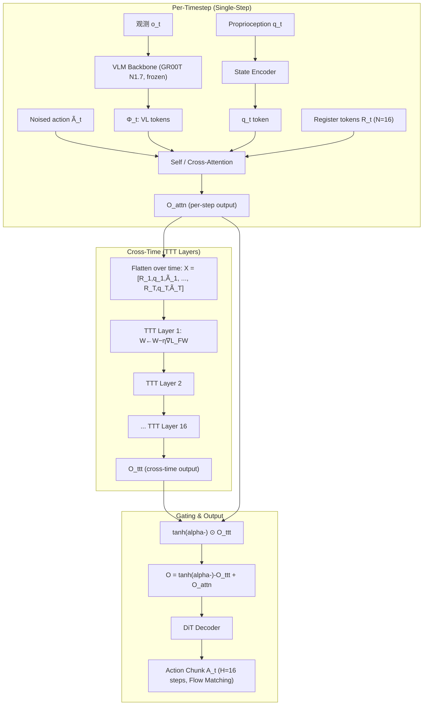

# RoboTTT: Context Scaling for Robot Policies via Test-Time Training

- 本地 PDF：`papers/memory/RoboTTT_2607.15275.pdf`
- arXiv：https://arxiv.org/abs/2607.15275
- 项目页：research.nvidia.com/labs/gear/robottt
- 年份：2026（7 月）
- 团队：NVIDIA GEAR + Stanford + UT Austin（李飞飞、Yuke Zhu、Jim Fan 联合指导，一作 Yunfan Jiang）
- 阶段：TTT 快速权重记忆 — 内循环梯度下降将 8K 步写入参数空间

## 一句话总结

RoboTTT 将 Test-Time Training 引入 VLA 基础模型：在 GR00T N1.7 的 DiT 动作头的 attention 层后插入 16 个 TTT 层，每观测一帧机器人数据就在内循环中做一步梯度下降，将 8K 时间步（~5 分钟）的观测-动作历史压缩到快速权重（fast weights）中。推理延迟恒定 30Hz（RTX 5090），8K 上下文比 1K 提升 62% 闭环性能且未饱和，比单步基线提升 87%。三种记忆写入模式共享同一 TTT 框架：序列动作强制（标准训练）、视频 one-shot 模仿（人类视频→内循环更新快速权重→执行）、DAgger 蒸馏（失败作为上下文编码到快速权重 + 纠正动作作为 loss target）。上下文长度成为一个新的 scaling axis。

## 核心技术

1. **TTT 快速权重记忆** — 将 TTT 层插入 DiT 动作头，每层含一个 2-layer MLP 作为 fast model $f_W$，每步做 MSE loss 梯度下降更新 $W$：$W_t = W_{t-1} - \eta \nabla_W \|f_{W_{t-1}}(K_t) - V_t\|^2$，输出 $O_t = f_{W_t}(Q_t)$。记忆存储在参数空间，而非 KV cache
2. **双向时间建模** — Attention 层处理单步内的 token 交互（空间）；TTT 层处理跨时间步的信息传播（时序）。二者串联，各司其职
3. **tanh 门控保护预训练** — TTT 输出 $\times \tanh(\alpha)$（$\alpha=0.001$ 初始），再加 attention 残差，训练初期 TTT 贡献接近零，逐步学习何时使用记忆
4. **序列动作强制** — 长序列中每个 action chunk 独立采样 noise level $\tau_t$，防止共享 noise level 导致整个序列"统一太容易或统一太难"，稳定 flow matching 长序列训练
5. **DAgger 蒸馏 — 失败作为学习信号** — 失败轨迹作为上下文通过 TTT 更新快速权重（模型内部状态已"知道"什么导致失败），损失仅在人类纠正动作上计算。本质是蒸馏了 DAgger 的 failure→correction 映射到快速权重里

## 底层原理与数学推导

### 1. TTT 的数学基础

给定 d 维 token 序列 X，通过投影矩阵 $\theta_Q, \theta_K, \theta_V$ 得到 Q, K, V：

**更新步（写入记忆）**——将当前 token 信息编码到快速权重：
$$W_t = W_{t-1} - \eta \nabla_W \underbrace{\|f_{W_{t-1}}(K_t) - V_t\|^2}_{\mathcal{L}_{\text{FW}}}$$

**应用步（读取记忆）**——从快速权重中检索信息：
$$O_t = f_{W_t}(Q_t)$$

其中 $\eta$ 是可学习的学习率，$W_0$ 是可学习的初始化权重，$f_W$ 是 2-layer MLP with GELU（input/output dim 均为 d=1024）。投影矩阵 $\theta_Q, \theta_K, \theta_V$、$W_0$ 和 $\eta$ 全部通过外循环任务损失端到端学习：

$$\mathcal{L}_{\text{fm}}(\theta, W_0, \eta, \theta_{Q,K,V}) = \frac{1}{T}\sum_{t=1}^T \mathbb{E}_{\tau_t,\epsilon}\left[\|v_\theta(\Phi_t, A_t^{\tau_t}, c_{<t}) - (A_t - \epsilon)\|^2\right]$$

其中 $c_{<t}$ 表示通过 $W_{t-1}$ 编码的历史上下文。

**$W_0$ 的元学习本质**：$W_0$ 通过梯度之梯度（二阶优化）学习——外循环损失 $\mathcal{L}_{\text{fm}}$ 对 $W_0$ 的梯度需要经过所有内循环的 TTT 更新步。这意味着 $W_0$ 被训练为"知道如何从零开始快速适应机器人轨迹的最优初始状态"。

### 2. 系统架构

**关键设计选择**：

- TTT 层数：16（匹配 DiT 的层数，每 attention 层后跟一个 TTT 层）
- Register token N=16：VL tokens 不直接传入 TTT（计算效率考虑），Register tokens 作为代理携带跨时间的 VL 信息
- Fast model $f_W$：2-layer MLP, hidden dim=1024, GELU activation, ~10M 参数/层
- 总模型大小：690M 参数（GR00T N1.7 backbone + 160M TTT 参数）
- TTT 层仅处理 $R_t, q_t, \tilde{A}_t$（每个时间步 ~16+1+action_dim 个 token），不处理 VL tokens

### 3. 训练配方

**序列动作强制 (Sequence Action Forcing)**：

Long-sequence flow matching 训练中，长度为 T 的序列对应 T 个 action chunks。标准做法是整个序列共享一个 noise level $\tau$，但这导致训练不稳定——低 noise 时全序列太容易，高 noise 时全序列太难。序列动作强制让每个 chunk 独立采样 $\tau_t \sim \mathcal{U}[0,1]$：

$$\mathcal{L}_{\text{seq-FM}} = \frac{1}{T}\sum_{t=1}^T \mathbb{E}_{\tau_t,\epsilon}\left[\|v_\theta(\Phi_t, A_t^{\tau_t}, c_{<t}) - (A_t - \epsilon)\|^2\right]$$

其中 $A_t^{\tau_t} = \tau_t A_t + (1-\tau_t)\epsilon$，每个 $\tau_t$ 独立采样。这使序列中同时有"容易"和"困难"的 chunk，训练信号更丰富。

**截断 BPTT (TBPTT)**：

8K 步的全梯度回传超出 GPU 内存。TBPTT 将序列切成多个 segment（每段 256 steps），segment 间传递快速权重状态 $W_t$ 但 detach 该状态对前一 segment 的梯度依赖：

$$W_{\text{seg}_k}^{\text{init}} = W_{\text{seg}_{k-1}}^{\text{final}}.\text{detach}()$$

这样每个 segment 的梯度回传只在该 segment 内，但快速权重能累积整个序列的上下文。

**Tanh 门控保护预训练**：

对于每个 DiT 层，学习一个向量 $\alpha \in \mathbb{R}^d$（初始化为 0.001），TTT 输出被门控后再与 attention 输出相加：

$$O = \tanh(\alpha) \odot O_{\text{TTT}} + O_{\text{attn}}$$

$\alpha=0.001$ 时 $\tanh(0.001) \approx 0.001$，TTT 贡献几乎为零。训练中 $\alpha$ 可以增长，模型自主决定何时开始依赖记忆。

### 4. 三种记忆写入模式

**模式 1：序列动作强制（标准训练）**：机器人数据 $\xi = \{(o_t, q_t, A_t)\}_t$，TTT 在每步观测上执行 update→apply 循环，外循环损失在动作 chunk 上计算。训练后模型学会将"过去做了什么"编码到快速权重中。

**模式 2：视频 One-Shot 模仿**：先看一段人类示范视频（无 action label），将视频帧编码后通过 TTT 更新快速权重（仅在视频帧上做 update，无 outer loss）。然后切换到机器人执行——快速权重中已编码了"任务该怎么做"的信息，外循环损失在机器人动作上计算。本质是内循环=视频上下文编码，外循环=策略模仿。

**模式 3：DAgger 蒸馏**：先执行自主 rollout（可能失败），人类在失败时刻介入纠正。将整段轨迹（包括失败的自主动作和纠正后的人类动作）作为 TTT 上下文。关键设计：loss mask——仅对纠正后的动作计算外循环损失，失败动作不产生 loss。这样快速权重编码了"失败状态→什么不该做"，而 loss 信号告诉策略"在那种状态下应该怎么做"。

## 物理直觉解释

**为什么 KV cache 不够？**

Transformer 的 KV cache 像是你在对话中不断重复前面说过的话——每多说一句，之前说的每句话都要重新被"听到"（attention）。讲 5 分钟的话，每句话都要过一遍前面所有的 token——$O(T)$ 的 attention 计算和 $O(T)$ 的显存存储。这就是为什么即使有 KV cache，长上下文推理仍然线性变慢、线性吃内存。

**TTT 为什么高效？**

TTT 不"复述"历史——它把每帧的要点"刻"进固定数量的参数里。想象你给了 MLP 一个输入 K 和期望输出 V，让它"学会"这个映射。MLP 做了几步梯度下降，把 (K,V) 的信息吸收进了自己的权重。下一次你有新的输入 Q，MLP 从权重的变化中"读取"之前的信息来修改 Q 的输出。这个过程的内存和计算是 $O(1)$ 的——不管你看了 8 步还是 8000 步。

**为什么压缩反而好？**

因为机器人数据有极端的帧间冗余——一秒钟 30 帧观测里，关节角度变化可能只有几度，桌子上 99% 的物体位置没变。TTT 的梯度下降天然地自适应压缩：变化大的信息（手碰到螺丝的那瞬间）产生大梯度，被强写入；几乎不变的信息（背景桌子）产生近零梯度，自然被忽略。这不是手动设计的压缩策略——是梯度下降的内在性质。

**DAgger 蒸馏为什么比标准 DAgger 好？**

标准 DAgger 的做法：人类纠正→把"纠正后的状态-动作对"加入训练集→下次训练。问题是模型学到的是"纠正后正确的样子"，但没有学到"为什么会犯错"——它不知道什么样的状态组合会导致失败。RoboTTT 的 DAgger 蒸馏给了模型"失败前奏"的完整上下文：失败轨迹通过 TTT 更新了快速权重，模型内部状态已经"经历过"失败前的模式，然后在纠正动作上算 loss。这等价于告诉模型"在经历过那种状态下，你应该这样做才对"——隐式的因果学习，而非表面模仿。

## 工程细节与实操指南

- **基座模型**：GR00T N1.7 VLA。VLM backbone（Zamba2-3B + SigLIP）frozen，仅训练 DiT action head + TTT layers + projection matrices
- **DiT action head**：40 layers, hidden dim=1024, 16 heads, head dim=64
- **TTT 层配置**：16 层（每 attention 层后 1 层），每层 2-layer MLP, hidden 1024, GELU, input/output dim=1024
- **Register tokens**：N=16, dim=1024, 随机初始化，通过 attention 与 VL tokens/action tokens/proprio 交互
- **Fast model 参数量**：~10M/层 × 16 层 = ~160M
- **外循环优化**：AdamW, lr=1e-4, wd=0.01, β=(0.9, 0.95)
- **内循环学习率 η**：learnable per-layer scalar, initial ~0.01
- **训练**：8 GPU H100, batch=1/GPU (full trajectory), 8K max context, ~4 days
- **TBPTT**：segment 256 steps, detach fast weights between segments
- **推理**：RTX 5090, 30Hz（TTT overhead < 5ms per step）, 延迟恒定 vs 序列长度
- **数据**：~2K teleoperated demos + ~500 human video demos (for one-shot mode) + ~1K failure trajectories (for DAgger distillation)
- **Robot platform**：bimanual setup (2×Franka arms), 3×RealSense cameras
- **Task suite**：Gear Bot assembly (10 stages, 5min), Circuit (60 unseen configs for one-shot test), perturbation test (external forces applied mid-execution)

## 消融实验与分析

| 消融 | 指标 | 数值变化 | 结论 |
|------|------|---------|------|
| Context length scaling | 闭环完成度 | 1K → 2K → 4K → **8K** 单调递增，8K 比 1K +**62%** 且未饱和 | 上下文长度是新的 scaling axis——更多 context 持续带来增益 |
| 8K vs 单步 baseline | 平均任务完成度 | +**87%** | 长上下文对多阶段任务产生质变，不是量变 |
| TTT (非线性 MLP) vs Gated DeltaNet (线性快速模型) | 任务完成度 | TTT 高 **27%** | 非线性快速权重是必要设计——线性模型表达能力不足 |
| 10 阶段齿轮装配 | 是否完成全 5min | RoboTTT **唯一完成**；所有 baseline 中途失败 | 5 分钟连续记忆是完成多阶段装配的前提 |
| DAgger 蒸馏 vs 标准 DAgger fine-tune | 自改进幅度 | **+36%** vs +13% | 失败作为上下文（而非模仿目标）的范式优势 |
| 外部扰动鲁棒性 | 扰动下成功率 | **83%** vs 53%（最佳短上下文 baseline） | 长记忆支持从扰动中恢复——"知道扰动前自己在做什么" |
| One-shot 人类视频 | 6/10 trials 成功 | GDN baseline 0/10 | 从单次视频中学习的涌现能力 |
| 8K pretrain → 下游 1K fine-tune | 迁移效率 | 显著优于从零 1K 训练 | 长上下文预训练的知识可以迁移到短上下文任务 |

## 技术权衡（Trade-off）

| 优势 | 劣势与工程代价 |
|------|----------------|
| 8K 上下文（3 个数量级超越 SOTA），推理延迟恒定（30Hz, <5ms TTT overhead per step） | 训练 8K 需 TBPTT + 8 H100 GPU × 4 天，训练成本高 |
| TTT 快速权重自适应压缩（梯度下降 → 忽略冗余，保留关键变化） | 快速权重容量有限（~160M params），跨 episode 记忆机制未验证 |
| Tanh 门控保护预训练（alpha-=0.001 初始 → 模型自主决定 memory usage） | 梯度之梯度训练（$W_0$ 元学习）增加了数值稳定性挑战 |
| 三种记忆模式（标准训练/视频 one-shot/DAgger 蒸馏）统一在 TTT 框架内 | DAgger 蒸馏需要人类在线纠正，非完全自主 |
| 与 VLA 架构兼容——TTT 层插入但不破坏原架构 | 当前仅验证 GR00T N1.7；对 π0/OpenVLA 等不同 backbone 的即插即用性未知 |

## 技术价值与演进定位

RoboTTT 在整个机器人记忆研究中的位置：

1. **上下文长度 = 新 scaling axis**：在 LLM 领域，context length 已经被验证为 scaling law 的第三轴（参数量 + 数据量 + 上下文长度）。RoboTTT 首次在机器人领域验证了这一点——8K 上下文带来 62% 的闭环性能提升且未饱和，类比于 GPT-3 到 GPT-4 的 context window 扩展带来的能力涌现。

2. **记忆从"外挂"变成"架构核心"**：早期记忆工作（如 MEM 在 π0.6 中的多尺度缓存）是在 VLA 上加一个独立的记忆模块——"外挂式记忆"。RoboTTT 的 TTT 层不是 add-on——它和 attention 层在架构上对等，交替串联。记忆和执行共享同一参数空间，不能单独拆卸。

3. **三种记忆模式 = 一种算法，三种数据**：Sequence action forcing（机器人标准训练）、video imitation（人类视频 one-shot）、DAgger distillation（失败自我改进）——看似三个独立的能力，共享完全相同的 TTT 机制，区别仅在于输入数据和 loss mask。这是优雅的系统设计。

4. **二阶优化在机器人中的首次大规模验证**：$W_0$ 的元学习涉及"梯度的梯度"——这曾经是不稳定且昂贵的技术。RoboTTT 证明了在 690M 参数规模上，二阶优化可以通过 TBPTT + 序列动作强制稳定地工作。

## 与其他论文的关系

- **GR00T N1.7（NVIDIA, 2025）**：RoboTTT 的基座 VLA。GR00T 提供了 generalist robot policy，RoboTTT 为其添加了长上下文维度
- **TTT（Stanford, "Learning to (Learn at Test Time)", 2024）**：首次提出 TTT 概念用于语言模型。RoboTTT 将 TTT 从语言域迁移到机器人域——核心挑战不同：语言 token 是语义离散的，机器人 token 是连续高冗余的观测序列
- **RL Token（Physical Intelligence, 2026）**：VLA + 在线 RL，小 actor-critic 在 VLA 特征上做 RL。RoboTTT 的方式不同——不是在 VLA 输出上加 RL head，而是让 VLA 本身通过 TTT 在部署时适应
- **MemoryWAM（清华, 2026）**：分层压缩记忆（short+anchor+gist）。RoboTTT 的 TTT 和 MemoryWAM 的 gist 代表了记忆的两种根本不同的设计哲学——TTT = 梯度内生写入，gist = 手工设计压缩结构。两者互补：TTT 更适合秒-分钟级自适应，gist 更适合结构化长期存储
- **WAM-TTT（银河通用, 2026）**：在世界模型层面做 TTT（分钟-小时适应），RoboTTT 在策略层面做 TTT（秒-分钟适应）。两者合并 = 多时间尺度的完整 TTT 记忆系统
- **Diffusion Policy / ACT / π0**：短上下文 baseline（通常 1-8 步），RoboTTT 证明 8K 步记忆带来的能力是质变不是量变

## 精读问题

1. **快速权重的信息衰减**：8K 步末端，早期（前 1K 步）的信息是否被后续梯度冲淡？TTT 的"write"操作没有显式的保护机制——$W_t$ 只是被覆盖，旧信息完全依赖 MLP 的容量和梯度方向的自然稀疏性保留。是否有隐式的 catastrophic forgetting？

2. **跨 episode 记忆**：当前所有实验都是单 episode 内的（一个 rollout, 5 分钟）。能否通过 checkpoint $W_t$ 并在下次同一个任务的 episode 中恢复来实现跨 episode 记忆？$W_t$ 中的信息是否可跨任务迁移？

3. **TTT 层数与信息容量的关系**：16 层 TTT = 160M 快速权重参数。这个容量的上限是多少？如果继续扩展到 32 层/64 层，8K 上下文还能继续收益吗？还是 160M 已经足够编码 5 分钟内的所有有用信息？

4. **为什么 Register token N=16？**：VL tokens 不直接入 TTT 是出于计算效率（VL tokens 有几百个/帧），但 Register 代理的信息瓶颈在哪？N=8 或 N=32 的消融？

5. **TTT 的"自监督 loss"的局限**：当前 $\mathcal{L}_{\text{FW}}$ 是简单的 MSE reconstruction——MLP 学会"复制"输入。但这个 loss 不包含"什么是重要的"的信号。如果用 task-relevant loss（如 affordance prediction）作为 $\mathcal{L}_{\text{FW}}$，TTT 能否学会更有选择性地编码记忆？
