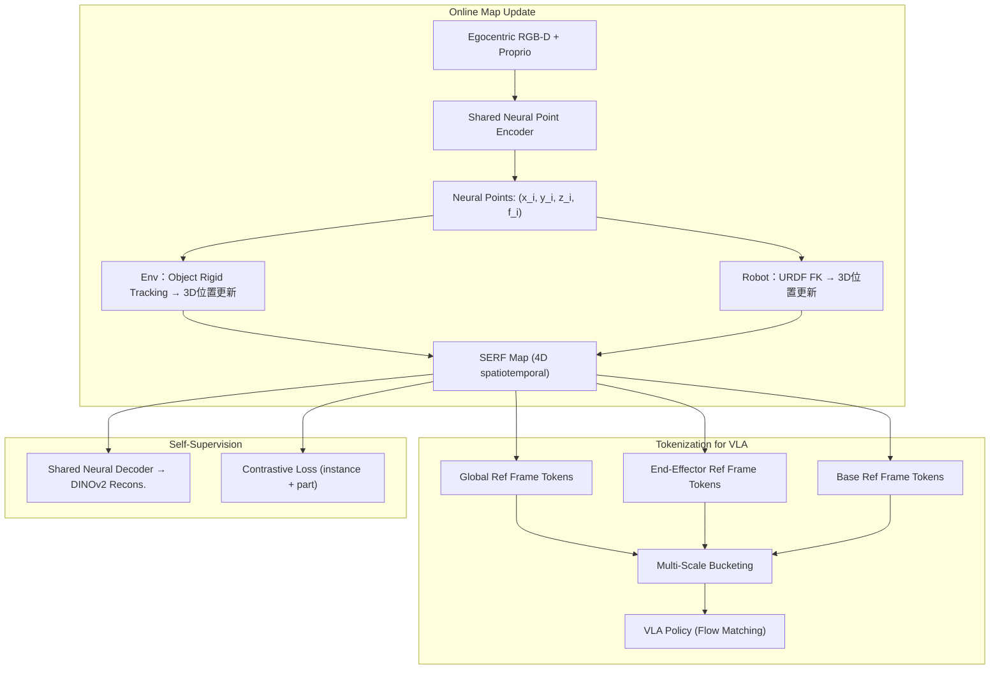

# SERF: Spatiotemporal Environment and Robot Feature Map for Long-Horizon Mobile Manipulation

- 本地 PDF：`papers/memory/SERF_2606.12956.pdf`
- arXiv：https://arxiv.org/abs/2606.12956
- 项目页：https://existentialrobotics.org/serf/
- 年份：2026（6 月）
- 团队：UC San Diego + UMich（Sunghwan Kim 一作, Nikolay Atanasov 通讯）
- 阶段：4D 潜特征地图 — 记忆=环境+机器人共享的空间表示

## 一句话总结

SERF 将记忆建模为 4D 神经点云地图——环境和机器人身体被编码为同一潜空间的 neural points（3D 位置 + 可学习 feature），共享 encoder/decoder 和 DINOv2 蒸馏目标。在线增量更新：环境点通过 object-level rigid tracking，机器人点通过 URDF forward kinematics。多尺度（spatial）+ 多坐标系（world/end-effector/base）tokenization 后输入 VLA。BEHAVIOR-1K 上远超图像-only VLA（π0.5），未访问区域任务进度从 28%→51%，能从历史位置检索掉落物体——核心贡献：证明"记忆=空间表示本身"比"记忆=独立模块"更高效。

## 核心技术

1. **共享潜空间** — 桌面和机械臂被编码为同一格式的 neural point（3D XYZ + 128-dim feature），共享 encoder 和 DINOv2 decoder。机器人在环境地图中不是"观察者"——它是地图的一部分
2. **在线增量更新** — 每帧 ~10Hz：环境点通过 object rigid tracking 更新（检测→6 DoF 估计→3D 位置更新），机器人点通过 URDF FK 更新。Feature 累计平均——不从头重建地图
3. **多尺度多坐标系 Tokenization** — 同时提取 global frame / ee frame / base frame + 不同空间半径的 token buckets。给策略同时提供"世界中心的导航信息"和"自我中心的操作信息"
4. **对比学习增强** — 类别级 instance discrimination + 部件级 part correspondence loss，使 neural point 的 feature 空间有判别性

## 底层原理与数学推导

**环境点跟踪**：对每帧 RGB-D，用 Grounding DINO + SAM 检测物体刚性区域 → 估计 6-DoF 刚体变换 → 更新对应 neural points 的 3D 位置。非刚体区域通过 ICP 微调。

**机器人点更新**：从 URDF 采样 ~500 个 surface 点，通过 forward kinematics 变换到世界坐标系。点的 feature 通过观测的 visual feature 更新。

**Tokenization 策略**：对每个参考坐标系，以原点为中心在多个半径（0.2m, 0.5m, 1.0m, 2.0m）内采样 neural points → MLP 聚合 → concat → VLA token。本质是"多分辨率空间注意力"——近处高分辨率，远处低分辨率。

## 物理直觉解释

**为什么需要把机器人放进地图？**

传统方法中，地图是外部世界的地图，机器人只是"看地图导航的东西"。但移动操作中，机器人和环境是不断交互的——手碰到了桌子、身体挡住了路、底盘需要绕过障碍。SERF 把机器人的身体也放进地图——手臂的神经点和桌面的神经点在同一个坐标系统里。当策略计算"手离杯子有多远"时，不需要做坐标变换——两个 neural point 的 distance 直接给出答案。

这就像人的本体感觉——你不需要"看到"自己的手才能知道它在哪，大脑有一个身体的内部模型（body schema）。SERF 给机器人同样的能力——它的身体在地图中是"天生就知道"的，不是需要视觉推断的。

**为什么未访问区域的任务进度能翻倍（28%→51%）？**

因为地图被逐步填充——SERF 的地图不是"看到了才有的"。周围已探索区域的结构通过空间邻接关系提供了"推断"——"我看到了一道门，门的另一边大概率是另一个房间，我现在可以朝那个方向规划路径"。这不是机器学习出来的泛化——是 3D 几何自带的空间先验。

## 工程细节与实操指南

- **Neural Point**：3D (x,y,z) + 128-dim latent feature, ~5000 环境点 + ~500 机器人点
- **Encoder**：MinkowskiEngine sparse 3D conv，从 RGB-D 生成 neural points
- **Decoder**：shared MLP，重建 DINOv2 embedding（监督信号来自 frozen DINOv2 ViT）
- **对比 loss**：类别级（discriminate between object instances）+ 部件级（discriminate between semantic parts）
- **Rigid tracking**：Grounding DINO + SAM → mask → Kabsch algorithm for 6-DoF
- **更新频率**：~10Hz，tracking ~5ms on RTX 4090
- **坐标系**：world（全局导航）、end-effector（精细操作）、base（移动规划）
- **VLA**：基于 π0.5 架构，SERF tokens 作为 extra conditioning input
- **Benchmark**：BEHAVIOR-1K 移动操作长程任务（household environments）

## 消融实验与分析

| 消融 | 关键发现 | 定量效果 |
|------|---------|---------|
| 无 SERF map（纯 2D VLA） | 图像-only 模型在空间复杂任务中系统性劣化 | 未访问区域进度 28% |
| +SERF map（环境+机器人） | 共享潜空间 + 在线更新 | 未访问区域进度 **51%**（+82% 相对提升） |
| 仅环境点（无机器人身体点） | 缺失本体空间感知 | 精细操作精度下降 |
| 单尺度 vs 多尺度 tokenization | 多尺度对"全局导航+局部操作"的双重需求关键 | — |
| 单坐标系 vs 多坐标系 | 多坐标系使策略能同时做 egocentric 和 allocentric 推理 | — |
| 有/无对比学习 | 对比 loss 提升 feature 判别性 | — |
| 历史掉落位置检索恢复 | SERF 能在地图中查找到之前掉落物体的 3D 位置并导航回去 | 功能验证 |

## 技术权衡（Trade-off）

| 优势 | 劣势与工程代价 |
|------|----------------|
| 空间记忆天然精确（3D 几何 world coordinates） | 语义记忆弱——地图知道"这里有个物体"但不知道"这是杯子"还是"碗" |
| 在线增量更新，不需重训，适应动态环境 | Object rigid tracking 假设物体是刚体——布料、液体、食物等非刚体失败 |
| 身体+环境共享空间，操作接地气 | 大场景（>100m²）下 neural point 的存储和 kNN 查询 scalability 待验证 |
| 未访问区域也能获得空间先验 | DINOv2 蒸馏质量依赖 frozen ViT 的 domain gap（ImageNet→household） |

## 技术价值与演进定位

SERF 代表了记忆研究中"空间地图"路线的最高水平。它在概念上和 SLAM 中的 real-time mapping 一脉相承——但核心区别在于：SLAM 的地图是"几何"的（点云/网格），SERF 的地图是"语义+几何"的（neural feature field）。这个升级让地图不仅能告诉策略"这里有个障碍物"，还能告诉它"这个障碍物是桌子，旁边是抽屉，你 3 分钟前在这个抽屉里放了东西"。

和 MemoryWAM 的"时间压缩"路线形成天然互补——SERF 管"空间结构"，MemoryWAM 管"时间序列"。未来的 robot memory 可能需要两者融合：一个 4D spatiotemporal map 同时记空间和时间。

## 与其他论文的关系

- **π0.5**：baseline VLA, SERF 以其为 backbone 但加 4D map 条件后系统性超越
- **MemoryWAM**：时间分层压缩 vs 4D 空间地图，互补而非竞争
- **EchoVLA**：同为空间记忆（3D voxel map），SERF 用连续 neural points（更精确但更昂贵）
- **3D Foresight**：3D 辅助任务增强策略，SERF 将 3D 从辅助升级为持久记忆
- **RISE / LingBot-VA**：世界模型做未来预测，SERF 的地图是"已经发生的"——互补于预测性记忆

## 精读问题

1. **非刚体跟踪**：布料被折叠、液体被倒出——SERF 的 rigid tracking 完全失效。能否用 deformable tracking 或 particle-based 表示扩展？
2. **语义注入**：neural point feature 目前从 DINOv2 蒸馏——这个是通用的 visual feature。能否加入 language-grounded semantic feature（如 CLIP）让地图知道"这是杯子"、"这是钥匙"？
3. **地图的终身学习**：SERF 的地图在 episode 结束后是否保留？如果在同一环境中多天操作，地图能否持续积累——形成"家里杯子通常在哪"的长期空间记忆？
4. **和 RoboTTT 的融合**：SERF 的地图更新是"追加式"的（累计平均），RoboTTT 的 TTT 提供"自适应选择性写入"。能否用 TTT 替代累计平均，让 feature 更新更有选择性？
