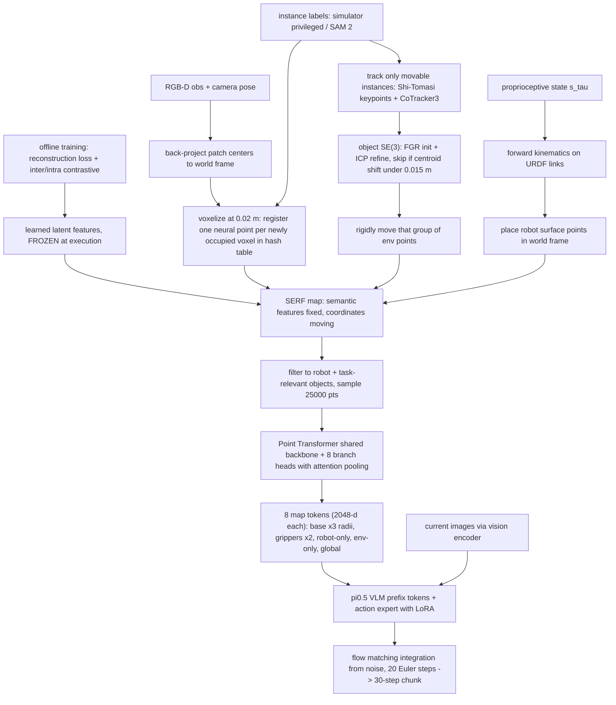

# SERF：环境与机器人一体的 4D 神经点时空特征地图

- 本地 PDF：`papers/memory/SERF_2606.12956.pdf`
- arXiv：https://arxiv.org/abs/2606.12956
- 年份：2026（arXiv v1 2026-06-11，附录排版近 NeurIPS 风格，venue 未注明，待确认）
- 团队：UC San Diego + 韩国 Agency for Defense Development + SceniX Inc. + University of Michigan（Atanasov 组）
- 阶段：BEHAVIOR-1K 长时程移动操作——给 VLA 换上一个"环境+本体"共存的持久 4D 空间记忆作为显式状态输入

## 一句话总结

把工作空间表示成一堆带可学习 latent 特征的 neural points：离线学好的特征在执行期完全冻结，只靠 object-level SE(3) 跟踪挪环境点、靠 forward kinematics 摆机器人点，从而得到一张随时间演化的 4D 地图；再从多个参考系与尺度 tokenize 出 8 个 map token 喂给 π0.5，让策略同时获得 allocentric（我在场景哪）与 egocentric（手够不够得着）两种推理——BEHAVIOR-1K 三任务平均任务进度从 image-only 的 44.0% 提到 58.7%（Abstract/Table 1）。

## 核心技术

1. **Neural point 表示（Sec 3）**：地图 $\mathcal{P}_\tau=\{(p_{i,\tau}, f_i, c_i)\}_{i=1}^N$，每个点携带世界系坐标、64 维 latent 特征与实例标签；查询任意位置 $x$ 时做 ball query 取 K=6 近邻、softmax 加权插值特征，再经共享 decoder 映射回 DINOv3 patch embedding。**点的存在形式本身就是它的杀手锏：坐标是显式的，刚体一动就整体平移旋转，不需要重训练任何东西。**
2. **环境-机器人共享隐空间**：环境点由 RGB-D 观测提升到 3D 后按 voxel 注册进 spatial hash table；机器人点从 URDF link mesh 表面采样、存于各 link 局部坐标系。两组特征用同一个 decoder 联合优化 + 类别间对比损失（把机器人当作一个附加类别），保证 DINOv3 语义落在同一坐标系里——这是后面"距离即可达性"推断的前提。
3. **在线更新 = 只动坐标（Sec 3 Map Updates）**：执行期 latent feature、实例标签、decoder 全部冻结；环境点按物体实例分组，组内以 Shi-Tomasi 角点 + CoTracker3 的 2D 关键点轨迹提升到 3D，FGR 初始化 + ICP 精化估计 instance 级 SE(3)，然后整组搬移；质心位移 < 0.015 m 判为静止跳过配准。机器人点则直接 FK 到当前世界位姿。训练与在线用的是同一条更新规则，只是来源一个是录制数据、一个是实时估计。
4. **Map Tokenizer（Sec 4）**：先按 BDDL 任务过滤掉背景与结构件，只留机器人点和任务相关物体点；每步采样 25,000 个点，过一个共享 Point Transformer 骨干后接 **8 个并行分支头**——3 个 robot-base 半径（1 m / 2 m / 4 m）多尺度局部 token、2 个 end-effector 0.5 m ball token（左右夹爪抓取推理）、robot-only token、environment-only token、global token——每个分支 attention pooling 成一个 2048 维 token；刻意丢掉绝对坐标、只用相对位置编码来抑制过拟合。
5. **π0.5 条件化与训练（Sec 4）**：$h_\tau=\mathrm{Concat}(E(o_\tau), e_m, e_s, e_\ell)$ 输入 VLM 主干 + action expert；flow matching 训练动作专家；冻结 VLM backbone 与 vision encoder，只在 action expert 里插 LoRA，map tokenizer、投影层、LoRA 构成全部可训参数。

## 底层原理与数学推导

论文拆成两个学习问题。Problem 1 是建图：$\mathcal{D}_\tau \subseteq \mathcal{X}\times\mathcal{Y}$ 为截至 $\tau$ 时刻的坐标-embedding 对，最小化重建损失

$$\mathcal{L}_{\mathrm{map}}(\Theta)=\mathbb{E}_{\tau,\,(x,y)\sim\mathcal{D}_\tau}\big[\mathcal{L}(m_\tau(x;\Theta),\,y)\big]$$

Problem 2 是 map 条件化的行为克隆：

$$\mathcal{L}_{\mathrm{bc}}(\phi)=-\mathbb{E}_{(o_\tau,s_\tau,a_\tau,\ell)\sim\mathcal{T}}\big[\log \pi_\phi(a_\tau\mid m_\tau,o_\tau,s_\tau,e_\ell)\big]$$

核心算子是神经点插值。对查询点 $x$，取 K 近邻集合 $\mathcal{N}(x;\mathcal{P}_\tau)$，按反距离 softmax 权重聚合 latent 特征，经 MLP decoder 得到该处的 VFM embedding：

$$F(x;\mathcal{P}_\tau)=\sum_{i\in\mathcal{N}(x;\mathcal{P}_\tau)} w_i(x;\mathcal{P}_\tau)\,f_i,\qquad w_i=\mathrm{softmax}\big(-\|x-p_{i,\tau}\|/\sigma\big)$$

$$m_\tau(x;\Theta)=D_\theta\big(F(x;\mathcal{P}_\tau)\big),\qquad \mathcal{L}_{\mathrm{rec}}=1-\mathrm{sim}\big(D_\theta(F(x)),\ y\big)$$

除重建外还叠加两级对比目标，把语义结构灌进隐空间：

$$\mathcal{L}_{\mathrm{map}}=\mathcal{L}_{\mathrm{rec}}+\lambda_{\mathrm{inter}}\mathcal{L}_{\mathrm{inter}}+\lambda_{\mathrm{intra}}\mathcal{L}_{\mathrm{intra}}$$

其中类别间项跨场景拉近同类特征、推开异类特征（InfoNCE 形式，$\lambda_{\mathrm{inter}}=0.02$）；实例内项按 part 分组拉近同部件、分离同一物体的不同部件（环境样本用 SAM 2 分割作部件标签，机器人样本用渲染的 link 标签；$\lambda_{\mathrm{intra}}=0.01$，两者温度均为 $\sigma_c=0.1$，每迭代采样至多 16,384 点并做类平衡重要性采样）。这就是附录 C 中 PCA 可视化能看到"椅子、泰迪熊、鞋子各自聚簇"的原因。

地图的时序更新走纯几何路线。每个 movable 实例按刚体处理，2D 关键点轨迹提升为 3D 对应关系 $(q^{\tau-1}_k, q^\tau_k)$ 后解一个加权最小二乘问题求 SE(3)：

$$(\hat R,\hat t)=\arg\min_{R\in SO(3),\,t\in\mathbb{R}^3}\sum_k\big\|q^\tau_k-(Rq^{\tau-1}_k+t)\big\|^2$$

$$p^e_{i,\tau}=\hat R\, p^e_{i,\tau-1}+\hat t\quad(\forall i\in I),\qquad p^r_j(s_\tau)=R_{l_j}(s_\tau)u_j+t_{l_j}(s_\tau)$$

第二条式子就是正运动学：机器人表面点 $u_j$ 存在自身 link 的局部系里，世界坐标由该 link 当前的旋转平移给出——因此机器人部分根本不需要"跟踪"，它永远精确。动作侧沿用 π0.5 的 conditional flow matching：对专家 chunk $\mathcal{A}_\tau=a_{\tau:\tau+H}$ 加噪 $\mathcal{A}^\alpha_\tau=\alpha\mathcal{A}_\tau+(1-\alpha)\epsilon$，训练速度场预测目标速度 $u_\tau=\mathcal{A}_\tau-\epsilon$：

$$\mathcal{L}_{\mathrm{action}}=\mathbb{E}\big[\|\,v_\psi(\mathcal{A}^\alpha_\tau,h_\tau,\alpha)-u_\tau\,\|^2_2\big]$$

推理时从高斯噪声出发、沿 $\alpha:0\to1$ 积分 20 步 Euler 得到整个动作块。

推导层面最关键的一条设计判断藏在第 3 节开头一句：**语义是慢变量，位置是快变量**。于是把"这个点是什么"压进冻结的特征里（由对比学习保证跨场景稳定），把"这个点现在在哪"交给闭式几何（SE(3)/FK 精确解析求解）。两件事用了完全不同的工具——前者用大模型蒸馏，后者用经典几何——各自只做自己擅长的那半，避开了端到端学到两头都糊的问题。

## 物理直觉解释

**第一段｜贴在桌子上的磁贴**。想象工作空间是一张巨大的白板，环境里的每一小片表面都是一枚磁贴——磁贴背面印着它的语义身份（这是桌面、这是杯柄、这是夹爪指尖），正面标着它在白板上的位置。当有人把杯子从桌上挪到柜子里，你不会重新测量整个房间，而是**捏住这组磁贴整摞平移过去**。SERF 做的就是这件事：物体级的 SE(3) 变换把一个实例的所有点作为刚体整体搬移，而检测这次搬移所需的只是一个 2D 点追踪器加一次 ICP——这正是传统 occupancy/feature grid 地图做不到的：栅格里没有"这个物体"的概念，运动一来只能整片擦掉重涂。

**第二段｜把自己的影子画进平面图**。以前的空间记忆只画房子不画人，机器人得靠自己的一堆图像和姿态去猜"我的手离那个杯子多远"。SERF 直接把机器人的表面点也钉在同一张图上，相当于 architect 在户型图上**画上了住户本人的轮廓和手的位置**。好处立刻具体化：左夹爪周围 0.5 m 内有哪些点、末端到目标的直线距离是多少，这些都是地图上的简单邻域查询，而不需要网络凭空推断。token ablation 也支持这一点——去掉 end-effector 和 robot-only 两组 token 各跌 6.1 个百分点，是所有 token 组里掉得最多的（Table 2），说明"身体入图"恰恰是最有信息量的那部分输入。

**第三段｜三个问题的分工**。论文开篇说长时程操作要持续回答三个耦合问题：我在哪、周围什么变了、任务进行到几分之几。答案其实对应地图的三种用法：allocentric 用法回答前两个（base 多尺度 token 定位自己、environment token 反映变更后的布局），egocentric 用法回答第三个（end-effector token 让策略知道夹爪此刻贴着什么、要补哪些子目标）。image-only 策略之所以会"物体一出视野就僵住"（Fig 5/14 的定性观察），就是因为这三个问题全都要从两三帧图像里现场推断，没有外部账本可以查——SERF 相当于给它发了一个**随手可查的房产登记册**。

**第四段｜为什么特征要冻结**。一个容易反驳的设计是：为什么不让特征跟着环境一起微调？因为特征承载的是身份——"这枚点是杯柄"这件事在杯子被移动前后不应该变。若允许在线更新特征，一次光照变化或遮挡就可能把杯柄"误认成"别的类别，随后所有下游检索全部错乱。冻结等价于给每个点发了**一张终身有效的身份证，搬家不换证**——理解世界的方式保持不变，改变的只有索引（坐标）。代价是不能应对外观本身的巨变（例如被撕开的包装盒），这一点在 Limitations 里没有明确讨论，值得在精读中追问。

## 工程细节与实操指南

- **感知栈参数（Appendix A/B）**：DINOv3 处理 480×480 RGB，输出 30×30 网格 × 1280 维 patch embedding（patch size 16）；SAM 2 base-plus 做 part 级掩码；voxel 尺寸 0.02 m，机器人 mesh 采样分辨率相同；每点 latent 64 维；decoder 是 64→1280 的 residual MLP；ball query K=6，插值 softmax 温度 0.05。
- **Tokenizer 结构（Appendix E）**：共享 Point Transformer 两阶段骨干，通道宽 (128, 256)、每阶段 2 个 block、stride 4、16 近邻；分支头宽 256、stride 1；attention pooling 输出单个 2048 维 token 与 VLA token 维度对齐；每次策略输入采 25,000 点；不留绝对坐标、只用相对位置编码防过拟合。
- **π0.5 微调配置**：基于 BEHAVIOR-1K OpenPI 实现（Larchenko et al.，2025 BEHAVIOR challenge 冠军方案）；action horizon 30、动作维 32；每任务 20k step、batch 16、每个 batch 元素采 15 组 flow matching 时间/噪声样本；cosine 学习率，warmup 1k 步、峰值 2.5e-6、终值 1.0e-6；推理每个 query 重算一次 map token（不是每个控制步）、20 步 Euler 积分生成 30 步 chunk，保留前 26 步三次插值重采样为 20 条控制指令。
- **评测协议（Appendix G/H）**：Task 21 收玩具（7 个目标物，4.4×3.0 m，最长 38,372 步）、Task 22 鞋上架（5.5×9.0 m，15,384 步）、Task 26 组装礼篮（20 个物件，7.6×8.8 m，52,120 步）；每任务训练 200 条专家演示、评测 20 个配置；指标是 BDDL 子目标完成比例（task progress %），不是二值成功率。
- **失败恢复诱导协议**：运输途中强制张开夹爪使物体坠出视野，两个 policy 从同一 post-drop 状态继续；演示数据不含恢复情形，成功与否考察的是超出示教分布的泛化。
- **诚实披露的前提假设（Limitations）**：依赖执行前预学的 prior map（特征不能从零流式建立）+ **仿真器特权实例标签**（非真实分割）；作者明言所有对比应理解为"在这些假设下加入空间记忆的收益"，而非严格同输入信号的比较。他们指出 MISO 式 feed-forward 编码器和 SAM 2 是两条替代路径。

## 消融实验与分析

**主结果：BEHAVIOR-1K 任务进度 %，20 配置均值±标准差（Table 1）**

| 方法 | Task 21 玩具 | Task 22 鞋架 | Task 26 礼篮 |
|---|---|---|---|
| π0.5（pre，50 任务统一微调权重） | 42.9 ± 19.7 | 43.0 ± 23.5 | 44.1 ± 22.4 |
| π0.5（ft，仅图像逐任务微调） | 40.7 ± 18.8 | 43.0 ± 19.3 | 48.4 ± 21.1 |
| SBP（静态 3D 特征图 [18]） | 57.9 ± 17.8 | 52.5 ± 24.1 | 51.6 ± 11.7 |
| SERF（env，去掉机器人点） | 57.9 ± 15.3 | 59.0 ± 20.5 | 49.4 ± 13.4 |
| SERF（完整，环境+机器人） | **63.5 ± 16.7** | **60.1 ± 19.1** | **52.5 ± 13.8** |

**核心结论**：三行对照链清晰地隔离了三个因素——(1) 有无地图：SBP/SERF(env) 对 π0.5(ft) 平均涨约 14~17 个点，说明显式空间记忆本身贡献最大；(2) 静态 vs 时序更新：SBP → SERF(env) 主要收益在需要导航找物的 Task 22（+6.5），静态地图在那里拿到的东西拿不全；(3) 图里有没有身体：SERF(env) → SERF 又平均再涨约 3 个点，其中 Task 21 最明显（57.9→63.5），多物体搬运阶段最吃"身体在哪"的信息。image-only 基线在 T21 上微调反而比不微调更低（40.7 vs 42.9），提示短视距下逐任务过拟合了演示路径。

**Map token 组消融（Appendix F，Table 2，Task 22 task progress %）**

| 变体 | 去掉的 token 组 | 任务进度 |
|---|---|---|
| SERF w/o end-effector | 左右夹爪 0.5 m 局部图 ×2 | 54.0 ± 21.5 |
| SERF w/o robot-only | 本体聚合 token | 54.0 ± 22.2 |
| SERF w/o global | 全场景聚合 token | 55.1 ± 20.6 |
| SERF w/o robot-base | base 1/2/4 m 多尺度 ×3 | 56.5 ± 21.7 |
| SERF w/o environment-only | 环境状态 token | 58.5 ± 20.9 |
| SERF 完整（8 tokens） | – | **60.1 ± 19.1** |

**核心结论**：缺谁都不如完整版，但缺口大小差 4 倍——end-effector 与 robot-only 各 −6.1，global −5.0，robot-base −3.6，而 environment-only 仅 −1.6。这与主实验的结论互相印证：任务进度主要卡在"手正处在哪、接下来该伸向哪"这一微观决策上，而非宏观环境认知；同时也是对"8 个 token 有冗余"这种质疑的直接回应——每个组都有不可替代的边际贡献，虽然绝对方差（±20 上下）表明单次评测噪声不小，排序结论应视为趋势而非精确差值。

**泛化与失败恢复（Fig 6 / Fig 7 数字，均 20 配置/20 episodes）**

| 设定 | 指标 | π0.5 (ft) | SERF | 提升 |
|---|---|---|---|---|
| OOD：目标书架搬家 | 任务进度 % | 42.9 | 50.8 | +7.9 |
| OOD：追加 2 只泰迪熊（7→9 目标物） | 任务进度 % | 50.6 | 63.0 | +12.4 |
| OOD：2 只凉鞋放在从未访问区域 | 任务进度 % | 28.0 | 51.0 | +23.0 |
| 运输中脱手落物后恢复 | 恢复成功率 % | 65 | 95 | +30 |
| 同上 | 平均恢复耗时 s | 24.3 | 20.5 | −3.8 |

**核心结论**：OOD 幅度越大、SERF 优势越大——尤其 Unvisited Region 场景（+23.0）：目标物在演示从未到达过的区域，必须主动探索，persistent map 提供的正是探索所需的可查询空间账本；对象数量变化的 +12.4 说明增量物体可以直接注册为新点集而被策略利用。失败恢复更是纯零-shot 泛化：演示里没有任何恢复样本，SERF 却能重新定位并二次抓取已坠地的物体——因为掉落的物体在地图上仍有一组带语义的点，而 image-only 策略连"去哪里看"都没有方向。

## 技术权衡（Trade-off）

- **特权标签换干净的数据关联**：instance label 来自仿真器而非真实分割，物体跟踪、点过滤、BDDL 相关筛选全部站在特权信息的肩膀上；作者自己承认这让基线对比的公平性打折。把它换成 SAM 2 会引入分割漂移→错误关联→点群错位的连锁风险，鲁棒性数字几乎必然回落。
- **prior map 依赖**：latent 特征必须在执行前从预采集数据学出（环境样本来自预执行观测、机器人样本来自多视角渲染）。换新环境就得重学一遍特征 + 重采一批 demo；MISO 式 feed-forward 编码器可以缓解但会牺牲特征质量。
- **刚体假设的天花板**：抽屉、门、布料、绳索这些铰接或柔性对象都不在 object-level SE(3) 的表达范围内——只能当作静止或失效处理。家庭场景的高频交互物恰好集中在这里，这是走向真实落地的最大结构性短板。
- **单时间窗 token**：tokenizer 只编码当前时刻的地图快照，不含过去若干窗口或未来预测（作者列的未来工作）。相比库内 MemoryWAM 的时间分层、RoboTTT 的上下文内自回归适应，SERF 把全部时序信息压进了"坐标的历史累积"这一个维度里。
- **效率上的折中设计**：30 步 chunk 内只重算一次 map token（而非每控制步），换来的是地图状态在 chunk 执行期间可能过期——对慢速重组足够，对快速动态并不安全；同样地，主干每步 25,000 点的 Point Transformer 推理成本在论文里未被量化报告（待确认：计算延迟与内存占用无公开数值）。

## 技术价值与演进定位

SERF 的位置可以从它引用的三个失败象限看清：模块化系统（OK-Robot、DynaMem、MORE）有显式场景记忆但抽象掉了密集几何与机器人-环境接触线索；policy 内嵌记忆（MemER、MEM、EchoVLA）扩展了时间上下文但空间锚定含蓄；已有的 feature-map 方法（MindMap、自家前作 SBP、3D-VLA）给了空间 grounding 但只建模静态环境、且不包含机器人本体。SERF 同时填掉最后两个坑——演化（4D）与本体入图——使得"空间记忆"第一次以**可微分几何一致的连续表示**进入 VLA 条件流。方法层面的范式意义在于明确了三段式分工：VFM 蒸馏管语义（慢）、闭式几何管运动（快）、tokenizer 管"喂给策略的视角选择"。它与 EchoVLA 是库内"外置空间记忆"的两条平行实现（离散 voxel+门控 vs 连续神经点+刚体跟踪），与本组更早的 SBP 合起来构成 Atanasov 组一条清晰的演进曲线：static map → dynamic env map → env+robot spatiotemporal map。

## 与其他论文的关系

- **π0.5 — 背骨与受试者**：所有五个变体共享同一 π0.5 主干与训练设置，唯一差别是 map-token 输入，因此 Table 1 的增益可以被干净归因于空间记忆；SERF 也是π0.5 在长时程双臂移动操作上的一次系统压力测试。
- **SBP（Kim et al., ICRA 2026 "Seeing the Bigger Picture" [18]）— 同组的直系前作**：静态 3D latent map 是 SERF 的消融上限参照（SBP 行即"冻结时间轴的 SERF"）；env 版比它平均高出的份额正是"时间"要素的市场价格。
- **EchoVLA（库内 `notes/memory/echovla.md`）— 空间记忆的镜像路线**：离散 voxel 图 + discrepancy 门控写入 vs 连续 neural points + SE(3) 跟踪搬移；EchoVLA 额外带 episodic 时间缓存而 SERF 不带（时序只活在坐标历史里）；SERF 把机器人本体放进地图而 EchoVLA 不放。SERF 附文还将 EchoVLA 归类为"经验缓冲/retrieval 一派"，认为其空间 grounding 不够显式——这条批判是否公允可作为精读切入点。
- **MemoryWAM（库内 `notes/memory/memorywam.md`）与 RoboTTT（库内 `notes/memory/robottt.md`）— 组织轴不同的互补方案**：MemoryWAM 沿时间轴分层压缩记忆内容，RoboTTT 把记忆写进 fast weights；三者分别占据"空间地图 / 时间层级 / 参数自适应"三种记忆形态，SERF 明确不保存事件级信息，因此对"上次做过什么"这类非马尔可夫线索存在盲区。
- **DynaMem / 动态场景图一系 [10][11] — 符号式动态记忆对照**：同样处理动态开放世界，但把场景抽象为对象符号或 scene graph，利于语义推理却丢失策略控制所需的稠密几何；SERF 选择保几何、将语义留给 DINOv3 特征隐式承载。
- **3D-VLA [19] — 世界模型式的 3D 条件**：通过生成式世界模型引入 3D 先验，SERF 则通过显式地图；两者的差异是"想象未来帧"与"记录过去几何"的方向之分。
- **PIN-SLAM / Neural point-based graphics [20][21] — 技术血统**：neural point 作为"带特征的点 + 显式坐标可搬移"的原语直接借自点式神经表示与 LiDAR SLAM 传统，把 SLAM 界的表示迁移到了机器人学习管线。

## 精读问题

1. **外观变化的语义盲区**：特征一旦冻结，一个纸箱被拆开摊平后就只能带着旧特征去新的位置吗？能否给环境点加一条低频特征刷新通路（例如按置信度选择性调用 feed-forward encoder），同时保住"身份证不变"的优势？
2. **去除特权标签后的退化幅度**：如果 instance 标签全部换成 SAM 2 在线分割，物体级 SE(3) 跟踪的跨帧 ID 漂移会让 Table 1 中多少增益消失？有没有必要做一个 split：高频细节靠分割、低频一致性靠关联约束（类似 tracking-by-detection 中的 ReID）？
3. **铰接对象的 SE(3) 扩展**：抽屉拉出是 1-DoF 平移，冰箱门是绕轴旋转——这两类都能由参数化的 articulation model 近似，但布料不行。哪些真实家庭任务会被刚性假设硬性挡住？ articulate map 与 deformable particle 表示的接入成本各是什么量级？
4. **时序 token 的必要性证据**：当前地图对"刚才发生过什么"的唯一记录是坐标的当前位置——液体被倒出、临时遮挡后被移走的物体在地图上已无痕。加一个 short-horizon 环境差分 token（相邻两次 tokenizer 输出的差异）能否低成本地恢复事件可辨识度？
5. **与导航规划的接口缺失**：SERF 的地图已被证明能引导探索未访问区域（Unvisited Region +23.0），但探索行为本身是从 BC 里隐式涌现的；如果把这张地图同时喂给一个显式 frontier/exploration planner 并与 VLA 策略级联，能否进一步压缩长程任务的步数（对照 Task 26 高达 52,120 步的截断上限）？
