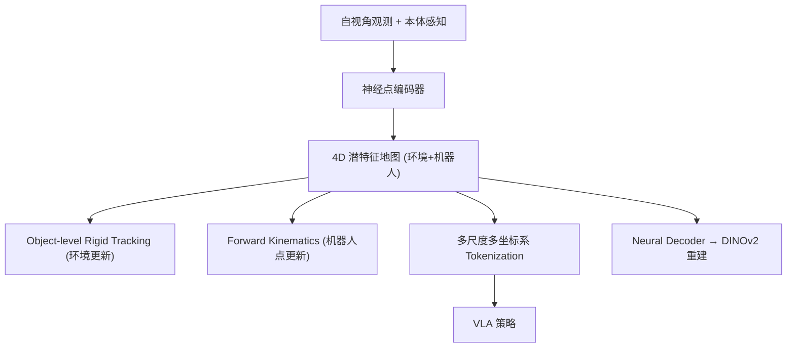

# SERF: Spatiotemporal Environment and Robot Feature Map for Long-Horizon Mobile Manipulation

- 本地 PDF：`papers/memory/SERF_2606.12956.pdf`
- arXiv：https://arxiv.org/abs/2606.12956
- 项目页：https://existentialrobotics.org/serf/
- 年份：2026（6 月）
- 团队：UC San Diego + UMich (Sunghwan Kim, Nikolay Atanasov 等)
- 阶段：4D 潜空间地图 —— 环境和机器人共享潜特征空间

## 一句话总结

SERF 将记忆建模为 4D 神经点云地图：环境和机器人本体都被编码为潜特征点（3D 位置 + 可学习特征），在线增量更新，多尺度/多坐标系 token 化。BEHAVIOR-1K 上远超越图像-only VLA，未访问区域任务进度从 28% 提升到 51%，能从掉落物体位置恢复。

## 核心技术

1. **共享潜空间** — 环境点和机器人身体点用同一编码器和解码器，地图本身是记忆
2. **在线增量更新** — 每帧观测通过 object-level rigid tracking（环境）+ FK（机器人）更新地图
3. **多尺度多坐标系 tokenization** — 全局/末端/基座 + 不同空间尺度，同时提取 egocentric 和 allocentric 特征
4. **DINOv2 蒸馏** — 神经点解码重建 DINOv2 embedding，赋予语义+几何特征

## 底层原理与数学推导

## 关键结果

- BEHAVIOR-1K: 移动操作长程任务远超图像-only VLA
- 未访问区域的任务进度: 28% → 51%（地图填充了"没看到但知道"的空间）
- 掉落物体恢复：从地图中检索掉落位置
- 更直接的导航轨迹（知道身后环境布局）

## 精读问题

1. 神经点云的存储和查询在大场景中的 scalability？
2. 语义记忆（物体功能、任务常识）在地图中如何表示？

## 技术权衡（Trade-off）

| 优势 | 劣势 |
|------|------|
| 记忆与空间表示合二为一 | 语义记忆弱于空间记忆 |
| 增量更新，实时适配 | 大场景存储和查询的 scalability 待验证 |

## 技术价值与演进定位

2026 年机器人记忆研究的代表工作，属于各自的记忆技术路线（4D 潜地图/双记忆/四模块/状态化训练/TTT）。

## 与其他论文的关系

- 与 RoboTTT、MemoryWAM 等同属 2026 年记忆研究方向，技术路线不同但目标一致：让机器人不忘记。

## 精读问题

1. 核心技术路线在当前 benchmark 之外的表现？
2. 与其他记忆路线的互补可能性？

## 物理直觉解释

SERF 把记忆做成了一张"活地图"——不是静态的导航地图，而是实时更新的、包含机器人自己在内的 4D 潜特征地图。就像你闭着眼睛也能摸到自己的鼻子——因为你的大脑有一个自己的身体在空间中的模型。SERF 给机器人同样能力：它知道自己和环境在同一个坐标系里。

## 工程细节与实操指南

- 神经点: 3D 位置 + 可学习潜特征
- 更新: 环境点 = object-level rigid tracking, 机器人点 = URDF FK
- Tokenization: 多尺度 + 多坐标系（全局/末端/基座）
- 解码: DINOv2 蒸馏 + 对比学习
- Benchmark: BEHAVIOR-1K, 移动操作长程任务

## 消融实验与分析

| 消融 | 结论 |
|------|------|
| 有/无 4D 地图 | 地图使未访问区域进度 28%→51% |
| 环境+机器人 vs 仅环境 | 机器人本体在地图中对操作精度关键 |
| 多尺度 vs 单尺度 tokenization | 多尺度对全局+局部理解都必要 |
