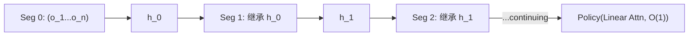

# StateLinFormer: Stateful Training Enhancing Long-term Memory in Navigation

- 本地 PDF：`papers/memory/StateLinFormer_2603.23571.pdf`
- arXiv：https://arxiv.org/abs/2603.23571
- 年份：2026 (IROS 2026)
- 团队：AIRS (深圳市人工智能与机器人研究院)
- 阶段：状态化训练 — 训练-部署记忆状态对齐，涌现 ICL

## 一句话总结

StateLinFormer 证明序列模型的"健忘"不一定是架构问题，而是训练协议问题。当前几乎所有 VLA 和序列策略用 stateless training——每个训练 batch 从零隐藏状态开始（$M_0 = 0$）。但真实部署是连续的——机器人不会在每次 reset 后重置记忆。StateLinFormer 改为 stateful training（batch 结束时把记忆状态 $M_T^{(b)}$ 传给下一 batch 的初始状态 $M_0^{(b+1)}$）+ Linear Attention（恒定 $O(1)$ 记忆成本）。效果：相同架构、相同参数量（约 0.2B）下，MAZE CON 成功率 0.64 → 0.77（+0.13）、步数 249 → 189，ProcTHOR CON 成功率 0.420 → 0.580（+0.16）、步数 669 → 496；10M 帧训练的 Stateful 版本还反超 40M 帧预训练的 SPOC-Pretrained（0.580 vs 0.566）。并且涌现了上下文学习能力——同一环境交互越长成功率越高，无需更新任何参数。IROS 2026。

## 核心技术

1. **Stateful Training** — 训练时 batch k 的初始记忆状态 = batch k-1 的终止状态（而非清零），梯度仍按 batch 截断。模型参数在"自己长期演化产生的记忆状态分布"上被优化，而非在退化的零初始化分布上
2. **Linear Attention** — 记忆状态 $M_t \in \mathbb{R}^{d \times d}$ 增量更新，每步 $O(1)$ 计算成本，支持跨 batch 传状态而不爆炸
3. **涌现 In-Context Learning** — 训练从未显式教"如何利用积累信息"，但部署时同一环境 context 越长成功率越高（stateless 对照在长上下文反而退化）——论文将其归因于 stateful 训练提高了训练信号的 burstiness（参考 Chan et al. 2022 的 ICL 数据分布性质结论）

## 底层原理与数学推导

线性注意力的记忆状态 $M_t$ 是固定的 $d \times d$ 矩阵，每个时间步做秩 1 增量更新（$\varphi(\cdot)$ 为核特征映射），读出用 query 与记忆的内积：

$$M_t = M_{t-1} + \varphi(k_t) v_t^{\top}, \quad h_t = \varphi(q_t)^{\top} M_t, \quad \pi_t = \text{Softmax}(MLP(h_t))$$

stateless 与 stateful 的唯一差别在训练协议——前者每个 batch 清零，后者把上一 batch 的终止状态作为下一 batch 的初始状态：

$$M_0^{(b)} = 0 \quad \text{(stateless)}, \qquad M_T^{(b)} \rightarrow M_0^{(b+1)} \quad \text{(stateful)}$$

优化视角下两者目标函数不同：stateless 在退化分布（记忆恒为零）上优化，stateful 近似在模型自身递归动力学诱导的平稳分布 $d_\theta$ 上采样（论文以经验证据 RSD 支持，无正式收敛证明）：

$$\min_\theta \mathbb{E}_{\tau \sim \mathcal{D}}\, \mathcal{L}(\theta; M_0 = 0) \quad \text{vs} \quad \min_\theta \mathbb{E}_{\tau \sim \mathcal{D}, M \sim d_\theta} \mathcal{L}(\theta; M)$$

训练损失为每步动作的负对数似然，$M_T^{(b)} \to M_0^{(b+1)}$ 只传播前向状态、不跨 batch 反向传播：

$$\mathcal{L} = \sum_{t=1}^{T} \ell(\pi(a_t | h_t), a_t), \quad M_{t} = f_\theta(M_{t-1}, x_t)$$

## 物理直觉解释

**"撕笔记的学生 vs 带笔记的学生"**——想象一个学生每次上课都把昨天的笔记撕掉、空手来上课，这就是 stateless training。考试时突然要求"基于所有学过的内容连续做题"，学生懵了，因为他从来没练习过"带着积累的知识学新东西"。StateLinFormer 改成"每天带昨天的笔记来上课"——训练和考试的条件一致了。模型参数因此在一系列"非空、有历史、由自己产生"的记忆状态下被优化，而不是只在"空白记忆"下被优化；部署时机器人恰好处于"有历史"的状态，两者对齐。

**"常驻店员 vs 每日轮岗店员"**——常驻便利店员在同一家店连续工作一周，越往后越清楚货架位置和常客习惯，找货越来越快——这就是涌现的 ICL：没有更新任何参数（店员还是那个人），但 performance 随积累的上下文上升。每日轮岗的店员每次都是新环境，表现不会随天数提升。论文 Fig. 2 显示 stateless 模型在长上下文下成功率甚至退化——像是轮岗店员被连续追问细节反而更混乱。关键洞察是：**光有架构能力不够，必须在训练时就模拟"积累"这个过程**，否则模型只会"用空白记忆思考"。

**"恒容书包"**——普通 Transformer 的记忆 = 每次只能带固定页数的讲义（fixed context window），装不下就丢。linear attention 的记忆 = 一个大小恒定的笔记本（$O(1)$），无论读过多少页都能装，但笔记本本身不会变大。stateful training 则保证这个笔记本在训练时就不是空白的——$M_T^{(b)} \to M_0^{(b+1)}$ 相当于"放学时不把笔记本清空，第二天接着写"。三者缺一不可：架构提供恒容记忆，训练协议让记忆有内容，部署时记忆自然积累。

## 工程细节与实操指南

- **架构**：SPOC 风格 encoder-decoder，decoder 用 kernelized linear attention 替换 Transformer，约 0.2B 参数（与全部基线容量对齐），记忆状态 $M_t \in \mathbb{R}^{d \times d}$，每步 $O(1)$
- **训练**：stateful 跨 batch 传递记忆状态，梯度在 batch 内截断；8 张 NVIDIA A800
- **数据**：MAZE 15×15 网格世界（1k 环境 / 50K 轨迹 / 100M 步），ProcTHOR（1k 环境 / 5K 轨迹 / 10M 步，394×224 第一视角）；训练序列 = 同一环境内连续多个导航目标
- **评测**：自建 Continual Object Navigation (CON) benchmark——目标重复允许、无预告（完成当前目标才给下一个）、环境持续不变；16 个未见环境，最多 5000 步，单指令上限 500 步（MAZE）/ 1000 步（ProcTHOR）
- **对比**：SPOC-10M（同数据重训）/ SPOC-Pretrained（40M 帧，context 100 步，按任务完成重置记忆以保持公平）

## 消融实验与分析

**训练协议消融（同架构同参数量，仅改训练协议；CON 任务）**：

| 配置 | MAZE SR ↑ | MAZE 步数 ↓ | ProcTHOR SR ↑ | ProcTHOR 步数 ↓ | 训练帧数 |
|------|-----------|-------------|----------------|------------------|----------|
| StateLinFormer (Stateless) | 0.64 | 249 | 0.420 | 669 | 10M |
| StateLinFormer (Stateful) | 0.77 | 189 | 0.580 | 496 | 10M |
| SPOC-10M (Transformer) | 0.68 | 239 | 0.479 | 630 | 10M |
| SPOC-Pretrained (大规模参考) | — | — | 0.566 | 525 | 40M |

**ICL 涌现证据（Fig. 2，未见环境成功率 vs context 长度）**：

| 交互长度增加 | Stateful 成功率 | Stateless 成功率 |
|--------------|-----------------|------------------|
| 短上下文 | 与 stateless 相当 | 基线水平 |
| 长上下文 | 持续上升（ICL 特征） | 上升停滞甚至退化 |

**记忆状态稳定性（Fig. 3，记忆范数相对标准差 RSD）**：stateful 训练全程低于 stateless——stateless 在零初始化退化分布上优化导致记忆瞬变，stateful 逼近平稳分布 $d_\theta$，经验行为一致。

**核心结论**：增益完全来自训练协议而非架构——相同架构、约 0.2B 参数、相同 10M 帧下，仅把"每 batch 清零"改为"跨 batch 延续记忆"，MAZE 成功率 0.64 → 0.77（+0.13）、步数 249 → 189，ProcTHOR 成功率 0.420 → 0.580（+0.16）、步数 669 → 496；10M 帧 stateful 模型还反超 40M 帧预训练的 SPOC-Pretrained（0.580 vs 0.566），且增益随 context 变长而放大——训练范式比数据量更关键。

## 技术权衡（Trade-off）

| 优势 | 劣势与工程代价 |
|------|----------------|
| 训练范式创新——不改架构只改训练方式，增益即得 | 仅验证导航（MAZE / ProcTHOR 的 CON 任务），操作任务效果未知 |
| 约 0.2B 参数、10M 帧反超 40M 帧模型——数据效率极高 | Linear attention 表达能力上限——复杂操作可能需要更强的状态传递机制 |
| 涌现 ICL——训练目标未显式要求，白得的适应能力 | $d_\theta$ 平稳性只有经验证据（RSD），无正式收敛保证与稳定性刻画 |
| 梯度按 batch 截断，训练成本几乎不变 | stateless 模型在长上下文下的退化机制未完全解释 |

## 技术价值与演进定位

StateLinFormer 是记忆研究中最被低估的一篇：没有发明新架构，而是揭示了一个训练协议缺陷。当前几乎所有 VLA（π0、OpenVLA、GR00T、G0.5）和序列策略都用 stateless 训练——它们的"记忆潜力"可能远未被挖掘，同样的架构只改训练方式就可能获得可观提升。它把"记忆对齐"问题拆成了两层：RoboTTT / WAM-TTT 解决"参数级"的部署期适应（部署时改权重），StateLinFormer 解决"状态级"的训练-部署一致性（训练时别清零）。对 linear attention / state space model 类架构（Gated DeltaNet、Mamba、TTT）而言，stateful 协议是可即插即用的免费增益，属于"低垂的果实"式改进方向。

## 精读问题

1. **Fig. 2 显示 stateless 模型在长上下文下成功率退化——这是零初始化导致的分布失配，还是线性注意力在长序列上的数值漂移？**
2. **stateful 训练把记忆 RSD 压低、逼近平稳分布 $d_\theta$——$d_\theta$ 的混合时间与 episode 长度、环境复杂度、batch 长度是什么关系？**
3. **10M 帧反超 SPOC-Pretrained（40M 帧）——若给 stateful 模型同样 40M 帧，增益继续扩大还是已经饱和？**
4. **CON 任务目标重复出现且只在前一目标完成后给出下一目标——涌现的 ICL 是否依赖这种"无预告"指令分布，换成随机目标序列是否消失？**
5. **操作任务中状态转移更多依赖动作而非纯观察——stateful 协议能否直接迁移到 VLA 操作策略，还是需要动作条件化的状态传递变体？**

## 与其他论文的关系

- **SPOC** — 架构参照系（Transformer decoder 导航模型）；SPOC-10M 同数据重训被全面超越（ProcTHOR 0.580 vs 0.479），证明 linear attention + stateful 协议的组合优势
- **SPOC-Pretrained** — 40M 帧大规模预训练参考模型，被 10M 帧 stateful 训练反超（0.580 vs 0.566）——训练范式 > 数据量
- **ReLIC / Memo** — 显式记忆机制（可学习 KV 向量 / 摘要 token）扩展有效上下文，但记忆机制本身仍在 stateless 协议下训练——stateful 协议可叠加
- **RoboTTT / WAM-TTT** — 部署期快速权重 TTT 是"参数级"在线适应，stateful training 是"记忆状态级"的训练-部署对齐——不同层级的记忆问题
- **Gated DeltaNet / Mamba** — linear attention 的替代状态空间架构，stateful 训练协议理论上可直接迁移，值得验证
