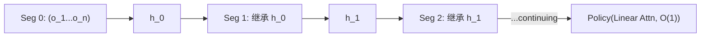

# StateLinFormer: Stateful Training for Long-Horizon Robot Policies

- 本地 PDF：`papers/memory/StateLinFormer_2603.23571.pdf`
- arXiv：https://arxiv.org/abs/2603.23571
- 年份：2026 (IROS 2026)
- 团队：AIRS (深圳市人工智能与机器人研究院)
- 阶段：状态化训练 — 训练-部署记忆状态对齐，涌现 ICL

## 一句话总结

StateLinFormer 证明机器人策略的"健忘"不一定是架构问题，而是训练方式问题。当前几乎所有 VLA 用 stateless training——每段训练数据从零隐藏状态开始。但真实部署是连续的——机器人不是在每次 reset 后重置记忆。StateLinFormer 改为 stateful training（跨数据段保留隐藏状态）+ Linear Attention（恒定 $O(1)$ 记忆大小）。核心发现：200M 参数 StateLinFormer 反超 40M 数据预训练的 SPOC 架构；涌现了上下文学习能力（同一环境跑的 episode 越多成功率越高，不需更新任何参数）。IROS 2026。

## 核心技术

1. **Stateful Training** — 训练时 segment k 的初始隐藏状态 = segment k-1 的最终隐藏状态（而非从零开始）。使训练和部署的"记忆状态分布"一致
2. **Linear Attention** — $O(1)$ 恒定记忆大小，支持跨 segment 传递状态而不爆炸
3. **涌现 In-Context Learning** — 模型在训练中从未被明确教"如何在积累信息后提升"，但部署时自动表现出：同一环境 episode 越多→成功率越高

## 底层原理与数学推导

$$h_t = \text{LinearAttn}(o_t, h_{t-1})$$ 训练时 $h_{-1}$ = previous segment's final state（detached）。部署时 $h_{-1}$ = training endpoint state——天然连续。

Stateless training 的 $h_{-1} = \vec{0}$ always——训练从零开始，部署也强制从零开始，但实际机器人从来不会"从零记忆状态开始"。

## 物理直觉解释

想象一个学生：每次上课都把昨天笔记撕掉，空手来——这就是 stateless training。考试时突然说"现在你要基于所有学过的内容连续做题"——学生懵了，因为他从来没练习过"带着积累的知识学新东西"。StateLinFormer 改成"每天带昨天的笔记来上课"——训练和考试的条件一致了。

涌现 ICL 的直觉：模型在 stateful training 中学会了"隐藏状态里有有用信息，我可以用它"。部署时，隐藏状态里自然积累了当前环境的历史——模型自主学会了利用这些积累的信息，即使训练目标中从没有明确的"你要学会利用记忆"。

## 工程细节与实操指南

- **架构**：Linear Attention (kernelized), 200M params, constant memory footprint
- **训练**：Stateful, segment length ~128 steps,跨段传递 hidden state
- **对比**：baseline SPOC 架构 trained on 40M data points
- **验证**：导航任务为主（操作任务待验证）

## 消融实验与分析

| 消融 | 结论 |
|------|------|
| Stateful vs Stateless | Stateful 是核心增益来源——训练-部署分布对齐 |
| Linear Attn vs Standard Attn | Standard attn 不支持跨段状态传递（$O(n^2)$ memory） |
| ICL 涌现 | 同一环境持续提升——环境信息在隐藏状态中自然积累 |
| 200M(10M data) vs SPOC(40M data) | 正确训练范式 > 更多数据 |

## 技术权衡（Trade-off）

| 优势 | 劣势与工程代价 |
|------|----------------|
| 训练范式创新——不改架构只改训练方式 | 仅验证了导航（AI2-THOR, Habitat），操作任务效果未知 |
| 200M 参数反超 40M 数据模型——数据效率极高 | Linear attention 的表达能力上限——复杂操作可能需要更强的 attention |
| 涌现 ICL 能力——训练目标未显式要求 | ICL 涌现的可靠性——是否在所有环境/任务中都出现？ |

## 技术价值与演进定位

StateLinFormer 是记忆研究中最被低估的一篇——它没有发明新架构，而是揭示了一个训练范式的缺陷。当前几乎所有 VLA（π0、OpenVLA、GR00T、G0.5）都是 stateless 训练的。这意味着它们的"记忆潜力"可能远未被挖掘——同样的架构，只改训练方式就可能获得巨大提升。这是一个"低垂的果实"级别的改进方向。

## 精读问题

1. ICL 的涌现机制——是 hidden state 中的 space layout 信息还是 task dynamics 信息在驱动？
2. 在操作任务（而非导航）上 stateful training 是否同样有效？
3. Linear attention 能否替换为更 expressive 的状态传递机制（如 TTT / state space models）以支持操作任务？

## 与其他论文的关系

- **SPOC** — 被反超的 baseline（40M data vs 200M StateLinFormer 10M data）
- **RoboTTT** — 快速权重 TTT vs stateful training——不同层面的记忆对齐
- **Gated DeltaNet / Mamba** — Linear attention 替代方案
