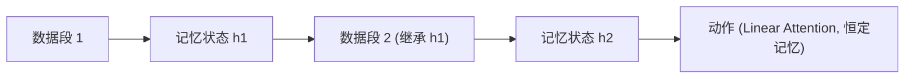

# StateLinFormer: Stateful Training for Long-Horizon Robot Policies

- 本地 PDF：`papers/memory/StateLinFormer_2603.23571.pdf`
- arXiv：https://arxiv.org/abs/2603.23571
- 年份：2026 (IROS 2026)
- 团队：AIRS (深圳市人工智能与机器人研究院)
- 阶段：状态化训练 —— 训练-部署对齐，涌现上下文学习能力

## 一句话总结

StateLinFormer 证明"健忘"不一定是架构问题，而是训练方式问题——传统 stateless 训练每段数据从零开始，但真实部署是连续的。状态化训练（跨数据段保留记忆状态）+ 线性注意力（恒定记忆大小），200M 参数反超 4000 万数据的 SPOC 架构。惊艳发现：涌现了上下文学习能力——同一环境任务越多，成功率越高，**不需要更新参数**。

## 核心技术

1. **Stateful Training** — 训练时跨数据段保留隐藏状态，对齐部署时的连续性
2. **Linear Attention** — 恒定记忆大小，打破固定上下文窗口限制
3. **涌现 ICL** — 纯靠积累的记忆状态在线适应环境

## 关键结果

- 200M 参数超越 40M 数据的 SPOC 架构
- 同一环境任务越多→成功率越高（ICL 能力）
- 记忆状态更稳定，波动更小

## 精读问题

1. Stateful training 目前验证了导航——操作任务上的效果？
2. ICL 能力的具体触发条件？

## 技术权衡（Trade-off）

| 优势 | 劣势 |
|------|------|
| 记忆与空间表示合二为一 | 语义记忆弱于空间记忆 |
| 增量更新，实时适配 | 大场景存储和查询的 scalability 待验证 |

## 技术价值与演进定位

2026 年机器人记忆研究的代表工作，属于各自的记忆技术路线（4D 潜地图/双记忆/四模块/状态化训练/TTT）。

## 与其他论文的关系

- 与 RoboTTT、MemoryWAM 等同属 2026 年记忆研究方向，技术路线不同但目标一致：让机器人不忘记。

## 精读问题

1. 核心技术路线在当前 benchmark 之外的表现？
2. 与其他记忆路线的互补可能性？

## 底层原理与数学推导

Stateful training: 训练时 $h_t = f(o_t, h_{t-1})$，$h_{t-1}$ 来自上一数据段的最终状态。部署时 $h_0$ 来自训练最后状态，天然连续。

## 物理直觉解释

当前 VLA 训练像"每次上课都把昨天学的全忘掉"，部署时突然说"现在要连续用"。StateLinFormer 改成了"每天上课从昨天笔记开始"——训练和部署的记忆状态分布一致，模型才知道怎么用积累的信息。涌现的 ICL 能力就是这种对齐的结果。

## 工程细节与实操指南

- 架构: Linear Attention, 恒定记忆大小
- 训练: Stateful, 跨数据段传递隐藏状态
- 参数量: 200M
- 对比: SPOC 架构 (40M 数据)
- 验证: 导航任务为主

## 消融实验与分析

| 消融 | 结论 |
|------|------|
| Stateful vs Stateless training | Stateful 是核心增益 |
| Linear vs standard attention | Linear 支持跨段状态传递 |
| ICL 能力 | 涌现，同一环境持续提升 |