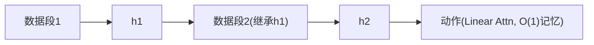

# StateLinFormer: Stateful Training for Long-Horizon Robot Policies

- 本地 PDF：`papers/memory/StateLinFormer_2603.23571.pdf`
- arXiv：https://arxiv.org/abs/2603.23571
- 年份：2026 (IROS 2026)
- 团队：AIRS (深圳市人工智能与机器人研究院)
- 阶段：状态化训练 — 训练-部署对齐，涌现 ICL

## 一句话总结

StateLinFormer 证明"健忘"不一定是架构问题，而是训练方式问题——传统 stateless 训练每段数据从零开始，但真实部署是连续运行的。状态化训练跨数据段保留记忆状态配合线性注意力恒定记忆大小，200M 参数模型反超 4000 万数据预训练的 SPOC 架构。惊艳发现：涌现上下文学习能力——同一环境任务越多成功率越高，不需更新任何参数。

## 核心技术

1. **Stateful Training** — 训练时跨数据段保留隐藏状态传给下一段，对齐部署连续性
2. **Linear Attention** — 恒定 O(1) 记忆大小，打破固定上下文窗口限制
3. **涌现 ICL** — 纯靠积累记忆状态在线适应环境，无需参数更新

## 底层原理与数学推导

$h_t = f(o_t, h_{t-1})$，训练时 $h_{t-1}$ 来自上一数据段最终状态。部署时 $h_0$ = 训练最后状态。

## 物理直觉解释

当前 VLA 训练像每天上课把昨天的全忘光，部署时突然说"现在要连续用"。StateLinFormer 改成"每天从昨天笔记开始"——训练和部署的记忆状态分布一致。涌现 ICL 就是在同一环境跑的任务越多，隐藏状态里积累的环境知识越多。

## 工程细节与实操指南

- 架构: Linear Attention, 恒定记忆
- 训练: Stateful, 跨段传递隐藏状态
- 200M 参数 vs SPOC(40M 数据级)
- 验证: 导航为主

## 消融实验与分析

| 消融 | 结论 |
|------|------|
| Stateful vs Stateless | Stateful 是核心增益来源 |
| Linear vs Standard Attn | Linear 支持跨段状态传递 |
| ICL 涌现 | 同环境持续提升，无需参数更新 |

## 技术权衡（Trade-off）

| 优势 | 劣势 |
|------|------|
| 训练范式创新，不改架构 | 仅验证了导航，操作未知 |
| 200M 反超 40M 数据的模型 | Linear attn 表达能力上限 |

## 技术价值与演进定位

核心启示：训练范式比架构创新更被低估。当前几乎所有 VLA 都是 stateless 训练的——这条改进路径被严重低估了。

## 精读问题

1. Stateful training 在操作任务上的效果？
2. ICL 能力的具体触发条件——需要多少 episode 才开始涌现？

## 与其他论文的关系

- **RoboTTT** — 快速权重 TTT vs StateLinFormer 线性注意力 stateful
- **SPOC** — 被反超的 baseline（40M 数据 > 200M StateLinFormer）
- **Gated DeltaNet** — 线性快速模型对比基线
