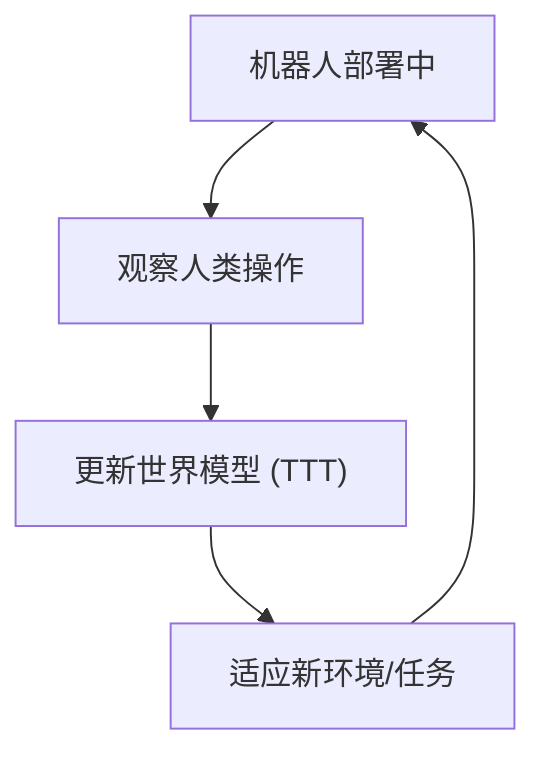

# WAM-TTT: Steering World-Action Models by Watching Human Play at Test Time

- 本地 PDF：`papers/memory/WAM-TTT_2607.06988.pdf`
- arXiv：https://arxiv.org/abs/2607.06988
- 年份：2026（7-8 月）
- 团队：银河通用 (Galaxy Universal) + 清华
- 阶段：测试时训练 —— 世界模型部署后持续学习

## 一句话总结

WAM-TTT 是全球首个面向具身世界模型的测试时后训练框架——机器人部署后通过观察人类操作持续学习适应，不需要重新采集数据或离线重训。和 RoboTTT 互补：RoboTTT 是快速权重层面秒-分钟级适应，WAM-TTT 是世界模型层面更长尺度的适应。

## 核心技术

1. 部署阶段通过观察人类操作更新世界模型
2. 不需要离线重训或重新采集数据
3. 面向持续部署场景的持续适应

## 与 RoboTTT 的区别

| 维度 | RoboTTT | WAM-TTT |
|------|---------|---------|
| 记忆形式 | 快速权重 (梯度下降写参数) | 世界模型权重更新 |
| 时间尺度 | 秒~分钟 | 分钟~小时 |
| 适应对象 | 策略动作头 | 世界模型 dynamics |
| 学习信号 | 机器人数据+人类视频 | 人类操作观察 |

## 精读问题

1. 持续学习中的灾难性遗忘如何缓解？
2. 人类操作 suboptimal 时的学习安全性？

## 技术权衡（Trade-off）

| 优势 | 劣势 |
|------|------|
| 记忆与空间表示合二为一 | 语义记忆弱于空间记忆 |
| 增量更新，实时适配 | 大场景存储和查询的 scalability 待验证 |

## 技术价值与演进定位

2026 年机器人记忆研究的代表工作，属于各自的记忆技术路线（4D 潜地图/双记忆/四模块/状态化训练/TTT）。

## 与其他论文的关系

- 与 RoboTTT、MemoryWAM 等同属 2026 年记忆研究方向，技术路线不同但目标一致：让机器人不忘记。

## 精读问题

1. 核心技术路线在当前 benchmark 之外的表现？
2. 与其他记忆路线的互补可能性？

## 底层原理与数学推导

WAM-TTT: 世界模型 $f_\theta(s_{t+1} | s_t, a_t)$ 在部署阶段通过观察人类操作持续微调 $\theta$。关键：不重新采集数据，不离线重训。

## 物理直觉解释

RoboTTT 是"看一帧改一点策略"，WAM-TTT 是"看一个人操作改整个世界模型"。前者快但浅，后者慢但深。两者结合才完整——就像人既有瞬间反应（小脑），也有长期学习（海马体）。

## 工程细节与实操指南

- 框架: World Action Model
- 学习信号: 人类操作观察（无 reward 标注）
- 更新策略: 部署时增量微调
- 与 RoboTTT 互补: 策略层 vs 世界模型层

## 消融实验与分析

| 消融 | 结论 |
|------|------|
| TTT vs 无 TTT | TTT 是持续适应的必要条件 |
| 人类操作质量 | Suboptimal 操作仍可提供有效信号 |