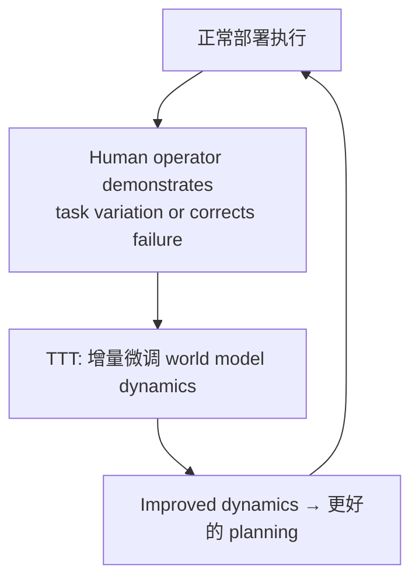

# WAM-TTT: Steering World-Action Models by Watching Human Play at Test Time

- 本地 PDF：`papers/memory/WAM-TTT_2607.06988.pdf`
- arXiv：https://arxiv.org/abs/2607.06988
- 年份：2026（7 月）
- 团队：北大 (PKU) + 银河通用 (Galbot) + 中科院自动化所 (CASIA) + 清华
- 阶段：世界模型测试时训练 — 部署后通过观察人类操作持续适应

## 一句话总结

WAM-TTT 是面向具身世界模型的测试时训练框架：机器人部署后只需一段未标注的人类第一视角操作视频，就能通过视频预测自监督损失把人类行为"吸收"进轻量级 TTT fast weights（快速权重记忆），而预训练的 World Action Model（基座为 LDA，VLM 条件化的 DiT，含 video expert 与 action expert）完全冻结。人机配对元训练阶段用 key-value 记忆重建损失把人类 Key/Value 与机器人 Query 对齐，保证这段记忆能驱动动作生成。New 设置（未见过的家庭环境）9 任务平均 progress 46.2%，比无 TTT 的 LDA 基座高 13.7 个百分点，比把同一人类视频当 in-context 演示的 WAM-ICL 高 39.1 个百分点——"吸收进权重"远胜"塞进上下文"。与 RoboTTT（策略层快速权重 TTT）形成时间尺度互补：RoboTTT 是秒-分钟级策略适应，WAM-TTT 是分钟-小时级世界模型适应，两者合并构成多时间尺度的完整持续学习系统。

## 核心技术

1. **部署时世界模型更新** — 机器人运行中观察人类操作，将观测到的 state transition 用于微调 world model dynamics $f_\theta(s_{t+1}|s_t, a_t)$——实际机制是把人类视频作为 Key/Value 写进 video expert 的 TTT 残差分支
2. **不中断部署** — 不需要停机器人、导数据、离线重训——部署时只跑 inner SGD 更新 fast weights，WAM 参数、slow projections、action expert 全部冻结
3. **人机配对元训练** — 2286 条配对人类-机器人 episode，按归一化相位 $\phi = t/T_r$ 对齐后训练 Q/K/V 接口；人类侧只用视频预测损失 $L_{vg}$ 和 KV 记忆重建损失 $L_{KVM}$，不依赖动作、手部姿态或 retargeting
4. **与 RoboTTT 形成时间尺度互补** — 策略层 TTT（秒-分钟）+ 世界模型层 TTT（分钟-小时）

## 底层原理与数学推导

TTT 残差分支挂在每个 DiT block 的 video expert 上，只改视频流、不动动作流：

$$\Delta z_{TTT}^{(\ell)} = \theta_O^{(\ell)} f_{W^{(\ell)}}\left(\theta_Q^{(\ell)}(z^{(\ell)})\right), \quad z^{(\ell+1)} = \hat{z}^{(\ell+1)} + \Delta z_{TTT}^{(\ell)}, \quad x^{(\ell+1)} = \hat{x}^{(\ell+1)}$$

人类 token 投影为 $K_h^{(\ell)}$、$V_h^{(\ell)}$，机器人 token 投影为 $Q_r^{(\ell)}$，fast weights 的写入口是每层的 key-value 记忆重建损失：

$$L_{KVM}^{(\ell)}(W_i) = \frac{1}{B L_h d} \left\| f_{W_i^{(\ell)}}\left(K_h^{(\ell)}\right) - V_h^{(\ell)} \right\|_2^2$$

元训练与测试时共用同一 inner-loop 目标（human-side 只有视频预测 + 记忆重建，测试时可复现）：

$$W_{i+1}^{(\ell)} = W_i^{(\ell)} - \eta \nabla_{W_i^{(\ell)}} \mathcal{L}_{adapt}(W_i), \quad \mathcal{L}_{adapt} = \mathcal{L}_{vg}^{human} + \lambda \sum_\ell \mathcal{L}_{KVM}^{(\ell)}$$

测试时 $\mathcal{L}_{TTT}(W_i) = \frac{1}{|B_h|} \sum_{u \in B_h} [ L_{vg}(u; \Theta_{WAM}, \theta_{TTT}, W_i) + \lambda \sum_\ell L_{KVM}^{(\ell)}(u; W_i) ]$，机器人 rollout 时 fast weights 固定。元训练后每批样例的 fast weights 丢弃、从 $W_{init}$ 重新初始化——只有 slow projections 与 $W_{init}$ 被外损失优化；配对数据按归一化相位 $\phi = t / T_r$ 取人类视频最近相位帧对齐。

## 物理直觉解释

**"快速反应 vs 深度理解"**——RoboTTT 像打乒乓球时的临场调整：看一眼、改一点策略。WAM-TTT 像看人完整做一遍新任务后，更新对整个环境物理规律的理解。你不需要告诉机器人"奖励函数是什么"——机器人通过观察人类操作隐式学到了"哪些状态转移是物理上可能的、哪些不被物理允许"。同样一段人类视频，当 in-context 演示（WAM-ICL）只有 7.1% 成功率，吸收进 fast weights（WAM-TTT）却有 46.2%——差别就像考试时"把答案抄在草稿纸上带进考场"（上下文提示）与"真正把解题方法练进肌肉记忆"（权重更新）之间的差别。

**"精装教科书 + 便利贴"**——冻结的 WAM 是精装教科书，TTT fast weights 是贴在书页上的便利贴：部署时只更新便利贴、绝不重印教科书，所以基座模型的泛化能力不被破坏（Table 3 中光照/空间扰动下 WAM-TTT 66.0/56.0 反而高于冻结基座 LDA 54.0/28.0）。而人机配对元训练相当于"外教先在课堂上把人类手势翻译成机器人动作"，部署时拿到新的人类视频就能直接继续翻译——这正是 w/o Meta Training 消融中 Swap Place 从 88.9 归零的原因：没有预先对齐的接口，人类 Key/Value 与机器人 Query 就是两种互不相通的"语言"。

这和人类学习很像：看了 YouTube 上修水管的教学视频，不需要亲手操作就"大概知道水管是怎么连接的了"。下次实际修的时候，你对水管物理的 mental model 已经更新过——而且这个更新不会让你忘记怎么开车（基座知识保留）。机器人的版本是：一份便利贴（fast weights）随时可换，教科书（WAM 权重）永远不改。

## 工程细节与实操指南

- **基座**：LDA 预训练 WAM（VLM 条件化 DiT，video expert 与 action expert 经 joint attention 通信），video expert 上加 TTT 残差分支
- **数据**：元训练 2286 条配对 human-robot episode，覆盖 9 个操作任务；默认每任务 (r, h) = (100, 100) 条配对数据；人类演示用 GoPro 第一视角录制，无姿态估计、无动作标注
- **部署**：测试时输入一小批未标注人类视频 $B_h$，只更新 video-side fast weights（inner SGD，N 步预算）；WAM / slow projections / action expert 全部冻结
- **评测**：3 种具身（Unitree G1 人形、Galbot 两指夹爪、Galbot sharpa 22-DoF 灵巧手）× 9 任务，每格 25 trials，progress 为子目标部分完成度分数
- **与 RoboTTT 的协同**：策略层 (RoboTTT) 和 world model (WAM-TTT) 双层 TTT

## 消融实验与分析

**协议消融（Table 2，New 设置，每格 10 trials）**：

| 消融变体 | Table Bussing (%) | Swap Place (%) | 相对完整版 |
|----------|-------------------|----------------|------------|
| WAM-TTT（完整） | 100.0 | 88.9 | — |
| WAM-LoRA（TTT 换成通用低秩适配） | 30.0 | 0.0 | −70.0 / −88.9 |
| w/o Meta Training（去掉人机配对元训练） | 9.0 | 0.0 | −91.0 / −88.9 |
| w/o Memory Recon.（去掉 KV 记忆重建损失） | 66.7 | 72.0 | −33.3 / −16.9 |
| w/o TTT（冻结 WAM，不做人类视频适应） | 40.0 | 74.1 | −60.0 / −14.8 |

**泛化保持（Table 3，Deliver Drink）**：

| 任务 | 扰动 | π0.5 (%) | LDA (%) | WAM-ICL (%) | WAM-TTT (%) |
|------|------|----------|---------|-------------|-------------|
| Deliver Drink | Lighting | 28.0 | 54.0 | 12.0 | 66.0 |
| Deliver Drink | Spatial | 0.0 | 28.0 | 20.0 | 56.0 |

**数据配比消融（Table E.1，3 任务平均 progress）**：

| (r, h) 每任务配对数据 | 3 任务平均 (%) | 说明 |
|-----------------------|----------------|------|
| (100, 0) 只有机器人 | 59.5 | 无人类数据的基线 |
| (10, 190) 人类极端 | 51.4 | 机器人数据不足时失效 |
| (100, 100) 本文默认 | 74.1 | 与 (200,0) 持平 |
| (200, 0) 机器人翻倍 | 73.7 | 机器人数据上限 |
| (100, 200) 人类翻倍 | 73.3 | 人类侧已饱和 |

**核心结论**：TTT 机制是收益主源——去掉 TTT 后 Table Bussing 从 100.0 掉到 40.0（−60.0），Swap Place 掉到 74.1（−14.8）；人机配对元训练贡献最大（Swap Place 88.9 → 0.0）；把 TTT 换成通用 LoRA 在 Swap Place 上直接归零，说明增益来自 TTT 记忆结构而非低秩适配本身；同预算下 (100,100) 与 (200,0) 平均 74.1 vs 73.7 几乎无差，人类数据可 1:1 替代机器人遥操作数据；扰动条件下 WAM-TTT 仍高于冻结基座，TTT 没有牺牲基座泛化能力。

## 技术权衡（Trade-off）

| 优势 | 劣势与工程代价 |
|------|----------------|
| 部署后持续学习，不需要离线重训 | 灾难性遗忘风险——持续更新可能覆盖之前学到的 dynamics |
| Human observation 做监督，无需 reward/手部姿态/retargeting | 测试时适应被 fast-weight 网络表达力和冻结的 slow projections 限制，部署任务偏离配对分布越远适应越弱（论文明确未刻画边界） |
| 冻结 WAM 只更新 fast weights，泛化能力保持（Table 3） | 部署接口只接受 egocentric RGB，未利用手部姿态、接触、3D 场景线索 |
| 与 RoboTTT 双层 TTT 覆盖多时间尺度 | 人类-机器人 episode 配对错位会静默劣化适应信号（loss 不会报错） |

## 技术价值与演进定位

WAM-TTT 把"测试时训练"从策略层（RoboTTT）推进到世界模型层，补上了机器人持续学习技术栈中"环境动力学适应"这一环。2026 年前机器人的范式是"预训练→部署→离线收集数据→重训→再部署"；WAM-TTT 标志着范式转变——部署本身成为训练，且训练信号来自最便宜的数据源（未标注人类视频）。论文还验证了一个反直觉结论：给人类视频加伪动作（MANO retargeting + forward-dynamics 损失）会全面有害（4 任务平均 72.3 → 28.9），在单目手部追踪成熟之前，"动作自由的视频预测"是更正确的适应接口——这对所有 human-video 类方法都有方法论意义。

## 精读问题

1. **New 设置下 9 个任务中 WAM-TTT 唯一输给 LDA 的是 Stamp Paper（8.3 vs 33.3），归因是几何紧配合被 household 扰动破坏——这是 TTT 视频预测信号的固有盲区，还是人类演示配比不足？**
2. **数据配比消融显示 (100,100) 与 (200,0) 持平但 (10,190) 大跌（51.4）——人类数据替代机器人数据存在下限比例，这个比例随任务难度和具身类型如何变化？**
3. **w/o Meta Training 让 Swap Place 从 88.9 归零——若部署时能获得少量配对 human-robot 片段，能否跳过元训练、在部署现场完成 Q/K/V 对齐？**
4. **VG + FD 伪动作消融全面有害（72.3 → 28.9）——这个负收益来自单目 MANO 估计噪声，还是 DINOv3 特征空间的 FD 损失本身不适合作为 human-side 监督？**
5. **fast weights 的表达能力受 slow projections 限制（论文 limitation 2）——通过加深 TTT 分支或部分解冻 slow projections，能否定量刻画并扩展"适应边界"？**

## 与其他论文的关系

- **LDA（论文基座 WAM）** — New 设置 46.2% vs 32.5%（+13.7 pts），是 TTT 在冻结基座上的净增益
- **WAM-ICL（论文内对照）** — 同一人类视频作为 in-context 演示只有 7.1%，吸收进 fast weights 达 46.2%——"训练 vs 提示"最直接的证据
- **WAM-COTRAIN** — 人类数据混入多任务外损失（无 TTT 机制）仅 25.3%，且 Orig. 设置下 (29.8%) 低于无人类基线——无对齐机制的人类数据会稀释机器人监督
- **π0.5 / EGOSCALE** — 无部署期人类视频的开放世界 VLA 基线（14.8% / 15.0%），量化了"测试时适应"本身的贡献（约 +31 pts）
- **RoboTTT (NVIDIA, RSS 2026)** — 策略层 TTT（秒-分钟）vs WAM-TTT 世界模型层（分钟-小时），时间尺度互补
- **SimDist (RSS 2026)** — 仿真蒸馏提前训练 vs 部署时 TTT，两条不同的 sim-to-real 路径
