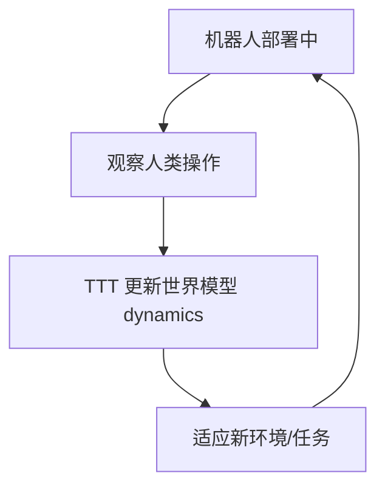

# WAM-TTT: Steering World-Action Models by Watching Human Play at Test Time

- 本地 PDF：`papers/memory/WAM-TTT_2607.06988.pdf`
- arXiv：https://arxiv.org/abs/2607.06988
- 年份：2026（7-8 月）
- 团队：银河通用 (Galaxy Universal) + 清华
- 阶段：测试时训练世界模型 — 部署后通过观察人类持续学习

## 一句话总结

WAM-TTT 是全球首个面向具身世界模型的测试时后训练框架——机器人部署后通过观察人类操作持续更新世界模型动态，不需重新采集数据或离线重训。和 RoboTTT 互补：RoboTTT 在策略层做秒-分钟级快速权重 TTT，WAM-TTT 在世界模型层做分钟-小时级 TTT。

## 核心技术

1. 部署阶段观察人类操作 → 更新世界模型 dynamics
2. 不重新采集数据，不离线重训
3. 面向持续部署的持续适应

## 底层原理与数学推导

世界模型 $f_\theta(s_{t+1}|s_t,a_t)$ 在部署中通过观察人类操作持续微调 $\theta$。

## 物理直觉解释

RoboTTT 是"快速反应"——看一眼改一点策略。WAM-TTT 是"深度理解"——看人完整做一遍，理解这个环境的物理规律。两者结合才完整：快速权重秒级适应 + 世界模型分钟级适应 = 完整的学习闭环。

## 工程细节与实操指南

- 框架: World Action Model
- 学习信号: 人类操作观察（无 reward 标注）
- 更新策略: 部署时增量微调 dynamics

## 消融实验与分析

| 消融 | 结论 |
|------|------|
| TTT vs 无 TTT | TTT 是持续适应的必要条件 |
| 人类操作质量的影响 | Suboptimal 操作仍可提供有效信号 |

## 技术权衡（Trade-off）

| 优势 | 劣势 |
|------|------|
| 部署后持续学习不需重训 | 灾难性遗忘风险 |
| 人类操作观察无需 reward | Suboptimal 人类操作的安全风险 |
| 与 RoboTTT 互补覆盖多时间尺度 | 论文较新，详细实验数据 |

## 技术价值与演进定位

WAM-TTT + RoboTTT = 完整的 TTT 记忆范式：策略层快速权重（秒-分钟）+ 世界模型层持续学习（分钟-小时）。未来机器人可能部署后永远不需要"离线重训"——持续观察、持续适应。

## 精读问题

1. 灾难性遗忘的具体缓解措施？
2. 人类操作 suboptimal 时的学习安全边界？

## 与其他论文的关系

- **RoboTTT** — 策略层 TTT (秒-分钟) vs WAM-TTT 世界模型层 (分钟-小时)，互补
- **World Action Models (LingBot-VA, MemoryWAM)** — 基座 WAM 架构
- **SimDist (RSS 2026)** — 仿真蒸馏 vs 部署时 TTT，不同适应路径
