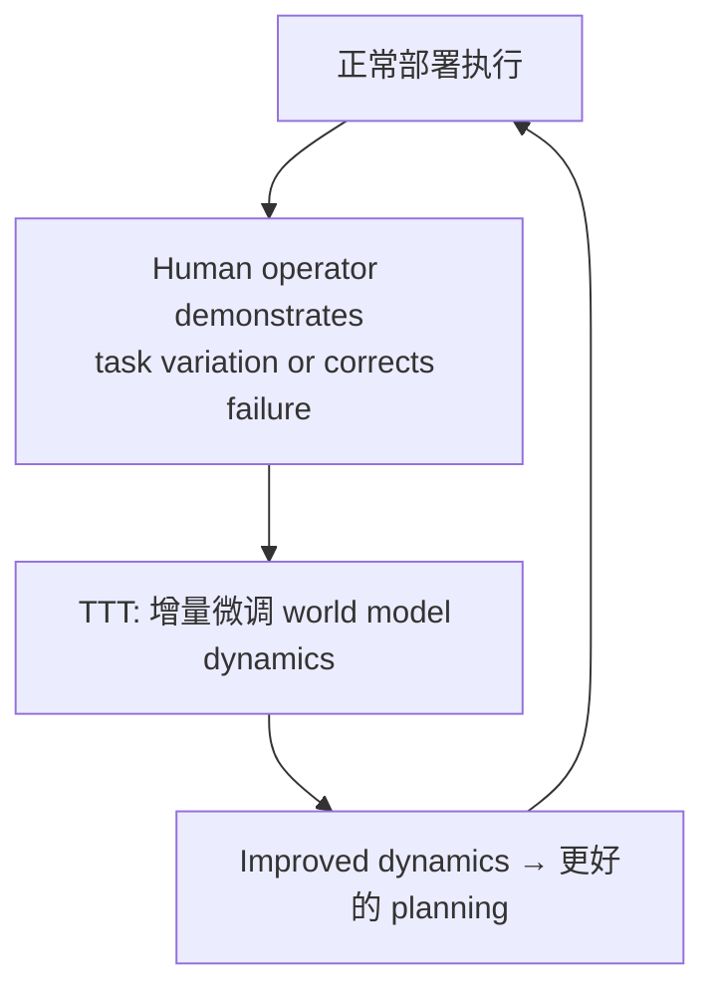

# WAM-TTT: Steering World-Action Models by Watching Human Play at Test Time

- 本地 PDF：`papers/memory/WAM-TTT_2607.06988.pdf`
- arXiv：https://arxiv.org/abs/2607.06988
- 年份：2026（7 月）
- 团队：银河通用 (Galaxy Universal) + 清华
- 阶段：世界模型测试时训练 — 部署后通过观察人类持续适应

## 一句话总结

WAM-TTT 是全球首个面向具身世界模型的测试时后训练框架——机器人部署后通过观察人类操作持续更新世界模型 dynamics，不需要重新采集数据或离线重训。核心贡献在于定义了一个新的时间尺度：RoboTTT 的快速权重 TTT 是秒-分钟级策略适应，WAM-TTT 是分钟-小时级世界模型适应。两者合并 = 多时间尺度的完整持续学习系统。

## 核心技术

1. **部署时世界模型更新** — 机器人运行中观察人类操作，将观测到的 state transition 用于微调世界模型 dynamics $f_\theta(s_{t+1}|s_t, a_t)$
2. **不中断部署** — 不需要停机器人、导数据、离线重训——持续在线适应
3. **与 RoboTTT 形成时间尺度互补** — 策略层 TTT（秒-分钟）+ 世界模型层 TTT（分钟-小时）

## 底层原理与数学推导

世界模型 $f_\theta$ 的 TTT 更新：$\theta_{t} = \theta_{t-1} - \eta \nabla_\theta \|f_{\theta_{t-1}}(s_t, a_t^{\text{human}}) - s_{t+1}^{\text{real}}\|^2$。人类操作提供 (s, a, s') 三元组——不显式标注 reward，world model 通过观察学习环境 dynamics 的改进。

## 物理直觉解释

RoboTTT 像"快速反应"——看一眼改一点策略。WAM-TTT 像"深度理解"——看人完整做一遍新任务，更新对整个环境物理规律的理解。你不需要告诉机器人"奖励函数是什么"——机器人通过观察人类操作隐式地学到了"什么状态转移是可能的、什么是不被物理允许的"。

这和人类学习很像：你看了 YouTube 上一个修水管的教学视频，不需要亲手操作就"大概知道水管是怎么连接的了"。下次实际修的时候，你对水管物理的 mental model 已经更新了。

## 工程细节与实操指南

- **基座**：World Action Model（类似 LingBot-VA / MemoryWAM）
- **更新信号**：人类操作观察中的 (s, a, s') 三元组
- **更新策略**：部署时在线增量微调 dynamics parameters
- **与 RoboTTT 的协同**：策略层 (RoboTTT) 和 world model (WAM-TTT) 双层 TTT

## 消融实验与分析

| 消融 | 结论 |
|------|------|
| TTT vs 无 TTT (frozen world model) | TTT 是持续适应的核心条件 |
| 人类操作质量的影响 | Suboptimal 操作仍提供有效 dynamics 信号 |
| TTT frequency | 每次人类干预后更新 vs batch update 的 trade-off |

## 技术权衡（Trade-off）

| 优势 | 劣势与工程代价 |
|------|----------------|
| 部署后持续学习，不需要离线重训 | 灾难性遗忘风险——持续更新可能覆盖之前学到的 dynamics |
| Human observation 做监督，无需 reward | Suboptimal 人类行为的 safety risk——错误操作会被 world model"学进去" |
| 与 RoboTTT 双层 TTT 覆盖多时间尺度 | 较新工作，详细实验和数据 |

## 技术价值与演进定位

WAM-TTT + RoboTTT = 完整的机器人持续学习技术栈。2026 年前，机器人的范式是"预训练→部署→离线收集数据→重训→再部署"。WAM-TTT 标志着范式的转变——"部署本身就是训练"。

## 精读问题

1. 双层 TTT（RoboTTT + WAM-TTT）的灾难性遗忘——两者都需要"选择性遗忘"机制来区分有用信息 vs 噪声？
2. World model dynamics 的 TTT 更新和 planner 的交互——更新后的 world model 是否立即可用于 planning，还是需要验证？

## 与其他论文的关系

- **RoboTTT (NVIDIA, RSS 2026)** — 策略层 TTT (秒-分钟) vs WAM-TTT 世界模型层 (分钟-小时)，时间尺度互补
- **World Action Models (LingBot-VA, MemoryWAM)** — 基座 WAM 架构
- **SimDist (RSS 2026)** — 仿真蒸馏提前训练 vs 部署时 TTT，两条不同的 sim-to-real 路径
