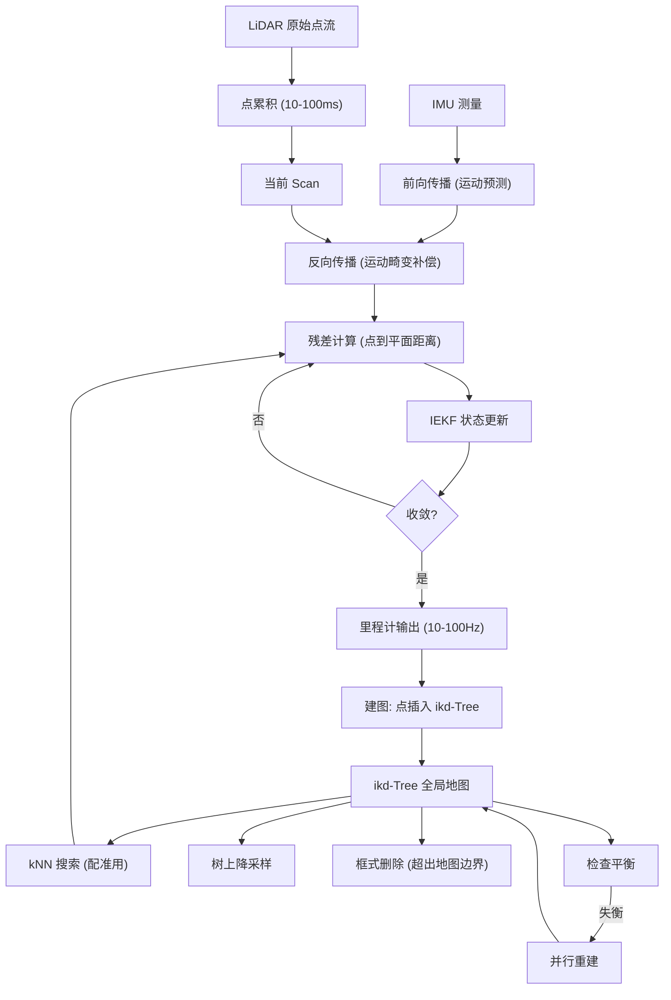

# FAST-LIO2: Fast Direct LiDAR-Inertial Odometry

- 本地 PDF：`papers/perception/FAST-LIO2_2107.06829.pdf`
- arXiv：https://arxiv.org/abs/2107.06829
- 代码：https://github.com/hku-mars/FAST_LIO
- 年份：2022 (IEEE T-RO)
- 团队：HKU Mars Lab (Wei Xu, Yixi Cai, Dongjiao He, Jiarong Lin, Fu Zhang)
- 阶段：LiDAR-惯导里程计 —— 紧耦合迭代卡尔曼滤波 + 直接点云配准 + ikd-Tree

## 一句话总结

FAST-LIO2 提出了一种快速、鲁棒的 LiDAR-inertial 里程计框架。相比传统方法提取特征点再配准，它直接将原始点云注册到地图上（direct method），配合增量 k-d 树（ikd-Tree）实现高效的增量建图和 100Hz 实时运行，在 19 个公开数据集序列上精度超越 SOTA 且计算量显著更低。

## 核心技术

1. **直接原始点配准 (Direct Raw Point Registration)** — 不提取边缘/平面特征点，直接将每个 LiDAR 点注册到地图中的局部平面。避免了手工特征提取模块的参数调优，天然适配不同扫描模式（旋转式、固态式）
2. **紧耦合迭代卡尔曼滤波 (Tightly-Coupled Iterated Kalman Filter)** — 继承 FAST-LIO 的滤波框架：IMU 前向传播补偿运动畸变（back-propagation）+ 流形上迭代更新状态 + 等价 Kalman 增益公式将计算复杂度从测量维度降至状态维度
3. **ikd-Tree (Incremental k-d Tree)** — 全新的增量 k-d 树数据结构：支持高效点插入、树上降采样、框式删除、动态重平衡，并行重建避免主线程延迟
4. **在线 LiDAR-IMU 外参标定** — FAST-LIO2 在滤波框架中同时估计 LiDAR-IMU 的外参

## 底层原理与数学推导

### 系统架构

### 状态估计

**状态向量**（流形上）：
$$x = [^G R_I^T, ^G p_I^T, ^G v_I^T, b_\omega^T, b_a^T, ^I R_L^T, ^I p_L^T]^T$$

包含 IMU 位姿（旋转、平移、速度）、IMU bias（陀螺仪 + 加速度计）、LiDAR-IMU 外参。

**前向传播**：连续时间 IMU 运动学模型驱动状态预测：
$$\dot{^G R_I} = {}^G R_I \lfloor \omega_m - b_\omega - n_\omega \rfloor_\times, \quad \dot{^G p_I} = {}^G v_I, \quad \dot{^G v_I} = {}^G R_I (a_m - b_a - n_a) + {}^G g$$

**反向传播**：补偿 LiDAR 扫描内各点的运动畸变。利用 IMU 高频测量（~200Hz），在 scan 的结束时刻和每个点的采样时刻之间做反向积分，精确推算每个点采样时的 IMU 位姿。

**迭代状态更新**：点到平面残差：
$$z_j^\kappa = u_j^T\left({}^{G_k}p_j - {}^{G_k}q_j\right)$$

其中 $u_j$ 是地图中对应平面的法向量，$q_j$ 是地图中的平面点。Kalman 增益的等价公式（核心加速）：
$$K = (H^T R^{-1} H + P^{-1})^{-1} H^T R^{-1} \approx P H^T (H P H^T + R)^{-1}$$

原始公式的计算复杂度为 $O(m^3)$（$m$ 为测量维度），等价公式降为 $O(d^3)$（$d$ 为状态维度，$d=18$，$m$ 可到几千）。

### ikd-Tree 数据结构

核心操作及复杂度：

| 操作 | 复杂度 | 实现 |
|------|--------|------|
| 点插入 | $O(\log n)$ | 递归下降到达叶节点，插入新点 |
| 树上降采样 | $O(n)$ | 遍历叶节点，合并近邻点 |
| 框式删除 | $O(\log n)$ | 维护 range info + lazy label，被标"删除"的点在重建时被移除 |
| 动态重平衡 | $O(\log n)$（均摊） | Scapegoat tree 机制：检测子树不平衡→并行重建该子树 |

与 octree / R*-tree / nanoflann k-d tree 对比：ikd-Tree 在所有关键操作上综合最优，尤其支持树上降采样（其他结构需先导出点云再降采样再重建）。

## 物理直觉解释

FAST-LIO2 可以这样理解：**LiDAR 是"眼睛"，IMU 是"内耳"**。

- IMU 每秒测 200 次加速度和角速度，在 LiDAR 两帧之间（100ms）提供了 20 次高频姿态更新——就像内耳的平衡感让你知道自己在转圈，即使闭着眼睛
- LiDAR 的每一帧激光束在不同时刻发射（不是瞬间拍一张照），IMU 反向传播补偿了这个"卷帘快门"效应——就像你知道自己在旋转时拍照，照片里每个像素的拍摄时间不同，需要用旋转速度把每个像素"校正"回去
- Direct method 不提取特征点——传统方法只挑出"边角"和"平面"这些容易匹配的点，弱纹理环境下就会退化（就像在白色房间里找不到拐角会迷路）。FAST-LIO2 用所有点，每个点都能找到它在环境中的对应平面，信息量远大于特征点方法

ikd-Tree 的直觉：SLAM 需要一边建图一边查图——就像你一边画地图一边在地图上定位自己。普通 k-d 树每加几个新点就要重建一次（卡顿），ikd-Tree 支持"边用边改"，在保证查询效率的同时几乎不卡顿。

## 工程细节与实操指南

- **点累积**：10-100ms 的 LiDAR 点累积为一个 scan（对应 100Hz-10Hz 的里程计频率）
- **地图大小**：维护一个大立方体区域内的点（如边长 1000m），超出边界的点被框式删除
- **IMU 反向传播**：从 scan 结束时间反向积分到每个点的采样时间——这是实时的，不需要离线处理
- **Kalman 增益加速公式**：将 $m \times m$ 矩阵求逆降为 $d \times d$（$d=18$, $m$ 与点数成正比可达数千），是支持 100Hz 的关键
- **并行重建**：ikd-Tree 检测到某子树不平衡时，在独立线程中重建该子树，主线程不受影响
- **多平台适配**：Intel i7（UAV 机载电脑）和 ARM 处理器均可运行，代码开源
- **激光雷达兼容性**：机械旋转式（Velodyne, Hesai）、固态式（Livox）均可，不需要改动特征提取参数

## 消融实验与分析

| 消融因子 | 变化 | 结论 |
|---------|------|------|
| Direct vs Feature-based | raw points vs Loam feature | Direct 在弱纹理/小 FoV 场景下精度显著更高 |
| ikd-Tree vs static k-d tree | incremental vs rebuild each scan | ikd-Tree 使 100Hz 建图成为可能，static 无法实时 |
| 有/无反向传播 | back-propagation on vs off | 反向传播在高动态运动下补偿畸变，精度提升明显 |
| ikd-Tree vs octree | 不同动态数据结构 | ikd-Tree 在插入/查询/删除综合性能上最优 |
| 迭代次数 | 1 vs 3 vs 5 iterations | 3-5 次迭代收敛，更多无明显增益 |

**核心结论**：Direct registration 和 ikd-Tree 是两个独立的关键贡献——前者提升精度和鲁棒性，后者提供计算效率使实时运行成为可能。二者缺一不可。

## 技术权衡（Trade-off）

| 优势 | 劣势与工程代价 |
|------|----------------|
| 直接原始点配准，不需要调特征提取参数 | 原始点数量巨大（每帧可达数万点），依赖 ikd-Tree 的效率 |
| 紧耦合 IEKF 100Hz 实时 | 滤波方法（非全局优化）仍有累积漂移，需外部回环检测 |
| ikd-Tree 支持增量更新和动态重平衡 | 并行重建增加了线程同步复杂度 |
| 适配多种 LiDAR 和嵌入式平台 | 对 IMU 质量有一定要求（需足够高频和低噪声） |
| 开源代码成熟 | 主要针对 LiDAR 平台，不直接支持纯视觉 |

## 技术价值与演进定位

FAST-LIO2 是 LiDAR-inertial 里程计的标杆工作之一，核心贡献在两点：(1) 证明了 direct raw point registration 相比 feature-based 方法的精度和泛化优势；(2) ikd-Tree 数据结构解决了实时增量建图中"建索引"和"查索引"的矛盾。后续工作（FAST-LIVO、R3LIVE 等）在其基础上加入了视觉和辐射场重建，但里程计核心仍是 FAST-LIO2 的框架。

对机器人操作相关工作的意义：FAST-LIO2 是目前最成熟的实时 LiDAR SLAM 方案之一，适用于机器狗移动平台的定位建图模块。

## 与其他论文的关系

- **FAST-LIO** — 前身，使用特征点 + 静态 k-d 树，仅适用于小场景。FAST-LIO2 用 raw points + ikd-Tree 突破规模限制
- **LIO-SAM** — 因子图优化的 LiDAR-inertial SLAM，全局一致性更好但计算更重；FAST-LIO2 滤波框架更实时
- **LOAM / LeGO-LOAM** — 经典特征点 LiDAR odometry，FAST-LIO2 的 direct method 在精度和鲁棒性上超越
- **R3LIVE** — 同 lab 后续工作，加入视觉-惯性-激光雷达融合和辐射场重建

## 精读问题

1. Direct raw point registration 在缺少局部平面结构的环境（如空旷草地）下如何工作？每个点假设落在局部平面上是否在非平面环境（如植被）中失效？
2. ikd-Tree 的点删除使用 lazy label——被标记为"删除"的点何时真正释放内存？长时间运行内存增长风险？
3. 滤波方法累积漂移量的定量分析：在无回环检测下，漂移率 (drift rate) 是多少？与场景大小和运动模式的关系？
4. Livox 固态雷达的 non-repetitive 扫描模式对 kNN 搜索的均匀性有什么影响？
