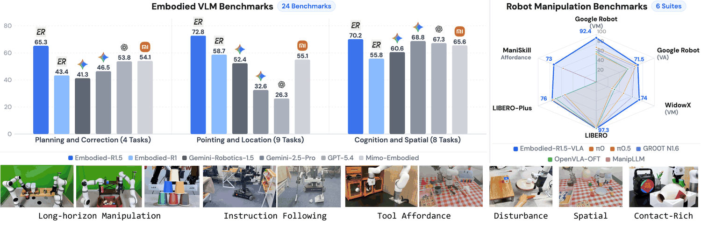
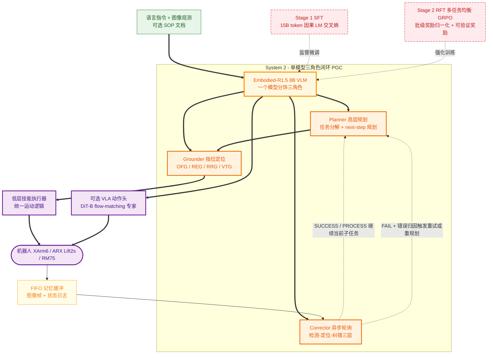

# Evolving Physical Intelligence via Embodied Foundation Models (Embodied-R1.5)

- arXiv: https://arxiv.org/abs/2606.11324
- Source: https://arxiv.org/abs/2606.11324
- Project: https://embodied-r.github.io
- Local PDF: `/Users/luogu/physical_intelligence/papers/reasoning/Embodied_R1.5_2606.11324.pdf`
- Year: 2026
- Category: unified embodied foundation model / reasoning+grounding+control
- Priority: high

## 一句话总结

（Problem）具身能力碎片化、多任务训练相互干扰、缺少长程闭环验证 →（Insight）认知/规划纠错/指位三类能力可在单一 8B VLM 内统一，且内部化的具身推理可大幅降低下游动作数据需求 →（Mechanism）15B token 三管线数据 + SFT/多任务均衡 RFT + Planner-Grounder-Corrector 单模型闭环 →（Evidence）24 个具身 VLM 基准中 16 个 SOTA（21 个主基准平均 70.4%，超 Gemini-Robotics-ER-1.5 17.0pp）；无动作预训练的 VLA 在 SimplerEnv-GR(VM) 达 92.4%（π0.5 为 72.7%）；真机零样本 5 类任务 4 项领先（Cup Disassembly 66.6% vs 基线全 0）。

## 九问速览

1. **Problem**：现有具身模型各自只覆盖认知/规划/grounding 一角，多任务联合训练冲突严重，且未在长程真机闭环中验证。
2. **Bottleneck**：异构输出（长文本推理、坐标、轨迹）导致联合训练收敛困难；能力间相互侵蚀。
3. **Insight**：三类能力是同一具身推理链的不同抽象层，统一后信息可自由流动；强具身骨干能替代动作数据规模。
4. **Method**：Qwen3-VL-8B 全参 SFT（15B token）+ 多任务均衡 GRPO 变体 RFT；PGC 单模型闭环执行。
5. **Evidence**（带关键数字）：16/24 基准 SOTA；RoboFAC 77.2%（+24.0pp vs Gemini-ER-1.5）；Part-Afford 82.9%；LIBERO 97.3% 无预训练即超 OpenVLA-OFT 97.1%。
6. **Ablation**：RFT 相对 SFT 在 Pointing +3.8pp；完整 RL 配方优于 vanilla/EMA-GRPO；ER1.5 骨干使 GR00T 头 10K 步即达 92.0%（Qwen3-VL 骨干 82.0%）。
7. **Assumption**：坐标可作为纯文本符号被反复引用；2D 指位+低层技能执行器足以支撑多数桌面操作。
8. **Failure**：Door Open 真机仅 16.6%（3D 轨迹推理仍弱）；2D 输入在遮挡/杂乱场景受限（作者自述）。
9. **Opportunity**：原生 3D 感知、推理 token 与动作生成 tighter coupling、PGC 扩展到移动操作与导航。

| 维度 | 论文答案 |
|---|---|
| Perception | 单图/多图/视频输入，纯文本 token 输出坐标（归一化 [0,1000]）；无点云/深度原生输入 |
| Closed-loop | PGC：Planner 每子任务后 next-step 规划，Corrector 异步轮询（SUCCESS/PROCESS/FAIL），FIFO 记忆缓冲 |
| Correction | 检测→定位→纠错三层能力（ER1.5-Correction ~800K 样本训练），失败触发重试/重规划，人类扰动下自主恢复 |
| Deployment | XArm6、ARX Lift2s、Realman RM75 真机零样本部署；同一 8B 模型异步服务三个角色 |

## 核心技术

信息流拆解（Input→Representation→Decision→Action→Training Signal）：

*论文 Figure 1（p1）：Figure 1 Performance overview of Embodied-R1.5. Top: Performance across 24 embodied VLM benchmarks (*

- **Input**：语言指令 + 图像观测（单图/多图/视频），可选外部上下文（任务 SOP 文档）；坐标归一化到 [0,1000] 的纯文本序列。
- **Representation**：Qwen3-VL-8B-Instruct 统一 Transformer，所有异构能力（自然语言推理、点坐标、轨迹序列）统一为 token 序列；坐标作为可引用符号在多步推理中保持视觉锚定。
- **Decision**：三类能力维度——认知与空间推理（空间关系/度量/3D 感知/场景认知）、规划与纠错（分解/下一步规划/过程检测/错误定位/纠错）、指位与定位（REG/RRG/OFG/VTG，VTG 含物体流与末端流、2D 与 3D）。
- **Action**：两条路径。(a) PGC：指位输出 → 低层技能执行器（unified motion logic）执行；(b) VLA 扩展：DiT-B flow-matching action expert，以 VLM 中间层 hidden states（2048 维）作 cross-attention 上下文 + 32 个可学习 future query tokens，生成 7 维连续动作块（action chunking）。
- **Training Signal**：Stage 1 SFT 用标准 causal LM 目标；Stage 2 RFT 用可验证奖励（5 族奖励函数 + format 奖励）的多任务均衡 GRPO。

**训练/冻结情况**：Qwen3-VL-8B 骨干 + 视觉编码器全程联合训练（不冻结，因具身场景视觉分布与通用预训练差异大）；VLA 动作头为新附加组件。DINO/MoGe-2/Grounded-SAM 等仅用于离线数据管线，不进模型。

**Loss**：SFT 为 token 级交叉熵；RFT 为 GRPO clipped surrogate + KL-in-reward 惩罚（K1 无偏估计，β=0.01），奖励 = (1−λ)·R_acc + λ·R_fmt（λ=0.1）。

## 底层原理与数学推导

**1. 分段线性衰减奖励框架**（§4.2.2, Eq.1）。所有连续值奖励（点距离、轨迹 RMSE、深度 MAE）统一用距离度量 d 与阈值对 (τp, τz)：

$$
\varphi(d;\ \tau_p,\ \tau_z) = \mathrm{clip}\!\left(\frac{\tau_z - d}{\tau_z - \tau_p},\ 0,\ 1\right)
$$

d < τp 给满额 1 分，d ≥ τz 给 0 分，中间线性衰减。具体实例化：点定位 R = φ(d_nn; 40, 150)（平均最近邻距离）；2D 轨迹 R_2D = φ(RMSE_2D; 50, 120)；3D 深度 R_depth = φ(MAE_d; 0.1, 0.4)，3D 轨迹奖励 R = 0.5·R_2D + 0.5·R_depth。点数不匹配罚 δc = 0.3，轨迹长度不匹配罚 δl = 0.35，单点输出直接 0 分以防 reward hacking。该设计为 RL 提供稠密部分信用，规避二值奖励的稀疏性。

**2. 全局批级奖励归一化（核心 novelty 之一）**（§4.2.1）。标准 GRPO 按组内 std 归一化，无法消除跨任务奖励尺度差异；EMA-GRPO 按任务维护滑动平均，低资源任务统计不稳定。本文改为：

$$
\hat{A}_i = \frac{R_i - \mu_{\text{group}}}{\sigma_{\text{batch}} + \epsilon}
$$

组内均值 μ_group 保留组内相对排序（哪个 rollout 更好），批级 std σ_batch 统一跨任务梯度幅度，且无需任务标签与历史状态。配套两个策略：难度感知数据过滤（按 SFT checkpoint 的 rollout 通过率筛出 ~200K 中等难度样本）与动态过滤（整组奖励相同则掩码，不产生梯度）。

**3. 组合奖励**（§4.2.2, Eq.2）：

$$
R = (1-\lambda)\,R_{\text{acc}} + \lambda\,R_{\text{fmt}},\qquad \lambda = 0.1
$$

R_acc 为五族任务奖励之一（exact-match / IoU / point-distance / trajectory-RMSE / Skywork-Reward-V2-Qwen3-4B 语义相似度经 sigmoid 温度归一），R_fmt 为二值格式奖励（<answer> 标签 + 任务特定结构，如 point_2d 须为二元数值列表）。

**4. 数据管线的 3D 提升**（附录 B.1, Eq.3）。单目度量深度反投影生成结构化 3D 场景图，支撑 ER1.5-Spatial 程序化 QA：

$$
p^c = D_i(u,v)\cdot K_i^{-1}[u, v, 1]^{\top}
$$

配合 RANSAC 主平面法向估计（法向量点积 > 0.996 即内点，K=100 次迭代，内点率 < 30% 弃场景）与桌面 z=0 对齐（bbox 底部 z 距 0 超 7cm 即剔除），保证度量 QA 的几何一致性。

## 物理直觉解释

**类比：一位随身带着「可写字坐标卡片」的总工程师。** 传统具身模型把认知、规划、指位拆给不同子模型，像设计院、施工队、质检员各拿各的图纸，交接时信息层层丢失；Embodied-R1.5 让同一个 8B 模型在同一张「草稿纸」（token 序列）上写推理链、画坐标、标轨迹，坐标一旦写下就成为可被后续步骤反复引用的符号。这就是「坐标作为符号」的物理意义——机械臂在多步操作中最怕的不是单步不准，而是第一步的抓取点在第三步的放置推理中「被遗忘」，符号化的坐标让空间锚定贯穿全程，PGC 闭环里 Corrector 之所以能精准归因错误，正是因为它能直接读到 Planner 当初写下的计划与 Grounder 写下的坐标。

**类比：先内功后招式——把「动作数据 Scaling」换成「推理内化」。** 主流 VLA 路线（π0/π0.5、OpenVLA 系）赌的是大规模动作预训练；本文赌的是相反方向：当 VLM 已经真正理解「杯子在盘子左边 10cm、把手朝外应该从哪抓」，剩下的只是把已理解的意图映射为连续动作，这个映射很轻。证据是 LIBERO 上不用任何动作预训练就拿到 97.3%（超预训练的 OpenVLA-OFT 97.1%），且 10K 步即达 92.0%（基线骨干 82.0%）——像一个先学会力学的人学开叉车，比死记一万次操作录像的人上手快得多。这解释了为何 ER1.5-Spatial 只有 ~20K 样本却杠杆巨大：它改变的是「理解」而非「模仿」。

**类比：给机器人装一个「质检员 + 三层纠错反射」。** 真机长程任务（奶茶 10 步）的失败不是平均分布的，而是「抓滑了、放偏了、漏了一步」这样的局部事件；ER1.5-Correction 用 ~800K 样本（其中 BridgeData 贡献 ~802K 中的绝大部分，经 19 个 QA 子类型扰动生成）把纠错拆成检测（有没有错）→定位（错在哪一步、哪类错）→纠错（怎么改）三层，再用五种计划扰动算子（漏步/冗余/交换/换物体/换动作）与执行侧扰动（截断/描述替换/物理扰动注入）覆盖两类失败。人类实验者反复挪走盘子时，系统之所以能一次次恢复，是因为 Corrector 的异步轮询持续比对「预期计划 vs 当前观测」，像一个不眨眼的监工——这层能力在开环系统里是结构性缺失的，再强的单步策略也补不上。

## 工程细节与实操指南

**两阶段训练配方**（§4）：

- **SFT**：Qwen3-VL-8B-Instruct 起步，全参微调（视觉编码器不冻结），AdamW + bf16，峰值 lr 2×10⁻⁶ 余弦衰减，10% warmup，全局 batch 512，最大上下文 8192 token，全数据系统训 1 epoch。
- **RFT**：改进 EasyR1 框架（扩展混合视频-图像输入 + 外部 RM 打分）。clip ratio 下/上界 0.2/0.28（响应短，实际裁剪率极低）；KL-in-reward 形式 + K1 无偏 KL 估计直接作奖励惩罚项，β=0.01；每 prompt n=8 并行 rollout；AdamW lr 3×10⁻⁶，梯度裁剪 1.0；视觉编码器与 LLM 联合训练，共 2 epoch。自适应思考：只约束 <answer> 格式不强制推理链，简单指位学出近零推理开销、复杂规划学出结构化思考。
- **VLA 微调**（§7.2）：DiT-B flow-matching 动作头；AdamW (β1=0.9, β2=0.95)，动作模型 lr 10⁻⁴、VLM lr 10⁻⁵，batch 128，8×H20-96GB；推理 4 步 Euler 积分；基于 starVLA 框架。SimplerEnv 配置：horizon 16、delta 末端位姿、单视角 224×224、BridgeData+Fractal 混合 80K 步；LIBERO：horizon 8、delta 关节位置、双视角 224×224、4 套件 80K 步。

**数据管线要点**（§3 + 附录 A/B）：三条自动化管线——(1) 3D 场景标注：MoGe-2 度量深度 + Grounded-SAM-2 开放词表分割 + RANSAC 平面对齐，检测置信度 <0.3、mask 面积 <0.5% 或 >50% 的实例剔除，2mm 体素下采样；(2) 失败感知标注：五算子计划扰动 + 三策略执行扰动，正负样本平衡 + 人工抽检；(3) 指位与轨迹：仿真部件级标注（部件标注在仿真里「免费」）+ 手物交互数据 + Detectron2 末端检测器/Co-Tracker3 轨迹提取；低保真仿真轨迹也有效（「语义泛化」：VTG 只关心运动拓扑与方向语义而非渲染保真）。

**部署要点**：PGC 是无状态轻量 harness，只做控制流调度与 FIFO 记忆管理，不含任何推理规则——系统上限完全由模型能力决定，随模型升级自然扩展。单模型统一推理服务（vLLM）异步调用三个能力接口，避免多模型级联的信息损耗。指位输出经统一运动逻辑转成机器人动作（Embodied-R1 同款路线）。

## 实验协议清单

| 项目 | 论文设置 | 来源与备注 |
|---|---|---|
| 观测 | 语言指令 + 单图/多图/视频；坐标文本化归一化 [0,1000]；VLA：SimplerEnv 单视角 224×224，LIBERO 双视角 224×224 | §2.2, §7.2 |
| 动作空间 | EFM：纯文本 token（坐标/轨迹/推理）；VLA：7 维连续动作（delta 末端或 delta 关节位置）flow-matching 生成 | §2.2, §7.2 |
| 控制频率 | 未报告 | 待确认：真机闭环仅说明固定采样率图像 |
| 重规划频率 | PGC：每子任务完成后 next-step 规划；Corrector 异步轮询（频率未报告） | §5 |
| 动作 horizon | SimplerEnv 16 步；LIBERO 8 步（action chunking） | §7.2 |
| 数据 | 34 个数据集共 >15B token；ER1.5-Spatial ~20K、ER1.5-Correction ~800K（BridgeData ~802K/19 QA 子类型 + ManiSkill ~3.5K）、ER1.5-Pointing ~400K、规划 QA ~950K、机器人视角认知 ~106K | §3, 附录 A |
| 奖励 | 5 族：exact-match 0/1；IoU；点距 φ(40,150) + 计数罚 0.3；轨迹 φ(50,120) + 深度 φ(0.1,0.4) + 长度罚 0.35；RM 语义相似度（Skywork-Reward-V2-Qwen3-4B，sigmoid 温度归一）；format λ=0.1；KL-in-reward β=0.01 | §4.2.2 |
| Reset | 未报告（真机扰动实验声明全程无人工 reset/干预） | §7.4, Fig.8 |
| 成功定义 | 各基准官方 held-out test split 官方指标；RoboTwin demo_randomized 成功率；真机任务级人工判定；训练与评估基准严格去重 | §7.1, §7.3 |
| 评估次数 | LIBERO 每任务 50 episodes；真机 5 类任务每类 n=6 trials；SimplerEnv episode 数未报告 | §7.2, Table 12 |
| 随机种子 | 未报告 | |
| 扰动测试 | LIBERO-Plus 7 类分布偏移（相机/机器人/语言/光照/背景/噪声/布局）共 76.0%；真机人类主动干扰（挪盘、移动物体）多次扰动后自主完成 | Table 10, Fig.8 |
| 真机 | XArm6 + ARX Lift2s（双臂）+ Realman RM75；零样本 5 类任务 + 4 个长程闭环任务（奶茶 10 步、叠杯 6 步、循环扫地、货架拣选） | §7.3, §7.4, Table 12 |
| 算力 | VLA 训练 8×NVIDIA H20-96GB；SFT/RFT 阶段 GPU 数量与时长未报告 | §7.2 |
| 特权信息 | RL 奖励计算用 GT 坐标/轨迹（仅训练信号）；真机执行依赖低层技能执行器（unified motion logic），非端到端连续控制 | §4.2.2, §7.3 |

**附录陷阱自查**：
- privileged 信息：RL 训练用 GT 几何算奖励属正常；推理期无特权输入；但 RoboTwin 零样本结果依赖手工统一运动逻辑执行器，与基线端到端策略不完全同类比较
- reward shaping：分段线性密集奖励 + 计数/长度罚 + 单点零分防 hacking，设计完备；但 RM 语义奖励（规划/纠错类）存在 LLM-judge 噪声，消融显示该维度 RFT 增益也最小（+1.3pp）
- reset 难度：评估 reset 协议未报告；真机任务为作者自选场景（桌面、室内货架），非标准基准
- eval budget：真机仅 6 trials/任务（16.6% 档位的分辨力极有限，一个 trial 之差即 ±16.7pp）；LIBERO 50 eps/任务较充分
- 底层控制栈：PGC 的动作执行走「指位→统一运动逻辑」，控制频率、轨迹生成细节未披露；接触密集任务另需 force-aware 策略接管（ForceFlow）
- 数据优势：SimplerEnv 训练用 BridgeData+Fractal，与该基准视觉同源，天然占优；15B token 语料含大量与评测基准同分布的构造数据（虽声称已去重）

## 消融实验与分析

*论文 Table 9（p18）：Table 9 LIBERO results. Success rate (%). Pt.: whether action pretraining is used*

| 消融项 | 设置 | 结果 | 来源 |
|---|---|---|---|
| SFT vs SFT+RFT | 同数据 SFT-only vs 完整 RFT | Pointing 69.0→72.8 (+3.8pp)；Planning 62.6→65.3 (+2.7pp)；Cognition 68.9→70.2 (+1.3pp) | Table 14 |
| RL 配方 | vanilla GRPO / EMA-GRPO / 去掉难度过滤 / 完整配方 | 完整配方三维全部最优（70.2/65.3/72.8）；去难度过滤后 Pointing 降至 70.6；EMA-GRPO 弱于完整配方（Pointing 71.0） | Fig.10 |
| VLM 骨干 | ER1.5 vs Qwen3-VL-8B 骨干 × 两种动作头（GR00T / OpenVLA-OFT）× LIBERO | GR00T 头 10K 步 92.0 vs 82.0 (+10pp)，80K 步 97.0 vs 96.0；OFT 头同样一致受益，排除架构特异性混淆 | Fig.9, §7.5 Q2 |
| 动作预训练 | 无预训练 ER1.5-VLA vs 预训练基线 | LIBERO 97.3% 超 OpenVLA-OFT 预训练 97.1%；对比 π0.5 无预训练掉到 93.6%、OFT 掉到 91.9% | Table 9 |

**核心结论**：可验证几何奖励的任务（指位）从 RFT 获益最大；难度感知过滤是 RL 配方中贡献最稳的组件；具身骨干的收益在收敛后仍然存在（非单纯暖启动）。

**证据是否支持机制的点评**：Q1/Q3/Q2 三组消融设计规范——「No X」式对照齐全（去过滤、去 RFT、换骨干），且 Q2 用双动作头排除了架构混淆，是机制论证的亮点。但有两处缺口：(1) 15B token 数据系统中三条管线各自贡献没有逐项消融（如去掉 ER1.5-Correction 后 RoboFAC 掉多少未报告），「数据→能力」的因果链靠基准相关性支撑；(2) PGC 闭环没有与「多模型级联（如 Planner 用 GPT-5.4 + Grounder 用 Embodied-R1.5）」的基线对比，单模型统一是否优于级联只能间接论证（信息不丢失论）。真机 6-trial 样本量不足以支撑 16.6% vs 0% 之外更细的排序。

## 技术权衡（Trade-off）

| 优势 | 劣势与工程代价 |
|------|---------------|
| 单模型统一三能力，无级联信息损耗，PGC 上限随模型能力自然扩展 | 8B 单模型同时当三角色，异步轮询 Corrector 增加推理服务负担，延迟未报告 |
| 纯文本坐标输出，无特殊 token 词表开销，预测更稳 | 坐标精度受 token 化离散限制，2D 指位天花板低于连续回归头；无原生 3D 输入（作者自认遮挡场景受限） |
| 具身内化替代动作预训练，VLA 适配只需小数据 | 数据工程前置成本极高：15B token、3 条自动化管线、多轮质检；复现门槛主要在数据而非算法 |
| 多任务均衡 RL 解决异构冲突，无需任务标签 | 依赖 RM 打分的任务（规划/纠错）奖励噪声大，RFT 增益相应最小；σ_batch 归一化在任务数继续增长时未验证 |
| 指位+统一运动逻辑实现零样本跨本体（RoboTwin 65.0% 逼近微调 π0.5 72.9%） | 运动逻辑为手工执行器，接触密集/力控任务必须外接力觉策略（ForceFlow），非通用解决方案 |
| 全开源（权重/数据/代码/EmbodiedEvalKit），评测管线统一 | 与评测基准同源数据（BridgeData/Fractal→SimplerEnv）带来的比较优势需读者自行折价 |

## 技术价值与演进定位

定位：具身基础模型（EFM）路线中「先推理后动作」范式的 8B 级完整参考实现。相对前作 Embodied-R1（pointing 专家），R1.5 完成了从单能力到三维能力统一的跃迁；相对 Gemini-Robotics-ER-1.5（闭源、ER+VLA 组合），它以 1/未知规模的参数量在 21 个主基准平均反超 17.0pp 并全开源。它的两个论点——(1) 异构具身能力可在单模型内用均衡 RL 共训；(2) 具身推理内化可部分替代动作数据规模——前者是对多任务 RL 工程的实答，后者是对 VLA 社区「数据军备竞赛」的方向性反驳，LIBERO-Plus 76.0%（分布偏移下 +6.4pp）与 LIBERO 97.3% 无预训练是这两点的最强证据。局限同样清晰：2D 感知天花板、Door Open 类 3D 长程动力学任务真机仅 16.6%、闭环验证限于桌面操作。作为 2026 年 EFM 谱系的快照，它更像是「认知-指位层标准化接口」的确立，而非端到端动作生成的终点。

## 与其他论文的关系

- **π0.5** — 最重要的对照组：同为「推理+动作」双系统，但 π0.5 走大规模动作预训练+推理共训路线，ER1.5-VLA 以无预训练在 4 套件上反超（SimplerEnv-GR 92.4% vs 72.7%），直接对话「数据换内化」之争；真机上 RoboTwin 零样本 65.0% 逼近微调 π0.5 72.9%
- **OpenVLA / OpenVLA-OFT** — 开源 VLA 基线与动作头供应商：ER1.5 骨干 + OFT 动作头的消融（Fig.9）证明收益跨动作专家成立；LIBERO 上无预训练 97.3% vs OFT 预训练 97.1%
- **Gemini Robotics (ER-1.5)** — 闭源 EFM 对手：21 主基准平均 70.4%，论文声明整体超 Gemini-Robotics-ER-1.5 17.0pp，规划纠错维度差距最大（RoboFAC 77.2% vs 47.0%）
- **GR00T N1** — 双系统 VLA + 动作头基线：SimplerEnv WidowX 74.0% vs GR00T-N1.5 62.0%；其动作专家也被用作骨干消融的对照头
- **OneTwoVLA / F1-VLA / DreamVLA** — 同属「推理先于动作」谱系：OneTwoVLA 用快慢双模型切分推理层级，ER1.5 证明单 8B 模型加状态机 harness 即可承载全部角色；DreamVLA 靠生成式世界知识做梦，ER1.5 靠可验证几何奖励 RL，是「生成 vs 判别」两条推理内化路径
- **VoxPoser** — 指位→执行的鼻祖级接口：ER1.5 的 OFG/VTG + 统一运动逻辑是 LLM 组合价值图的 VLM 原生升级版，零样本 RoboTwin 结果延续了该路线
- **ThinkWVLA / WorldVLA** — 世界模型表征注入 VLA 的对照路线：ER1.5 不显式建模世界状态，靠纠错 QA 数据 + 闭环 Corrector 显式处理状态演化，两种「物理理解」来源互补
- **SimpleVLA-RL** — RL 后训练范式在动作侧的镜像：ER1.5 的 RFT 作用于认知/指位层（GRPO + 可验证奖励），SimpleVLA-RL 作用于动作层，二者正交可叠加

## 精读问题

1. 全局批级归一化 Â=(R−μ_group)/(σ_batch+ε) 在任务数从当前混合扩到 50+、且某任务样本占比 >80% 时是否退化？σ_batch 被单一任务主导后跨任务统一梯度的论断是否还成立？可否用分组 σ 的中位数替代？
2. PGC 的 Corrector 轮询频率与 FIFO 缓冲长度如何权衡检测延迟与上下文窗口消耗？若 Corrector 误判 SUCCESS（假阳性），系统缺少对该类错误的二阶校验机制，错误传播概率是否被 6-trial 真机评估掩盖？
3. 坐标 token 化到 [0,1000] 的量化误差（~0.1% 图像宽）在精插任务（如 Door Open 16.6%）中是否已成为瓶颈？做一组「文本坐标 vs 连续回归头」的受控对比能否定位 3D 任务失败的来源？
4. ER1.5-Correction 的 ~800K 样本中 ~802K 来自 BridgeData 的计划扰动，执行失败类真实样本（RoboFail 仅 30 episodes）占比极小——纠错能力是否主要在「计划类错误」上过拟合？用真实失败分布重估 Corrector 召回率会怎样？
5. 「具身内化替代动作预训练」的结论在 OXE 级 100× 动作数据下是否反转？固定算力预算，比较「全投 VLA 预训练」vs「一部分投 EFM 一部分投 VLA 微调」的帕累托前沿是有价值的后续实验。
6. 指位 + 手工统一运动逻辑在 RoboTwin 上零样本 65.0%，但该运动逻辑本身的泛化边界（如非桌面构型、动态障碍）未被刻画——把 motion logic 换成通用 low-level policy（如 π0）后零样本成绩保留多少？
7. RoboTwin Click Bell 99% vs 微调 π0.5 66%，但 Place Shoe 仅 50% vs 93%：哪些任务类别系统性偏向「指位原语」、哪些偏向「连续策略」？建立一个可预测的判据（如接触丰富度、形变自由度）比个案更有迁移价值。

