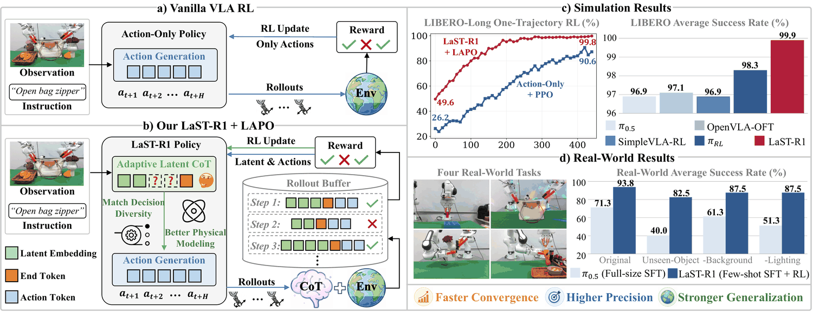
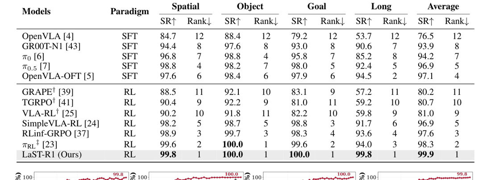
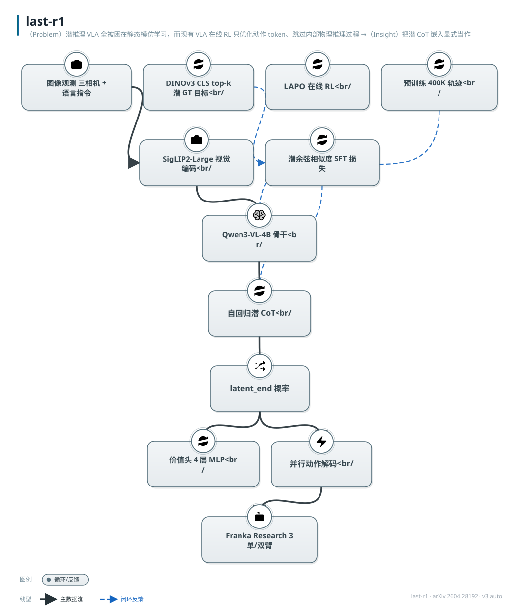

# LaST-R1: Reinforcing Action via Adaptive Physical Latent

- arXiv: https://arxiv.org/abs/2604.28192
- Source: https://arxiv.org/abs/2604.28192
- Project: https://siriyep.github.io/last-r1/
- Local PDF: `/Users/luogu/physical_intelligence/papers/reasoning/LaST-R1_2604.28192.pdf`
- Year: 2026
- Category: VLA + latent CoT over physical dynamics
- Priority: high

## 一句话总结

（Problem）潜推理 VLA 全被困在静态模仿学习，而现有 VLA 在线 RL 只优化动作 token、跳过内部物理推理过程 →（Insight）把潜 CoT 嵌入显式当作「隐决策变量」，用环境奖励同时重塑推理空间与动作空间 →（Mechanism）LaST-R1（Qwen3-VL-4B + DINOv3 离线潜目标 + 并行离散动作解码）+ LAPO（潜/动作统一步级似然比的 PPO 式联合优化）+ 自适应潜 CoT（<latent_end> 早退）→（Evidence）LIBERO 单条轨迹 warm-up 即 99.9% 平均成功率（Long 99.8% vs Action-Only+PPO 95.2%、πRL 94.0%）；真机 4 任务 30 条数据 warm-up + RL 从 52.5% 提到 93.75%（±1.25%），超 100 条数据全量 SFT 的 π0.5（71.25%）达 +22.5pp。

## 九问速览

1. **Problem**：潜推理 VLA（LaST₀/InternVLA-A1 类）只能模仿学习；VLA-RL（PPO/GRPO 系）只在动作空间做优化，「思考」与「行动」的内在联结无人训练。
2. **Bottleneck**：潜向量连续、无显式概率分布，标准 PPO 似然比无法直接作用于潜推理序列；固定推理长度浪费算力或容量不足。
3. **Insight**：潜嵌入可作为隐决策变量，用各向同性高斯近似的步级潜比率让环境奖励直接塑造「好的推理流形」。
4. **Method**：DINOv3 <CLS> top-k 潜目标（离线预计算）+ 自回归潜生成 + <latent_end> 后并行动作解码；LAPO 联合优化 + 长度自适应早退。
5. **Evidence**（带关键数字）：LIBERO 99.9%（Spatial 99.8/Object 100.0/Goal 100.0/Long 99.8）；warm-up 阶段潜推理就把 Long 从 26.2% 拉到 49.6%；真机平均 93.75% vs π0.5 71.25%。
6. **Ablation**：DINOv3 99.8% vs Pooling 96.8/Q-Former 97.2/Conv 98.4；潜长度 1→8 token 从 96.2→98.4%；M=4 早退 99.8% 最优；λ1=0 显式潜监督缺失降到 97.2%。
7. **Assumption**：DINOv3 全局特征已含足够物理/空间结构；潜序列条件独立假设成立；σ 固定的高斯近似够用。
8. **Failure**：细粒度执行误差（碗放偏滑落、碰倒 moka 壶）；真机插入偏差、拉链打滑、擦拭未接触、拧盖提前终止。
9. **Opportunity**：去掉 Nmax=8 与 M 个固定候选位的硬约束做全动态早退；扩展到灵巧手/人形；潜空间与力觉等多模态融合。

| 维度 | 论文答案 |
|---|---|
| Perception | SigLIP2-Large 视觉编码（2D-RoPE）+ 256×256（sim）/同分辨率三相机（真机：D455 第三人称 + 双 D435 腕部） |
| Closed-loop | 每 chunk（8 步）重观测重规划；sim 在线 RL 闭环交互；真机异步 actor-learner 持续闭环 |
| Correction | 无显式纠错模块；纠错隐式发生在潜推理空间（OOD 下持续改善）+ 人工干预数据回灌专用 buffer |
| Deployment | Franka Research 3 单/双臂 + UMI 夹爪；LoRA r=32 热更新；RTX 4090 推理；4 个接触密集任务 |

## 核心技术

信息流拆解（Input→Representation→Decision→Action→Training Signal）：

*论文 Figure 1（p2）：Figure 1: The Overview of LaST-R1. (a) Unlike vanilla RL baselines that strictly optimize actions,*

- **Input**：多模态观测 s_t = 图像（sim 单前视 256×256；真机三相机）+ 语言指令。
- **Representation**：Qwen3-VL-4B 骨干（LLM 2560 维 hidden）+ SigLIP2-Large 视觉编码器。视觉嵌入 f_v 与语言嵌入 f_l 拼接进 LLM。潜推理嵌入先自回归生成 Nz 个（对未来动力学的压缩预测），以 DINOv3 <CLS> token（R^{1×4096}）沿通道维 top-k（k=2560）选择为离线预计算的 GT 目标——保留最显著视觉成分且与 VLA 嵌入维度对齐，训练/推理零额外开销（基础模型与策略解耦）。
- **Decision**：自回归潜 CoT（推理长度自适应，最长 8）→ <latent_end> 转移 token（其最终 hidden 路由到 4 层 MLP value head 估计状态价值）→ 动作解码。
- **Action**：动作归一化后离散化为词表扩展的 256 个 <action_i> token（无参数 tokenizer，D.2），复用潜阶段 KV cache，对 8 个占位向量做单向 forward + 双向 attention 并行解码一个 8 步 action chunk（7-DoF 时恰 56 token/chunk；双臂 14-DoF 拼接）。混合注意力 mask：视觉/文本/潜 token 因果下三角，动作 token 双向。
- **Training Signal**：三阶段。(1) 大规模预训练（400K 轨迹/28M 帧，OXE+DROID+RoboMIND 混合，潜目标离线加载）；(2) SFT warm-up：潜余弦相似度损失 + <latent_end> CE + 动作 CE，权重 1:0.1:1；(3) LAPO 在线 RL：动作 token 用联合概率的离散似然比，潜嵌入用高斯近似的连续似然比，二者在同一 clipped surrogate 内联合优化；GAE 优势；另有 <latent_end> 的转移似然比优化推理长度。

**训练/冻结情况**：Qwen3-VL-4B 与 SigLIP2 全参参与预训练与 warm-up；sim RL 阶段 actor 全参更新（lr 3×10⁻⁵）+ value head（lr 3×10⁻⁴）；真机 RL 冻结底座、只更新全 attention 层注入的 LoRA（r=32）。DINOv3 始终冻结（仅离线产 GT 潜目标）。

**Loss**：L_total = L_action + λ1·L_latent + λ2·L_value + λ3·L_end（最优 λ1=0.1, λ2=1, λ3=0.1）；真机 RL 另用 BC(λBC=1.0) + Q-guided improvement(λQ=0.5) 的联合目标。

## 底层原理与数学推导

**1. 潜似然比（核心 novelty，附录 B 完整推导）**。对 rollout 采样的旧潜序列 Z^old_t 用以当前策略输出 z^θ_{t,i} 为中心的各向同性高斯（固定方差 σ²，维数 D）近似其分布。单嵌入比率：分子代入 x=z^old_{t,i}，分母因旧策略均值即 z^old_{t,i}（距离为 0）只剩归一化常数，二者相除常数完美抵消：

$$
r^z_t(\theta) = \frac{\pi_\theta(Z^{old}_t\mid\cdot)}{\pi_{\theta_{old}}(Z^{old}_t\mid\cdot)} = \exp\!\left(-\frac{1}{2\sigma^2}\sum_{i=1}^{N_z}\lVert z^{old}_{t,i} - z^\theta_{t,i}\rVert^2\right)
$$

物理含义：当优势 Â_t>0 时，最大化该比率等价于最小化当前潜输出与「促成成功的旧潜」的欧氏距离——把策略的潜表示拉向成功轨迹所处的「好推理流形」；Â_t<0 时反向推离。潜序列联合比率假设各嵌入条件独立（乘积→指数求和）。

**2. LAPO 联合裁剪代理目标**（§2.3, Eq.4）。对决策步 t 在 {潜 z, 动作 a} 两空间取统一 PPO 式裁剪（不对称界 εmin=0.2, εmax=0.28）：

$$
\mathcal{L}_{\text{policy}}(\theta) = -\mathbb{E}_t\left[\sum_{k\in\{z,a\}}\min\!\left(r^k_t(\theta)\hat{A}_t,\ \mathrm{clip}\big(r^k_t(\theta),\,1-\epsilon_{\min},\,1+\epsilon_{\max}\big)\hat{A}_t\right)\right]
$$

实践中为优化灵活性解耦为 L_action 与 L_latent 两项分别回传。动作侧比率用 chunk 内 token 联合对数概率：r^a_t(θ)=exp(log π_θ(C_t|·)−log π_old(C_t|·))。

**3. 总训练目标**（Eq.5/Eq.7）：

$$
\mathcal{L}_{\text{total}}(\theta) = \mathcal{L}_{\text{action}}(\theta) + \lambda_1\mathcal{L}_{\text{latent}}(\theta) + \lambda_2\mathbb{E}_t\big[(v_t-\hat{R}_t)^2\big] + \lambda_3\mathcal{L}_{\text{end}}(\theta)
$$

L_end 是 <latent_end> token 的离散似然比损失，Â 引导下奖励可预测状态里的短路径、惩罚欠推理，实现「早退」的显式监督。

**4. 自适应长度的探索采样**（Eq.6）。从 M 个预定义候选位的 pre-softmax logits l 中以温度 β 归一化出类别分布并采样推理长度：

$$
p_m = \frac{\exp(l_m/\beta)}{\sum_{i=1}^{M}\exp(l_i/\beta)},\qquad m\sim\mathrm{Categorical}(p_1,\dots,p_M)
$$

推理时改用置信早退：<latent_end> 概率 p≥0.99 才终止。RL 后长度分布显著向 2/4 token 偏移（附录 E.2），证明「想够了就停」是被学出来的而非手工规则。

## 物理直觉解释

**类比：先在脑内「过一遍电影」再动手。** 显式语言 CoT 的 VLA 像一边干活一边大声自言自语——把「我看到碗、碗在左边、我要伸手」逐字念出来，延迟高且离散语言装不下连续动力学；LaST-R1 的潜 CoT 像老师傅动手前半秒的默想：DINOv3 提供的离线潜目标是「下一刻世界大概长什么样」的压缩剧照，模型自回归生成 2-8 个潜嵌入，等于在脑内把「抓起-移动-放下」的物理过程快进预演一遍，再让动作 token 基于这个预演并行展开。warm-up 阶段仅靠这条潜链就把 LIBERO-Long 从 26.2% 拉到 49.6%，说明预演本身（而非 RL）已承载了大量长程结构。

**类比：RL 同时训练「怎么想」和「怎么动」，而不是只练手。** 现有 VLA-RL 像只让学徒反复练手、不许改脑内模型：动作分布被奖励推着走，内部表征原地不动，于是 OOD 一来就崩（论文中 Action-Only+PPO 的 OOD 曲线全程停滞甚至下探）。LAPO 的潜比率 exp(−‖z_old−z_θ‖²/2σ²) 像一根橡皮筋：成功的 rollout 把当前潜表示拽向当时的「好念头」，失败的推离——环境奖励经由这根皮筋直接按摩「物理直觉」本身。结果是 LaST-R1 的 OOD 成绩随训练单调上升（多个任务冲到 100%），Grad-CAM 显示其注意力随轨迹推进从被操作物平滑转移到目标容器，而基线要么散射要么死盯夹爪。

**类比：按任务难度「量入为出」地思考，而非每次都默想八拍。** 固定 8 token 潜链对简单推块是浪费、对复杂装配可能不够——自适应早退像老司机的路口决策：绿灯直行想半秒，无保护左转让大脑多转两圈。<latent_end> 的概率早退（p≥0.99）+ RL 学出的长度分布向 2/4 token 集中，使每步平均推理开销大降而成功率不损（M=4 时 99.8% 还高于固定长度 98.4%）。更妙的是执行步数：RL 后策略在三个 suite 上的平均执行步数甚至少于专家脚本——潜推理被优化后，策略不再模仿专家保守的航点式轨迹，而是合成更直接的决定性路径。

## 工程细节与实操指南

**预训练与 warm-up**（附录 C.1, D.2）：400K 轨迹/28M 帧，混合比例 BridgeV2 20.82%、Kuka 20.22%、Fractal 13.67%、Robo-Net 11.53%、Language Table 7.72%、BC-Z 7.54%、ManiSkill 5.26%、DROID 4.82% 等 25 源；全部帧的 DINOv3 潜 token 离线预计算。warm-up：8×H20 + Accelerate/DeepSpeed bf16，全局 batch 64，AdamW 峰值 lr 1×10⁻⁵ 余弦衰减（最小比 0.1）；LIBERO 每任务 1 条专家轨迹训 10K 迭代，潜长度从 {2,4,6,8} 均匀采样；真机每任务 30 条训 1K 迭代，潜长度固定 8。

**LIBERO 在线 RL**（附录 D.3）：verl + Ray + FSDP 单节点 8×H20。rollout batch 512 条轨迹均分 4 mini-batch，4 个 PPO epoch；动作采样温度 1.6；轨迹上限 Spatial 240 / Object与Goal 320 / Long 576 步；严格 verifier 稀疏二值奖励，终止步 ×5 缩放；GAE(γ=0.99, λ=0.95) + 有效步掩码；actor lr 3×10⁻⁵ / value head 3×10⁻⁴；全局梯度裁剪 10；不对称裁剪 (0.2, 0.28)；每 5 个更新步评估一次成功率。

**真机 RL**（附录 D.4）：连续异步 actor-learner（基于 serl 系管线），actor 边执行边回流 transition；人工干预路由到独立 buffer，learner 混合采样示范流与 rollout 流；底座冻结，仅更新全 attention 层 LoRA（r=32）；积累 500 transitions 后开始在线优化；BC(λBC=1.0) + Q 引导策略提升(λQ=0.5)，AdamW lr 1×10⁻⁵ 零权重衰减，梯度裁剪 1.0；critic:actor 更新比 2:1，one-step TD（γ=0.98），目标网络软更新 τ=0.005；梯度累积 16 × micro-batch 2 × 双流 ≈ 有效 batch 32；奖励：操作员确认成功 +10、每步 −0.05； learner 周期性广播权重热加载到 actor。

**部署**：Franka Research 3 + 3D 打印 UMI 夹爪；D455 第三人称 + 双 D435 腕部；RTX 4090 推理；spacemouse 采集示范。失败模式提示：真机失败集中在细粒度接触（插入偏差、打滑、未接触、提前终止），部署时建议配合力/触觉监控兜底。

## 实验协议清单

| 项目 | 论文设置 | 来源与备注 |
|---|---|---|
| 观测 | sim：单前视角 256×256；真机：1 第三人称 D455 + 2 腕部 D435，分辨率与 sim 一致 | §3.1, 附录 C.2 |
| 动作空间 | SE(3) EEF 7-DoF（3 位置偏移 + 3 欧拉角 + 1 夹爪），双臂拼接 14-DoF；离散化为 256 个动作 token | §2.1, D.2 |
| 控制频率 | 未报告 | 待确认：仅知 chunk 级重规划 |
| 重规划频率 | 每 action chunk（8 步）一次决策；sim RL 每步与环境交互后按 chunk 推进 | §2.3, D.3 |
| 动作 horizon | H=8（并行解码一个 chunk；7-DoF 下 56 token/chunk） | D.2, D.3 |
| 数据 | 预训练 400K 轨迹/28M 帧（OXE+DROID+RoboMIND 25 源）；LIBERO warm-up 1 条/任务；真机 warm-up 30 条/任务（spacemouse）；π0.5 基线 100 条全量 SFT | 附录 C.1, C.2, D.2, §3.3 |
| 奖励 | sim：严格 verifier 稀疏二值 0/1，终止步 ×5；真机：操作员确认 +10、每步 −0.05 | D.3, D.4 |
| Reset | sim：LIBERO 标准复位（隐含）；真机 reset 协议未报告 | 待确认 |
| 成功定义 | sim：verifier 任务成功（50 held-out 场景平均）；真机：人工判定任务级成功 | §3.1, §3.3 |
| 评估次数 | sim：每任务 50 个 held-out 场景；真机：每任务 20 次 rollout（位置变化）；步数分析另用 500 条轨迹/suite | §3.1, §3.3, 附录 E.3 |
| 随机种子 | sim RL 种子未报告；真机：3 次独立运行报标准差（93.75±1.25% / π0.5 71.25±4.5%） | §3.3 |
| 扰动测试 | 真机三类 OOD：未见物体（最大降幅 ≤15pp vs π0.5 的 −45pp）、背景、光照（近零降幅）；sim：每 suite 留 1 任务 OOD | Table 2, §3.4, 附录 E.4 |
| 真机 | Franka Research 3 单臂×1 + 双臂×3 任务（插六边形块/开袋拉链/擦花瓶/开瓶盖），UMI 夹爪 | §3.3, 附录 C.2 |
| 算力 | 预训练/warm-up/sim RL：8×H20（DeepSpeed/FSDP/verl）；真机推理：RTX 4090 | D.2, D.3, C.2 |
| 特权信息 | DINOv3 潜 GT 由「未来观测」离线计算（仅作 SFT 监督，推理不需未来）；sim 奖励来自仿真器 verifier；真机奖励由人工确认 | §2.2, D.3, D.4 |

**附录陷阱自查**：
- privileged 信息：潜目标取自未来帧的 DINOv3 特征——SFT 用未来信息当目标是「预测式监督」的合法做法，但评估时模型确实只见当前帧；sim RL 的 verifier 是仿真特权
- reward shaping：sim 奖励纯稀疏（×5 只是缩放）无 shaping，干净；真机 −0.05 步罚鼓励快执行，+10 由人工确认引入主观性
- reset 难度：LIBERO 标准复位，无额外难度修饰；真机「varied positions」具体分布未报告
- eval budget：sim 50 场景/任务、真机 20 rollout/任务 × 3 runs，中等偏充分；但真机仅 4 任务，任务多样性有限
- 底层控制栈：控制频率、EEF 控制器类型（位置/速度/阻抗）均未报告；chunk 8 步内开环执行，接触任务靠高频感知外的策略鲁棒性硬扛
- 数据优势：与 π0.5 对比时 LaST 用 30 条 vs 100 条，看似数据劣势，但 LaST 有自建 400K 轨迹预训练、π0.5 有其更大的专有预训练，两者底座不对等；真机 RL 还引入人工干预数据（基线无此资源）

## 消融实验与分析

*论文 Table 1（p7）：Table 1: Comparison on the LIBERO. For RL, we use single-trajectory warm-up and single-view*

| 消融项 | 设置 | 结果 | 来源 |
|---|---|---|---|
| 潜推理本身 | warm-up：带潜 CoT vs Action-Only；RL 后：LAPO vs PPO | warm-up 平均 63.9% vs 51.0%（Long 49.6% vs 26.2%）；RL 后 99.9% vs 95.2% | Fig.3, §3.2(1) |
| 潜表示构造 | DINOv3 top-k vs 全局池化 / 卷积下采样 / Q-Former | RL 后 SR：DINOv3 99.8% > Conv 98.4% > Q-Former 97.2% > Pooling 96.8%（LIBERO-Spatial） | Fig.4(a), 附录 D.1 |
| 潜长度 | 固定 Nz ∈ {1,2,4,8} vs 无潜 | 96.2% (1) → 98.4% (8) 单调升；Action-Only 95.0%；4→8 增益边际，故封顶 8 | Fig.4(b) |
| 早退候选位 M | M ∈ {1,2,4,8}（Nmax=8 均匀分布） | M=4 最优 99.8%；固定 M=1 98.4%；M=8 过自由降到 99.0% | Fig.4(c) |
| 损失权重 | λ1∈{0,0.1,1}；λ2∈{0.1,0.5,1}；λ3∈{0.1,2} | λ1=0 掉到 97.2%（隐式梯度不够）、λ1=1 降到 99.0%；λ2=0.1/0.5 降到 97.8/98.4%；λ3=2 降到 98.6%；最优 (0.1, 1, 0.1) | 附录 E.1, Fig.8 |

**核心结论**：显式潜监督（λ1>0）、DINOv3 全局先验、适度自适应长度三者共同贡献；其中「λ1=0 仍达 97.2%」说明动作损失对潜空间有隐式塑形，但显式 LAPO 项再挤出 2.6pp。

**证据是否支持机制的点评**：消融矩阵相当完整——有「No X」（Action-Only、λ1=0、M=1 退化固定长度）与「换 X」（四种潜表示、不同 M），机制链条（潜监督→好推理流形→OOD 韧性）有 OOD 曲线与 Grad-CAM 注意力双重旁证，属于高质量的证据组织。两个弱点：(1) 潜比率的高斯近似（固定 σ、条件独立）没有对 σ 的敏感性分析，σ 是推导核心超参却在附录 D/E 中未报告取值——待确认；(2) OOD 实验只留 1 任务/suite，holdout 任务的选择效应无法排除；真机 4 任务全部为作者自选，无标准基准锚点，93.75% 的绝对水平难以与他文横向比较。

## 技术权衡（Trade-off）

| 优势 | 劣势与工程代价 |
|------|---------------|
| 潜 CoT 无语言 tokenization 瓶颈，承载连续动力学；推理开销每步仅 2-8 个潜 token | 潜推理不可读、不可人工审计，出错只能看 Grad-CAM 事后归因 |
| LAPO 复用 PPO 骨架，改动集中在似然比定义，工程可移植 | 高斯近似 + 固定 σ + 条件独立假设在潜空间强相关时失准；潜比率对 ‖·‖² 尺度敏感，需与 λ1 调参联动 |
| 自适应早退：RL 后长度集中到 2/4 token，推理延迟大降 | Nmax=8 与 M=4 候选位是手工约束，复杂任务容量天花板被人为封死（作者自认局限） |
| 单轨迹 warm-up 即近满分，数据效率突出 | LIBERO 已近饱和（99.9%），该基准对后续改进失去区分度；瓶颈证据需看 Long 与 OOD |
| 真机用 LoRA + 异步 actor-learner，4090 可部署 | 真机 RL 依赖人工干预数据流与操作员确认奖励，人力成本转移而非消失 |
| DINOv3 潜目标离线预计算，训练零额外开销 | 潜目标绑定单一视觉基础模型，DINOv3 的归纳偏置成为系统上限的一部分 |

## 技术价值与演进定位

定位：VLA「潜推理 + RL 后训练」两条线的合流点。此前潜推理系（LaST₀、InternVLA-A1、Latent Reasoning VLA）止步于模仿学习，VLA-RL 系（SimpleVLA-RL、VLA-RL、πRL、RLinf）只在动作空间优化——LaST-R1 首次给出「对连续潜推理序列做 PPO 式策略优化」的可用数学方案（高斯近似潜比率），并用自适应早退回应了推理长度分配问题。其「奖励塑造内部表征→OOD 韧性」的论证（OOD 曲线 + 注意力迁移）是论文最扎实的贡献，指出了一条比「更多动作数据」更便宜的泛化路径：让环境反馈直接训练「物理直觉」。局限在于机制的天花板都是手工设定（Nmax、M、σ），以及真机验证规模小（4 任务）。后续方向作者已点名：全动态无约束早退、灵巧手与人形扩展。

## 与其他论文的关系

- **π0.5** — 真机对照组与 SFT 范式代表：100 条全量 SFT 平均 71.25%，被 30 条 warm-up + LAPO 的 93.75% 反超；OOD 下 π0.5 见未见物体掉 45pp、LaST-R1 最多 15pp，直指「静态模仿 vs 交互塑造」差距
- **OpenVLA / OpenVLA-OFT** — 动作 tokenizer 与并行解码的直接来源（无参数 tokenizer、chunk 并行）；LIBERO 表中 SFT 强基线（OFT 97.1%），LaST-R1 以单轨迹数据达 99.9%
- **SimpleVLA-RL** — RL 后训练基线（GRPO 路线、warm-up 协议被本文沿用）：96.9% 被 99.9% 压制，差距全在 Long（91.7 vs 99.8），凸显长程任务对内部推理的依赖
- **OneTwoVLA** — 自适应推理的文本路线：OneTwoVLA 用快慢两套系统按任务切显/隐推理，LaST-R1 在纯潜空间用早退实现同样的「量入为出」，是同一问题的离散/连续两种答案
- **DreamVLA / ThinkWVLA** — 世界知识内化的生成/蒸馏路线：DreamVLA 靠生成式做梦、ThinkWVLA 靠世界模型蒸馏，LaST-R1 靠 DINOv3 潜目标 + 环境奖励塑造，第三条路证明「不自回归生成未来帧」也能获得物理理解
- **π0.6 (π*0.6)** — 「从经验中学习的 VLA」：同为经验改进闭环，π0.6 走大规模真机经验+蒸馏，LaST-R1 走任务级在线 RL + 潜空间优化，粒度与成本不同层级
- **π0.7 / pi07** — PI 系可操纵通才模型：代表「指令可控 + 涌觉能力」的大厂路线，LaST-R1 的潜 CoT 可视为其 Stan-style 中间推理的学术开源对应物
- **F1-VLA / Gemini Robotics** — 理解-生成-动作统一与快慢双系统代表：均把推理显式化（生成中间态/语言），LaST-R1 反其道把推理全部压进潜空间换取延迟与连续性

## 精读问题

1. 潜比率中固定 σ 的取值论文未披露（附录 B/D 均未给值）——σ 控制「多远的潜偏移算一次大更新」，它与 ‖z‖ 的量纲耦合：做一组 σ ∈ {0.1,1,10} 扫描，观察训练稳定性与最终 SR 对 σ 的敏感度，是复现该工作的第一道坎。
2. 条件独立假设在潜嵌入间几乎必然不成立（同一推理链的 token 强相关）：用序列级联合高斯（含协方差）或 energy-based 比率替代，能带来多少上限提升？还是说裁剪机制已吸收了误指定误差？
3. DINOv3 <CLS> + top-k 通道选择是「拍脑袋」还是被搜索过？用其它基础模型（V-JEPA 2、SigLIP2 自身、DINOv2）与其它通道选择策略（PCA、随机 k）做对照，能否分离「特征质量」与「选择策略」的贡献？
4. 真机 RL 的 Q-guided 项（λQ=0.5）与 LAPO 潜优化是否真正兼容？论文未报告真机阶段潜损失是否仍被优化（LoRA 冻结底座后潜表征几乎不动？）——若真机只训了动作侧，标题中「joint optimization」的真机证据链是有缺口的。
5. 自适应长度学到的「2/4 token 为主」分布是任务难度使然还是容量封顶（Nmax=8）使然？把 Nmax 放宽到 32 后，Long suite 上长度分布是否右移、SR 是否再升？
6. 执行步数少于专家（附录 E.3）令人兴奋但也危险：更短路径是否对应更贴边的激进轨迹（碰撞裕度下降）？量化「步数-轨迹安全裕度」的 trade-off 才能判断这是真优化还是风险转移。
7. 潜推理与动作之间的信息瓶颈只有 <latent_end> 的 hidden——把 value head 换成多个中间潜 token 的池化、或在动作解码时让每个动作 token 只看部分潜前缀，是否会改变推理结构与可优化性？

*架构速览：（Problem）潜推理 VLA 全被困在静态模仿学习，而现有 VLA 在线 RL 只优化动作 token、跳过内部物理推理过程 →（Insight）把潜 CoT 嵌入显式当作「隐决策变量」，用环境奖励同时重塑推理空间与*
