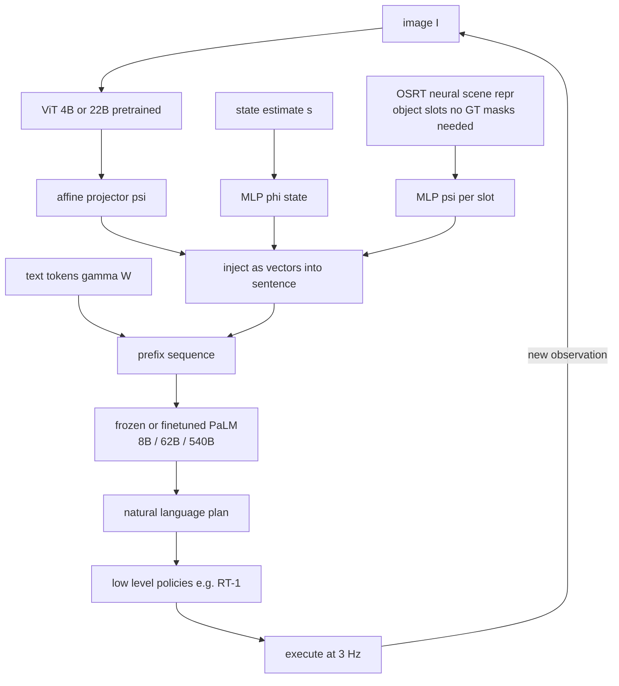

# PaLM-E: An Embodied Multimodal Language Model

- 本地 PDF：`papers/reasoning/PaLM-E_Embodied_Multimodal_Language_Model_2303.03378.pdf`
- arXiv：https://arxiv.org/abs/2303.03378
- 年份：2023
- 团队：Robotics at Google + TU Berlin + Google Research
- 阶段：把连续具身观测注入 LLM 嵌入空间的多模态具身推理模型（输出高层规划文本，交由低层策略执行）

## 一句话总结

PaLM-E 用「多模态句子」把图像、状态估计、神经 3D 场景表征（OSRT）以向量形式直接插入 PaLM（8B/62B/540B）的语言 token 流中端到端训练——最大版本 PaLM-E-562B 是当时已报道最大的 VLM，在 OK-VQA 上拿到 SOTA（66.1），同时证明单一通用模型跨三种机器人具身做规划时，混合互联网级图文数据共训能带来成倍性能提升（TAMP 规划均值 48.6% 到 94.9%），并发现「规模越大、多模态微调的语言遗忘越少」这一关键规律。

## 核心技术

1. **多模态句子（multimodal sentences）**：跳过离散 token 层，用编码器 $\phi: \mathcal{O} \to X^q$ 把连续观测映射为 $q$ 个语言嵌入空间的向量，动态地插进 prompt 的任意位置（而非固定位置），复用 LLM 原有的位置编码；词表大小 $|W| = 256{,}000$
2. **三档底座组合**：8B LLM + ViT-4B = PaLM-E-12B；62B + ViT-22B = PaLM-E-84B；540B + ViT-22B = PaLM-E-562B（ViT 为图像分类预训练）
3. **多种观测编码器对照**：状态向量 MLP（可用真值物体中心信息）、ViT-4B / ViT+TL（全局或按实例掩码分解的 object-centric）、OSRT——一个无需真值分割、靠新视角合成任务学出 object slots 的 3D 感知场景表征，每个物体 slot 经 MLP $\psi$ 投影为多个嵌入
4. **实体指代（entity referrals）**：输入前缀写成 `Object 1 is <obj 1> ... Object j is <obj j>`，让模型能在生成的计划中直接用 `<obj j>` 特殊 token 指代物体，低层策略也消费这些 token——解决同色积木无法用语义词命名的 grounding 问题
5. **层次化控制闭环**：PaLM-E 只生成高层技能序列文本（如 "1. Find a sponge, 2. Pick up..."），由 RT-1 等已有低层策略执行，遇到扰动或失败时基于新观测重规划；输出子目标 1 Hz，低层动作 5 Hz

## 底层原理与数学推导

**从语言建模到多模态语言建模只需要改一个映射。** 标准 decoder-only LLM 对文本 $w_{1:L}$ 的建模是自回归链式分解：

$$p(w_{1:L}) = \prod_{l=1}^{L} p_{LM}(w_l \mid w_1, \dots, w_{l-1}), \qquad x_l = \gamma(w_l),\; w_l \in W$$

其中 $\gamma$ 是 embedding 矩阵（$k \times |W|$）。前缀条件化不需要任何结构改动：

$$p(w_{n+1:L} \mid w_{1:n}) = \prod_{l=n+1}^{L} p_{LM}(w_l \mid w_{1:l-1})$$

PaLM-E 的全部技巧在于：让 prefix 序列 $x_i$ 里的元素既可以来自词嵌入器 $\gamma$，也可以来自观测编码器 $\phi_j$：

$$x_i = \begin{cases} \gamma(w_i) & i \text{ 对应文本 token} \\ \phi_j(\mathcal{O}_j)_i & i \text{ 对应第 } j \text{ 个连续观测 } \mathcal{O}_j \end{cases}$$

训练目标只对 prefix 之后的文本 token 计交叉熵：

$$\mathcal{L} = -\mathbb{E}_{(w,\mathcal{O},n)}\left[\sum_{l=n+1}^{L}\log p_\theta(w_l \mid x_{1:l-1})\right]$$

也就是说，具身观测被当作「可以出现在句子任何位置的特殊 token」，而预测目标永远是文字。这与 RT-2 形成一个精确的对称：两者共用同一种注入机制，差别只在预测目标——RT-2 让目标变成动作 token，PaLM-E 让目标保持自然语言、由外部低层策略二次落地。

**ViT 与语言维度不对齐怎么办。** ViT 输出 $\tilde{x}_{1:m} = \tilde{\phi}_{ViT}(I) \in \mathbb{R}^{m\times\tilde{k}}$，其特征维 $\tilde{k}$ 通常不等于 LLM 的嵌入维 $k$，因此需要一个仿射投影 $\psi$ 补齐：

$$x_i^{img} = \psi\big(\tilde{\phi}_{ViT}(I)_i\big) \in \mathbb{R}^k$$

对 OSRT 则是每个物体 slot $o_j = \bar{\phi}_{OSRT}(I_{1:v})_j \in \mathbb{R}^{\bar{k}}$ 都被展开成多个 token（$\psi: \mathbb{R}^{\bar{k}} \to \mathbb{R}^{m\times k}$），保证单个物体在序列里占据一段连续位置而不是一个点——这是它比全局 ViT 更适配符号化 LLM 的结构性原因。

**object-centric 掩码分解。** 有真值掩码时可以把全局 ViT 表征切成逐物体切片 $x^j_{1:m} = \phi_{ViT}(M_j \circ I)$，把「静态网格」重构为「实例集合」，与 LLM 预训练的符号归纳偏置对齐。

## 物理直觉解释

**为什么必须把像素塞进 LLM 而不是先转成文字描述。** 此前的 SayCan 类方法把 LLM 当规划器用，但喂给它的只有纯文本——机器人「看到什么」这件事被外包给了另一套感知系统。问题在于：操作任务的可行性往往取决于毫米级的几何细节（两个杯子相距几厘米、抽屉是否半开），这些信息一旦被压缩成 "there is a cup on the table" 就永久丢失了。PaLM-E 的做法相当于**不让助手替你转述现场，而是直接把你带回案发现场**——原始观测以向量形式进入注意力层，模型可以在「语义概念」和「几何配置」之间自由往返。论文用来佐证这一点的是 TAMP 环境：要抓住被压住的绿块，正确计划是先移开橙块，这种隐式依赖只有真的"看见"布局才能推出来。

**为什么共训 web 数据会帮助机器人规划（而不是拖累）。** 直觉上机器人数据和 VQA 数据是两种任务，混在一起似乎互相稀释。实测结果恰恰相反：TAMP 少样本设置下（每个规划任务仅 320 个示教），单域训练 + 微调 LLM 只有 48.6%，换成 full mixture 共训 + 微调后到 94.9%；冻结 LLM 时也从 31.8% 升到 74.3%。机制上，VQA 数据提供的是「如何描述与回答关于场景的问题」这类通用技能，等价于给机器人任务预装了一层**语言化的场景理解基座——就像先学过看图说话的孩子再学物理实验报告，难的从来不是描写而是实验本身，但描写能力让他读题就读对了**。这也是全文最重要的可迁移结论：机器人数据的稀缺性可以用其他模态的数据来抵偿。

**为什么规模越大遗忘越少是这条路线的关键赌注。** 多模态微调的最大风险是毁掉 LLM 原本的语言能力。实验给出的规律非常干净：NLG 相对退化在小模型上是灾难性的——PaLM-E-12B 丢掉 87.3%，中等规模丢 61.6%，而 PaLM-E-562B 只丢 3.9%。这意味着「具身化」和「保留通用智能」在大参数量下不再是一对矛盾，反而成了同一件事的两面：容量越大，就有越多的冗余子空间可以去容纳新的模态而不动用旧的知识通路。**大仓库里腾一间房放货不挤占陈列区，小仓库只能拆东墙补西墙。**

## 工程细节与实操指南

**full mixture 配方（Appendix Table 6，采样频率折算比例）**

| 数据源 | 占比 |
|---|---|
| Webli | 52.4% |
| VQ2A | 13.1% |
| CC3M | 13.1% |
| VQG | 5.2% |
| Object Aware | 5.2% |
| Language Table（仿真+真实） | 4.2% |
| Mobile Manipulator（真实） | 3.1% |
| TAMP（仿真） | 1.6% |
| OK-VQA / VQAv2 / COCO / Wikipedia 各 | 0.5% |

即 **具身数据只占整个 mixture 的 8.9%**——这个比例本身就是论文结论的一部分：少量机器人数据足矣，前提是有海量视觉语言数据兜底。

**编码器选型经验**
- 状态向量 + MLP：最简单，配合 ground-truth 物体中心信息即可在域内打满，但对视觉输入零迁移力
- 全局 ViT-4B：域内表现好，少样本规划差；换上 full mixture 共训后规划成绩翻倍以上
- ViT+TL（从头训）：在极低数据下几乎不可用
- OSRT：不用任何大规模数据就在 TAMP 规划上拿到最优（82.5 / 76.2），验证了几何先验的价值——但需要视频域内数据训练
- 同色物体场景务必加 entity referrals，否则指令中的「绿色块」二义性会让计划不可执行

**控制回路的集成方式**
- 低层策略直接沿用已有工作不做修改（RT-1、Language-Table 的推箱子策略）
- prompt 结构 `Human: <instruction> Robot: <step history>. I see .` 让模型自回归地输出下一步并在完成后基于新图像重规划，直到输出 terminate
- 移动操作训练数据即 SayCan 论文的运行轨迹，共 2912 条序列
- 论文假设低层策略只能执行短视距的小型技能库词汇表，且**没有任何机制约束或过滤 PaLM-E 的输出**——计划合法性完全由训练分布决定

**可复用的评测协议**
- 失败检测：`Q: Was <skill> successful?`
- 可供性预测：`Q: Is it possible to <skill> here?`
- 长程规划：逐步生成 + 重规划；这两个 VQA 化的评测子任务后来成为 embodied reasoning 的标准探针

## 消融实验与分析

### TAMP 少样本环境：输入表示对比（Table 1，仅 1% 数据 = 每个规划任务 320 条示教）

| 配置 | q1 | q2 | q3 | q4 | p1 抓取规划 | p2 叠放规划 |
|---|---|---|---|---|---|---|
| SayCan（oracle affordance） | - | - | - | - | 38.7 | 33.3 |
| PaLI（zero-shot，无机器人数据） | - | 0.0 | 0.0 | - | - | - |
| State（GT，LLM 不预训练） | 99.4 | 89.8 | 90.3 | 88.3 | 45.0 | 46.1 |
| State（GT，LLM 预训练） | 100.0 | 96.3 | 95.1 | 93.1 | 55.9 | 49.7 |
| ViT + TL（物体中心，预训练） | 34.7 | 54.6 | 74.6 | 91.6 | 24.0 | 14.7 |
| ViT-4B 单机数据 | - | 45.9 | 78.4 | 92.2 | 30.6 | 32.9 |
| ViT-4B full mixture | - | 70.7 | 93.4 | 92.1 | 74.1 | 74.6 |
| OSRT（含 VQA） | 99.7 | 98.2 | 100.0 | 93.7 | 82.5 | 76.2 |

**核心结论**：(1) 未经过机器人训练的 SOTA VLM（PaLI）在具身 VQA 上得分为 0.0，直接证伪了「好 VLM 自动就是好具身推理器」的假设；(2) 共训 full mixture 使 ViT-4B 的规划成绩翻倍以上（p1 30.6 到 74.1）；(3) 无需任何大规模数据的 OSRT 几何表征反而在最难的规划任务上最好（82.5 / 76.2）——**3D 结构先验与数据规模是两条正交的提升轴**；(4) oracle affordance 版 SayCan 也只有 38.7 / 33.3，因为 affordance 只约束「现在可能做什么」，不足以构造长程计划。

### 共训 vs 单域、冻结 vs 微调（Fig. 4，PaLM-E-12B，TAMP 1% 数据，p1/p2 均值）

| 配置 | 规划成功率 |
|---|---|
| LLM 微调 + single robot | 48.6% |
| 无预训练（LLM+ViT 从零） | 42.9% |
| LLM 冻结 + single robot | 31.8% |
| LLM 冻结 + full mixture | 74.3% |
| LLM 微调 + full mixture | 94.9% |

**核心结论**：mixture 共训与 LLM/ViT 预训练是两个独立的增益源，且两者相乘效果最大（94.9% vs 三种弱化方案的 31.8%-48.6%）；冻结 LLM 可以省钱但在机器人任务上明显吃亏（74.3% vs 94.9%）——如果想省算力就得接受约 20 个点的损失。

### 语言遗忘 vs 模型规模（Fig. 6 / Table 8，NLG 平均相对下降）

| 模型 | NLG 相对退化 |
|---|---|
| PaLM-E-12B | 87.3% |
| 中间规模 | 61.6% |
| PaLM-E-562B | 3.9% |

**核心结论**：多模态训练的灾难性遗忘随参数规模指数级缓解，562B 仅损失 3.9%；这给后续所有 VLA 设计提供了最直接的 scaling 依据——**想既会机器人又保住语言，要么冻住 LLM，要么把 LLM 做大，中间路线两头不讨好**。

### 通用视觉语言基准（Table 5）

| 模型 | VQAv2 test-dev | OK-VQA val | COCO Karpathy |
|---|---|---|---|
| Frozen（冻结 LLM 先行工作） | 48.4 | - | - |
| PaLM-E-12B frozen（generalist） | 70.3 | 51.5 | 128.0 |
| PaLM-E-12B（generalist，单 checkpoint） | 76.2 | 55.5 | 135.0 |
| PaLM-E-562B（generalist，单 checkpoint） | 80.0 | 66.1 | 138.7 |
| PaLI（task-specific finetuned） | 84.3 | 64.5 | 149.1 |
| Flamingo（task-specific / 32-shot OK-VQA） | 82.0 | 57.8 | 138.1 |

**核心结论**：单一 generalist checkpoint 的 PaLM-E-562B 在 OK-VQA 上达 66.1，超过专为该任务微调的 PaLI（64.5），拿到当时最高纪录；同时它的冻结-LLM 版本在 VQAv2 上比 Frozen 高出超过 45%（70.3 vs 48.4），确立「加模态注入架构本身也优于纯粹冻结式软提示」这一结构性判断。
（补充 Table 4：失败检测 F1 上 PaLM-E-12B full mixture 冻结版 0.91，超过 CLIP-FT-hindsight 0.89 与 zero-shot PaLI 0.73；可供性预测 0.91 超过 QT-OPT 阈值法的 0.63。）

## 技术权衡（Trade-off）

| 收益 | 代价 |
|------|------|
| 观测嵌入可在句子任意位置动态插入，复用位置编码，prompt 结构极为灵活 | 编码器产生的 token 数直接抬高序列长度与注意力开销；ViT-22B 加 540B LLM 只有云端能跑 |
| 端到端共训带来强迁移，320 条示教即可学会新规划任务（数据效率极高） | 输出仍是文本，需要外挂低层策略落地；接口处的语义鸿沟（`<obj j>` 这类指代须由低层策略理解）限制了技能词汇表大小 |
| 小占比（8.9%）的具身数据就能撑起具身能力，标注成本可控 | 具身数据过少导致在某些环境下须依赖仿真专家规划器（TAMP 用 Driess et al. 2020 planner 造数据），真实世界稀缺行为的覆盖仍受限 |
| 大模型多模态化几乎不伤语言能力（562B 仅退 3.9%），一模型多用途 | 冻结路线虽然省钱省心，却在规划类任务上系统性落后微调路线（74.3% vs 94.9%） |
| OSRT 显示几何结构先验可替代一部分大规模数据 | OSRT 需要域内视频训练，跨域泛化未验证；且有真值掩码时才能进一步切分物体 |

## 技术价值与演进定位

PaLM-E 在演进链条上的角色是「具身多模态性」的定义者。它用五组对照实验完成了三个奠基性论证：其一，纯文本 LLM + affordance 函数的分层方案（SayCan）在长程组合规划上不够用（38.7/33.3），必须让模型直接看几何；其二，机器人数据的稀缺可以用视觉语言数据补偿，共训本身就是一种 data augmentation；其三，规模是解决「具身化 vs 遗忘」矛盾的可行路径。

值得注意的是 PaLM-E 与 RT-2 构成的精确互补关系：同样的「连续观测向量注入 LLM 词嵌入空间」机制，PaLM-E 输出语言（高层计划，需要外部执行器），RT-2 输出动作 token（自闭环）。前者证明了模型的「理解侧」就绪，后者补上了「执行侧」。这条「理解先行、执行跟进」的时间线正是本库 reasoning 分类线的骨架，后来的 GR00T N1 双系统、F1-VLA 的思考-行动分段都在重复同一个分岔。此外 OSRT 作为输入表示的胜利暗示了另一个长期方向：符号化/结构化的观测表征可以让 LLM 更高效地吸收几何信息，这条线后来演化为各类 scene-representation-conditioned policy。

## 与其他论文的关系

- **SayCan** — 直接对照与数据来源：PaLM-E 使用 SayCan 的移动操作轨迹（2912 序列）训练，并以 oracle affordance 版 SayCan 为 baseline 击败之（TAMP 38.7/33.3 vs OSRT 版 82.5/76.2）；核心批评是 affordance 函数只约束当下可行性，无法承载长程组合规划的构造需求
- **RT-1 / RT-2** — 执行层的两端：PaLM-E 移动操作域的低层策略就是 RT-1；RT-2 之后把 PaLM-E 式的注入机制与动作 token 目标合并，形成真正的端到端 VLA。读这三篇的顺序应是 RT-1（动作表示）→ PaLM-E（模态注入与共训迁移）→ RT-2（目标函数合一）
- **Frozen (Tsimpoukelli et al.)** — 冻结 LLM 思路的源头：PaLM-E 把冻结式设计推广到更多模态并全面超越（VQAv2 上 70.3 vs 48.4，提升超 45%），但也同时给出它的边界——冻结 LLM 在机器人规划任务上吃亏 20 个点
- **PaLI / Flamingo** — 通用 VLM 上限的标尺：未接触机器人数据的 PaLI zero-shot 在具身 VQA 上完全失效（0.0/0.0），说明通用视觉语言能力并不自动转化为具身推理；而 PaLM-E-562B 反过来在 OK-VQA 上超越专门微调的 PaLI
- **Gato** — 多具身 generalist 的前身对照：同为单模型多本体 agent，Gato 未展示跨域联合训练的正迁移，而 PaLM-E 的核心贡献正是系统地证明并量化 positive transfer（Fig. 3 / Fig. 4）
- **OSRT (Sajjadi et al., 2022)** — 本文作为输入表示引入的无监督 3D 场景表征：不依赖真值分割也不依赖大规模数据却取得最佳规划成绩，是文中唯一独立成立的结构性贡献，值得单独追踪其后续发展

## 精读问题

1. **0.0 分的真实含义**：PaLI zero-shot 在 q2/q3 上得 0.0 是「完全无法回答」还是「输出格式不匹配被判失败」？如果是后者，具身 VQA 与通用 VQA 之间的差距是否被夸大了？怎样设计一个更公平的 probing（比如 few-shot 校准后再测）？
2. **冻结 vs 微调的 20 点差距来自哪里**：Fig. 4 中同样使用 full mixture，微调 LLM 到 94.9%、冻结只剩 74.3%。这 20 个点是语言推理能力的损耗差异，还是嵌入空间「软提示」的表达上限？能否通过增大 encoder 输出 token 数 $q$ 来弥合？
3. **entity referrals 的闭环断点**：`<obj j>` 特殊 token 由 PaLM-E 生成、由低层策略消费，意味着两套系统必须在 token 语义上对齐。当物体在多步计划中被移动、遮挡后，低层策略如何在无显式跟踪的情况下持续解析这些指代？这是否是长程任务的主要失败来源？
4. **8.9% 这个比例的最优性**：full mixture 里具身数据只占不到十分之一就够撑起具身能力，那再往下压到 3% 会崩吗？paper 给出的是单点结果，混合比例是否存在相变？这个问题在 RT-2-X 的消融里有部分答案（fine-tune 与 co-fine-tune 打平），说明该曲线高度依赖机器人数据自身多样性。
5. **OSRT 的高性价比能否复制到其他领域**：OSRT 需要 in-domain 视频来学习新视角合成。对于桌面操作的实验室数据集这很容易满足，但对于 mobile manipulation 或户外导航呢？如果能与 web 规模的视觉数据结合（作者自己也把这列为 future work），是不是可以同时吃到几何先验和数据规模两条轴？
6. **scale 曲线的外推风险**：87.3% → 61.6% → 3.9% 的遗忘衰减只在三个点上有观测。当模型继续变大但多模态数据配比不变，最终会收敛到多少？如果反过来在固定 562B 下无限增加机器人数据比例，遗忘会不会重新恶化？
