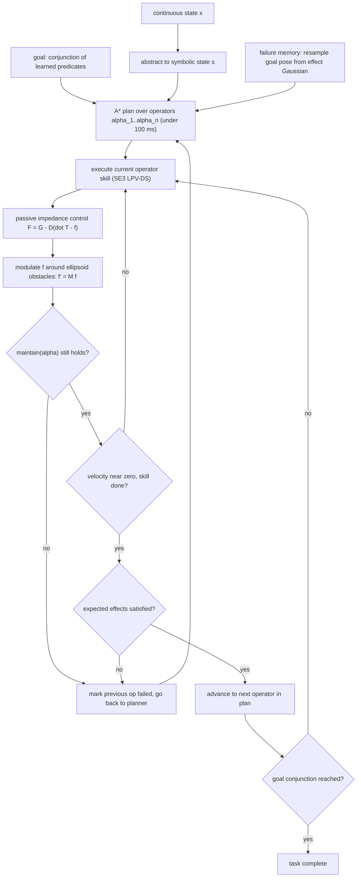

# SymSkill: Symbol and Skill Co-Invention for Data-Efficient and Reactive Long-Horizon Manipulation

- 本地 PDF：`papers/reasoning/SymSkill_2510.01661.pdf`
- arXiv：https://arxiv.org/abs/2510.01661 （v3，2026-06-08）
- 项目主页：https://symskill.github.io/
- 年份：2026 (ICRA 2026；奖项级别在 PDF 正文未注明，按论文脉络归入符号推理路线代表作)
- 团队：University of Pennsylvania GRASP Laboratory（Yifei Simon Shao, Sunan Sun, Pratik Chaudhari, Vijay Kumar, Nadia Figueroa 等）
- 阶段：符号推理路线代表——谓词/操作符/技能从未标注未分割演示中共同发明，符号级实时规划换取组合泛化与即时故障恢复

## 一句话总结

SymSkill 把模仿学习与经典 TAMP 各取一半拼起来：离线阶段只给「5 条左右示教」就能自动切分出 premotion/motion 片段、用相对位姿聚类发明谓词、跟踪谓词跃迁归纳操作符、再为每个操作符拟合一条全局渐近稳定的 SE(3) LPV-DS 反馈场技能；在线阶段用 A* 在符号空间组合这些积木达到目标谓词合取式，维持条件丢失或效果未达成时立即重规划，扰动则交给被动阻抗控制器与吸引子重采样就地消化。结果：RoboCasa 12 个单步任务平均成功率 85.0%（每任务仅 5-10 条演示）、零额外数据串成多步任务（如 StoreCheese 连锁六个技能并多次符号级恢复）；真实 Franka 从约 5 分钟 play 数据学到 11 个操作符并实时执行多步目标。

## 核心技术

1. **符号与技能共同发明（co-invention）** — 谓词、操作符、低层策略全部从无标签、无分段的数据里长出来，无需人工设计抽象层，也绕开了既有方法 propose-then-down-select 搜索的耗时与语义漂移。
2. **物体中心相对坐标 + 双类片段分解** — 每个技能周期天然分成 premotion（只有末端动）与 motion（末端+一个物体同动）；premotion 以运动目标物 $o_{int}$ 为参考系，motion 由离线查询一次 Gemini-2.5-Pro 选出静止参考物 $o_{ref}$ 后在其坐标系下表达。同一类型物体共享轨迹结构假设，是少样本可学的根基。
3. **SE(3) LPV-DS 技能层** — 位置用连续 LTI 系统的 GMM 加权混合、姿态用 Quaternion-DS，每个子系统经半定规划施加全局渐近稳定约束，得到的是收敛反馈场而不是开环轨迹回放；少量多峰演示由混合分量自然容纳。
4. **符号级在线规划与三层恢复机制** — A* 只在离散状态空间重算计划（计划时间 <100 ms，因此可以做到实时反应）；连续空间扰动被被动阻抗控制与调制矩阵吸收；执行失败时从效果高斯里重采吸引子位姿平移技能（`f' = T f`），语义级意外则触发整体重规划。
5. **VLM 的克制定位** — 视觉语言模型只在离线环节承担一件事：从运动片段的若干等距帧中挑出参考物体（结构化输出限定在场景物体集合内，抑制幻觉）。在线规划、监测、恢复完全无模型调用，这是它能同时拿到「实时性」与「语义正确性」的关键取舍。

## 底层原理与数学推导

### 谓词发明的形式化过程

设对象集 $O$ 中每个物体带类型 $\lambda(o)\in\Lambda$，末端帧记 $ee$，$T_{AB}\in SE(3)$ 表示 B 系相对 A 系的位姿。演示是无标签无分段的连续状态流：

$$
\mathcal{D}=\{\tau_i\}_{i=1}^{N},\qquad \tau_i=\{\,x^t\,\}_{t=0}^{T_i}
$$

对所有物体的线/角速度阈值化检测变点，切出两类片段并把轨迹写进相应参考系：premotion 存 $\prescript{o_{int}}{}{T_{ee}}$ 序列，motion 存 $\prescript{o_{ref}}{}{T_{ee}}$ 与 $\prescript{o_{ref}}{}{T_{o_{int}}}$ 序列（注意与直觉相反，motion 阶段技能用的是「参考物到末端」而非「物体到末端」的相对轨迹——非抓持交互时后者噪声太大）。谓词的发明过程就是对片段端部位姿分布拟合两个独立高斯：

$$
p_{rel}\sim\mathcal{N}\big(\mu_{pos},\ \Sigma_{pos}\big),\qquad \log R_{rel}\sim\mathcal{N}\big(\mu_{ori},\ \Sigma_{ori}\big)
$$

对新的观测计算马氏距离并以双阈值判真假：

$$
d(v)=\sqrt{(v-\mu)^{\top}\Sigma^{-1}(v-\mu)},\qquad
\psi(x)=\mathbb{1}\big[\,d_{pos}\le\epsilon_{pos}\ \wedge\ d_{ori}\le\epsilon_{ori}\,\big]
$$

由此得到两个谓词库：$\Psi_{pre}(\lambda_{o_{int}})=\{\psi_{o_{int}\to ee}\}$（夹爪已到位）与 $\Psi_{motion}(\lambda_{o_{int}},\lambda_{o_{ref}})=\{\psi_{o_{ref}\to o_{int}}\}$（物体到达目标相对位姿，附约 2 秒 post-motion 窗口稳住终态估计）。这批高斯椭球身兼两职：判定符号状态 + 作为在线恢复时的目标位姿采样器。

### 操作符归纳

把每个演示在所有片段边界处评估成抽象状态序列 $s_0, s_1, \dots$，效果相同的迁移聚为一组 $T$，再取交集归纳出该操作符的前置、增删效果与全程维持条件：

$$
add(\alpha)=\bigcap_{(s_0,s_1)\in T}\big(s_1\setminus s_0\big),\quad
del(\alpha)=\bigcap_{(s_0,s_1)\in T}\big(s_0\setminus s_1\big),\quad
pre(\alpha)=\bigcap_{(s_0,s_1)\in T}s_0
$$

由于在线还要监测连续状态，再补一份维持条件（区间内一直为真的谓词之交集）：

$$
maintain(\alpha)=\bigcap_{t(s_0)\le t<t(s_1)}x(t)
$$

最终每个操作符是五元组 $\alpha=\langle params,\ pre,\ eff,\ maintain,\ skill\rangle$，`params` 是按类型排序的参数表，使同一模板可实例化到同类型的任何物体对上——这正是组合泛化的来源。

### SE(3) LPV-DS 技能与稳定执行

位置策略是 K 个稳定 LTI 子系统的 GMM 加权混合，权重即高斯后验分配：

$$
v=f_p(x;\Theta_p)=\sum_{k=1}^{K}\gamma_k(x)\,A_k\,(x-x^{*}),\qquad
\gamma_k(x)=\frac{\pi_k\,\mathcal{N}(x;\mu_k,\Sigma_k)}{\sum_{j=1}^{K}\pi_j\,\mathcal{N}(x;\mu_j,\Sigma_j)}
$$

姿态用四元数动力系统 $\omega=f_o(q;\Theta_o)$。每个 $A_k$ 通过半定规划求解，约束保证全局渐近稳定（论文原文表述为 "solving a semi-definite program (SDP) with constraints enforcing globally asymptotic stability"；具体的 Lyapunov 型不等式形式沿用 SE(3) LPV-DS 原文，PDF 未重列）。输出由被动阻抗控制器跟踪：

$$
F_{ee}=G-D\big(\dot{T}_{ee}-f(\cdot)\big)
$$

阻尼阵 $D$ 使与期望速度正交的方向上的能量耗散，人推机器人不会失稳。障碍规避靠特征分解构造的调制矩阵直接改写速度场；执行失败时不再原样重试，而是从对应效果高斯中采样位姿变换重定位吸引子：

$$
f'=\mathcal{M}(\mathcal{O}-o_{int})\,f,\qquad f'=T\,f
$$

## 物理直觉解释

**系统做的事可以概括为「从监控录像里自己总结出名词和动词」**。给它几段没头没尾的操作视频（谁都没告诉它哪一步开始、哪一步结束），它先用速度变点找到"什么时候有东西动了"，再反过来问"手在这一刻之前够向哪里"。够向谁，那个物体就是这个动作的主角；被搬去哪，静止的那个大件就是舞台参照物。于是"夹爪到达杯沿附近""杯子进入水槽上方"这样的空间关系自动浮出来成为名词（谓词），而"拿起盖子—放到柜子里"的状态跳转自动结成动词（操作符）。同一个类型的物体之间还能互换角色，因为整套关系都在相对坐标系里定义——换一只杯子进水槽，语法不变。

**DS 技能像是把轨迹变成了一片「漏斗形磁场」**。普通行为克隆是在背一条曲线：起点稍有偏差就越走越歪，这也是 5-10 条示教喂不饱扩散策略的原因（RoboCasa 里 12 个任务平均只有 3.3% 成功率，连用学好的 DS 场合成 100 条扩充数据都救不回来）。LPV-DS 学的不是路径而是指向吸引子的速度场：无论从哪个偏移的初始位姿出发、中途被人推一下，场都会把你重新导回流面上；场里有几个漏斗口（GMM 分量），多峰演示也各自收敛。数据少不再致命，因为要拟合的是"方向"而非"形状"。

**故障恢复分工是「方向盘微调」与「重算路线」的两级制**。持续小扰动（桌面被挪了半厘米、手肘碰了一下手臂）根本不值得惊动规划器——阻抗控制器和收玫场当场就把它消化掉，整个 episode 连一次重规划的记录都没有。只有当离散事实变了——盖子被人重新扣上了锅、柜门自己弹回去——才升级到符号层重算一条新计划。介于两者之间的第三种情况是"路对了但终点被挡"：比如托盘边缘卡住奶酪，此时不重算整个计划，而是从学到的"放置完成位姿分布"里另抽一个吸引子换个落点重试。三层各管一段尺度，论文的 Fig. 6 用一段连续扰动演示把这三种机制依次触发了个遍。

## 工程细节与实操指南

- **感知前提**：假设有模块逐时刻提供全部相关物体的 6D 位姿与类型（真机实验用动作捕捉系统测物体与夹爪位姿 + 一个网络相机录像；仿真里直接读模拟器）。作者提及可用 VLM 分类扩展开放词汇物体集，但当前实现依赖预定义类型表 $\Lambda$。
- **分割细节**：对 $ee$ 与所有物体算线/角速度并按固定阈值检测起止点（具体阈值数值论文未给出——待确认）；一次 motion 段内假定至多一个非夹爪物体在动（单臂刚性搬运与单关节铰接件交互成立）。
- **VLM 参考物选择**：从每个 motion 段均匀抽 n 帧 + 一张初始全景帧（先让 Gemini 描述全部可见物体获得枚举名单），结构化输出限制只能返回名单中的名字，避免幻觉和超纲答案。
- **RoboCasa 复现配置**：只用 RoboCasa 作者发布的原始演示保证可比性；每任务过滤到单一 fixture 变体（如门只保留左开的柜子）降低方差；测试环境同样限缩但保留物体初始位姿随机性；每任务 5-10 条演示、每任务 10 次评测。失败集中在 PnPCounterToStove 等任务：随机生成的容器过高（沙拉碗级）导致搬运碰撞。
- **真实 play 数据采集**：场景含积木+香蕉（thing 类）、红盘（drawer 类）、白盘（container 类）、碗架（cabinet 类）、盖子（lid 类）、平底锅（cookware 类）；示教者握 UMI 夹爪自由玩耍约 5 分钟；产出 11 个操作符，例如「Pick thing from cookware」的前置条件之一是 Lid-in-cabinet——系统自己发现了"锅里取东西先得把盖子挪去碗架"这种隐含因果。
- **在线算法参数**：A* 给出 $\alpha_1..\alpha_n$ 后顺序执行，速度低于阈值视为本技能完成并检查预期效果是否为真；维持条件失效记上一操作符失败、效果未达记当前操作符失败并写入 `failmem`，随后对该操作符的效果高斯重采吸引子；重规划次数上限 20 次，超出判失败。
- **对照实现提示**：NSIL 复现暴露三类失败模式值得引以为戒——要求计划长度等于示教长度（suboptimal 示教一票否决）、干扰物造成候选谓词歧义（单干扰物任务就出现 13 个候选，beam search 会选中 RelPose(DoorHandle, Object) 这类脆弱关系）、非抓持接触噪声拉长抽象序列并把优化导向错误关系。

## 消融实验与分析

RoboCasa 单步任务（Table II，每任务 10 次，值为成功率 %）：

| 任务 | SymSkill | 去掉在线监测 | 低层换成 Diffusion Policy |
|------|----------|--------------|---------------------------|
| OpenSingleDoor | 100 | 100 | 0 |
| CloseSingleDoor | 100 | 80 | 0 |
| PnPCounterToCab | 80 | 70 | 0 |
| PnPCabToCounter | 100 | 40 | 0 |
| PnPStoveToCounter | 70 | 30 | 0 |
| PnPCounterToStove | 20 | 0 | 0 |
| OpenDrawer | 100 | 100 | 0 |
| CloseDrawer | 70 | 50 | 40 |
| TurnOnStove | 100 | 100 | 0 |
| TurnOffStove | 80 | 30 | 0 |
| TurnOnSinkFaucet | 100 | 100 | 0 |
| TurnOffSinkFaucet | 100 | 90 | 0 |
| 平均 | **85.0** | **65.0** | **3.3** |

**核心结论**：关掉符号监测与重规划后平均从 85.0 掉到 65.0，且几乎所有损失落在与环境可变性相关的动作上（PnPCabToCounter 100→40、TurnOffStove 80→30）——少样本示教里的固定序列无法吸收测试时的偶发偏差，这正是符号层闭环存在的意义；把技能层换成扩散策略后只剩 CloseDrawer 拿到 40，其余十一个任务全军覆没，论文进一步验证了即使用训练好的 DS 场为 DP 合成 100 条增广数据也无济于事（姿态精度劣化仍是零成功），把「极低数据量下反馈场优于生成式策略」钉死在定量证据上。

方法横向对比（Table I）与多步/真机验证：

| 方法 | 谓词来源 | 技能 | 示教需求 | 计划时间 |
|------|----------|------|----------|----------|
| SymSkill | 相对位姿聚类（起止片段） | SE(3) LPV-DS | 1-10 | <100 ms |
| NSIL | 低相对速度聚类 + 下选搜索 | MLP BC | 200 | <100 ms |
| LAMP | Relational Critical Regions | 运动规划 | 200 | >50 s |
| NOD-TAMP | NDF 特征 | 优化 + 运动规划 | 1-10 | >50 s |

**核心结论**：SymSkill 是唯一同时做到「两位数以内演示量」与「亚秒级计划时间」的方法——NSIL 证明同样快但要 200 条演示且在本文设定下根本选不出语义正确的谓词，LAMP/NOD-TAMP 说明能发明好符号的运动规划技能在动态环境和实时恢复面前完全不可行。多步能力无须新增数据：新造的 StoreCheese 任务（从柜里取奶酪放上台面再关门）只复用已有操作符、仅在演示上重评前置条件即可连锁六个技能并多次符号级恢复成功；真实 Franka 上从约 5 分钟无分段 play 数据归纳出 11 个操作符，达到人工指定的符号目标。

## 技术权衡（Trade-off）

| 优势 | 代价与边界 |
|------|------------|
| 5-10 条演示即可产生可组合、可验证的技能与符号体系 | 强感知前提：需要全场景物体 6D 位姿与预定义类型表，视觉侧尚需外部系统兜底 |
| 符号计划 <100ms，容许在人机共存环境中实时响应 | 谓词词典限于相对位姿一族，力学约束（插入/旋紧力反馈）暂无法表达 |
| 反馈场提供 formal 稳定性保证，安全性可论证 | 混合动力学的复杂接触行为（卡扣、摩擦锁定）仍超出 GMM-LPV 表达范围 |
| 三层恢复互不干扰，扰动不必惊动规划器 | 操作符归纳的最优性取决于演示质量；plan 长度上限 20 次重规划外的场景无解 |
| 高斯椭球一物两用（判定 + 重采样）让失败修复无需额外学习 | 维持条件继承示教集中的巧合关联（如 Op9 的 Thing-in-container 前置条件），跨环境可能反噬 |

## 技术价值与演进定位

在「堆数据堆参数」的主流叙事之外，SymSkill 是少数用结构性论证回答泛化问题的工作：组合泛化的正确单位不是 token 而是带前置/效果契约的可验证操作符。它把 TAMP 的两大工程死穴逐一处理掉——符号靠聚类+VLM 自动发明替代手工编码，技能用 DS 反馈场替代慢速运动规划——于是经典的「可验证组合性」第一次与「实时恢复」「极低样本量」兼容并存。从谱系上看，它属于自 Konidaris & Lozano-Perez「从技能到符号」延续下来的 symbol invention 一支的最新形态，也是 UPenn GRASP 把非完整性控制 / 动力系统传统嫁接到 TAMP 上的代表成果。它给出的边界也同样清晰：视觉感知外包给动捕、谓词只覆盖空间关系、动力学表达受限于光滑矢量场，这三点正是与视觉灵巧操作主流（VLA/扩散策略）交汇前必须补齐的方向。

## 与其他论文的关系

- **NSIL** — 最直接的同类基线：都用「从相对几何中找谓词候选」，但 NSIL 取低速段聚合后还要跑昂贵的 propose-down-select 优化，200 条示教起步且在 suboptimal 演示/干扰物/非抓持三种情形下系统性失效（附录给了 13 个候选谓词歧义的具体案例）；SymSkill 改用起止片段的结构信号加 VLM 语义锚定，5 条示教即可，代价是需要一次离线的参考物选择。
- **LAMP / NOD-TAMP** — 同为「自动发明符号的 TAMP」代表，前者用 RCR 谓词、后者用神经描述子，都能从极少数据建模符号层；但两者的技能都落在运动规划（>50 秒求解）上，面对移动目标与人际共存的实时恢复无能为力，SymSkill 用 LPV-DS 把执行侧压到毫秒级反馈解决了这一环。
- **Diffusion Policy** — 低数据区间最锋利的反例：5-10 条示教下 RoboCasa 12 任务均值 3.3%，用 DS 合成数据增广也没有起色；结论不是 DP 不行而是它缺少归纳偏置，两个工作的适用域由此划清——数据充裕的多峰复杂技能归 DP，少样本结构化任务归反馈场+符号。
- **Silver et al. / Chitnis et al.（bilevel 规划的谓词发明线）** — SymSkill 的操作符归纳直接沿用 Chitnis 的迁移交集法，但没有走它们的枚举/优化选择流程；差异的本质是把"选哪个谓词"这个搜索问题替换成了"在正确参考系里聚类端点"这个统计问题。
- **MimicPlay / Lotus（层次化模仿学习）** — 同样拆高低两层处理长程任务，但其上层是从潜变量分布做统计预测，没有任何逻辑机制保证拼出的序列可达目标；SymSkill 的前置/效果/维持条件给予计划的正确性证明，两者构成「统计层次 vs 可验证层次」的正面对照。
- **MimicGen / DemoGen / SkillMimicGen（示教数据生成系）** — 这些方法通过切割拼接示教来量产数据，但从不学习任务间的依赖关系，只能原样重放子任务顺序；SymSkill 学出的恰恰是被它们忽略的那张依赖图，因而能够在线重排甚至发现新的任务分解。
- **VoxPoser（及更广的 LLM 推理操作线）** — VoxPoser 让 LLM 直接合成值场做零样本操作，语义强但物理执行粗糙且每次在线都要大模型参与；SymSkill 把语义判断压缩进离线的一次参考物询问，在线只剩下确定性的规划与反馈——两种范式在「何时使用语言模型」这一维度上是对立解。
- **ACT / UMI（演示采集协议）** — 真机 play 数据用 UMI 夹爪采集沿用其无机器人示教协议，说明本框架对采集硬件不挑剔，主要瓶颈仍在物体位姿的可得性。

## 精读问题

1. **速度阈值的普适性**：premotion/motion 切分靠固定速度阈值，物体质量、抓取刚度、演示节奏变化时误差如何传播？能否改成基于接触事件或速度比的自适应变点检测？
2. **谓词词汇的表达力上限**：目前只有相对位姿一族（外加隐式的夹爪开合），插入过盈配合、力控旋紧、软体形变目标分别需要什么形式的谓词族？马氏距离阈值在高维刚体自由度上的校准策略？
3. **类型表的维护成本**：$\Lambda$ 是手工预定义的封闭集合，真实家庭场景的新物体需要类型指派；引入 VLM 开放词汇分类后，类型错误会沿操作符实例化链放大多少？
4. **巧合成因的前置条件**：Op9 的 Thing-in-container 前置条件来自全体演示的巧合，换一个没有白盘的数据集它会消失吗？如何区分"因果必要"与"数据内相关"？是否应引入最小干预式的主动探索来甄别？
5. **与视觉 VLA 的接口**：若用 VLA 或开放词汇分割替代动捕提供物体位姿、用目标图像生成替代人工书写符号目标，系统的哪一部分会最先失配——符号层的离散化粒度还是技能场的坐标系约定？
