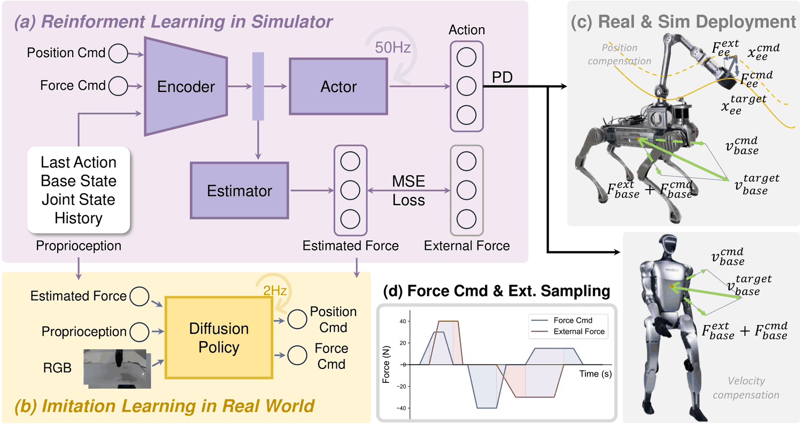
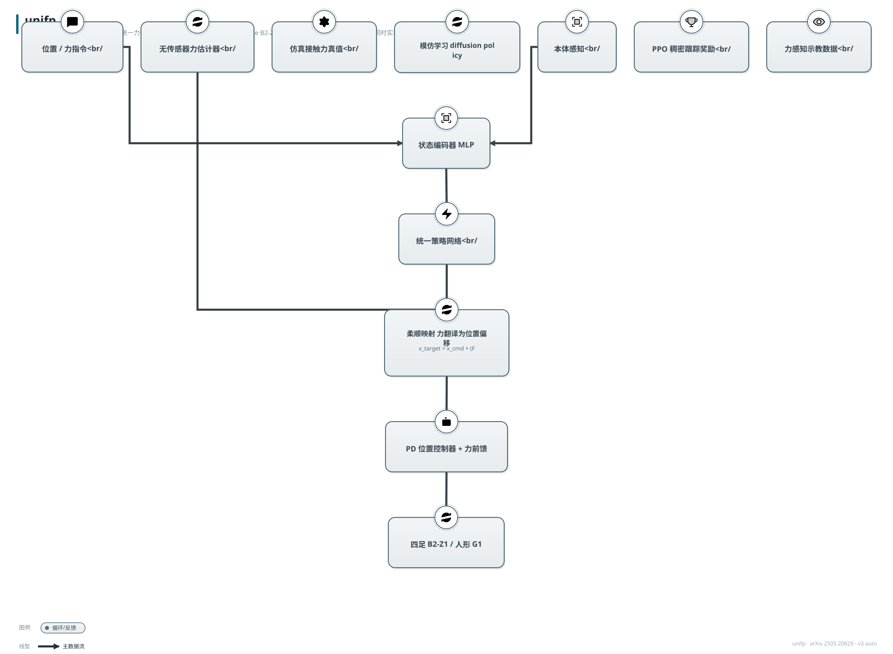

# UniFP: Learning a Unified Policy for Position and Force Control in Legged Loco-Manipulation

- 本地 PDF：`papers/architecture/UniFP_2505.20829.pdf`
- arXiv：https://arxiv.org/abs/2505.20829
- 项目页：https://unified-force.github.io/
- 年份：2025 (CoRL 2025 Best Paper)
- 团队：BIGAI (北京通用人工智能研究院), Unitree Robotics, 北京邮电大学
- 阶段：统一力位控制 —— 无需力传感器，四足+人形全身 loco-manipulation

## 一句话总结

UniFP 提出首个不依赖力传感器的统一力位控制策略——同一策略在四足（Unitree B2-Z1）和人形（Unitree G1）机器人上同时实现位置跟踪、力施加和柔顺交互，位置跟踪误差多保持在 0.1m 内、真实机器人力控误差 10N 内；其内置力估计器为模仿学习提供力感知示教数据，使接触-rich 任务成功率相对纯位置策略提升约 39.5%。CoRL 2025 Best Paper。

## 九问速览

1. **Problem**：接触-rich 操作需要力控，但力传感器昂贵稀缺、力/位模式切换工程困难
2. **Bottleneck**：纯位置策略在接触任务（擦黑板 3mm 行程推拉柜）上失败；力数据无法标注
3. **Insight**：接触力可从本体感知（关节力矩+历史状态+位置偏移）隐式估计——力指令可翻译为位置偏移
4. **Method**：Isaac Gym RL（PPO）统一策略输出 (q_d, F_d)，柔顺映射执行；内置力估计器给遥操作示教自动补力标签
5. **Evidence**：真机力控误差 <10N（指令 0-60N）；力感知示教使 4 任务成功率 +39.5%（遮挡抽屉 0.30→0.76）
6. **Ablation**：纯视觉 baseline（去力估计/力指令）在接触任务大幅失败——擦黑板无法保持接触、推柜 3mm 行程测不出
7. **Assumption**：仿真可获得力真值 + 随机扰动训练；量程 Y/Z 轴 ±40N、指令 ±60N；刚体接触为主
8. **Failure**：软接触（海绵/布料）估计精度未验证；5-10N 估计误差可能误导模仿学习
9. **Opportunity**：外骨骼力反馈遥操作、软接触力估计、更大力量程泛化

| 维度 | 论文答案 |
|---|---|
| Perception | 本体感知（关节力矩/IMU/上一步动作）为主；IL 层加视觉；无外部力传感器、无触觉皮肤 |
| Closed-loop | 强闭环：50Hz RL 策略持续输出位置+力目标，力估计器在线修正 |
| Correction | 柔顺映射本身消化外力扰动（跟随门走）；无显式任务级 retry |
| Deployment | Isaac Gym 仿真训练 + 域随机化 sim-to-real；四足 B2-Z1 与人形 G1 双平台部署 |

## 核心技术

*论文 Figure 2（p4）：Figure 2: Method Overview. (a) Architecture of the unified position-force policy trained via rein- f*

1. **统一力位控制策略** — 单一策略在位置控制和力控制之间无缝切换，无需模态切换逻辑
2. **无传感器力估计** — 不依赖力/力矩传感器，从本体感知（关节力矩、IMU）隐式推断接触力
3. **力感知示教增强** — 以学到的策略作为遥操作基础策略，执行中经内置力估计器自动记录接触力，为位置型模仿学习提供带力标签的示教数据（成功率 +~39.5%）
4. **跨本体泛化** — 同一策略部署到四足狗和人形机器人，展示力控行为的跨平台迁移

## 底层原理与数学推导

*架构速览：UniFP 提出首个不依赖力传感器的统一力位控制策略——同一策略在四足（Unitree B2-Z1）和人形（Unitree G1）机器人上同时实现位置跟踪、力施加和柔顺交互，位置跟踪误差多保持在 0.1m 内、真实机器人*

策略输出同时包含位置目标 $q_d$ 和力目标 $F_d$，通过 PD 控制器 + 前馈力实现统一执行。力估计从关节力矩 $\tau$ 通过动力学模型隐式推断接触力，无需外部力传感器。

核心的执行逻辑是"力指令 → 位置偏移"的柔顺映射：策略收到期望力 $F_{cmd}$ 后，结合环境被动反作用力 $F_{react}$ 与外力扰动 $F_{ext}$，把目标位置修正为：

$$
x_{target} = x_{cmd} + \frac{F_{ext} + (F_{cmd} - F_{react})}{K}
$$

其中 $K$ 为等效刚度——位置控制器负责把末端送到 $x_{target}$，而策略实时调整 $F_{cmd}$ 与补偿 $F_{ext}$（由学习得到的力估计器根据历史状态与目标位置偏移推断），从而实现"用力推门"与"跟着门走"的统一：力控行为最终全部通过位置目标的柔顺修正来执行，因此不需要力传感器，也不需要硬切换的力/位模式。

## 物理直觉解释

**拧瓶盖时你的手在同时做"走位"和"发力"**。你拧瓶盖的时候，既需要"手指走到瓶盖的位置"（位置控制），也需要"施加足够的扭力"（力控制）。传统机器人把这两种控制分开——位置模式和力模式之间要硬切换，而切换时机本身就是工程上最头痛的问题。UniFP 的做法是：让策略自己决定什么时候用力、什么时候用位置——就像人类操作时不会在脑子里切换"位置模式"和"力模式"——它们是同时存在的。训练时仿真器同时下发随机的力指令和位置指令并叠加外力扰动，策略被迫学会对所有组合都给出正确响应，于是"位置跟踪、施加指定力、跟踪指定力、柔顺避让"四种行为收敛进同一个策略。

**"力"在 UniFP 里不是直接输出的，而是"翻译"成位置偏移**。UniFP 的执行层只有一个位置控制器，但目标位置会被期望力修正：力指令减去环境反作用力后除以等效刚度 K，换算成该走多少偏移——这就像推一扇沉重的门：你"想用 30N 的力推"，但实际上你的手臂只是在持续朝门前进的方向移动目标点，门不让你走就自然产生力。这种"力→位置偏移"的柔顺映射（compliance）是工业阻抗控制的经典思想，UniFP 的贡献是把"该用多少力、何时撤力"的决策交给 RL 策略，而不是人工设计的切换逻辑。

**力估计器像"盲人的听风辨位"——不靠传感器，靠历史轨迹推断**。真实机器人上几乎没有力传感器，但关节力矩里其实藏着接触力的信息。UniFP 的力估计器根据机器人的历史状态和目标位置偏移隐式推断外力（训练时仿真中随机叠加外力扰动迫使它学会这一映射），实测在六个离散力等级上的估计误差仅 5-10N。更妙的是副产品：策略在执行时随手记录下估计的接触力，就能把"纯轨迹示教"升级为"带接触力标注的示教"——而纯轨迹数据连擦黑板这种基础接触任务都训不出好策略，加上力标签后成功率提升约 39.5%。

## 工程细节与实操指南

- **硬件**：四足机械臂 Unitree B2-Z1 + 人形 Unitree G1，均不依赖外部力传感器
- **力估计**：学习式力估计器，根据机器人历史状态与目标位置偏移推断外力（训练中仿真叠加随机外力扰动迫使策略学会补偿）
- **训练**：Isaac Gym 仿真，同时随机下发位置/力指令 + 外部扰动力，domain randomization（质量、摩擦、接触刚度）
- **策略架构**：MLP encoder + policy network，输出 (q_d, F_d) 联合目标
- **执行**：位置控制器 + 力指令的柔顺映射（x_target = x_cmd + (F_ext + F_cmd - F_react)/K），无需力/位模式切换
- **演示增强**：以学到的策略作为基础遥操作策略，执行中经内置力估计器自动记录接触力，增强模仿学习训练集（成功率 +~39.5%）
- **定量指标**：位置跟踪误差 ~0.1m（6000 步 rollout）、状态估计误差 ~0.05m、真实力控误差 10N 内、力估计误差 5-10N（六个离散等级，Y/Z 轴量程 40N）

## 实验协议清单

| 项目 | 论文设置 | 来源与备注 |
|---|---|---|
| 观测 | 本体感知（关节状态/力矩、基座状态、上一步动作、IMU）；IL 层另加视觉（抽屉遮挡任务） | §3、附录 A |
| 动作空间 | 联合目标 (q_d, F_d)：全身关节位置目标 + 笛卡尔力指令（[-60,60]N），50Hz | §3、附录 C.1 |
| 控制频率 | RL 策略 50Hz（PD 位置控制 + 力前馈执行）；遥操作指令 2Hz | Fig.2、§4.2 |
| 重规划频率 | 每步（50Hz 连续控制，无 chunk） | Fig.2 |
| 动作 horizon | 单步控制（无 chunk 概念）；IL 层为 diffusion policy | — |
| 数据 | RL：仿真自生成（指令+扰动随机采样）；IL：擦黑板 50 条轨迹、开/关柜+遮挡抽屉各 30 episodes（遥操作采集，MuJoCo AR/无线手柄） | §4.2、附录 A |
| 奖励 | RL：稠密跟踪奖励（末端位置/力跟踪 + 惩罚项，Table A.1）；IL：diffusion policy 模仿损失 | 附录 C、Table A.1 |
| Reset | 仿真自动 reset；真机 IL 评测未报告 reset 方式 | — |
| 成功定义 | IL 任务二值成功（如擦净/柜门开启）；控制层用跟踪误差（位置 0.1m/力 10N） | §4.1-4.2 |
| 评估次数 | IL 每任务 50 trials（每 trial 上限 1000 步≈20s）；力控实测：测力计 + 5 个末端位置 | §4.1-4.2 |
| 随机种子 | 未报告 | — |
| 扰动测试 | 有：训练时随机外力扰动（域随机化）；IL 评测含视觉遮挡场景 | 附录 C.1、§4.2 |
| 真机 | Unitree B2-Z1 四足臂 + G1 人形：力控定量 + 4 个 IL 接触任务 | §4、Fig.4 |
| 算力 | RL 训练 Isaac Gym 4096 并行环境（GPU 型号未报告）；真机部署 RTX 3090 桌面 | 附录 C、附录 A |
| 特权信息 | RL 训练用仿真力真值监督估计器（Table A.2 域随机化）；真机无任何力传感器 | 附录 B/C |

**附录陷阱自查**：
- privileged 信息：力估计器训练依赖仿真接触力真值（sim-only）；真机部署零力传感器——sim-to-real 残差集中在 Y 轴（作者自述）
- reward shaping：重度的——稠密位置/力跟踪奖励 + 多惩罚项（Table A.1），典型 RL shaping
- reset 难度：仿真自动 reset；IL 任务初始条件未报告随机化程度
- eval budget：每任务 50 trials，充足
- 底层控制栈：PD 位置控制器 + 力前馈的柔顺映射是核心兜底——学习策略输出目标，经典控制器保证稳定
- 数据优势：baseline（纯视觉策略）与本文用相同遥操作轨迹但缺力标签——差异仅力信息，归因干净

## 消融实验与分析

论文的验证以定量指标为主（位置/力跟踪误差 + 示教成功率提升），而非逐组件消融：

| 验证维度 | 设置对比 | 关键指标 |
|---------|---------|---------|
| 位置跟踪（仿真） | 6000 步随机末端轨迹 rollout | 无外力/力指令时跟踪误差多保持在 0.1m 内；Y 轴略高（自由度受限） |
| 状态估计（仿真） | 估计末端位置 vs 仿真 ground truth | 全轴误差保持在 0.05m 内 |
| 力控（仿真） | 带力指令 vs 无外力基准 | 跟踪误差略升但仍多保持 0.1m 内，力感知行为有效 |
| 力控（真实） | 力指令 0-60 N，测力计测量，5 个末端位置 | 平均误差 10 N 内；六个离散力等级估计误差 5-10 N |
| 示教数据（4.2 节） | 纯轨迹数据 vs 力感知示教（估计力标签注入位置型 IL 策略） | 成功率提升约 39.5%（摘要称四任务、正文称三任务，论文内部表述不一） |
| 任务覆盖 | 纯轨迹数据在接触-rich 任务（如擦黑板）上的表现 | 连基础接触任务都无法训练出有效策略，验证力标签的必要性 |
| 跨本体 | Unitree B2-Z1 四足机械臂 vs Unitree G1 人形 | 7 项实验同一架构跨平台部署成功 |

**核心结论**：UniFP 的验证逻辑是"定量误差 + 数据价值"双线——控制侧，位置跟踪误差 0.1m 内、状态估计 0.05m 内、真实力控误差 10N 内（估计误差 5-10N），证明无传感器力估计的精度足够实用；数据侧，纯轨迹示教连擦黑板都学不会，而注入估计力标签后成功率提升约 39.5%，直接证明"力信息缺失"才是接触-rich 模仿学习失败的根因——这也正是"力感知示教增强"设计成立的定量依据。

## 技术权衡（Trade-off）

| 优势 | 劣势与工程代价 |
|------|----------------|
| 无需力传感器，硬件成本低（真实力控误差 10N 内） | 力估计精度受限于本体感知噪声（Y/Z 轴量程仅 40N） |
| 统一策略简化系统架构（无模式切换） | 训练需要仿真中访问力 ground truth + 随机扰动分布设计 |
| 力感知示教增强模仿学习（成功率 +39.5%） | 力估计误差（5-10N）可能误导模仿学习，软接触场景待验证 |

## 技术价值与演进定位

UniFP 解决了一个 VLA 社区经常忽略的问题：**操作不只是位置控制**。大多数 VLA 输出的动作是 SE(3) 位姿，没有力的维度；现实中的插拔、拧紧、推拉都需要力感知和控制。UniFP 的三点贡献对领域有范式意义：其一，证明力控制可以从本体感知（历史状态 + 位置偏移）中隐式学习，无需力传感器——这直接把"力控能力"从高端硬件门槛中解放出来，对低成本 manipulation 平台（如 AlohaMini2 类遥操作平台）有直接启示；其二，"力指令 → 位置偏移修正"的柔顺执行架构把经典阻抗控制思想重新落地为可学习的统一策略，力/位不再互斥；其三，力估计器顺带解决了接触-rich 模仿学习的数据标注难题——机器人领域最大的瓶颈是示教数据缺失力标签，而 UniFP 证明基础策略自身就能为遥操作数据自动补充接触力标注（+39.5% 成功率）。这一"自举式数据增强"思路与 ROVE 的价值过滤、自改进类工作同属"让数据采集管线自我升级"的路线。

## 与其他论文的关系

- **ACT / Diffusion Policy** — 纯位置控制轨迹生成，UniFP 为模仿学习数据加入力维度
- **GR00T N1** — 人形全身控制，UniFP 提供了力控组件与力感知数据管线的补充视角
- **WholeBodyVLA (ICLR 2026)** — 全身 VLA，UniFP 补充了力控视角
- **ROVE (XPeng 2026)** — 同属"数据管线自我升级"路线：ROVE 用价值过滤清洗遥操作噪声，UniFP 用内置力估计器为遥操作数据补充接触力标签

## 精读问题

1. 无传感器力估计在软接触（如海绵、布料）上的精度 vs 刚体接触？力估计误差 5-10N 的构成（训练扰动分布 vs 执行误差累积）？
2. 力控制和位置控制的冲突如何解决——策略输出的力和位置目标矛盾时怎么办？K（等效刚度）的选择如何影响力/位权衡？
3. 跨本体迁移（四足→人形）中力控行为的哪些部分可以共享，哪些需要本体特定？力估计器是否跨本体复用？
4. 力感知示教中，估计力（含 5-10N 误差）注入模仿学习相对"仿真 ground-truth 力"标签的增益损失有多大？
5. 训练时随机位置/力指令与外力扰动的分布如何设计？分布范围与最终力控精度的量化关系？
6. 策略在"力指令 0-60N"之外（更大力度、长时间持续接触）的泛化表现？柔顺行为是否会被位置控制器上限约束？
