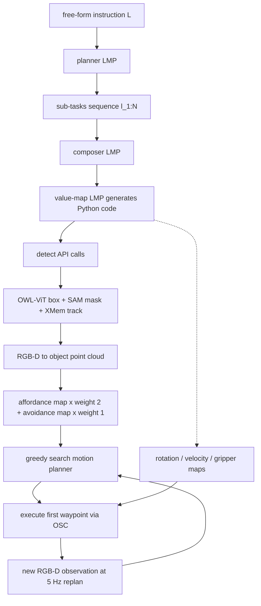

# VoxPoser: Composable 3D Value Maps

- 本地 PDF：`papers/reasoning/VoxPoser_Composable_3D_Value_Maps_2307.05973.pdf`
- arXiv：https://arxiv.org/abs/2307.05973 （v2, 2023-11-02）
- 年份：2023（CoRL 2023, Atlanta）
- 团队：Stanford University + UIUC（Wenlong Huang, Chen Wang, Ruohan Zhang, Yunzhu Li, Jiajun Wu, Li Fei-Fei）
- 阶段：不对任何组件做训练、由 LLM 写代码组合 3D value map 的零样本操作路线

## 一句话总结

VoxPoser 让 GPT-4 以 Python 代码调用开放词汇检测（OWL-ViT）、分割（Segment Anything）与追踪（XMem），再把指令蕴含的 affordance 和 constraint 直接写进机器人观测空间的 100x100x100 体素价值图——运动规划器取归一化 affordance 图乘 2 加 avoidance 图乘 1 的负值作 cost，greedy search 合成 6-DoF 末端航点并以 5 Hz 重规划闭环执行；全程没有任何训练，真实世界 5 个日常操作任务平均成功率 88%（扰动下仍 70%），与 Code as Policies 变体的 24%（扰动下 0%）形成量级差距。

## 核心技术

1. **代码接口生成 value map**：指令以注释形式写进 prompt，LLM 输出 Python 代码，其中调用感知 API 获得"实体"的空间几何（中心位置、occupancy grid、平均法向量），再用 NumPy 操作 3D 数组在相关位置赋值（把手区域设高值吸引、花瓶周围设低值排斥）。这一观察的前提是论文的核心论断：LLM 不适合直接输出文本形式的控制动作，但擅长推断语言条件化的 affordance 与 constraint
2. **entity of interest 抽象**：value map $V \in \mathbb{R}^{w \times h \times d}$ 引导的对象不一定是末端执行器，也可以是物体或物体部件（推垃圾入簸箕时被引导的是垃圾本身）；任务代价按该实体穿越体素的取值累加计算
3. **五类 map 与两级 LMP 编排**：affordance / avoidance / 末端速度 / 末端旋转 / 夹爪动作五种 map 各有一个 LMP；之上再有 planner（把用户指令 $L$ 拆成子任务序列 $\ell_{1:N}$）和 composer（拿到当前子任务 $\ell_i$ 后调度相应 map LMP）两个高层 LMP，沿用 Code as Policies 的递归 LMP 结构
4. **模型式规划的零样本闭环**：用零阶优化（随机采样轨迹打分）加 greedy search 求 collision-free 的末端位置序列 $p_{1:N} \in \mathbb{R}^3$，之后在各个位置上由旋转/速度/夹爪 map 补齐参数；执行第一个 waypoint 即重规划，频率 5 Hz。生成的代码在一个子任务内保持不变，因此可以缓存其输出，使 LLM 在环的情况下仍能高频闭环
5. **在线经验的可选扩展**：零样本合成的轨迹虽有意义但不充分，可将其作为动作采样分布的先验 $P(a_t \mid o_t, \tau_0^r)$（只在先验附近加小噪声采样），交替采数据与拟合 MLP dynamics model，少数几分钟交互即可完成开合铰链这类接触密集任务

## 底层原理与数学推导

**第一步：把操作写成约束优化。** 指令 $L$ 先由高层规划器分解为子任务序列 $L \to (\ell_1, \ell_2, \dots, \ell_n)$，对每个子任务求机器人的稠密末端航点轨迹 $\tau_i^r$（每个 waypoint 含期望 6-DoF 位姿、速度、夹爪动作，交由 Operational Space Controller 执行）。全文的形式化出发点是：

$$\min_{\tau_i^r} \left\{ F_{task}(T_i, \ell_i) + F_{control}(\tau_i^r) \right\} \quad \mathrm{subject\ to}\ C(T_i)$$

其中 $T_i$ 是环境状态演化，$\tau_i^r \subseteq T_i$ 是机器人轨迹，$C(T_i)$ 是动力学与运动学约束（由已知机器人模型和环境模型保证）。难点在于：不存在带 $T_i$ 与 $\ell_i$ 标注的机器人数据来直接学 $F_{task}$。

**第二步：用体素图替代表示 $F_{task}$。** 论文的关键观察是大量任务可以由一张"引导 interest 实体 $e$"的体素价值图刻画。给定子任务 $\ell_i$ 对应的 $V_i$，任务代价近似为实体轨迹上的取值累加：

$$F_{task} = -\sum_{j=1}^{|\tau_i^e|} V(p_j^e)$$

$p_j^e \in \mathcal{N}^3$ 是实体在第 $j$ 步离散化后的坐标。于是"理解一条自由语句"被转译为"往体素数组里写数值"，这正是 LLM 靠写代码能完成的事。

**第三步：规划器实际消费的组合形式。** 论文没有让规划器吃全部五类 map：优化中只用 affordance 与 avoidance 两张 cost 图，其余三类（旋转、速度、夹爪）在得到位置路径后逐点施加。cost 的显式构造为：

$$
\begin{aligned}
C_{plan}(p) &= -\left( w_a \cdot \hat{V}_{aff}(p) + w_c \cdot \hat{V}_{avo}(p) \right) \\
w_a &= 2, \qquad w_c = 1
\end{aligned}
$$

即归一化后的两张图按固定权重 2:1 加权取负。稀疏赋值会让轨迹优化不稳定，所以 affordance 图经 Euclidean distance transform 致密化、avoidance 图经 Gaussian filter 平滑，鼓励规划器给出更平滑的路径。注意权重是作者固定的实验配置，不是由 LLM 输出的额外变量。

**第四步：SE(3) 与夹爪的扩展映射。** 位置项只覆盖三维平移，完整轨迹还需要姿态与开关：旋转图 $V_r : \mathcal{N}^3 \to SO(3)$ 在任务相关位置指定朝向（如"末端要对准把手的支撑法向"），对应数组形状 $(100, 100, 100, k)$ 中 $k = 4$（四元数维数）；夹爪图 $V_g : \mathcal{N}^3 \to \{0, 1\}$ 控制开闭；速度图 $V_v : \mathcal{N}^3 \to \mathbb{R}$ 指定目标速度倍率。它们不在规划目标里出现，而是作为轨迹参数化的一部分参与 Equation 1 的求解。

**第五步：把零样本轨迹变成探索先验。** 动力学学习的目标是拟合 $g_\theta$ 使预测下一帧观测与真实下一帧的 $L_2$ 误差最小。决定样本效率的是动作采样分布：与其在全动作空间随机采样，不如以零样本轨迹 $\tau_0^r$ 为均值、仅在其邻域内探索：

$$a_t \sim P(a_t \mid o_t, \tau_0^r), \qquad a_t = a_t^{\pi_0} + \varepsilon, \quad \varepsilon \sim \mathcal{N}(0, \sigma^2)$$

直觉上这相当于把"打开门需要先压下手把"这类常识从 LLM 迁移给探索过程，让绝大多数采样都落在与任务物体有实质接触的状态附近。

## 物理直觉解释

**value map 就是现场铺一张人工电场。** 中学物理里，带正电的板 attracting 一颗探针电荷、带负电的板 repelling 它，合力自然把探针推到低能量的安全路径上。VoxPoser 干的就是这件事的机器人版：affordance 图是"洼地"，avoidance 图是"高地"，greedy search 相当于让一颗小球沿等高线往低处滚。区别在于传统 potential field 的势场要工程师手写公式，这里改由 LLM 听完一句人话后当场布置场源。RT-2 走的是另一极端——用一个 55B 参数的网络把无数张这样的场地隐式记在权重里，所以它泛化靠的是数据覆盖度，VoxPoser 泛化靠的是命题式常识的重排。

**闭环鲁棒性的来源不是记忆而是检查频率。** 一个出发前就把整条路线背熟的司机会在第一次封路时崩溃；一个每五秒刷新一次导航的司机几乎感觉不到事故的存在。VoxPoser 的"导航刷新"有两层：其一是感知层的 5 Hz 重规划，物体的位移、外力的推动、被人拉回原位的抽屉都会在下一次重规划时体现为新点云驱动的两张新地图；其二是语义层的指令解释不会漂移——因为子任务内的代码被缓存复用，同一句"watch out for the vase"在整个阶段持续生效。这也解释了 Table 1 里最反直觉的一列：基线在扰动下全军覆没（0%），而 VoxPoser 只从 88% 掉到 70%，掉的部分大多是感知管线的锅而不是推理的锅。

**把「教机器人技能」替换成「问一个读过全网的人」。** RT-1 用 13 万条真机 episode 教会机械臂"肌肉记忆"，代价是每一类新行为都要重新采集；VoxPoser 从不积累肌肉记忆，它每次都去问一个已经读过整个互联网的语言模型："打开顶层抽屉时，什么东西应该被抓住？向哪个方向平移？还要避开什么？"这三个问题的答案本来就存在于语言模型的预训练分布中。真正的巧妙之处在于答案的表达载体选得极准：不是概率意义上的动作 token（RT-2 的路线，需要昂贵的微调把它们对齐到机器人本体），也不是一句含糊的自然语言计划（PaLM-E 的输出，还得交给预训练好的下层策略兜底），而是 NumPy 数组下标——一种既能被机器人直接消费、又能被人类逐格调试 check 的中间表示。

## 工程细节与实操指南

**真机硬件与控制栈**（Appendix A.4）：Franka Emika Panda 桌面平台，Operational Space Controller（impedance 由 Deoxys 提供）；两台 Azure Kinect RGB-D 分置桌面两角，rollout 开始后持续以 20 Hz 回传实时 RGB-D。仿真（A.5）为 SAPIEN 里的同款 Panda，4 台 RGB-D 各指工作区一角，控制器输入期望 6-DoF 位姿，IK 插值出 waypoint 序列后交给 PD 控制；官方开源实现基于 RLBench 搭建（github.com/huangwl18/VoxPoser）。

**LLM 与提示结构**：GPT-4（OpenAI API）。沿用 Liang et al.（Code as Policies）的递归 LMP 结构——每个 LMP 负责单一功能并用自己生成的代码继续调用后续 LMP；每个 LMP 的 prompt 内含 5-20 个示例查询及对应回答。两种环境各维护一套 planner / composer / parse_query_obj / get_affordance_map / get_avoidance_map / get_rotation_map / get_gripper_map / get_velocity_map prompt，全文公开在项目主页 prompts 目录下。

**感知管线是一条固定流水线**：物体/部件查询词先给 OWL-ViT 出 bounding box，再喂 Segment Anything 出 mask，随后由视频追踪器 XMem 在时间轴上维持这条 mask，最后把 tracked mask 与 RGB-D 配准重建物体/部件的点云。论文在错误分析中承认这是全系统最脆的一环：detector 对物体初始摆放位姿敏感，检测部件（handle、pump 这类局部结构）比整体物体更不稳。

**暴露给 LLM 的 API 面**（A.3，除 NumPy 与 Transforms3d 外）：`detect(obj_name)` 返回实例字典列表（中心位置、occupancy grid、平均法向量）；`execute(movable, affordance_map, avoidance_map, rotation_map, velocity_map, gripper_map)` 调起运动规划器，MPC 模式下 movable 与各 map 都是可随最新观测重新求值的函数对象；`cm2index` / `index2cm` 在厘米位移与体素下标间换算；`pointat2quat(vector)` 把期望指向转成满足约束的目标四元数；`set_voxel_by_radius(map, xyz, radius_cm, value)` 做球形区域赋值；另有 `get_empty_affordance_map()`（初值 0，值高吸引）、`get_empty_avoidance_map()`（初值 0，值高排斥）、`get_empty_rotation_map()`（初始化为当前末端四元数）、`get_empty_gripper_map()`（1 表示闭合）、`get_empty_velocity_map()`（初值 1，数值为默认速度的倍率）以及 `reset_to_default_pose()`。

**地图后处理与规划参数**：所有 map 形状 $(100, 100, 100, k)$，cost 类 $k = 1$、旋转类 $k = 4$；affordance 做 Euclidean distance transform、avoidance 做 Gaussian filter；规划 cost 为归一化 affordance 加权 2、avoidance 加权 1 后取负；greedy search 得到无碰撞位置序列后再叠加旋转/速度/夹爪参数；合成 6-DoF 轨迹后只执行第一个 waypoint，随后以 5 Hz 重规划。子任务内的生成代码会被缓存，这是"LLM 在环但仍能闭环执行"的实现关键。

**扰动协议**（A.4）：每个任务分静态与扰动两档评测，扰动在开始前预排好序列，共三类——对机器人施加随机外力、随机挪动任务相关物体与 distractor 物体、撤销任务进度（如机器人在关抽屉时人为把它拉回去）；第三类只用于 interest 实体为物体/部件的任务。基线是与 VoxPoser 同源的 Code as Policies 变体，仅有 `move_to_pos` / `rotate_by_quat` / `set_vel` / `open_gripper` / `close_gripper` 五个 primitive，刻意不提供 pick-and-place 这类领域特化能力。

**在线学习的实现要点**（A.4 / Sec 3.4）：绝大多数任务的 interest 实体就是机器人，环境动力学直接假设静态场景、靠逐步重规划吸收变化；interest 实体为物体时仅研究了平面推动一种情况——启发式动力学模型把输入点云沿推动方向平移 push distance，接触点、方向、距离三个动作参数由 random shooting MPC 选优，选出后执行预定义的 pushing primitive。作者注明当动作参数定义在末端或关节空间时这个 primitive 并非必需。探索噪声写作 $\varepsilon \sim \mathcal{N}(0, \sigma^2)$，待确认：正文未给出 $\sigma$ 的具体数值，附录亦只有 prompt 文本。

**仿真环境的属性划分**（A.5）：13 个模板任务合计 2766 条唯一指令；seen 属性如 $[dist] \in \{3, 5, 7, 9, 11\}$ cm、seen 物体为 blue/green/yellow/pink/brown block，unseen 属性把对应集合换为 4/6/8/10 cm 与 red/orange/purple/cyan/gray 等；seen 属性允许出现在 prompt 或监督基线的训练数据里，unseen 则不允许。

**论文自报的四项涌现能力**（A.2）：行为常识（"I am left-handed" 会把叉子从碗右侧移到左侧）、细粒度语言修正（盖壶盖偏了时可说 "you're off by 1cm" 触发调整）、多步视觉程序（"open the drawer precisely by half" 因缺少物体模型而无先验信息，模型自创流程——先全开并记录把手位移，再关回中点）、物体物理性质估计（借斜坡做对照实验判断哪块积木更重——有趣的是它选了滑得更远的那块，这在无摩擦理想世界里其实分不出轻重，LLM 继承了与人类相似的推理偏差）。

## 消融实验与分析

论文没有经典意义的"去掉本方法某一模块"消融，而是做了两组严格的成分替代实验：仿真里把 VoxPoser 拆解为"LLM 成分"与"运动规划器成分"，分别与监督学习 costmap（U-Net + MP，Sharma et al.）和 LLM 加 primitive（Code as Policies 变体）对照；真机上则考察扰动鲁棒性这一系统级性质。

**仿真域：成分替换对照**（block-world，13 任务 x 20 episode 取均值；SI/UI 为 seen/unseen instruction，SA/UA 为 seen/unseen attribute）：

| 设定切分 | U-Net + MP（学 costmap） | LLM + Prim.（代码参数化 primitive） | VoxPoser（LLM 组合 value map + 规划器） |
|---|---|---|---|
| SI SA Object Interactions | 21.0% | 41.0% | 64.0% |
| SI SA Spatial Composition | 53.8% | 43.8% | 77.5% |
| SI UA Object Interactions | 3.0% | 46.0% | 60.0% |
| SI UA Spatial Composition | 3.8% | 25.0% | 58.8% |
| UI UA Object Interactions | 0.0% | 17.5% | 65.0% |
| UI UA Spatial Composition | 0.0% | 25.0% | 76.7% |

**核心结论**：两个成分各自砍掉一个的收益都巨大且方向不同——把"学 costmap"换成"LLM 显式推理 affordance/constraint"，Spatial Composition 在从 seen 到完全 unseen 时几乎不掉（77.5% 到 76.7%），而 U-Net 从 53.8% 崩到 0%；把"primitive 参数化"换成"体素图联合优化"，Object Interactions 类里所有档位都领先。附录逐任务表还提供了诚实的反面数据：`grasp the [obj] from the table at [velocity]` 上 primitive（SA 75.0% / UA 70.0%）高于 VoxPoser（65.0% / 40.0%），`drop the [obj] to the [pos]` 上两者同为 UA 100.0%——单相、无需空间组合的任务并不是 VoxPoser 的主场。

**真实世界：5 任务 x 静态/扰动**（每格 10 次，Franka Panda 双 Azure Kinect）：

| 任务 | LLM+Prim. 静态 | LLM+Prim. 扰动 | VoxPoser 静态 | VoxPoser 扰动 |
|---|---|---|---|---|
| Move & Avoid | 0/10 | 0/10 | 9/10 | 8/10 |
| Set Up Table | 7/10 | 0/10 | 9/10 | 7/10 |
| Close Drawer | 0/10 | 0/10 | 10/10 | 7/10 |
| Open Bottle | 5/10 | 0/10 | 7/10 | 5/10 |
| Sweep Trash | 0/10 | 0/10 | 9/10 | 8/10 |
| Total | 24.0% | 0.0% | 88.0% | 70.0% |

**核心结论**：空间级组合在一次联合优化里发生、且每步都能依据最新观测重算这两件事，共同造就了对扰动工程意义上可用的鲁棒性（88.0% 到 70.0%）；顺序 chaining primitive 的架构则在扰动列全面清零，连原本静态成功 7/10 的 Set Up Table 也守不住。

**仿真域：零样本先验对动力学学习效率的影响**（开合铰链类，3 个随机种子，TLE 为超过 12 小时上限）：

| 任务 | Zero-Shot 成功率 | 仅在线学习（成功率 / 学习时长） | 零样本先验 + 在线学习（成功率 / 学习时长） |
|---|---|---|---|
| Door | 6.7%±4.4% | 58.3%±4.4% / TLE | 88.3%±1.67% / 142.3±22.4 s |
| Window | 3.3%±3.3% | 36.7%±1.7% / TLE | 80.0%±2.9% / 137.0±7.5 s |
| Fridge | 18.3%±3.3% | 70.0%±2.9% / TLE | 91.7%±4.4% / 71.0±4.4 s |

**核心结论**：零样本轨迹"通常有意义但不充分"（独立使用时 Door 只有 6.7%、Fridge 也才 18.3%），把它降级成探索先验却是质变——三组成功率升到 80%-92% 且交互时长全部折算在 3 分钟以内（142.3 / 137.0 / 71.0 秒），对照组则一律撞上 12 小时的时限墙。

**错误归因**（Sec 4.4，仿真中持有 ground-truth 感知与动力学的条件下分解）：三类错误来源为 dynamics error、perception error、specification error（错误出现在给低层规划器/primitive 定 cost 或参数的模块）。Fig. 4 显示 VoxPoser 把 specification error 压到三种方法中最低；文中同时说明真机实验的主要错误来自感知侧。

## 技术权衡（Trade-off）

| 这一侧 | 另一侧 |
|---|---|
| 零训练即可执行开放集指令、开放集物体，新任务的边际成本只是写一段更好的 prompt example | 四个限制都被作者明确列出：依赖外部感知模块、缺少通用动力学模型无法泛化地处理接触密集任务、规划器只考虑末端轨迹（whole-arm planning 未纳入）、需要手工 prompt 工程 |
| specification error 全场最低，代价是真实世界瓶颈转移到了感知管线（初始位姿敏感、部件检测不稳） | 每个涉及视觉 grounding 的环节都可能失败，任务成败上限被 detect-SAM-track 链的最弱一环锁死 |
| 5 Hz 重规划换来对移动物体与人为干扰的强鲁棒性 | LLM 首次调用的延迟与费用仍在——虽然子任务内缓存规避了逐帧调用，长程任务的 planner/composer 次数依然线性增长 |
| 五类 map + 权重固定（2:1）的组合足够覆盖日常指令 | 组合语义受限：约束必须能写成体素位置的函数，接触力约束、关节空间可行性这类量本质上难以表达（论文将其列为未来工作的轨迹优化接口问题） |
| 兴趣实体抽象让 value map 同时服务"手到位"与"物到位"两类任务 | 实体为物体时目前只有平面推动一种启发式动力学模型，锁死了可执行的任务族 |

## 技术价值与演进定位

VoxPoser 给前四篇论文串成的"数据与规模叙事"提供了一个反向参照系。RT-1 用 13 万条离轨数据买 97% 的熟悉任务成功率，RT-2 用互联网知识微调买到 unseen 62 的涌现语义泛化，OXE 证明跨具身迁移的正迁移效应需要容量解锁，PaLM-E 把观测塞进 LLM 嵌入空间换取端到端的具身推理——它们的公共前提都是"机器人行为要从数据中来"。VoxPoser 开篇点破的正是这个瓶颈的另一种解法：如果 LLM 已经内化了世界知识，缺的只是一个把知识落到观测空间的接口，那么技能习得的成本可以从采集 episode 变成设计 API。论文自己也划定了思想谱系——它与路径规划中的 potential field 方法（Hwang & Ahuja 1992）和操作规划中的约束优化（sequence-of-constraints MPC 一脉）血脉相连，VoxPoser 本质上是"谁来定义势场"这个老问题的 LLM 版回答。

它对后续研究的三点可继承资产：其一，value map 作为语言-控制的中间表示比动作 token 更可检查、比文本计划更可直接执行，团队此前的 SayCan 是用从数据中学的 affordance 打分器挑 primitive，这里是彻底抛开学习得到的 affordance 函数；其二，"冻结大模型 + 组合现成模块"这条系统路线在操作域被验证可行——不训练大模型也能获得开放集能力；多模态 LLM（论文 future work 明确点名）成熟后视觉 grounding 可以并入主干，从而收窄最脆弱的那段管线；其三，零样本轨迹作为强化学习/动力学学习探索先验的角色，是"foundation model 做先验、小模型做适应"这一模式在操作域的清晰示范——零样本版本自己干不了压门把这种活，但它足以把 12 小时的探索压缩到 3 分钟。

## 与其他论文的关系

- **RT-1** — 时间尺度上的镜像：RT-1 用 13 万 episode 与 700+k 步预训练换来 3 Hz 端到端闭环推理，鲁棒性内建于网络权重；VoxPoser 一条机器人数据都不用，鲁棒性外置于 5 Hz 重规划循环。两者恰好论证了闭环能力既可以买（数据）也可以租（模型基础结构的更新频率）。
- **RT-2** — 同样押注 LLM 的世界知识，但知识的注入通道相反：RT-2 通过 co-fine-tune 把互联网知识压进动作 token 分布（unseen 平均 62），VoxPoser 让冻结的 GPT-4 经代码接口输出空间约束。前者付出机器人数据的代价换执行平滑性，后者付出系统复杂度的代价换零样本性与可解释性。
- **Open X-Embodiment / RT-X** — OXE 押注跨具身数据规模化（22 种 embodiment、超过 100 万 episode 的合并池），核心发现是正迁移需要容量解锁；VoxPoser 从设计上就绕开了跨具身对齐问题——因为没有训练，就不存在"具身差异要不要对齐"的问题，但其代价是知识不会随数据增长，两条路线的 scaling axis（data vs prior）互为对方缺失的那个维度。
- **PaLM-E** — 结构上的近亲与分岔点：两者都用 LLM 把指令拆成子任务序列（PaLM-E 输出高层技能文本交给 RT-1 式下层策略，VoxPoser 的 planner LMP 输出 $\ell_{1:N}$ 交给 composer），分岔在于对下层能力的假设——PaLM-E 假设存在一个预训练好的连续控制策略，VoxPoser 假设存在一个可以把势场吃下去的传统规划器。PaLM-E 选择造最大的具身多模态骨干（562B），VoxPoser 选择完全不造骨干。
- **Code as Policies** — 直接前身与最强基线（同样出自 Stanford，prompt 基建被 VoxPoser 整套继承）。差别在组合发生的层级：CaP 顺序链接 primitive 调用（policy logic 级组合），VoxPoser 在一次联合优化里叠空间约束（spatial 级组合）；真机总数 24.0%/0.0% 对 88.0%/70.0% 是两种组合层级的正面成绩单，同时仿真显示纯抓取类单相位任务上 CaP 反而更高，说明这不是全面碾压而是任务谱系的分化。
- **SayCan** — 同一作者谱系内的演进节点：SayCan 需要 skill 打分 affordance（从真实机器人数据学来），VoxPoser 用 LLM 现写的体素图替代了那个学习出来的 affordance 评分器，affordance 判断从"可调用技能表上的后验概率"变成"观测空间中的一张数值图"。
- **Sharma et al. costmap 学习（Correcting Robot Plans）** — Table 2 的监督学习对照组：同样的语言条件 costmap 目标，用 U-Net 从训练分布学出的 costmap 在 SI SA Composition 上拿 53.8%，一旦属性离开训练集就归零（SI UA 3.8%、UI UA Composition 0.0%），是"分布内便宜、分布外归零"这一监督范式的标本。

## 精读问题

1. **fixed-weight 组合是不是隐藏上限**：cost 恒为 $- (2 \hat{V}_{aff} + 1 \hat{V}_{avo})$ 这一线性加权，但 Table 2 的 Composition 类与附录里 `push the [obj] while staying away from [obstacle]` 的失败率提示：当多个约束互相冲突（既要快又要在障碍旁慢下来）时，固定权重与贪心搜索可能系统性偏向某一方——权重应交由 LLM 按任务语义在线分配，还是应改为字典序/约束满足式规划？
2. **specification error 压缩后剩余错误的极限在哪**：Fig. 4 显示 VoxPoser 的 specification error 三者最低，但真机主要错误落在感知侧——若换成一体的多模态主干直接出 value map（论文 future work 方向），detect-SAM-track 链引入的误差是消失还是变换形态（例如被主干的全局视觉推理部分吸收）？可否设计实验把感知误差与规范误差解耦测量？
3. **5 Hz 重规划能否被视为一种"免费策略学习"**：Table 1 显示重规划闭环在人工扰动下守住 70%，但这依赖扰动落在"能被立即观测到"的范畴；对改变物体内在状态（关盖时卡扣形变、瓶盖螺纹滑丝）这类观测不可逆的干扰，5 Hz 刷新为什么注定失效？由此推断哪一类任务必须回到"从数据中学底层技能"的 RT-1 路线？
4. **先验-学习分工的边界如何定量刻画**：Table 3 中 w/ Prior 把 Door 从 TLE 压到 142.3±22.4 秒，但 Window 与 Fridge 的零样本起点差了近三倍（3.3% vs 18.3%）——零样本成功率的初始值对最终达到的成功率与时长的贡献关系是什么？是否存在零样本先验太差（连方向都不对）以至于反而拖慢学习的情形？
5. **entity of interest 抽象的适用范围**：推垃圾、放餐具、"更重的积木"实验都成立，是因为这些任务的空间自由度高且接触模式简单；对需要精确力反馈的任务（拧紧药瓶到阻力阈值、按泵头至定量出液），体素图的三类扩展（旋转/速度/夹爪）里哪一项最先成为表达瓶颈，需要什么样的新 map 类型？
