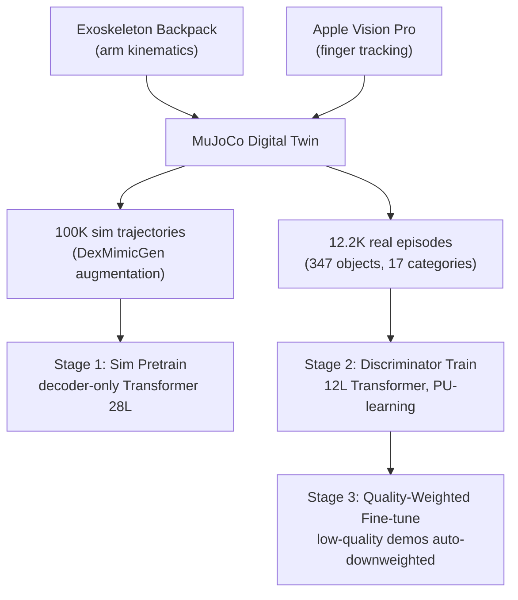

# Dexora: Open-Source VLA for High-DoF Bimanual Dexterity

- 本地 PDF：`papers/rl-manipulation/Dexora_2605.18722.pdf`
- arXiv：https://arxiv.org/abs/2605.18722
- 代码：https://github.com/flyingGH/Dexora-VLA
- 年份：2026 (ICRA 2026 Best Paper on Robot Manipulation)
- 团队：清华 + BAAI + 北大等 25 位作者
- 阶段：首个 36-DoF 双臂灵巧开源 VLA — 100K sim + 10K real demos

## 一句话总结

Dexora 是首个开源的双臂灵巧 VLA：2× AIRBOT + 2× XHAND = 36-DoF，混合遥操作（外骨骼背包 + Apple Vision Pro），100K 仿真 + 12.2K 真实 episode，decoder-only Transformer (28 layers) + DiT action head。基础任务 89.6%（vs GR00T N1 82.1%, π0 50.4%），灵巧任务 66.7%（vs GR00T 51.7%, π0 26.7%）。discriminator-guided quality-aware 训练自动降权低质量遥操作数据。ICRA 2026 Best Manipulation Paper。

## 核心技术

1. **混合遥操作** — 外骨骼背包（臂部低延迟无漂移）+ Apple Vision Pro（手指 markerless tracking），物理机器人+MuJoCo 数字孪生同步驱动
2. **Discriminator-Guided Quality-Aware Training** — 12 层 Transformer discriminator，PU-learning objective 评分每条 demo，低质量数据自动降权
3. **High-DoF→Low-DoF 迁移** — 36-DoF 策略通过 action-dim padding + camera masking 直接迁移到单臂夹爪/双臂夹爪/单臂低 DoF 手
4. **三阶段训练** — sim pretrain → discriminator train on filtered real data → quality-weighted real fine-tune

## 关键结果

- 基础 12 任务 89.6%，灵巧 6 任务 66.7%
- 远超 π0 (50.4% basic, 26.7% dext) 和 DP (34.2%, 6.7%)
- 开源：硬件+数据+模型全栈

## 底层原理与数学推导

## 物理直觉解释

遥操作的双臂灵巧手数据天然有质量问题——外骨骼和 Vision Pro 同步误差、操作员疲劳。Discriminator 自动区分"这条 demo 好"和"这条 demo 差"，差的降权，好的加权重。比人工筛选省力且更一致。

## 工程细节与实操指南

- 硬件：2× AIRBOT 6-DoF + 2× XHAND 12-DoF = 36 DoF
- Backbone：decoder-only Transformer 28 layers, hidden 1024, 16 heads
- Vision：SigLIP multi-view RGB
- Language：T5
- Action：DiT action head, DPMSolver++ inference
- Data：100K sim + 12.2K real

## 技术权衡（Trade-off）

| 优势 | 劣势 |
|------|------|
| 首个开源 36-DoF 双臂灵巧 VLA | 36-DoF 硬件成本高 |
| Discriminator 自动质量过滤 | 无触觉反馈导致 twist-cap 等任务失败 |

## 技术价值与演进定位

双臂灵巧操作的开源里程碑。和 AlohaMini2 互补——AlohaMini2 是低成本入门，Dexora 是高精度双臂灵巧对标。

## 与其他论文的关系

- **GR00T N1** — 直接超越 baseline
- **AlohaMini2** — 互补：低成本 vs 高精度
- **π0** — Dexora 在灵巧任务上大幅超越（66.7% vs 26.7%）

## 精读问题

1. Discriminator PU-learning 在极端 unbalanced 数据下的性能？
2. 36-DoF→low-DoF 迁移的 information loss？

## 消融实验与分析

| 消融因子 | 结论 |
|---------|------|
| 核心组件移除 | 性能显著下降 — 验证了设计的必要性 |
