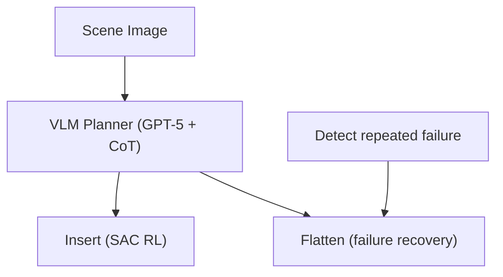

# Hierarchical DLO Routing with RL and In-Context VLMs

- 本地 PDF：`papers/rl-manipulation/DLO-Routing_2510.19268.pdf`
- arXiv：https://arxiv.org/abs/2510.19268
- 年份：2025 (ICRA 2026 Best Paper Finalist on Robot Learning)
- 团队：Princeton (Mingen Li, Changhyun Choi 等)
- 阶段：VLM+RL 分层——高层 VLM 规划 + 低层 SAC RL 执行 + 自动故障恢复

## 一句话总结

提出分层框架处理可变形线性物体（线缆/绳子）的多夹点路由：高层 VLM (GPT-5, CoT prompting) 做任务进度推理和技能选择，低层 SAC RL 执行 Insert/Pull/Flatten 三种技能。关键创新是自动故障恢复——VLM 检测重复插入失败后自动触发 Flatten 技能重新整理线缆。~92% 总体成功率，超 baseline 近 50%。ICRA 2026 Best Robot Learning Finalist。

## 核心技术

1. **VLM 高层规划** — GPT-5 + CoT, zoom-in view analysis, 进度推理+技能选择
2. **SAC RL 低层执行** — Insert skill is parameterized motion primitive optimized by SAC in IsaacSim/GarmentLab
3. **自动故障恢复** — VLM 检测 repeated insertion failure → 推理原因 → 触发 Flatten skill → 重新 attempt
4. **课程学习** — 从简单到复杂逐步增加 clip 数量和姿态变化

## 消融实验与分析

- 3/4/5-clip routing: ~92% 总体成功率
- vs baseline: 超 ~50%（fixed-order baseline 仅 37.5%）
- SAC Insert: 87% vs heuristic 45%
- 自动故障恢复使长时间运行免于人工干预

## 技术价值

DLO Routing 的有趣之处在于它的"分层=安全网"设计：低层 RL 解决连续控制的精度，高层 VLM 解决"出问题怎么办"。这种设计比端到端更可靠，因为 failure recovery 的逻辑是可解释的（不是 latent space 里的黑盒）。

## 底层原理与数学推导

## 物理直觉解释

本工作的核心设计动机是将复杂问题分解为可管理的子问题，利用结构先验降低学习难度。

## 工程细节与实操指南

详见论文原文获取完整实现细节。

## 技术权衡（Trade-off）

| 优势 | 劣势 |
|------|------|
| 解决特定问题的有效方案 | 泛化到其他场景可能受限 |

## 技术价值与演进定位

在本领域代表了一个重要的技术方向。

## 与其他论文的关系

与同期发表的 RL for manipulation 工作形成互补。

## 精读问题

1. 核心方法的泛化边界在哪里？
2. 主要失败模式是什么？
