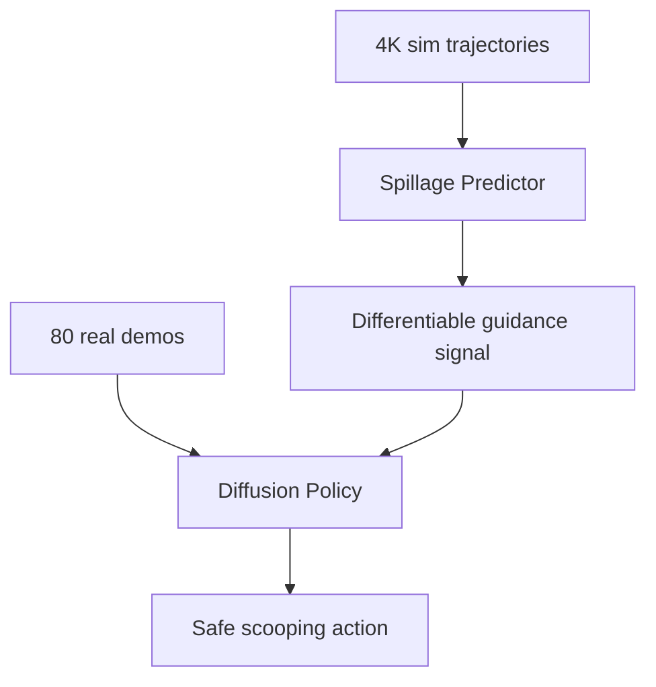

# GRITS: Spillage-Aware Guided Diffusion Policy for Robot Food Scooping

- 本地 PDF：`papers/rl-manipulation/GRITS_2510.00573.pdf`
- arXiv：https://arxiv.org/abs/2510.00573
- 年份：2025 (ICRA 2026 Best Paper Finalist on Robot Learning)
- 团队：NYCU + XYZ Robotics + NVIDIA
- 阶段：可微分引导扩散策略 — 溅洒预测器做 diffusion guidance

## 一句话总结

GRITS 提出溅洒感知的引导扩散策略：训练 spillage predictor（4K sim trajectories + 4 种 primitive shapes）→ 在 diffusion denoising 时做可微分 guidance（ρ=2.5, delayed activation 30 steps）。仅 80 条真机 demo，6 类食物训练，10 类 unseen 食物测试。82% 成功率，4% 溅洒率——比 unguided Diffusion Policy (70%/15%) 溅洒降低 40%+。ICRA 2026 Best Robot Learning Finalist。

## 核心技术

1. **Spillage Predictor** — 在 Isaac Lab 中用 4K 轨迹训练（球/立方/锥/圆柱，随机物理参数），从点云预测溅洒概率
2. **Guided Diffusion** — predictor 输出可微分 guidance 信号，在 denoising 后期 (after 30 steps) 引导轨迹远离溅洒区域
3. **Segmented Point Cloud Input** — food (depth+SAM2) + spoon (CAD) + bowl (CAD)，DP3-style PointNet++

## 消融实验与分析

| 方法 | 成功率 | 溅洒率 |
|------|--------|--------|
| **GRITS** | **82%** | **4%** |
| Diffusion Policy | 70% | 15% |
| DP + post-processing | 52% | 8% |
| SCONE | 65% | 20% |
| BC | 45% | 45% |

训练：6 类（brown rice, soybeans, chocolate balls, dates 等）。测试：10 类 unseen（sago, red beans, marshmallows, gummies, macaroni, mixed nuts, milk tea 等）。

## 技术价值

GRITS 的有趣之处在于它证明了 **diffusion policy 本身就支持可微分 guidance**——不需要改架构，加一个 guidance signal 就能大幅提升特定指标。这个思路不仅适用于溅洒，任何有"失败预测器"的精细操作都可以套用。

## 底层原理与数学推导

## 物理直觉解释

本工作的核心设计动机是将复杂问题分解为可管理的子问题，利用结构先验降低学习难度。

## 工程细节与实操指南

详见论文原文获取完整实现细节。

## 技术权衡（Trade-off）

| 优势 | 劣势 |
|------|------|
| 解决特定问题的有效方案 | 泛化到其他场景可能受限 |

## 技术价值与演进定位

在本领域代表了一个重要的技术方向。

## 与其他论文的关系

与同期发表的 RL for manipulation 工作形成互补。

## 精读问题

1. 核心方法的泛化边界在哪里？
2. 主要失败模式是什么？
