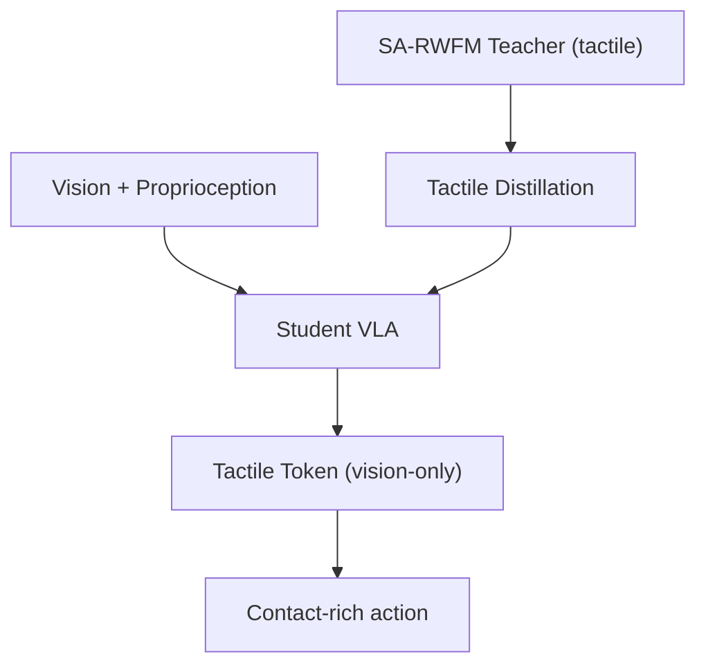

# HapticVLA: Contact-Rich Manipulation without Inference-Time Tactile Sensing

- 本地 PDF：`papers/rl-manipulation/HapticVLA_2603.15257.pdf`
- arXiv：https://arxiv.org/abs/2603.15257
- 年份：2026 (CVPR 2026)
- 团队：Skoltech
- 阶段：触觉蒸馏 — 训练时用触觉，推理时纯视觉

## 一句话总结

HapticVLA 提出触觉蒸馏 (Tactile Distillation)：两阶段训练——(1) SA-RWFM: 用触觉传感器做 safety-aware reward-weighted flow matching 离线 RL 训练 teacher，(2) 将 teacher 的触觉感知能力蒸馏到纯视觉 student VLA，student 从视觉+本体感知预测 compact "tactile token"。部署时不需要触觉硬件。真机 3 个接触丰富任务 86.7% 平均成功率——比还保留触觉传感器的 teacher (75%) 更高。

## 核心技术

1. **SA-RWFM (Safety-Aware Reward-Weighted Flow Matching)** — 离线 RL fine-tune action expert，reward 由触觉安全评估（抓取力、压力峰值、滑移等）
2. **Tactile Distillation (TD)** — Student VLA 从视觉+本体感知预测 tactile token，目标来自 teacher 的触觉内部表征
3. **Blended action targets** — 训练时插值 GT demo 和 teacher 预测：$\tilde{a} = (1-\alpha) a^{GT} + \alpha \hat{a}^T$, $\alpha=0.5$

## 消融实验与分析

| 配置 | 成功率 |
|------|--------|
| **HapticVLA (TD, 同步推理)** | **86.7%** |
| SA-RWFM teacher（有触觉传感器） | 75% |
| HapticVLA (无 TD) | 81.7% (async) / 75% (sync) |
| X-VLA (0.9B) / VLA-0 | **0%** |

蒸馏后的 vision-only student 居然比触觉-equipped teacher 更好——触觉信号本身的噪声可能干扰了 teacher 的推理。

## 技术价值

如果蒸馏效果持续成立，这是一个重大实用突破：**触觉级操作能力但不需要触觉传感器**。降低硬件成本和 fragile 性。和 TORL-VLA 互补：TORL-VLA 保留触觉做在线 RL，HapticVLA 蒸馏触觉做离线部署。

## 底层原理与数学推导

## 物理直觉解释

本工作的核心设计动机是将复杂问题分解为可管理的子问题，利用结构先验降低学习难度。

## 工程细节与实操指南

详见论文原文获取完整实现细节。

## 技术权衡（Trade-off）

| 优势 | 劣势 |
|------|------|
| 解决特定问题的有效方案 | 泛化到其他场景可能受限 |

## 技术价值与演进定位

在本领域代表了一个重要的技术方向。

## 与其他论文的关系

与同期发表的 RL for manipulation 工作形成互补。

## 精读问题

1. 核心方法的泛化边界在哪里？
2. 主要失败模式是什么？
