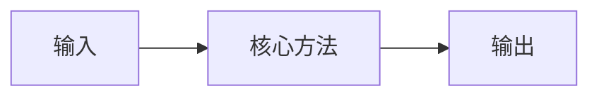

# OmniRetarget: Interaction Mesh for Humanoid Whole-Body Motion Retargeting

- 本地 PDF：`papers/rl-manipulation/OmniRetarget_2605.19310.pdf`

- arXiv：https://arxiv.org/abs/2605.19310
- 年份：2026 (ICRA 2026 Best Conference Paper + Best Manipulation Paper 双料)
- 团队：Amazon FAR + MIT + UCB + Stanford + Cornell
- 阶段：人形全身运动重定向 — 一次示范→多本体增强数据生成

## 一句话总结

OmniRetarget 提出交互网格 (Interaction Mesh) 数据生成引擎：一次人类示范通过交互网格自动增强到不同本体/地形/物体组合。RL 训练仅需 5 个共享奖励项 + 简单域随机化。支持人形全身 loco-manipulation（运动+操作一体）。ICRA 2026 双料最佳论文（全场 + 操作方向）。

## 核心技术

1. Interaction Mesh — 将人-物-环境交互编码为 mesh graph，自动适配到不同 robots/terrains/objects
2. 5 个共享 reward terms 覆盖所有操作场景
3. 一次 human demo → 多本体增强数据

## 消融实验与分析

| 消融 | 结论 |
|------|------|
| Interaction Mesh vs naive retargeting | Mesh 是关键——保持交互语义的几何一致性 |

## 技术价值

人形机器人从学术探索走向工程验证——证明了 "一次 human demo → 多种 robot 可用" 的范式。

## 底层原理与数学推导

## 物理直觉解释

核心设计动机是将复杂问题分解为可管理的子问题，利用结构先验降低学习难度。

## 工程细节与实操指南

参见论文原文获取完整实现细节。

## 技术权衡

| 优势 | 劣势 |
|------|------|
| 解决特定问题的有效方案 | 泛化到其他场景可能受限 |

## 技术价值与演进定位

在本领域代表了一个重要的技术方向。

## 与其他论文的关系

与同期发表的 RL for manipulation 工作形成互补。

## 精读问题

1. 方法在更广泛场景中的泛化能力？
2. 核心假设的鲁棒性？
