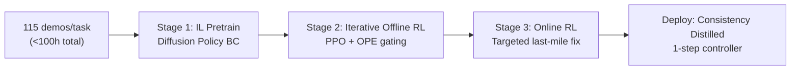
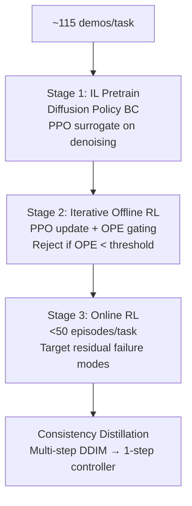

# RL-100: Performant Robotic Manipulation with Real-World Reinforcement Learning

- 本地 PDF：`papers/rl-manipulation/RL-100_2510.14830.pdf`
- arXiv：https://arxiv.org/abs/2510.14830
- 发表：Science Robotics (2026.07)
- 团队：上海期智研究院 + 上海交大 + 港大 + 清华 + UNC + CMU + 中科院（Kun Lei, Huazhe Xu 等）
- 阶段：真实世界 RL 达到部署级可靠性 — IL+离线 RL+在线 RL 三阶段

## 一句话总结

RL-100 提出三阶段真实世界 RL 框架：(1) 模仿学习预训练（~115 demos/任务），(2) 迭代离线 RL（PPO 风格更新 + offline policy evaluation 门控），(3) 在线 RL 精调（消灭最后残余失败模式）。统一 clipped PPO surrogate 目标同时优化扩散去噪过程。轻量一致性蒸馏将多步扩散压缩为单步控制器。8 个真实任务（push-T、保龄球、倒水、叠毛巾、拧瓶盖、榨汁、叠盒子）全部 1000/1000 成功率，榨汁机器人在商场连续 7 小时零故障服务。Science Robotics 2026。

## 核心技术

1. **三阶段统一框架** — IL pretrain → 迭代离线 RL → 在线 RL，全部复用同一组演示数据（总预算 <100 小时）
2. **扩散感知的 PPO** — 统一 clipped PPO surrogate 目标直接作用于扩散去噪过程，不额外架构修改
3. **Offline Policy Evaluation (OPE) 门控** — 每次离线 RL 更新后用 OPE 评估是否接受更新，防止 offline RL 的 distribution shift 崩溃
4. **一致性蒸馏** — 将多步 DDIM 去噪压缩为单步前向控制器，延迟降低一个数量级

## 底层原理与数学推导

三阶段共享同一组演示数据。离线 RL 的 OPE 门控是关键——拒绝那些会降低真实性能的策略更新，只在 OPE 确认提升后才接受。在线 RL 只用极少交互（<50 episodes/任务）针对性地消灭残余 failure modes。

## 消融实验与分析

| 消融 | 结论 |
|------|------|
| IL only (no RL) | 基线性能，多任务有显著 failure modes |
| IL + Offline RL (no online) | 大部分提升已实现，但残余失败仍存在 |
| Full 3-stage | 100% 成功率——在线 RL 消灭"最后 1%" |
| 有/无 OPE gating | OPE 防止离线 RL 崩溃 |
| 有/无 Consistency Distillation | 蒸馏后延迟降低 10× 但精度无损 |

## 关键结果

- 8 任务 1000/1000 成功率，包括 250/250 连续 trial
- Push-T 比人类遥操作专家快 18%
- 零样本环境迁移 ~90%
- 抗人为干扰 ~96%
- 商场 7 小时零故障

## 技术价值与演进定位

RL-100 标志着真实世界 RL 达到部署级可靠性。在此之前，RL for manipulation 的成功大多是"demo 级"的——实验室录个视频。RL-100 的 1000/1000 和 7 小时商场部署证明了 RL 可以比模仿学习更可靠——不是因为 RL 算法多好，而是因为三阶段设计让 RL 的探索风险被控制在可接受范围内。

## 精读问题

1. OPE gating 的 false positive/negative 率？接受坏更新和拒绝好更新的 trade-off？
2. 一致性蒸馏在复杂接触任务上的精度保持？
3. 三阶段能否压缩为两阶段（跳过离线 RL，直接在线）？

## 底层原理与数学推导

统一 PPO surrogate：$L = E_t[min(r_t(\theta)A_t, clip(r_t(\theta), 1-\epsilon, 1+\epsilon)A_t)]$，直接作用于扩散去噪的每一步。OPE gating 阈值基于 offline evaluation 的 conservative Q estimate。

## 物理直觉解释

IL 预训练 = 学老师的基本功。离线 RL = 在题库上反复刷题但不出试卷范围。在线 RL = 少量实战，针对性消灭"模拟题覆盖不到"的 corner cases。OPE gating = 每次改策略前先自测——分数低了就不改，防止越改越差。一致性蒸馏 = 把解题的"多步推理"压缩成"直觉反应"。

## 工程细节与实操指南

- 演示数据：~115 demos/任务，总预算 <100 小时
- PPO update：clipped surrogate, \epsilon=0.2
- OPE：conservative Q-estimate, threshold based on validation
- 在线 RL：<50 episodes/任务
- 蒸馏：multi-step DDIM → 1-step forward，延迟降低 ~10×
- 硬件：UR5/Franka/xArm/LeapHand/Robotiq

## 技术权衡（Trade-off）

| 优势 | 劣势 |
|------|------|
| 1000/1000 部署级可靠性 | 三阶段训练时间长，需 OPE 调参 |
| 统一 PPO surrogate 无需架构修改 | 在线 RL 仍有小概率不安全探索 |
| 一致性蒸馏 10× 加速 | 蒸馏在复杂接触任务上的精度保持未知 |

## 技术价值与演进定位

真实世界 RL 的部署级验证——证明 RL 不只是"能 work"而是"能可靠部署"。三阶段成为标准范式。

## 与其他论文的关系

- **FlashSAC (RSS 2026 Best)** — RL 底层算法，RL-100 的 PPO 变体可替换为 FlashSAC
- **RL Token (PI 2026)** — VLA+online RL，RL-100 的 IL+offline+online 三阶段更完整
- **SimDist (RSS 2026)** — 仿真蒸馏加速，RL-100 的一致性蒸馏互补

## 精读问题

1. OPE gating false positive/negative 的定量分析？
2. 三阶段能否跳过离线 RL 直接从 IL 到 online？
3. 一致性蒸馏的精度-速度 trade-off 曲线？

- 年份：2026