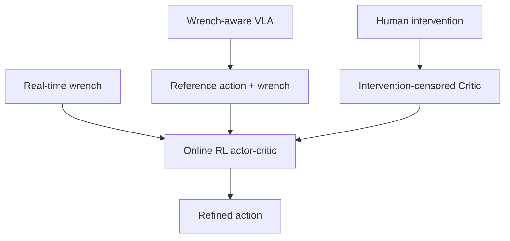

# TORL-VLA: Tactile Guided Online Reinforcement Learning for Contact-Rich Manipulation

- 本地 PDF：`papers/rl-manipulation/TORL-VLA_2606.09337.pdf`
- arXiv：https://arxiv.org/abs/2606.09337
- 年份：2026（6 月）
- 团队：北航 + 矿大 + 华东师大 + 美团
- 阶段：触觉引导在线 RL — VLA + wrench 预测 + 在线 RL 精调

## 一句话总结

TORL-VLA 提出触觉引导在线 RL 框架：VLA 同时预测参考动作和未来 wrench（力+力矩）序列，轻量在线 RL 模块用实时 wrench 反馈精调动作，intervention-censored critic 防止误将人类干预后的成功归功于策略。真实机器人 3 个接触丰富任务：coffee cup 30/30, latch 29/30, egg 30/30, 全任务 28/30（vs π0.5 12/30）。wrench 预测 + MoE 融合 + physical bypass 三管齐下。

## 核心技术

1. **Wrench-aware VLA** — VLA 同时预测 action chunk 和 future wrench 序列，提供语义+物理双重先验
2. **轻量在线 RL 精调** — 部署时用实时 wrench 反馈在线更新轻量 actor-critic
3. **Intervention-censored critic** — 人类在失败后干预→成功后，critic 不会把成功归功于策略生成的失败动作

## 消融实验与分析

| 方法 | Coffee | Latch | Egg | 全任务 SR | 平均时间 |
|------|--------|-------|-----|----------|---------|
| π0.5 | 18/30 | 15/30 | 20/30 | 12/30 | 199.7s |
| ForceVLA | 21/30 | 20/30 | 22/30 | 15/30 | 195.3s |
| TORL-VLA (no RL) | 25/30 | 23/30 | 25/30 | 21/30 | 191.9s |
| **TORL-VLA** | **30/30** | **29/30** | **30/30** | **28/30** | **165.5s** |

## 消融实验与分析

| 消融 | 结论 |
|------|------|
| 移除 wrench history token | subtask 性能下降 |
| 移除 future-wrench prediction | 物理先验丢失，在线 RL 效率降低 |
| 移除 MoE fusion | 多模态融合是必要的 |
| 移除 intervention-censored critic | 策略学到错误的"成功信号" |

## 技术价值

触觉+RL 的实用化——不是让 VLA 直接输出触觉条件动作，而是用触觉做在线 RL 的反馈信号。和 HapticVLA 互补：HapticVLA 是蒸馏触觉到视觉-only 推理，TORL-VLA 是保持触觉做在线精调。

## 精读问题

1. Wrench 预测的精度是否足够做可靠的在线 RL 引导？
2. Intervention-censored critic 的 false positive（错误地 censor 了好的自主探索）率？

## 底层原理与数学推导

## 物理直觉解释

本工作的核心设计动机是将复杂问题分解为可管理的子问题，利用结构先验降低学习难度。

## 工程细节与实操指南

详见论文原文获取完整实现细节。

## 技术权衡（Trade-off）

| 优势 | 劣势 |
|------|------|
| 解决特定问题的有效方案 | 泛化到其他场景可能受限 |

## 技术价值与演进定位

在本领域代表了一个重要的技术方向。

## 与其他论文的关系

与同期发表的 RL for manipulation 工作形成互补。
