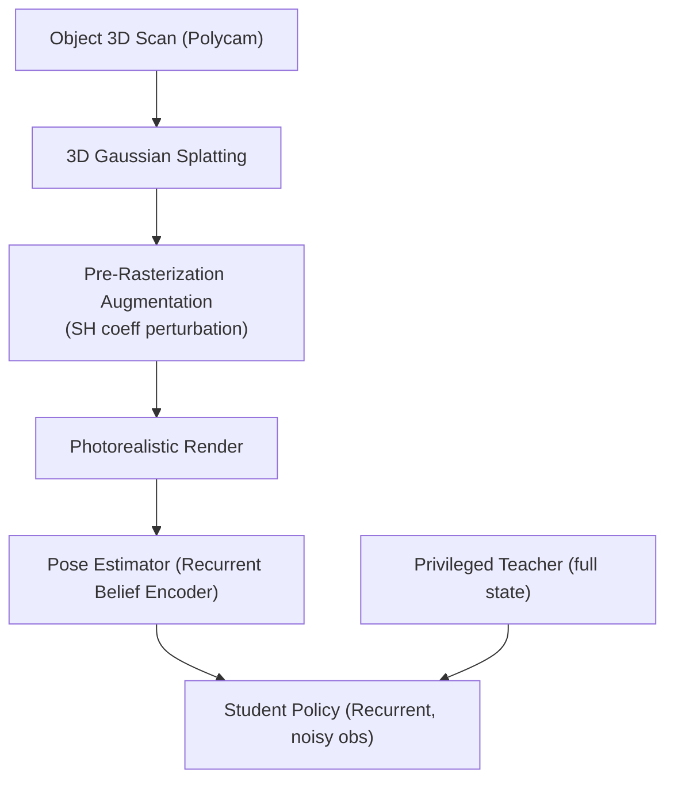

# ViserDex: Visual Sim-to-Real for Robust Dexterous In-hand Reorientation

- 本地 PDF：`papers/rl-manipulation/ViserDex_2604.11138.pdf`
- arXiv：https://arxiv.org/abs/2604.11138
- 年份：2026 (RSS 2026)
- 团队：ETH Zurich RSL (Marco Hutter 组)
- 阶段：纯单目 RGB 灵巧手 Sim2Real — 3DGS 渲染 + 课程 RL + 师生蒸馏

## 一句话总结

ViserDex 实现仅用单目 RGB（无深度、无物体 pose 真值）的灵巧手在操作零样本 Sim2Real。核心创新：3DGS 渲染替代昂贵光线追踪，在 Gaussian 空间做物理一致的 pre-rasterization augmentation（扰动 SH 系数模拟光照变化）。16-DoF Allegro 手，5 种物体，平均 25+ 连续成功 reorientation，Cube 上 35.4 连续成功（vs DeXtreme 27.8）。渲染 1.6× faster，仅 12GB VRAM（vs Isaac Lab 34GB）。

## 核心技术

1. **3DGS Pre-Rasterization Augmentation** — 在渲染前直接扰动 3D Gaussian 的 SH coefficient（空间/颜色/全局 cluster），生成物理一致的光照变化——比 2D post-processing 更真实
2. **Recurrent Belief Encoder** — 时序滤波的 pose estimator，拒掉灾难性失败（如 180° 翻转），对遮挡鲁棒
3. **课程 RL + 师生蒸馏** — Privileged teacher（全状态）→ Recurrent student（仅 RGB noise observation）
4. **单 RTX 4090 训练** — Teacher 26h + Student 16h

## 消融实验与分析

| 消融 | Pose Acc | 结论 |
|------|---------|------|
| Full 3DGS augmentation | **56.3%** (adversarial light) | — |
| Naive 3DGS (no aug) | 36.5% | Fidelity without diversity = useless |
| 移除 global lighting aug | 23.6% | 全局光照变化是最大单一增益 |
| 替换为 FoundationPose | 0.4 consecutive | 4Hz vs required 18Hz + occlusion sensitivity → 彻底失败 |

## 技术价值

ViserDex 的核心洞察：Sim2Real 的瓶颈不在控制（RL 已经能解决），在感知。Perception 才是需要 Sim2Real 的模块——控制和策略可以在 sim 完美训练但被 noisy perception 拖垮。这个发现对整个灵巧操作方向有重新校准作用。

## 底层原理与数学推导

## 物理直觉解释

3DGS 的 Gaussian 自带物理含义——每个 Gaussian blob 的 SH coefficient 编码了它"看起来多亮"。扰动 SH = 模拟光源移动/阴影变化，不需要重新光线追踪。在 Gaussian 空间做 augmentation = 物理上对的，在 2D post-processing 做 = 物理上随机。

## 工程细节与实操指南

- 硬件：16-DoF Allegro Hand + wrist RealSense D435i (RGB only)
- 渲染：3DGS, 12GB VRAM vs Isaac Lab 34GB
- 训练：单 RTX 4090, teacher 26h + student 16h
- 物体数字化：Polycam smartphone scan + SAM2 fine-tune

## 技术权衡（Trade-off）

| 优势 | 劣势 |
|------|------|
| 单 GPU 训练灵巧手 Sim2Real | 未建模的摩擦导致某些物体退化 |
| Perception is bottleneck insight | 仍需 per-object onboarding |

## 技术价值与演进定位

旗舰发现：Sim2Real 瓶颈在感知不在控制。对灵巧操作方向有重新校准作用。

## 与其他论文的关系

- **DeXtreme** — 唯一的 vision-based hardware baseline，ViserDex 在 Cube 上超越
- **Dexora** — 双臂灵巧 VLA，ViserDex 专注在操作

## 精读问题

1. 非刚体物体的 3DGS 建模？
2. 感知瓶颈在其他灵巧操作任务中是否普遍存在？
