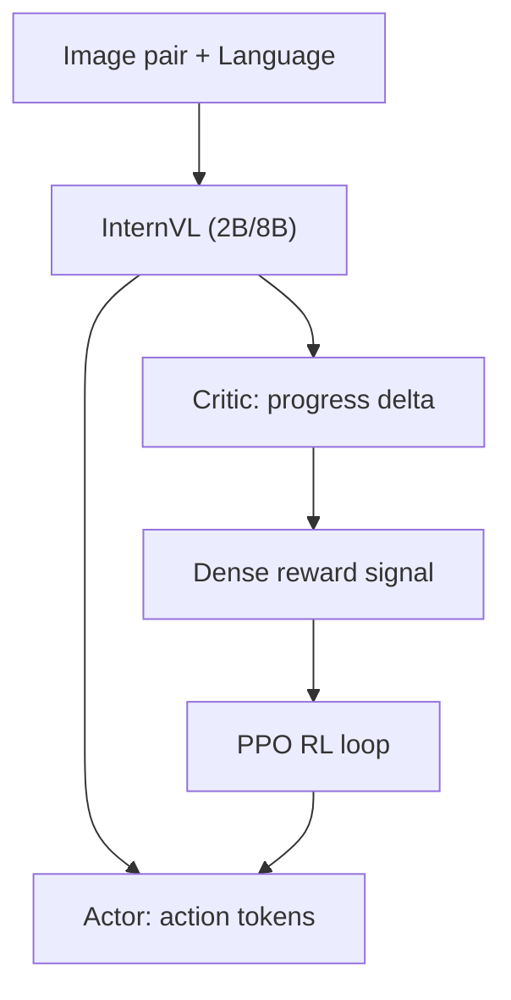

# VLAC: A Vision-Language-Action-Critic Model for Real-World Reinforcement Learning

- 本地 PDF：`papers/rl-manipulation/VLAC_2509.15937.pdf`
- arXiv：https://arxiv.org/abs/2509.15937
- 年份：2025 (ICML 2026)
- 团队：上海 AI Lab (Shaopeng Zhai, Jiangmiao Pang 等)
- 阶段：统一 actor-critic 自回归 — 单模型同时生成动作和评估进度

## 一句话总结

VLAC 提出统一 actor-critic 自回归架构：基于 InternVL 多模态模型，通过 pair-wise progress understanding 输入两张观测图+语言指令，同时输出动作 (actor) 和 dense progress delta (critic)。40M 训练样本。真实世界 RL 中从 ~30% 提升到 ~90%（200 episodes），one-shot in-context 迁移到 unseen 任务。8 机器人异步 RL（PPO），每个仅需 64 episodes 到 80% 成功率。

## 核心技术

1. **Pair-wise Progress Understanding** — 输入当前帧+历史帧 pair → 输出连续 progress delta 信号（正=前进，负=倒退），替代稀疏 handcrafted reward
2. **统一架构** — 同一 InternVL 模型，prompt 切换 actor/critic 模式：critic 输出 reward token，actor 输出 semantic delta EE pose
3. **One-shot in-context 迁移** — 给一个新任务的一张参考图，critic 能判断该任务的 task progress——不需 fine-tune
4. **异步分布式 RL** — 8 Franka 机器人, ZeroMQ+Ray, PPO, VLA 推理 <0.1s

## 消融实验与分析

- Critic: VOC-F1 0.89 on successful vs 0.44 on failed trajectories; 跨数据集泛化 0.95 on unseen RT1 data
- Actor: 5 任务 ~75% avg initial success; 极端光照/场景变化下 57-63%
- Real RL: ~30% → ~90% (200 episodes); 8 robots → 64 episodes/robot → 80%
- Human-in-loop 加速: 额外 ~50% sample efficiency 提升, 93-98% final

## 技术价值

VLAC 的核心洞察：**真实世界 RL 的瓶颈是 reward——不是算法。** 用一个 pre-trained critic 替代 handcrafted reward function 是更 scalable 的方案。和 RL Token (PI) 互补：RL Token 轻量 head 改策略，VLAC 大模型 critic 提供 reward。

## 精读问题

1. Progress delta 信号在连续长程任务（无明确子任务边界）中的精度？
2. One-shot ICL transfer 的 failure mode——什么类型的任务 critic 无法泛化？

## 底层原理与数学推导

## 物理直觉解释

本工作的核心设计动机是将复杂问题分解为可管理的子问题，利用结构先验降低学习难度。

## 工程细节与实操指南

详见论文原文获取完整实现细节。

## 技术权衡（Trade-off）

| 优势 | 劣势 |
|------|------|
| 解决特定问题的有效方案 | 泛化到其他场景可能受限 |

## 技术价值与演进定位

在本领域代表了一个重要的技术方向。

## 与其他论文的关系

与同期发表的 RL for manipulation 工作形成互补。
