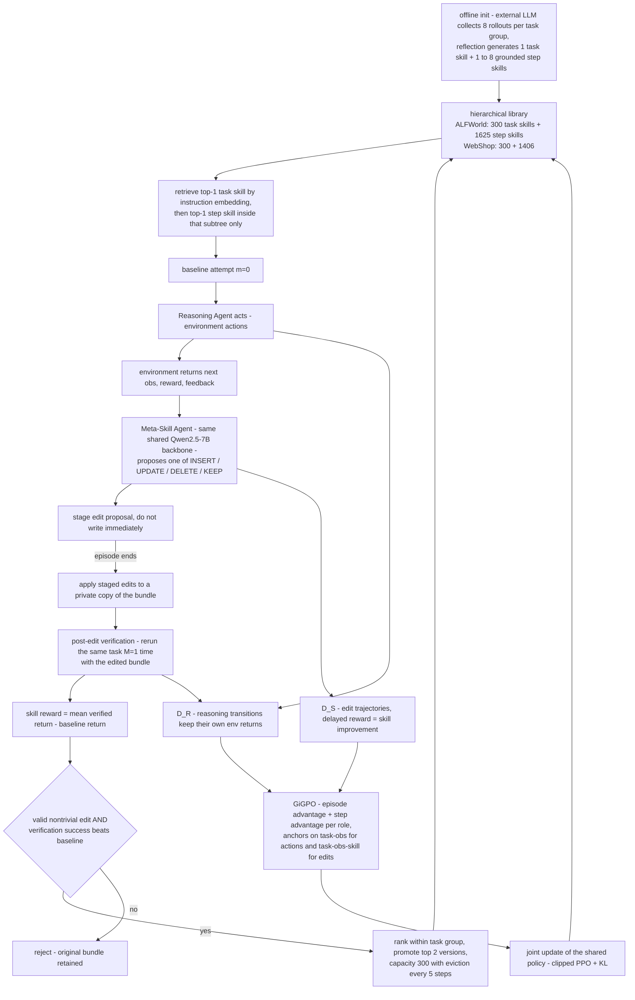

# CoSkill: Joint Reinforcement Learning of Reasoning and Meta-Skill Agents for Hierarchical Skill Evolution

- arXiv: https://arxiv.org/abs/2609.04865
- Source: https://arxiv.org/abs/2609.04865
- Project: 
- Local PDF: `papers/rl/agentic-algo/CoSkill_2609.04865.pdf`
- Year: 2026
- Category: rl
- Priority: medium

## 一句话总结

**数字域对照工作（ALFWorld 文本家庭任务 + WebShop 模拟电商，LLM agent，全文无任何真机或机器人控制实验）**：把"技能库的编辑者"从一个固定工作流（反思提示、SKILL.md 规则、多智能体流水线）改造成一个用 RL 训练的 Meta-Skill Agent，与 Reasoning Agent 共享同一个 Qwen2.5-7B-Instruct 骨干、在任务技能 → 步骤技能的层级技能库上联合优化——Reasoning Agent 按检索到的技能行动，Meta-Skill Agent 在每个推理转移后提议 INSERT/UPDATE/DELETE/KEEP，编辑先在私有副本上累积、再用 post-edit 验证（同一任务带编辑重跑 $M=1$ 次）算出的改进量 $\Delta^{skill}$ 当作延迟奖励。ALFWorld 平均成功率 98.4%（比最强的 RetroAgent 94.9% 高 3.5 pp，六类任务中五类 100%）、WebShop 成功率 90.6%（+6.2 pp）；消融显示去掉 Meta-Skill Agent RL 后 Step-20 成功率从 70.31% 跌到 57.81%、编辑动作里有害 DELETE 从趋近 0 涨到 36%、库膨胀多 47.6% 而性能更差。

## 核心技术

**对三个既有范式的诊断（论文的切入点）。** (a) 外部编排式（SkillRL、D2Skill、ReSkill、Trace2Skill）：技能生成/修订/维护交给外部 LLM 或手写规则，技能演化在策略学习目标之外，库会随策略演化变得陈旧、冗余、失配。(b) RL 优化的库管理式（SAGE、ARISE、Skill1）：用下游回报优化技能的生命周期决策，但粒度是原子的——RL 只决定"这个技能留不留/用不用"，技能内部步骤不被优化，"有用但有缺陷"的技能被低估或删除而不是被修好。(c) 元技能驱动式（SkillOpt、EvoSkill、SkillEvolver、MetaSkill-Evolve）：用执行反馈修单个技能的内容，但更新器是预定义工作流且推理器通常冻结，固定更新规则无法与演化中的策略共同适应。CoSkill 的答案：把元技能本身变成 RL 可学的 agent。

**层级技能库与两级检索。** 库 $\mathcal B = \{B_k\}_{k=1}^K$ 由 $K$ 个任务索引的技能束组成，$B_k = (s^{task}_k, S^{step}_k)$：任务技能给回合级全局指导，其子集 $S^{step}_k$ 存放面向中间观测的局部流程。检索先全局选任务束、再只在被选束内部选步骤技能——任务技能锁定候选子树，保证全局指导稳定、局部决策自适应。初始化由离线管线完成（外部 LLM 采集轨迹 → 反思生成 1 个任务技能 + 1 到 8 个有出处的步骤技能，每个步骤技能必须指向源轨迹与源轮次、以该轮次的精确观测为检索键），ALFWorld 库 300 个任务技能 + 1625 个步骤技能，WebShop 300 + 1406。

**共享参数的多智能体半马尔可夫决策过程（MSMDP）。** 两个角色共享策略 $\pi_\theta$ 与词表，靠角色提示 $p^R / p^S$ 分流到不同语义动作空间：推理动作是环境动作，元技能动作被限制为四种库编辑。时序是嵌套的——推理 agent 行动并拿到奖励后，元技能 agent 观测"同一转移"（当前观测、活动步骤技能、推理动作、环境反馈、短历史）并提议一次编辑。基线尝试（$m=0$）期间所有编辑提议只暂存不生效，回合结束后按序应用到一个私有编辑副本，验证通过才有资格写回持久库。

**Post-edit 技能验证奖励。** 编辑序列的价值必须由下游任务重执行来判定，而不是由触发它的转移判定：同一任务重置后带私有副本跑 $M$ 次验证尝试（实验中 $M=1$），以均值减基线回报的改进量为整段编辑序列的延迟回合级奖励；验证尝试自身的环境回报仍归推理动作所有，不记到编辑头上。晋升门槛：编辑有效且非平凡、验证成功率超过基线；每个任务组内只晋升排名前 $K_{prom}=2$ 的束版本，库容量 300、每 5 步驱逐一次，原始束保留以维持谱系。

**GiGPO 联合优化。** 两个角色的轨迹按 rollout 索引配对成各自的 batch，用同一个 GiGPO（episode 级相对优势 + step 级相对优势）目标更新共享 actor；episode 级对比在推理侧是同任务完整尝试回报、在编辑侧是同任务同基础技能的 $\Delta^{skill}$；step 级锚点推理用 $(x, o_t)$、编辑用 $(x, o_t, Z^{step}_t)$；两个角色的统计量各自归一化，避免任务回报与技能验证回报的量纲互相泄漏。

## 底层原理与数学推导

**技能条件化的推理目标。** 检索到的技能作为上下文进入动作分布，推理策略在库 $\mathcal B$ 下最大化期望折扣回报：

$$J(\theta; B) = \mathbb E_{x \sim \mathcal D,\ \tau \sim \pi_\theta(\cdot \mid x, B)}\left[\sum_{t=0}^{T} \gamma^t r_t\right]$$

两级检索把回合级与步级指导分开：

$$k^* = \arg\max_k \mathrm{sim}\big(f(x), f(q_k)\big), \qquad j^*_t = \arg\max_{j \in S^{step}_{k^*}} \mathrm{sim}\big(f(o_t), f(o_{k^*,j})\big)$$

其中 $f$ 是文本编码器（实现用 Qwen3-Embedding-0.6B），$q_k$ 是任务技能检索键，$o_{k,j}$ 是步骤技能源观测。最终上下文 $Z_{task} = s^{task}_{k^*}$ 固定、$Z^{step}_t = s^{step}_{k^*, j^*_t}$ 随观测变化。

**MSMDP 形式化。** 交互被写成部分可观测、共享参数的多智能体半马尔可夫决策过程，$\mathcal T$ 专门承载两种角色不同的时间尺度（推理步进有即时奖励，编辑的信用延迟到验证）：

$$\mathcal M = \langle S, \Omega, A, P, R, \gamma, T \rangle$$

角色观测嵌套：$u^R_t$ 打包任务状态、交互历史与检索技能；$u^S_t = (o_t, Z^{step}_t, a_t, r_t, e_t, o_{t+1}, h_t)$ ——推理动作本身就是高层观测的一部分，编辑者据此诊断活动技能。元技能动作空间被约束为结构化编辑集合：

$$A_S = \{\, \mathrm{INSERT}(\tilde s^{step}_t),\ \mathrm{UPDATE}(s^{step}_t, \tilde s^{step}_t),\ \mathrm{DELETE}(s^{step}_t),\ \mathrm{KEEP}(s^{step}_t) \,\}$$

**暂存与私有副本。** 为保住基线轨迹不被中途改库污染，任务 $i$ 的编辑序列 $z_{i,1:L_i}$ 在回合结束后才应用到检索束的拷贝上：

$$\hat B_i = \mathrm{Apply}\big(\mathrm{Copy}(B_{k^*_i}),\ z_{i,1:L_i}\big)$$

**跨回合信用分配。** 基线尝试回报 $R^{(0)}_i$ 与 $M$ 次验证尝试回报 $\{R^{(m)}_i\}$ 相减取均值，得到编辑序列的延迟奖励——减基线控制任务难度、取均值压验证方差（思想源自 meta-RL 的跨回合信用分配）：

$$\Delta^{skill}_i = \frac{1}{M}\sum_{m=1}^{M} R^{(m)}_i - R^{(0)}_i$$

**GiGPO 双层优势与联合损失。** 对每个角色 $\rho \in \{R, S\}$，优势是回合项加步项，$\omega^\rho$ 实验中两侧都取 1.0：

$$A^\rho_{i,t} = A^\rho_{E,i} + \omega^\rho A^\rho_{S,i,t}, \qquad \mathcal L(\theta) = \mathcal L^R_{\mathrm{GiGPO}}(\theta) + \mathcal L^S_{\mathrm{GiGPO}}(\theta)$$

关键在分组方式：推理的 step 级组用锚点 $(x, o_t)$ 回溯构建，编辑的 step 级组用 $(x, o_t, Z^{step}_t)$——即每个局部优势比较的是"同一环境状态、且对编辑而言同一目标技能"下的不同决策，把技能内部的信用分配真正做进了步骤粒度。两个目标共用标准 PPO 裁剪代理与 KL 正则，只差分组与奖励，于是推理与编辑通过同一次参数更新共同适应。

## 物理直觉解释

**Post-edit 验证把技能编辑从"编辑部润色"变成"试吃后改菜谱"。** 外部 LLM 编辑器的失败模式在案例研究里非常具体：编辑者看到一句局部合理的观测（"你从冰箱拿起了番茄"）就把"拿去水槽"的技能改写成"水槽或台面皆可"——文字上更通顺、局部奖励为零的绕路动作也完全合法，但任务要求清洗必须先于交付。没有 RL 的编辑器在做的是**语言合理性**优化，而有 RL 的编辑器在做**任务效用**优化：改完的库必须重跑一次任务、赢过基线才能写回，于是"看起来更聪明"的改动被 0→10 与 10→0 的回报差直接筛掉。这个机制和机器人领域"用真实 rollout 校验价值估计"是同构的，只是校验对象从数值变成了文本。

**双角色共享一个骨干像"同一个人白班写代码、晚班做评审"。** D2Skill 用 Gemini-3-Flash 或 O3 当外部编辑器仍在 ALFWorld 上输给共享 7B 联合训练 7.8 pp，这组对照的含金量在于它把"编辑器规模"与"编辑器对齐"拆开了：闭源大模型写出的技能再漂亮，也不是从目标环境奖励里学出来的。共享参数还有一层机制意义——编辑者观测到的 $u^S_t$ 里包含推理动作本身，同一个策略网络生成两者意味着"知道怎么执行"与"知道哪里难执行"天然共享表征，不需要对齐两个独立模型的接口。角色提示只是把同一套权重引向两个语义动作空间。

**97–99% UPDATE 的收敛是编辑器学会了"最小干预原则"。** 无 RL 的随机编辑器动作分布持续弥散：UPDATE 从 73% 滑到 54%，DELETE 从 13% 涨到 36%——它会把"当前观测里没出现鸡蛋"误读为"鸡蛋流程全局无用"，于是删掉唯一的搜索分支，最终把任务束删成空的（末段空束率 12.4%）。有 RL 的编辑器把 97–99% 的动作收敛为 UPDATE，而且库的累计晋升从 739 降到 387（-47.6%）却换来更高性能——这说明无 RL 编辑器的"活跃"大部分是**产生冗余修订的假性探索**：编辑概率没有被下游回报校准，写得勤不等于写得对。对任何"让 LLM 管理自己的记忆/技能库"的系统，这是一条可以定量复用的警示。

**层级检索像"先选书架、再翻书页"。** 把库拍平掉层级，Step-20 成功率掉 14.06 pp：层级的价值不只是组织结构，它把步骤技能的检索与修订都限制在与当前任务相关的子树内，切断了无关技能的干扰，同时任务技能保持全局指导稳定。但消融里有个诚实的细节：拍平版在 Step 30 一度反超 6.25 pp，说明层级的主要收益在早期轨迹的可靠性与整体收敛质量（93.75% 对 95.31% 的终局差只有 1.56 pp），不是每个训练阶段都占优——层级结构引入的检索误差在小库阶段反而是负担。另外主表上 Cool 一列 CoSkill 90.0% 落后 SkillRL 的 95.5%（-6.2 pp），层级检索也不是无条件的赢家。

## 工程细节与实操指南

- **骨干与基础设施**：Reasoning 与 Meta-Skill 两角色共享 Qwen2.5-7B-Instruct；技能检索用 Qwen3-Embedding-0.6B；基于 veRL + verl-agent，vLLM rollout（tensor parallel = 1），8 GPU 单节点。
- **训练超参（ALFWorld / WebShop）**：GiGPO 优势估计，step 权重 $\omega^R/\omega^S = 1.0/1.0$；actor lr $1\times10^{-6}$；折扣 $\gamma = 0.95$；PPO mini-batch 128、micro-batch 8/GPU、epoch 1、clip 0.2；KL 系数 0.01（low-variance KL）；非法动作惩罚 1.0；16 个任务组 × 每组 8 个 rollout；验证尝试 $M=1$；总训练步数 160 / 200；验证集 64 任务、每 5 步一次；环境步上限 30 / 15；prompt/response token 上限 8192/2048 与 4096/512；元技能历史步数 2 / 1。
- **离线库构建**：每个任务组采 $N_0 = 8$ 条轨迹、全成功组给 1 条成功轨迹、混合组给 1 成功 1 失败、全失败组给 1 条失败轨迹推断修正策略；反思提示要求输出恰好 1 个任务技能 + 1 到 8 个步骤技能，且失败轨迹上归纳的步骤技能必须描述"修正后的决策"而不是声称失败动作成功；解析只保留合法 JSON 束，无出处/重复的步骤技能丢弃，束内至少有 1 个有效子技能才入库。两环境都是 $K = 300$ 个束。
- **防御性解析**：JSON 畸形或动作不合法一律安全解析为 KEEP；INSERT 要求合法父任务技能 ID 且内容非空、UPDATE 要求目标 ID 有效且至少一个文本字段有变化、DELETE 要求目标 ID 有效。
- **训练成本**：ALFWorld 160 步在 8 张主流 GPU 上约 66 小时墙钟，约 526 GPU 小时——这个数字对估算"把同款流程搬到更贵环境"的预算很有用。
- **公开信息缺口**：待确认：任务组内晋升候选的排序指标未在论文中定义（Algorithm 2 只写"promote the top $K_{prom}$ valid candidates"，按什么分数排未说明）。待确认：技能效用（skill utility）的更新公式与"陈旧、低频束"的周期性剪枝准则未给出，只有 Algorithm 2 第 25 行的一句话。待确认：$M=1$ 的验证尝试是否计入"160 训练步"的预算、还是只计基线尝试，论文未明确。
- **诊断手段（值得照抄）**：编辑动作分布随训练步的堆叠图（检验编辑器是否收敛到定向修正）；累计晋升束数曲线（检验库是否收敛增长）；步骤技能检索命中率；空步骤束率（结构性损坏指标）；以及按训练步与任务指令精确配对、只用序列化证据的案例研究协议——论文附录 H 的三条案例（延迟约束保持、负证据触发继续搜索、重复子目标的技能保留）每一都给出"有 RL / 无 RL"的编辑文本对照，是分析技能库演化的模板。

## 消融实验与分析

### A. 主结果：四类基线全面对照（论文 Table 1，ALFWorld 六类任务宏平均成功率）

| 方法类别 | 代表方法 | ALFWorld 平均 | WebShop 成功率 |
|---------|---------|--------------|----------------|
| 闭源 LLM（不训练） | Gemini-3-Flash | 85.2% | 16.5% |
| 提示/经验（不训练） | Reflexion | 42.7% | 28.8% |
| 提示/经验（不训练） | ExpeL | 46.3% | 11.2% |
| RL 无技能 | PPO | 80.4% | 68.7% |
| RL 无技能 | GiGPO | 90.8% | 72.8% |
| RL 带技能 | D2Skill（Gemini-3-Flash 编辑器） | 90.6% | 80.5% |
| RL 带技能 | Skill1 | 93.7% | 75.0% |
| RL 带技能 | SkillRL | 89.9% | 72.7% |
| RL 带技能 | RetroAgent | 94.9% | 82.3% |
| CoSkill | 联合训练双角色 | 98.4% | 90.6% |

**核心结论：** CoSkill 在所有聚合指标上排第一：ALFWorld 98.4%（+3.5 pp over RetroAgent）且六类任务五类 100%（唯 Cool 一列 90.0% 落后 SkillRL 的 95.5%，-6.2 pp）；相对无技能的 GiGPO 提升 7.6 pp / 17.8 pp，说明增益不止来自优化器；关键对照是用闭源大模型当外部编辑器的 D2Skill——共享 7B 联合训练反超 7.8 / 6.2 pp，支持"技能精炼与目标环境奖励对齐比编辑器规模更重要"这一核心主张。

### B. 组件消融（论文 Table 2，ALFWorld，各检查点成功率）

| 变体 | Step 20 | Step 60 | Step 120 | 终局差距 |
|------|---------|---------|----------|----------|
| CoSkill（完整） | 70.31% | 89.06% | 95.31% | — |
| w/o Meta-Skill Agent RL | 57.81% | 87.50% | 92.19% | -3.12 pp |
| w/o Hierarchical Skill Library | 56.25% | 87.50% | 93.75% | -1.56 pp |
| Alternating Updates = 10 | 62.50% | 64.06% | 78.12% | -17.19 pp |
| Alternating Updates = 20 | 59.38% | 70.31% | 81.25% | -14.06 pp |

**核心结论：** Meta-Skill RL 主要买的是早期样本效率（Step-20 掉 12.50 pp、终局只掉 3.12 pp——编辑器保留了但没被回报校准）；层级结构同样是早期收益大（-14.06 pp）终局差距小；最刺眼的是稀疏交替更新：组件全保留、只把两个角色的联合更新改成每 10 或 20 步切换一次，Step-60 就落后 25.00 / 18.75 pp、Step-120 仍差 17.19 / 14.06 pp——慢的根源是陈旧的跨角色反馈而不是容量，"联合"两个字才是这套框架里最不能省的部分。

### C. Meta-Skill RL 改变了编辑器的行为分布（论文 Figure 5，ALFWorld）

| 指标 | 有 Meta-Skill RL | 无 Meta-Skill RL | 含义 |
|------|------------------|------------------|------|
| UPDATE 动作占比（收敛段） | 97–99% | 73% → 54% | 编辑收敛为定向修正 |
| DELETE 动作占比 | 趋近 0 | 13% → 36% | 无 RL 编辑器系统性毁技能 |
| 累计晋升束数（160 步） | 387 | 739 | -47.6%，库收敛增长 |
| 末段空步骤束率 | 0.2% | 12.4% | 结构损坏几乎归零 |
| 编辑 patches 总数 | 34,589 | 35,299 | 编辑量相当，质量不同 |

**核心结论：** 两个编辑器的活跃度几乎一样（patches 数量相当），差别全在编辑概率有没有被下游回报校准——无 RL 版把编辑力花在破坏性 DELETE 与冗余晋升上（库膨胀 47.6% 而性能更低），有 RL 版把 97–99% 的动作收敛为 UPDATE、检索命中率恢复到约 100%、空束率压到 0.2%。"技能库越大越好"的直觉在这里被定量否定。

## 技术权衡（Trade-off）

| 优势 | 劣势与工程代价 |
|------|---------------|
| 技能演化被拉进策略学习目标，端到端共同适应，早期样本效率大幅领先（Step-20 领先全部消融 7.81–14.06 pp） | 每条基线尝试都要额外跑 $M=1$ 次验证尝试（且验证转移也进 $D_R$ 参与推理优势），环境交互量约为纯 RL 的 2 倍——160 步花 66 小时 / 526 GPU 小时 |
| 免掉第二个大模型编辑器：共享 7B 骨干反超闭源编辑器版 D2Skill 7.8 pp | 双角色共享权重意味着编辑能力受推理骨干能力上限约束——7B 学到的编辑策略能否随骨干等比放大，论文没有做规模实验 |
| 编辑粒度到步骤内部（UPDATE 单条步骤技能），"有用但有缺陷"的技能被修复而不是删除 | 验证依赖环境可廉价重置与重跑：ALFWorld/WebShop 秒级重置，真机上同一任务重跑意味着硬件时间、磨损与物理随机性 |
| 库增长被效用驱动地收敛（387 对 739），配 top-$K_{prom}$ 与容量驱逐双重闸门 | 组级 top-2 会扣下已通过验证的好束（案例 3：回报 10→10 仍被扣），容量闸门与技能保留之间存在未解决的张力 |
| 防御性解析（畸形 JSON 一律 KEEP）+ 暂存不落盘 + 私有副本验证，工程上很稳健 | 结果只在两个确定性文本环境上成立：观测离散、动态确定、奖励稠密可判定；ALFWorld 的 Cool 类仍输 6.2 pp，层级检索非性能担保 |
| 消融与动力学分析完整（编辑分布、库增长、检索命中、空束率、三个机制案例） | WebShop 侧没有做组件消融（Table 2 只在 ALFWorld 上），联合优化在另一环境的必要性是推断而非实测 |

## 技术价值与演进定位

**先说清楚定位边界：这是数字域对照工作。** 评测全部在 ALFWorld（文本化家庭任务）与 WebShop（模拟电商）上，由 LLM agent 与环境做文本交互，没有任何真机、仿真机器人控制或 VLA 实验；它对机器人研究的价值是方法论映射而不是可直接复用的系统。在这个前提下，它对库里的三条线有明确的位置。**记忆/技能线**：RoboTTT、MemoryWAM 处理的是机器人经验的写入与检索，CoSkill 的主张往前推了一步——库的写回策略本身应当是被任务回报 RL 训练出来的策略，而不是固定反思提示；"编辑量相同、质量不同"（Table C）与"库膨胀 47.6% 反而更差"这两个数字，对任何让 LLM 管理自身记忆的系统都是可迁移的校准指标。**Agentic RL 线**：GiGPO 的角色分组用法（推理锚在任务-观测、编辑锚在任务-观测-技能）示范了同一优化器如何给两种时间尺度的行为分配信用。**迁移到机器人 agentic RL 的三个假设（均为本文推断，论文未验证）**：其一，真机上 post-edit 验证的成本结构会反转——文本环境重置免费，机器人重跑要硬件时间且物理随机性会让 $M=1$ 的验证回报噪声远大于文本环境，可能需要 $M>1$ 或改用仿真验证；其二，共享骨干双角色对 VLA 尤其有吸引力，因为机器人领域养不起第二个大编辑模型，而 D2Skill 对照已经说明编辑器规模不是决定项；其三，GiGPO 的 step 级锚点要求状态可比较，文本观测天然满足，连续机器人观测需要换成嵌入聚类锚点，这是迁移时真正的技术工作量所在。

## 与其他论文的关系

- **GiGPO（Feng et al., NeurIPS 2025）—** CoSkill 的优化器基座与最强无技能基线（ALFWorld 90.8% / WebShop 72.8%）；CoSkill 的增量是把同一套双层相对优势拆给两个角色复用，编辑侧的 step 级分组锚点 $(x, o_t, Z^{step}_t)$ 是在技能内部做信用分配的关键改动。
- **D2Skill（Tu et al., 2026）—** 层级"任务技能 + 步骤技能"库结构的直接来源，但技能更新由外部闭源 LLM（Gemini-3-Flash / O3 / Self 三种配置）执行；CoSkill 98.4% 对 D2Skill 最强版 90.6% 的 7.8 pp，是"联合训练比对齐编辑器规模更值钱"这一主张的证据来源。
- **Skill1 / SAGE / ARISE —** 同属"RL 管库"范式（CoSkill 对 Skill1 领先 4.7 / 15.6 pp，其中 Heat +12.5、Cool +23.4、Pick2 +7.7）；区别在于这些方法把技能当原子单元优化生命周期，CoSkill 把信用分配推进到技能内部的步骤编辑。
- **Reflexion / ExpeL / Voyager —** 无参数更新的经验外置传统（语言反思、洞见蒸馏、可执行技能库），CoSkill 的表里 Reflexion 42.7% 对 98.4% 的差距标定了"纯提示式自我改进"与"RL 式自我改进"在长程任务上的量级差。
- **Robot Self-Improvement via Human-Video Dynamics Models（notes/rl/humanvid-selfimprove.md）—** 不同域里同一个思想形状：DGAC 把机器人失败状态当作查询、用动力学与价值模型生成修正动作，CoSkill 把技能失效当作查询、用验证回报训练编辑策略——两者都拒绝"过滤掉失败/陈旧经验"的被动路线，都要求先有一个能预测后果的模型（动力学模型 / 验证重跑）再改写自身知识。
- **ENPIRE（notes/rl/enpire.md）—** 真机 agentic 自改进的对照点：ENPIRE 的改进回路跑在物理 rollout 上、成本以硬件小时计，CoSkill 的 act-edit-verify 回路跑在可免费重置的文本环境上——对照读可以看清"验证成本"如何决定自改进回路能做多复杂。
- **Meta-RL（Jiang et al., 2026）—** $\Delta^{skill}$ 的跨回合信用分配明确借自 meta-RL 的探索机制，编辑序列相当于上一层任务、重跑验证相当于内层适应，这是把双层时间尺度压进单次 PPO 更新的轻量做法。

## 精读问题

1. 组级 top-$K_{prom}$ 闸门在案例 3 里扣下了一个验证成功（回报 10→10）的束，理由是"不在组内前 2"——但论文从未给出组内排序指标。如果排序用的是累计效用，新晋升的束会因效用为零而永远排不进前 2，这是否构成结构性的新手歧视？你会用什么排序量（验证改进幅度、边际覆盖率、效用增量）来替换？
2. $M=1$ 的单次验证尝试给 $\Delta^{skill}$ 的方差有多大？ALFWorld 策略接近收敛时任务成功率本身在 95% 上下波动，单次重跑 0 对 10 的回报差是否足以区分"编辑有效"与"任务本来就简单"？把 $M$ 从 1 加到 3 大约会怎样改变那 66 小时的训练成本？
3. 编辑动作空间只有四种库操作，UPDATE 是唯一被 RL 收敛选中的（97–99%）——这是"最小干预原则"的涌现，还是奖励结构（$\Delta^{skill}$ 对 DELETE 的破坏性惩罚滞后且不可逆）导致的保守坍缩？如果能设计一个允许"批量重组多条步骤技能"的动作，现有奖励形式还能给它正确信用吗？
4. 两角色共享骨干意味着 Meta-Skill Agent 的编辑能力被封顶在 7B 推理骨干的水平上；D2Skill 的对照说明外部大编辑器不对齐也不行，但"共享 7B 联合训练"与"共享 70B 联合训练"的曲线会怎么分叉——编辑能力与推理能力在共享参数里是互相成就还是互相挤占？
5. 把 act-edit-verify 回路搬到机器人记忆库（例如对一条操作经验"在什么条件下改写、什么条件下删除"做 RL），验证环节用什么替代"同任务重跑"：仿真回放、真实重执行、还是用世界模型做想象验证？三者在验证保真度与成本上的取舍会如何改变 $\Delta^{skill}$ 这一度量本身的可信度？
