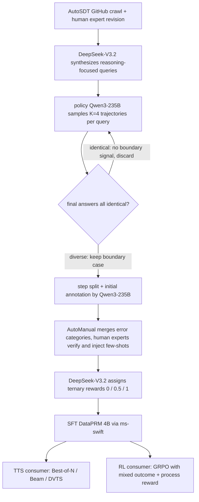

# Rewarding the Scientific Process: Process-Level Reward Modeling for Agentic Data Analysis

- arXiv: https://arxiv.org/abs/2604.24198
- Source: https://arxiv.org/abs/2604.24198
- Project: https://github.com/zjunlp/DataMind
- Local PDF: `papers/rl/agentic-algo/DataPRM_2604.24198.pdf`
- Year: 2026
- Category: rl
- Priority: high

## 一句话总结

用先导实验证明通用域 PRM 监督不了数据分析 agent——静态 PRM 抓不住"解释器不报错但结果错误"的 silent error，还会把必要的试错探索（grounding error，如猜错列名触发 KeyError）当致命失败而过度惩罚（ThinkPRM 把 DABStep 子集从 32.67% 提到 40.00% 却仍不敌 Majority Voting）；据此提出 DataPRM，一个 environment-aware 的生成式 PRM：用与 policy 相同的 ReAct 范式主动执行代码探查中间状态、配 `query_document`/`query_image` 两个工具补多模态与长文档感知、以三元奖励 $r_t \in \{0, 0.5, 1\}$ 区分可修正错误与不可恢复错误；数据侧用"多样性驱动轨迹生成（K=4 采样、答案不一致才保留）+ 知识增强逐步标注（AutoManual 合并错误类别、人工核验 86.0% raw accuracy、$\kappa=0.83$）"造出 7K+ 实例。4B 的 DataPRM 在 Best-of-N 下把 Qwen3-235B-A22B-Instruct 在 ScienceAgentBench 提升 7.21%、DABStep 提升 11.28%，以 58 倍参数效率压过 GenPRM-32B、Qwen2.5-Math-PRM-72B 与 235B self-rewarding；接入 GRPO 后 DABench 78.73%、TableBench 64.84%，且训练熵不塌缩（约 0.18 vs outcome-only 的 0.12）。

## 核心技术

1. **先导实证研究（动机）**：以 Qwen3-235B-A22B-Instruct 为 policy、DABStep 子集为场地，两个发现——(a) 三个 SOTA 数学 PRM（Qwen2.5-Math-PRM-72B、GenPRM、ThinkPRM）的 BoN 引导虽高于单路生成（ThinkPRM 32.67%→40.00%@N=16），却全都打不过免费的 Majority Voting；(b) 失败集中在两类：**silent error**（代码执行成功、逻辑错误产错结果，静态 PRM 只读代码文本无法验证执行语义）与 **grounding error**（模型先验与真实数据冲突的可恢复试错，现有 PRM 给这些"最终答对"轨迹中的步骤打低分，搜索算法随之剪掉本可自我修正的路径）。
2. **Environment-aware 生成式验证架构**：DataPRM 采用与数据分析 agent 相同的 ReAct 范式做验证——输入完整 policy 轨迹 $h_t$ 与当前步 $\tau_t$，内部进行多轮"思考-写代码-看执行结果"循环，主动运行探查代码去核对中间执行状态，最后一步产出 (分数, 依据) 而非代码；上一时刻的验证反馈元组 $(r_{t'}, c_{t'})$ 显式拼入下一步验证的输入，保证跨步评估的一致性。
3. **工具增强的感知解耦**：把验证器能力拆成内在推理（训练获得）与外在感知（工具获得），内置 `query_document`（向专家模型询问手册/规则文档）与 `query_image`（询问图像内容）两个函数调用——覆盖数据文件、说明文档、可视化图三类验证对象，弥补 4B 模型自身的多模态与长上下文短板。
4. **Reflection-aware 三元奖励**：把步级奖励空间从 $\{0, 1\}$ 扩到 $\{0, 0.5, 1\}$——1.0 严格正确（逻辑成立且直接推进）；0.0 不可恢复错误（根本性逻辑缺陷/幻觉，轨迹进入死胡同）；0.5 可修正错误（语法错、路径错等小错，但触发了可供修正的环境反馈回路）。专门让"必要试错"免于被当作 grounding 失败惩罚。
5. **多样性驱动轨迹生成**：改造 AutoSDT 的 GitHub 抓取 + 专家修订获得任务与文件，DeepSeek-V3.2 合成推理型查询；每个验证过的查询用 Qwen3-235B 并行采 $K=4$ 条轨迹，DeepSeek-V3.2 判卷，仅当 4 条终答不全一致时保留——把数据集中在信息量最大的边界样本上（对 PRM 训练而言，"全对"或"全错"的查询没有判别学习信号）。
6. **知识增强逐步标注**：Qwen3-235B 初标注 + AutoManual 框架合并相似错误类别 → 人工专家核验各类别 rationale 并作为结构化 few-shot 注回标注 prompt → DeepSeek-V3.2 按三元策略打终分。质检：过滤超时/文件损坏等非分析型错误；100 例人工抽检 86.0% raw accuracy、二次加权 Cohen's $\kappa = 0.83$。
7. **两种消费场景**：TTS（Best-of-N、Beam Search、DVTS 下按步分聚合选轨迹）与 RL（GRPO + clip-higher + token-level loss，PRM 分数与 outcome 奖励加权混合，终步不一致时以 outcome 覆写）。

## 底层原理与数学推导

**问题形式化**：数据分析过程是 POMDP $(U, S, A, T, O)$，环境 = 代码解释器 $\mathcal{I}$ + 文件集 $\mathcal{F}$，解释器同时是转移函数；ReAct 范式下第 $t$ 时刻的历史轨迹为

$$h_t = (u, z_0, a_0, o_0, z_1, a_1, o_1, \ldots, z_{t-1}, a_{t-1}, o_{t-1})$$

其中 $z_t$（思考）、$a_t$（代码动作）、$o_t$（观测）打包为统一步 $\tau_t$。PRM 参数化打分函数 $R_\theta$，步级奖励 $r_t \sim R_\theta(\cdot \mid h_t, \tau_t)$，轨迹级奖励由聚合函数得到：$r^{traj} = \mathcal{A}(r_1, r_2, \ldots, r_T)$（Sum 或 Mean）。

**DataPRM 的验证内循环**：初始上下文把 policy 轨迹、历史验证反馈 $f_t = (r_0, c_0, \ldots, r_{t-1}, c_{t-1})$ 与当前步拼接：

$$h^{prm}_{t,0} = h_t \oplus f_t \oplus \tau_t$$

内部第 $k$ 步生成验证元组 $\kappa_{t,k} = (\hat{z}_k, \hat{a}_k, \hat{o}_k)$ 并更新 $h^{prm}_{t,k+1} = h^{prm}_{t,k} \oplus \kappa_{t,k}$，直到第 $K$ 步输出分数与依据：

$$(\hat{z}_K, r_t, c_t) \sim \rho_\phi(\cdot \mid h^{prm}_{t,K})$$

与传统判别式 PRM（一次前向输出标量）的本质差别：$\hat{a}_k$ 是真实执行的代码，$r_t$ 是在"取证之后"才给出的——验证的计算路径本身携带环境信息。

**为什么必须交互（附录 A 的贝叶斯论证）**：把真实环境状态视为潜变量 $\varepsilon$，静态 PRM 只能靠训练学到的先验 $P_{prior}(\varepsilon \mid h_t)$ 隐式脑补环境；科学数据高度异质且常在分布外（$\varepsilon_{true} \notin P_{prior}$），于是产生"对 silent error 的错误奖励"——PRM 幻觉出一个与错误结果兼容的环境。交互式验证抽取真观测 $o_t \sim P(O \mid \varepsilon, a_t, h_t)$，用贝叶斯定理把先验更新为后验：

$$P_{post}(\varepsilon \mid o_t, a_t, h_t) \propto P(o_t \mid \varepsilon, a_t) \cdot P_{prior}(\varepsilon \mid h_t)$$

环境交互由此是"收集证据以锚定潜变量、降低奖励估计方差"的必要步骤。

**三元奖励的理论来源**：探索性 POMDP 中最优动作需权衡任务推进（exploitation）与不确定性消解（exploration），步奖励可写成二者的平衡组合（$\lambda = 0.5$）：

$$R(a_t) = \lambda \cdot G(a_t) + (1 - \lambda) \cdot I(a_t), \qquad I(a_t) = D_{KL}\!\left(P_{post} \,\|\, P_{prior}\right)$$

连续 KL 不可靠标注，故用指示函数 $I[I(a_t) > \epsilon]$ 近似"有效信息增益"，恰好映射到三值机制：严格正确（$G=1, I=1$）得 1；grounding/可修正错误（$G=0, I=1$——没推进任务但买到了环境信息）得 0.5；不可恢复错误（$G=0, I=0$）得 0。0.5 分档是"保护探索"的数学落点。

**RL 消费方式**：GRPO（组内归一化优势）+ clip-higher + token-level loss，总奖励是 outcome 与 PRM 均分的加权：

$$r_{total} = (1 - \beta) \cdot r_{outcome} + \beta \cdot \frac{1}{T} \sum_{t=1}^{T} r_{prm}(\tau_t), \qquad \hat{A}_{i,t} = \frac{r_{total,i} - \text{mean}(\{r_{total,j}\}_{j=1}^G)}{\text{std}(\{r_{total,j}\}_{j=1}^G)}$$

$\beta = 0.5$、$G = 4$。另加终步一致性覆写：若 $r_{prm}(\tau_T) \neq r_{outcome}$ 则 $r_{prm}(\tau_T) \leftarrow r_{outcome}$——避免轨迹终点处模型从相互冲突的信号学习。

## 物理直觉解释

**静态 PRM 验证 silent error，像体检只量体温。** 代码解释器是体温计：它只回答"程序崩没崩"，而 silent error 是不发烧的病——可视化代码跑通了、文件保存成功了，但那个 5.5 km 的风险缓冲区根本没画进图里（论文 Table 1 的真实案例，数学 PRM 判"正确"）。只读代码文本的 PRM 等于只问病史不验血：它能检查语法风格和表面逻辑，却无法回答"这段代码作用在真实数据上产出了什么"。DataPRM 的做法是直接验血——花平均 0.87 次工具调用把中间状态跑出来看。附录 O 的成本分析显示这笔开销是可承受的：比 235B self-rewarding 还少 15.1% token、少 22.6% 轮次，因为" targeted 取证"天然比"长篇自我评估"聚焦。

**把 grounding error 一律判死，像因为新员工第一天开错储物柜就把他辞退。** 数据分析 agent 必然先猜后查：猜一个列名、试一种文件路径，错了再根据报错修正——这是熟悉环境的学费，不是事故。现有 PRM 给这些步骤打 0 分的后果在搜索层面被放大：Best-of-N 按"步分之和"排序候选轨迹，一条前几步试错、后面全部正确的轨迹，会被一条"碰巧第一步就对"的平庸轨迹压过，自我修正能力反而成了被惩罚项。0.5 分档改变了这场算术：试错步保留一半分数，"先探明环境再收敛"的轨迹重新能赢。

**环境交互之于 PRM，像审计员盘点库存之于审账本。** 账本（代码文本）可以自洽地记错账——静态审查永远发现不了，除非去仓库数一遍货。贝叶斯视角把这个直觉说成方差问题：静态 PRM 对 OOD 科学数据的先验 $P_{prior}(\varepsilon|h_t)$ 本来就不可信，它在幻觉环境上打分，分数方差大且有偏；每一次真实执行都是一次无偏抽样，把先验拉向后验。这解释了论文图 2c 的消融梯度：纯 CoT 打分 35.33% < 单轮代码 41.33% < 多轮代码（多轮可以追加取证），三个数字单调印证"证据越多、判别越准"。

**"多样性优于纯度"像疫苗株覆盖问题。** 直觉上训练 PRM 该用过滤后的干净数据，但 Table 4 的结果相反：不过滤的版本在 N=16 时 40.89%，三种参考无关过滤策略（Meta-Critic、Outcome-Consistency、Process-Consistency）全都更低。机制在于 PRM 的本职是判别边界样本——过滤策略按"轨迹质量"筛数据，恰好把"中间步骤质量参差"的样本筛掉了，而那正是步级监督要学的东西；过滤后的 PRM 变得过度保守，面对大候选池时反而丢弃原本正确的答案（Qwen2.5-Math-PRM-72B 从 N=8 的 31.33% 跌到 N=16 的 29.11%）。步级奖励模型要的是见多识广，不是出身清白。

## 工程细节与实操指南

**主结果坐标（Table 2，policy 为 Qwen3-235B-A22B-Instruct-2507，BoN 平均准确率/SR）**：DataPRM-4B 在 ScienceAgentBench 78 任务上 SR 24.36/25.64/25.64（N=4/8/16），DABStep 上 Avg 37.11/39.77/40.89——两个基准上均为唯一随 $N$ 单调上升的验证器；对照组同列：Majority Vote 34.66/37.11/38.00、Self-Rewarding（235B）35.55/37.56/39.77、GenPRM-32B 32.66/33.11/34.22、Qwen2.5-Math-PRM-72B 30.22/31.33/29.11（N 增大反而退化）。扩展 TTS：Beam Search 下 DataPRM 35.33%→38.00%→38.89% 单调升，而 Qwen2.5-Math-PRM-72B 33.56%→30.89%→32.44% 波动下行——greedy beam 会利用奖励模型的不准确性（reward hacking），DataPRM 因判分有执行反馈兜底而抵抗该效应。

**评测口径**：ScienceAgentBench 过滤掉 ML/DL 训练类任务留 78 个数据分析任务，SR 评测中可视化指标由 Qwen3-VL-235B-A22B-Instruct 判；DABStep 用 accuracy；RL 评测在 DABench 与 TableBench 上以 Qwen3-30B-A3B-Instruct 作判卷模型，报 pass@1 与 pass@3。

**训练与推理配置**：DataPRM SFT 用 ms-swift（LR $10^{-5}$、warmup 0.05、3 epoch、liger kernel、global batch 32）；推理温度 0.7、top-p 0.9、top-k 20。RL 用 verl（LR $10^{-6}$、batch 32、mini-batch 2、$\beta = 0.5$、rollout 温度 0.7、top-p 1.0、组大小 $G = 4$），AgentLoop + RewardLoop 做异步 rollout 与异步打分——PRM 逐步调用工具的延迟被异步流水线吸收。硬件 8×H20。

**验证成本账（Table 5）**：GenPRM-32B 每步 7,061 token / 1.00 turn / 14.86s / 0 次工具调用；Self-Rewarding（235B）25,283 token / 3.32 turns / 194.95s；DataPRM 21,456 token / 2.57 turns / 24.66s / 0.87 次工具调用。延迟大头在串行环境交互，解法是隔离文件系统 + 轻量字符串上下文追踪的并行评测环境，把每样本延迟从 24.66s 压到 3.30s——想在真实 RL 循环里用 PRM，这个并行化是前提而非可选优化。

**数据管线复现要点**：轨迹生成只保留"4 条终答不全一致"的查询（judge 为 DeepSeek-V3.2）；标注链路是 Qwen3-235B 初标 → AutoManual 合并错误类别 → 人工核验后注入 few-shot → DeepSeek-V3.2 打三元分；过滤超时与文件损坏等非分析型错误；扩管线前先做人工抽检（论文 100 例、86.0%/$\kappa=0.83$）。可视化类任务直接沿用 AutoSDT 已验证查询，推理型查询由 DeepSeek-V3.2 新合成。

**待确认清单**：
1. 待确认：DataPRM 自身的 4B 底座型号——全文仅写 "4B parameters"，实验节明示的底座只有 RL 场景的 policy（Qwen2.5-Coder-7B-Instruct），未见 PRM 骨干命名。
2. 待确认：摘要口径的 "+7.21% / +11.28%" 未注明参照基线；表内最接近的可对照差值为 N=16 下 ScienceAgentBench 25.64 vs Majority Vote 23.08（相对 +11.1%）、DABStep 40.89 vs Majority Vote 38.00（相对 +7.6%），与摘要两个数字不一一对应，参照口径无法从正文还原。
3. 待确认：Figure 2b/2c、图 4、图 5 的柱状数值取自 PDF 文本层，柱与图例的逐一对应存在乱序风险；正文显式给出的数字（ThinkPRM 32.67%→40.00%、beam 35.33%→38.00%→38.89%、RL 78.73%/64.84%、熵 0.12/0.18）已单独核对无误；图 5a 中 pass@3 各组归属按与正文一致的读法标注。

## 消融实验与分析

组件消融（Table 3，DABStep，DataPRM 依次拆掉环境代码执行 Env、多轮交互 Multi、三元奖励 Refl；数值为准确率 %）：

| 变体 | Env | Multi | Refl | Easy (N=16) | Hard (N=16) | Avg (N=4) | Avg (N=8) | Avg (N=16) |
|------|-----|-------|------|-------------|-------------|-----------|-----------|------------|
| CoT（静态打分） | 无 | 无 | 无 | 75.00 | 32.01 | 33.78 | 36.67 | 38.89 |
| Single-turn Code w/ Env | 有 | 无 | 无 | 76.39 | 32.80 | 36.22 | 38.22 | 39.77 |
| Multi-turn Code w/o Env | 无 | 有 | 无 | 76.39 | 31.75 | 34.00 | 37.11 | 38.89 |
| Multi-turn Code w/ Env | 有 | 有 | 无 | 76.39 | 32.80 | 36.67 | 38.00 | 39.77 |
| DataPRM（全量） | 有 | 有 | 有 | 77.78 | 33.86 | 37.11 | 39.77 | 40.89 |

轨迹过滤策略消融（Table 4，DABStep Avg 准确率 %）：

| 过滤策略 | N=4 | N=8 | N=16 |
|----------|-----|-----|------|
| Unfiltered | 37.11 | 39.77 | 40.89 |
| Meta-Critic | 36.67 | 36.45 | 40.00 |
| Outcome-Consistency | 36.22 | 38.22 | 39.77 |
| Process-Consistency | 38.00 | 38.22 | 39.34 |

RL 侧对照（图 5a，policy 为 Qwen2.5-Coder-7B-Instruct，准确率 %）：DABench pass@1 为 SFT 76.0 / outcome-RL 77.4 / process-RL 78.73，pass@3 为 86.8 / 86.8 / 89.5；TableBench pass@1 为 61.5 / 60.2 / 64.84，pass@3 为 76.7 / 74.5 / 77.5。训练动态（图 5b/5c）：outcome-only 奖励在约 200 步后熵跌至约 0.12、奖励停止上涨；加 process 奖励后熵维持约 0.18、奖励持续上升，且 pass@3 增长（outcome 组 pass@3 无增长）。

**核心结论：** (1) 组件消融的排序结构说明"能执行"与"会交互"是两件事：单轮代码执行（+2.44 分 vs CoT@N=4）与纯多轮（+0.22 分）各自增益有限，组合后才到 36.67 分，再加三元奖励到 40.89 分——环境反馈是地基、迭代取证放大它、反思式评分解决选择问题，三者不可互相替代；Hard 子集上梯度更陡（CoT 32.01% → DataPRM 33.86%），且 Easy 侧差异很小（75.00 vs 77.78），验证成本应该花在难样本上。(2) 过滤消融在低采样预算下有反例（Process-Consistency 在 N=4 领先 0.89 分）但大预算下全面落后（N=16 落后 1.55 分），指向"纯度换掉了步级监督的多样性"这一非直觉结论。(3) RL 侧的关键数字不是 pass@1 的 +1.33 分，而是熵曲线：outcome-only 训练 200 步内熵塌到约 0.12 并停滞（策略过早收敛、pass@3 不再增长），process 奖励以每步细粒度信号维持约 0.18 的探索熵——过程监督在这里买的是"继续探索的能力"，与三元奖励在验证端保护探索的动机首尾呼应。(4) 成本侧（Table 5）说明这套验证不是免费的：每步 21,456 token 是 GenPRM 的 3 倍，串行延迟 24.66s 必须靠隔离文件系统并行化压到 3.30s 才能进 RL 循环。

## 技术权衡（Trade-off）

| 优势 | 劣势与工程代价 |
|------|---------------|
| 主动执行代码探查中间状态，能抓静态 PRM 结构性漏掉的 silent error；beam search 下不被 reward hacking 利用（35.33→38.89 单调升） | 每步验证 21,456 token、串行 24.66s（GenPRM 仅 7,061 token / 14.86s），必须自建隔离文件系统并行环境才能降到 3.30s |
| 三元奖励给可修正的试错步留 0.5 分，保住"先探环境再收敛"的轨迹；RL 训练熵维持 0.18 不塌缩、pass@3 持续增长 | 0.5 分的理论定义（KL 信息增益的指示近似）在实际标注中由 LLM 拍板，"可修正"与"已迷失"的边界没有形式化判据，链式试错场景存疑 |
| 4B 参数压过 32B/72B 数学 PRM 与 235B self-rewarding（58 倍参数效率），N 增大时是唯一单调扩展的验证器 | 只用 SFT 训练（作者自述局限），依赖 7K+ 标注数据质量（86.0% raw accuracy 即约 14% 步级标签带噪），噪声在 BoN 选择与 RL 梯度中的放大未测量 |
| 判分附 rationale 且反馈元组拼入后续验证，跨步评估有一致性；工具解耦让 4B 模型具备多模态/长文档感知 | 终步一致性覆写（$r_{prm}(\tau_T) \leftarrow r_{outcome}$）实际承认 PRM 终点判分不可独立信任——process 信号在轨迹末段退化为 outcome 的回声 |
| 数据管线参考无关（无需 gold 答案）、可扩展，多样性驱动保留边界样本 | 任务域限定推理与可视化（过滤掉 ML/DL 训练类任务），模型训练/预测类工程任务明确留待未来；benchmarks 偏小（ScienceAgentBench 78 任务、Seal0QA 式的小测试集方差问题在 DABStep 子集同样存在） |

## 技术价值与演进定位

这篇工作的位置是"PRM 从静态域迁往交互域"的早期系统性证据：先用受控先导实验给出反例（数学 PRM 在数据分析上打不过 Majority Voting），再把失败归因到两个有名字的失效模式（silent error / grounding error），最后给出的修法不是更大的验证器，而是改变验证器的认识论——从"读文本推断对错"到"执行取证后判分"，并配一个保护探索的评分粒度。两条可迁移结论超出数据分析本身：其一，凡是"执行结果可低成本获得"的 agent 域（代码、数据分析、工具调用），过程验证就应该消耗执行预算，纯参数量堆不出判别力（4B vs 72B 的反差即证）；其二，步级监督数据的筛选标准与轨迹级数据相反——边界混杂样本比纯净样本信息量大，"多样性优于纯度"对所有要训练 judge 的场景都成立。与 agent PRM 线的同伴（Web-Shepherd 的子目标清单、AgentPRM 的 TD 进度估计、SWE-PRM 的专有模型判卷）相比，它是唯一把"环境交互"作为第一性组件的，也因此独享 silent error 这一半的失效谱系。对本库的意义：它给出了 agentic RL 奖励设计的一个正交选项——当 outcome 奖励稀疏且熵塌缩时（RL 实验的 0.12 熵曲线是标准症状），外置一个会动手的 process judge 比调 RL 算法超参更对症；这与库内 LLM agentic RL 线（工具调用、技能库、环境课程）构成"reward 从哪来"的对照面。

## 与其他论文的关系

- **Web-Shepherd / AgentPRM / SWE-PRM（agent PRM 三同伴）** — 三者分别用子目标清单（web 导航）、TD+GAE 进度估计（通用 agent）、专有模型判卷（SWE）做步级监督，验证器都不触碰环境；DataPRM 的差异化恰在于执行取证，因而能覆盖 silent error 这一其余方法共同盲区，代价是每步约 0.87 次工具调用的执行预算。
- **数学 PRM 线（Math-Shepherd、Qwen2.5-Math-PRM、ReasonFlux-PRM、ThinkPRM、GenPRM）** — 在本文中既是动机反例（三个 SOTA PRM 输给 Majority Voting）又是消融基线（DABStep 上全部低于 35 分且多随 N 退化）；GenPRM 同为生成式 PRM，但生成的是推理过程而非代码执行，说明"生成式"本身不解决问题、"接地"才是分水岭。
- **DataMind / DeepAnalyze（数据分析 agent 训练线）** — DataMind（同组 zjunlp，代码仓库同名）走 SFT+RL 联合训练 agent 本体、DeepAnalyze 走数据接地轨迹合成 + 课程训练，都在改 policy；DataPRM 改 verifier，把 TTS 选择与 process 奖励作为不动 policy 权重的另一条增益路径，三篇合读覆盖数据分析自动化的"训练侧 + 验证侧"。
- **GRPO / DAPO / verl（RL 基建）** — RL 消费端直接建在 GRPO 上、加 DAPO 的 clip-higher 与 token-level loss、跑在 verl 的 AgentLoop/RewardLoop 异步设施上；其贡献不在算法而在"PRM 打分如何塞进组归一化优势"的工程接法（加权混合 + 终步覆写）。
- **库内 LLM agentic RL 线（`notes/rl/tool-r0.md`、`notes/rl/ragen-2.md`、`notes/rl/coskill.md`、`notes/rl/openclaw-rl.md` 等）** — 该线工作在环境课程、技能库、工具零样本等维度改进 agent，奖励多依赖 outcome 或规则信号；本篇提供"外置 process judge"这一正交组件，其熵不塌缩的证据（0.18 vs 0.12）可作为评估这些 outcome 型奖励训练的参照症状。
- **机器人侧 harness 对照（库内 `notes/rl/harbor.md`、`notes/rl/enpire.md`、`notes/rl/agentic-robotics-loop.md`）** — 机器人线的 gate/verify 是"执行前后的程序化检查点"，本篇的 PRM 是"逐步打分的可学习检查器"；同构点在于都拒绝只信语义自查、都把环境反馈做成一等公民，差异在于机器人侧 gate 输出布尔信号、DataPRM 输出带 0.5 分档的连续语义。
- **AutoSDT（数据上游）** — 轨迹生成的任务与文件底座来自 AutoSDT 的 GitHub 抓取 + 专家修订，本文的增量在其上的多样性驱动筛选（$K=4$ 终答不一致才保留）与逐步标注链路。

## 精读问题

1. 0.5 分档的理论定义是 KL 信息增益超过阈值的指示函数，但实际由 LLM 标注近似——当 agent 连续多步试错（第 3、4 次猜列名仍失败）时，"仍在积累环境信息"与"已陷入无收益乱试"的标注边界在哪里？错误类别合并（AutoManual）时是否显式处理过这种链式 grounding 失败？
2. 终步一致性覆写把与 outcome 冲突的 PRM 终分直接替换为 outcome——这意味着 PRM 在轨迹终点的判别力从未被独立检验过；如果 outcome 判卷模型（Qwen3-30B-A3B）自身有系统偏差，process 项是否只是把 outcome 的偏差以更高置信度复制到中间步骤？
3. "多样性优于纯度"的结论建立在约 7K 实例、且三种过滤策略都只做参考无关筛选的前提下——若数据规模放大 10 倍或采用"保留边界样本但剔除已证伪轨迹"的混合策略，未过滤的 40.89% 优势是否保持，还是它只是当前数据规模下信息稀缺的伪影？
4. RL 实验显示 process 奖励维持熵 0.18 并提升 pass@3，但 0.5 分档同时奖励"产生环境反馈的错误动作"——策略是否可能学出"故意犯错刷反馈"的 reward hacking 形态（例如先执行注定失败的探查代码再修正）？pass@1 与 pass@3 的差值变化能否区分健康探索与这种伪探索？
5. DataPRM 与 policy 的能力高度耦合（policy 换成非 Qwen3 系模型时验证分布是否漂移未测）——若在 RL 中 PRM 与 policy 联合训练或 policy 迭代升级，这个冻结的 4B judge 的判别力衰减速度如何，需要怎样的再校准机制？
