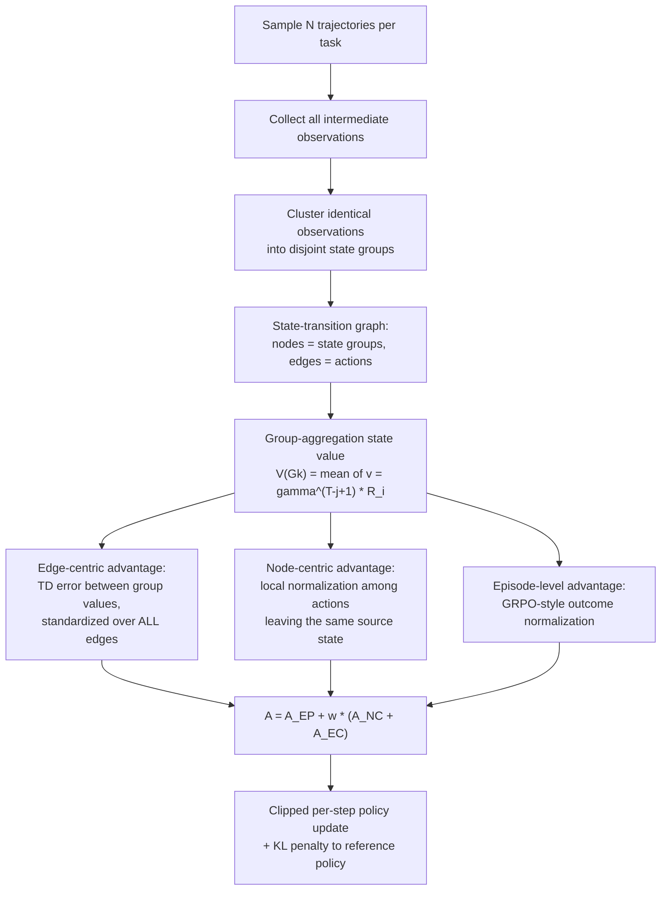

# Group-Graph Policy Optimization for Long-Horizon Agentic Reinforcement Learning

- arXiv: https://arxiv.org/abs/2606.22995
- Source: https://arxiv.org/abs/2606.22995
- 代码：https://github.com/Nala-YN/G2PO
- Project: 
- Local PDF: `papers/rl/agentic-algo/G2PO_2606.22995.pdf`
- Year: 2026
- Category: rl
- Priority: high

## 一句话总结

G2PO（微软 + 北大）把多轮 agent RL 的线性轨迹重构为全局状态转移图——相同 observation 聚为状态组节点、动作作为有向边——用 group-aggregation state-value estimation（组内所有步的折扣回报平均）把 value 估计方差从 $\sigma^2$ 压到 $\sigma^2/|G_k|$，再用 edge-centric advantage（组间 1-step TD error 在全图所有转移上的均值-方差标准化）度量每个动作对任务的绝对推进，与 GRPO 式 episode 级优势和 node-centric 局部优势合成三粒度优势；在 WebShop/ALFWorld/AppWorld 上以 Qwen2.5-1.5B/7B/14B 全面超过 GRPO/GiGPO/PPO/RLOO（WebShop +22.2、ALFWorld +14.4 @1.5B；AppWorld 14B 27.6% vs GRPO 24.8%），优势计算纯 CPU、每步仅 +1s（约 0.4% 总训练时间）。

## 核心技术

1. **State group graph construction（图构建）** — 对任务 $x$ 采 $N$ 条完整轨迹，收集全部中间 observation 集合 $\mathcal{O}$，按"完全相同的 observation"聚类划入互斥状态组：状态组为节点、动作 $(G_s, a, G_t)$ 为边，得到状态转移图。物理含义：多轨迹探索中的同一网页/同一房间配置天然汇成同一节点，被线性视角割裂的探索在图上重新连通。AppWorld 实验证明即使 observation 是 API 返回文本（需推断底层 app 状态），聚类建图依然可行。
2. **Group-aggregation state-value estimation（组聚合价值）** — 先按折扣回报给每条轨迹内的步赋值，再对同一状态组内所有步取平均作为节点价值。动机有二：方差削减（同一状态在不同轨迹中可能通向不同结局，单轨迹结局是掷硬币）；更好的时序信用分配（好动作可能因后续失误而失败、平庸动作可能靠运气成功，跨轨迹平均抹掉未来步噪声）。附录 B.1 证明方差降为 $\sigma^2/|G_k|$。
3. **Edge-centric advantage estimation（边中心优势）** — 动作重定义为状态节点间的转移边，其质量由源组与目标组的价值增量（稀疏终端奖励 + $\gamma=1$ 时结构上对应 1-step TD error）刻画；关键是不做局部归一化，而是把全图所有转移的 TD error 作为全局参照集做标准化——把"在平凡状态里的小改进"与"推动任务全局进展的关键突破"放进同一把尺子。附录 B.2 证明其方差不超过轨迹级优势。
4. **Multi-granularity advantage（三粒度合成）** — 保留 GRPO 式 episode 级优势 $A_{EP}$ 锚定最终任务目标，加上 node-centric $A_{NC}$（同一源状态下各动作的局部相对比较，参考集为该节点所有出边指向的目标组价值）与 edge-centric $A_{EC}$，按静态权重 $w$ 合成每步总优势；$w=0$ 时退化为 GRPO。随后套 GRPO 的裁剪代理目标 + KL 惩罚做逐步（per-step）更新。
5. **GPU-free 实现** — 建图、组聚合、三类优势计算全部只依赖 observation 文本匹配与统计量，跑在 CPU 上；1.5B 模型在 ALFWorld 上每训练步的优势计算阶段仅 +1s（rollout 189s、update 56s 的背景对比），占总训练时间 0.4%。

## 底层原理与数学推导

**问题设定与 GRPO 基线。** 轨迹 $\tau=(o_1,a_1,\dots,o_T,a_T)$，策略 $\pi_\theta(a_i|o_i)$，仅任务完成或达到步数上限时返回标量奖励 $R$（中间步零奖励）。GRPO 对每个 query 采 $G$ 个输出，优势 $A_i = (R_i-\mu)/\sigma$，目标为裁剪代理 + KL 惩罚：

$$J_{GRPO}(\theta) = \mathbb{E}\left[\frac{1}{G}\sum_{i=1}^{G}\left(\min(\rho_i A_i, \mathrm{clip}(\rho_i, 1-\epsilon, 1+\epsilon)A_i) - \beta D_{KL}\right)\right]$$

其中 $\rho_i$ 是重要性采样比。GRPO 的优势被轨迹内所有步共享——好动作可能因后续失败吃到负优势、平庸动作因后续纠正吃到正优势，这是 G2PO 要解决的粗糙信用分配。

**图构建的形式化。** 采 $N$ 条轨迹 $\{\tau_i\}_{i=1}^N$（$\tau_i = \{o_1^i, a_1^i, \dots, o_T^i, a_T^i\}$，$o_1^i = x$），$\mathcal{O} = \{o_j^i\}$ 为全部中间 observation。按相同 observation 聚类划入 $G$ 个互斥状态组 $G_k = \{o_j^i \in \mathcal{O} \mid o_j^i = \bar{o}_k\}$（$\bar{o}_k$ 为第 $k$ 组的特征 observation），图 $\{\mathcal{V},\mathcal{E}\}$ 的节点集 $\mathcal{V} = \{G_k\}$、边集 $\mathcal{E} = \{(G_s, a, G_t) \mid \exists i,j,\ o_j^i \in G_s,\ a_j^i = a,\ o_{j+1}^i \in G_t\}$。

**组聚合状态价值。** 先在单轨迹内按折扣回报赋值，再组内平均：

$$v_j^i = \gamma^{T-j+1} R_i, \qquad V(G_k) = \frac{1}{|G_k|}\sum_{o_j^i \in G_k} v_j^i$$

**方差削减证明（附录 B.1）。** $\gamma=1$、中间步零奖励时经验回报坍缩为终端奖励 $v_j^i = \sum_{t=j}^{T}\gamma^{t-j}r_t = R_i$。设 $\mathrm{Var}(R_i)=\sigma^2$：单轨迹估计方差为 $\mathrm{Var}(v_j^i) = \sigma^2$；在跨轨迹独立假设下组聚合估计方差为

$$\mathrm{Var}(V(G_k)) = \frac{1}{|G_k|^2}\sum_{o_j^i \in G_k}\sigma^2 = \frac{\sigma^2}{|G_k|}$$

$|G_k|>1$ 时方差按组大小线性下降——这是"多宇宙平均"的数学表述：同一状态的结局不该由单次采样决定。

**三类优势估计。** 节点中心（局部参照集 $\Delta_k = \{V(G) \mid o_m^n \in G_k, o_{m+1}^n \in G\}$，即该节点所有出边指向的目标组价值）：

$$A_{NC}(a_j^i) = \frac{V(G_{k'}) - \mathrm{mean}(\Delta_k)}{\mathrm{std}(\Delta_k)}$$

边中心——转移的内在价值增益，稀疏终端奖励 + $\gamma=1$ 下结构上对应 1-step TD error：

$$\delta_j^i = V(G_{k'}) - V(G_k), \qquad A_{EC}(a_j^i) = \frac{\delta_j^i - \mathrm{mean}(\{\delta_j^i\}_{i,j})}{\mathrm{std}(\{\delta_j^i\}_{i,j})}$$

其中均值/方差在**全图所有转移**上计算（全局标准化），而非同源动作的局部集合。episode 级沿用 GRPO：$A_{EP}(a_j^i) = (R_i - \mathrm{mean}(\{R_i\}_N))/\mathrm{std}(\{R_i\}_N)$。三粒度合成为

$$A_j^i = A_{EP}(a_j^i) + w\cdot\left(A_{NC}(a_j^i) + A_{EC}(a_j^i)\right)$$

**G2PO 目标函数。** 逐样本形式（$\rho_j^i = \pi_\theta(a_j^i|o_j^i)/\pi_{\theta_{old}}(a_j^i|o_j^i)$）：

$$J(\theta) = \mathbb{E}\left[\frac{1}{NT}\sum_{i=1}^{N}\sum_{j=1}^{T}\left(\min\left(\rho_j^i A_j^i, \mathrm{clip}(\rho_j^i, 1-\epsilon, 1+\epsilon)A_j^i\right) - \beta D_{KL}\left(\pi_\theta(\cdot|o_j^i)\,\|\,\pi_{ref}(\cdot|o_j^i)\right)\right)\right]$$

**边中心优势的方差上界（附录 B.2）。** 轨迹级优势 $A_{traj}(a_j^i) = R_i - b$ 的方差为 $\sigma^2$；边中心优势的方差展开为

$$\mathrm{Var}(\delta_j^i) = \mathrm{Var}(V(G_{k'})) + \mathrm{Var}(V(G_k)) - 2\,\mathrm{Cov}(V(G_{k'}), V(G_k)) \le \frac{\sigma^2}{|G_{k'}|} + \frac{\sigma^2}{|G_k|}$$

其中协方差项非负（经过目标节点的轨迹与经过源节点的轨迹共享历史、正相关）。当 $|G_k|>1$ 且 $|G_{k'}|>1$ 时 $\mathrm{Var}(\delta_j^i)\le\sigma^2$——边中心优势在方差上不超过轨迹级优势，同时给出步级信号。

## 物理直觉解释

**从"乘客路线图"到"地铁网络"**。线性轨迹视角相当于每个乘客各自画一张自己的完整路线图，路线之间毫无关系；G2PO 是把所有乘客的路线叠加到一张地图上——同一个地铁站（相同 observation）自动合并为同一个节点，乘客的每次换乘（动作）成为站间的边。一旦叠加，两件事立刻变得可能：其一，判断一个站好不好，不再看"某一位从这站上车的乘客最后回没到家"（单轨迹结局，纯掷硬币），而是看"所有经过这站的乘客的平均结局"——组聚合就是把同一站的多次采样平均掉运气；其二，网络结构显形之后，"哪个换乘是全线路的关键枢纽"变成一个可以在全网范围内排序的问题。论文的组大小统计证实了叠加的必要性：WebShop 只有 11.9%、ALFWorld 只有 8.1% 的步处于"组大小为 1"的孤立状态，平均组大小约 5——绝大多数探索步都能共享别的轨迹在同一状态上的经验。

**局部比较 vs 全局标尺**。判断一个路口的转弯好不好有三种问法：问"这辆车的终点到家了吗"（episode 级——把整条路程的功劳/锅都算在这一脚上）；问"这个路口的几个出口里这个相对最好吗"（node-centric 局部比较——论文的案例研究显示它会失灵：在 ALFWorld 任务"cool some bowl and put it in microwave"里，从"把杯子错误放进微波炉"的坏状态（$V=0.00$）转移到"到达冰箱、找到冷却工具"（$V=2.10$）是向目标的一大跳，但局部比较只看"各个目的地价值的平均"（局部均值 1.54），冰箱这一跳只得到 0.55 的微弱优势）；第三种问法是 G2PO 的——"这一脚油门让离终点近了多少（$\delta = 2.10 - 0.00 = 2.10$），放到全城所有路段的近距增量分布里排第几"——结果该转移拿到 2.1 的高优势。全局标准化的含义是：**优势的参照系从"同一个路口的邻居"换成"全网所有路段"**，动作的绝对贡献因此可见。

**critic-free 的第三条路**。要在中间步拿到价值信号，教科书做法是学一个 value network（PPO，1.5B 上 54.4% 最弱、还要养 critic），或者请标注者/PRM 给每步打分（成本高且 reward hacking）。G2PO 走的是"统计 + 图"路线：**N 条并行 rollout 就是 N 个平行宇宙，价值不必学习，直接从多宇宙的结局分布里读出来**——同一状态组的平均结局就是该状态的经验价值，组间差就是 TD error。这继承了 GRPO"用经验均值当基线"的哲学，只是把基线从"一条轨迹的组"升级为"图上一个节点的全部到访"。代价是它要求环境状态可由 observation 精确识别（文本完全匹配即可），且要求 N=8 的并行采样在经济上可承受——真实机器人每条 rollout 都是真实时间，这一前提在具身侧要重新掂量。

## 工程细节与实操指南

- 训练框架：verl-agent（GiGPO 同款，提供轻量 step-level RL 与灵活的信用分配接口），推理引擎 vLLM；论文自述局限是只在 verl-agent 上实现，tree sampling / 异步采样未验证
- 模型：Qwen2.5-1.5B-Instruct / 7B-Instruct 为主，AppWorld 用 Qwen2.5-14B-Instruct；prompt 格式 `<think></think>` 包推理、`<action></action>` 包动作（AppWorld 用 `<code></code>`）
- 超参（三基准一致部分）：invalid action 惩罚系数 0.1、actor LR $1\times10^{-6}$（PPO critic $1\times10^{-5}$）、rollout 温度 1.0 / 验证温度 0.4、KL 系数 0.01、组方法统一 16 组 × 8 环境 = 128 并行环境（PPO 用 128 独立环境）、组大小 $N=8$、G2PO 固定 $\gamma=0.95$、$\omega=1$（不调参）
- ALFWorld：prompt/响应上限 2048/512 token，每 episode 最多 50 步，mini-batch 256，奖励 success 10 / failure 0 / invalid -0.1
- WebShop：4096/512 token，最多 15 步，mini-batch 64；AppWorld：13000/512 token，最多 30 步，mini-batch 64
- 算力：ALFWorld/WebShop 的 1.5B/7B 各跑 100 迭代于 4×H100；AppWorld 14B 跑 50 迭代于 8×H100
- 建图实践：observation 需含固定长度历史（论文设定 observation incorporates a fixed number of historical steps）；按"observation 完全相同"聚类，无模糊匹配；`v_j^i = γ^{T-j+1} R_i` 中 $\gamma=0.95$ 使轨迹后段的步价值衰减
- 组大小监控（训练动力学）：两基准平均组大小约 5；WebShop 组大小先升（早期决策趋同产生相同 observation）后降（细粒度信用分配帮助模型删除冗余步、轨迹变短）；ALFWorld 组大小持续上升（任务本身要求重复动作、必然重访相同状态）；组大小分布的具体分桶比例（图 7 柱状数值与分桶的对应关系）待确认：柱状图标签在 PDF 文本抽取中顺序被打乱，仅"组大小为 1 占 11.9%（WebShop）/8.1%（ALFWorld）"可从正文直接确认
- 推理效率副产品：G2PO 训出的模型完成任务的交互步数少于 GRPO（两基准均如此）、多数情况少于 GiGPO（图 4c；柱状图数值与方法的一一对应待确认：文本抽取无法完全确定分组归属，WebShop 1.5B 一组读数为 GRPO 9 / GiGPO 7.3 / G2PO 5.4 步）——更少交互步直接降低推理与 API 调用成本

## 消融实验与分析

主结果（论文 Table 1，成功率 %，3 seeds 平均）：

| 方法（Qwen2.5-1.5B） | ALFWorld All | ALFWorld Look | WebShop Succ. | WebShop Score |
|------|------|------|------|------|
| **G2PO** | **95.0±0.8** | **96.3±5.2** | **71.2±2.6** | **85.1±1.4** |
| GiGPO | 86.7±1.7 | 67.5±4.6 | 67.4±4.5 | 83.5±1.8 |
| GRPO | 72.8±3.6 | 53.7±8.0 | 56.8±3.8 | 75.8±3.5 |
| RLOO | 69.7±2.5 | 52.8±8.6 | 52.1±6.7 | 73.9±5.6 |
| PPO (with critic) | 54.4±3.1 | 40.5±6.9 | 51.5±2.9 | 73.8±3.0 |

7B 规模与 AppWorld（Table 1 / Table 2）：

| 设置 | G2PO | GiGPO | GRPO | Δ vs GRPO |
|------|------|------|------|------|
| ALFWorld All, 7B (%) | 96.9±1.3 | 90.8±1.3 | 77.6±5.2 | +19.3 |
| WebShop Succ., 7B (%) | 78.3±0.6 | 75.2±3.8 | 66.1±3.7 | +12.2 |
| AppWorld Succ., 14B (%) | 27.6 | 25.7 | 24.8 | +2.8 |
| AppWorld Score, 14B | 21.7 | 19.2 | 20.7 | +1.0 |

组件级消融（论文 Figure 3，Qwen2.5-1.5B，从 episode-only 逐级加组件）：

| 配置 | 相对表现 |
|------|------|
| $A_{EP}$ only（≈GRPO） | 最低基线 |
| +$A_{NC}$（node-centric） | ALFWorld 子任务普遍上升，WebShop 温和 |
| +$A_{NC}$ + GA（组聚合价值） | 两基准显著跳升（组聚合降方差的直接收益；具体柱值待确认：图 3 为柱状图，数值无法从 PDF 文本抽取） |
| +GA + $A_{EC}$（完整 G2PO） | 最高，Look 子任务相对 GRPO +42.6（53.7→96.3） |

其余关键数字：步级权重 $w$ 在 WebShop 上扫描呈先升后降，$w=0.8$ 处成功率与分数最高（过低退化为 GRPO、过高过度短视）；优势计算 +1s/步，占总训练时间 0.4%（图 5：rollout 189s、update 56s、ref prob 10s、old prob 11s）；状态价值方差分析（图 4b）显示现有 step-level 方法下两基准、两个规模都有相当比例状态的 value 方差非零——单轨迹价值不可靠是普遍现象。

**核心结论：** (1) 全局图视角的增量真实存在——对 GiGPO（同样有 anchor state 分组的 node-centric 优势）仍领先 1.5B ALFWorld +8.3（86.7→95.0）、WebShop +3.8，说明收益不只来自"分组"，edge-centric 全局标准化贡献了独立增量；(2) 消融方向 $A_{EP} \to +A_{NC} \to +GA \to +A_{EC}$ 在两基准单调抬升，组聚合（GA）与边中心（AEC）各自带来可分离的一截收益；(3) 子任务分解暴露差距结构——Look（+42.6）、Pick2（+37.9）、Cool（+37.4）这类需要"找到正确工具/地点"的关键突破型子任务增益最大，Pick（+11.9）、Clean（+10.6）这类常规动作型增益小，与"全局标准化优先关键转移"的设计意图一致；(4) 收益随规模递减但不消失（1.5B +22.2 → 7B +19.3 → 14B AppWorld +2.8），且 AppWorld 的 API observation 证明了建图对复杂 observation 形态的鲁棒性；(5) 推理步数同步下降（WebShop 1.5B 约 9→5.4 步）意味着成本效率收益与精度收益同向，这对按交互步计费的真实环境是二次红利。

## 技术权衡（Trade-off）

| 优势 | 劣势与工程代价 |
|------|------|
| Critic-free 拿到步级稠密信号：无 value network、无 PRM 标注、无 reward hacking 面攻击面 | 依赖 observation 可精确字符串匹配建组：模糊/部分可观测/连续状态下"相同状态"失效，需额外近似聚类且误差会传入价值 |
| 纯 CPU、+1s/步（0.4% 总时间），对训练管线近乎零侵入 | 依赖 $N=8$ 并行组采样来填满状态组：rollout 昂贵的真实环境（机器人、真实浏览器）里组采样的成本被放大 |
| Edge-centric 全局标准化凸显关键突破转移，关键型子任务增益最大（Look +42.6） | 全局均值-方差标准化对 batch 组成敏感：当绝大多数转移都无进展时，微小改进经标准化后可能被放大成大优势 |
| 推理交互步数同步下降（约 9→5.4 步），精度与成本双收益 | 只在 verl-agent 框架实现与验证；tree/异步采样设置未测（论文自述局限）；$\gamma=0.95$ 与 $\omega=1$ 的组合敏感性只在 $w$ 单轴上扫过 |

## 技术价值与演进定位

G2PO 在 group-based agentic RL 的演化线上走完了关键一步：GRPO 把"组内相对奖励"确立为 critic-free 的基线机制，GiGPO 把组从"轨迹级"细化到"相同状态的锚点组"，G2PO 则把这些锚点连成图，并指出之前所有 step-level 方法共享的一个盲区——把探索当作孤立的线性轨迹集合。这个视角转换带来两个具体的技术增量：value 估计从单轨迹样本变成跨轨迹的组统计（方差 $\sigma^2 \to \sigma^2/|G_k|$），优势估计的参照系从"同源动作的局部集合"变成"全图转移的全局分布"。后一项尤其值得注意：局部归一化的方法（GiGPO 类）本质上只能回答"在这里哪个动作相对更好"，永远无法区分"平凡状态里的小改进"和"推动任务的关键突破"，而长 horizon 稀疏奖励任务里恰恰是后者决定成败——Look 子任务 +42.6 对 Pick +11.9 的增益分布直接印证了这一点。工程上它保持了近乎零成本（纯 CPU、0.4% 时间），使"图结构信用分配"可以当作 GRPO 的直接替换件而不是一套新基建。在算法与稳定性子线的谱系里，它与 reasoning-to-agentic 综述线勾勒的"trajectory-level → step-level → 结构化 credit assignment"演化叙事严丝合缝，也为后续把图结构与环境先验（可达性、状态等价类）结合的工作留出了接口。

## 与其他论文的关系

- GiGPO（最直接前驱，同用 verl-agent 框架与 anchor state 思想）：GiGPO 在相同状态的组内做 node-centric 局部归一化、但 value 仍取自单轨迹结局——G2PO 把锚点升级为全图节点、value 改为组聚合、新增 edge-centric 全局标准化，1.5B ALFWorld 86.7→95.0、WebShop 67.4→71.2。
- GRPO / RLOO / PPO（基线三件套）：GRPO 的组归一化是 $w=0$ 的退化特例，RLOO 用 leave-one-out 基线同样 critic-free，PPO 需要显式 critic 且 1.5B 上全面垫底（ALFWorld 54.4）——G2PO 证明 critic-free 路线不必以牺牲步级信号为代价。
- reasoning-to-agentic（信用分配综述线，notes/rl/reasoning-to-agentic.md）：该综述把"从 trajectory 到 step 的粒度演化"与信用分配方法谱系作为 agentic RL 的主线问题——G2PO 是"结构化/图式 credit assignment"这一支的代表作，其组聚合方差分析（附录 B）也是综述里"组统计降方差"论点的具体实例化。
- RAGEN/StarPO 与 lite-researcher / harness-1 / tool-r0（同批 agent RL 训练系统）：RAGEN 代表 trajectory-level 整段 concat 训练（长 horizon 下上下文爆炸、无法评估单步）；其余框架以稀疏 outcome reward 训多轮 agent——G2PO 的建图只需 observation 文本、纯 CPU 实现，可作为这些系统的优势估计模块直接替换。
- arlarena / polar（同库稳定性与规模化线）：arlarena 关注训练稳定性框架、polar 关注跨 harness 规模化——与 G2PO 正交（一个管"更新怎么算"，一个管"训练怎么跑"），图优势带来的更低方差（附录 B.2 上界）本身也是稳定性收益的一个来源。
- harbor / enpire（机器人侧对照）：机器人策略的"状态"天然可由物理配置或感知观测聚类，图式信用分配的思想可迁移；但机器人环境通常有 dense shaping 奖励（稀疏性弱）、且每组 N=8 的真实 rollout 成本远高于仿真文本环境——迁移的主要障碍在采样经济性而非算法本身。

## 精读问题

1. 建图按 observation 完全相同聚类——ALFWorld/WebShop 的 observation 是离散且规范的文本所以可行，部分可观测或带噪声的 observation（真实机器人感知、渲染 DOM 的网页）下"相同状态"的近似聚类误差如何沿图传播到 value 与优势？是否存在把相近状态错合并导致优势符号反转的失效模式？
2. $v_j^i = \gamma^{T-j+1} R_i$ 的折扣使轨迹后段的步价值整体偏小，edge-centric 的 $\delta = V(G_{k'}) - V(G_k)$ 会不会系统性偏向轨迹前段的转移（前段价值增量天然更大）？$\omega=1$ 全程固定、$\gamma$ 只在附录给了一个值，两者对长任务（ALFWorld 50 步上限）的联合敏感性没有报告。
3. 全局标准化把全图 TD error 拉成零均值单位方差——当一个 batch 里 90% 的转移都落在无进展区域时，剩余 10% 的小改进经标准化会被放大成大优势，这是特性还是失效模式？是否需要一个"绝对增量下限"与全局标准化并联？
4. ALFWorld 的平均组大小随训练上升（任务本身要求重复动作、必然重访相同状态）——重复访问同一状态组的转移其 $\delta\approx 0$，edge-centric 是否会系统性地压低"必要的重复动作"（如反复开合容器）的梯度，导致这类任务段欠训练？
5. AppWorld 上 G2PO 对 GiGPO 的领先（27.6 vs 25.7）远小于 ALFWorld（95.0 vs 86.7）——是 API 返回文本的状态聚类更难建图，还是 AppWorld 任务的关键突破集中在少数几步、全局标准化的区分度本来就该更小？哪一种解释与图 4b 的方差分布一致？
6. 组大小分析只统计了"组大小为 1"的比例（WebShop 11.9% / ALFWorld 8.1%），但方差削减是 $\sigma^2/|G_k|$——按组大小加权的实际平均方差削减倍数是多少？分布尾部（图 7 中存在 >50 的大组）是否意味着少数热门状态吞掉了大部分梯度预算？
