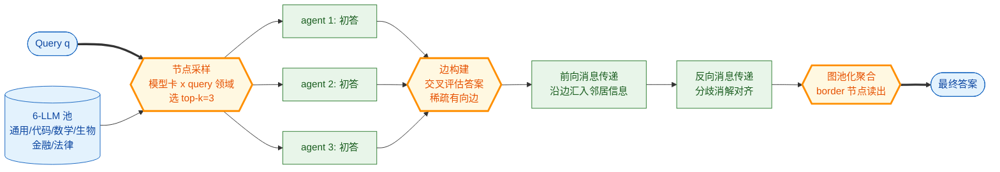

# Graph-of-Agents (GoA): A Graph-based Framework for Multi-Agent LLM Collaboration

- arXiv: https://arxiv.org/abs/2604.17148
- Source: https://arxiv.org/abs/2604.17148
- Project: https://github.com/UNITES-Lab/GoA
- 本地 PDF：`papers/rl/agentic-algo/GoA_2604.17148.pdf`
- Year: 2026 (ICLR 2026)
- Category: rl
- Priority: medium

## 一句话总结

UCSD 系（Sukwon Yun 等，UNITES-Lab）把推理时多 LLM 协作从 MoA 的"全连接层叠聚合"重构为**图上的四个可学习环节**：模型卡采样选节点（哪些 agent 参与）→ 交叉评估建边（谁听谁说）→ 前向再反向消息传递（双向沟通，反向轮专做分歧消解）→ 图池化聚合（border 节点读出最终答案）；理论上证明 k=N 时 GoA 退化为 MoA（Proposition 1），即 MoA 是其特例。在 6 个 LLM 池（7B 级为主 + 领域特化模型）× MMLU/MMLU-Pro/GPQA/MATH/HumanEval/MedMCQA 上，**只用 3 个 agent 的 GoA 全面超过用满 6 个 agent 的 Debate/Self-Consistency/Refine/ReConcile/MoA/Self-MoA**（如 GPQA 39.98 vs 最强基线 38.92、MedMCQA 60.04 vs 55.70、MATH GoAMean 73.12 vs 71.60）——"选对 3 个 + 组织好沟通"胜过"堆满 6 个"。ICLR 2026，纯推理时方法，零训练。

## 九问速览

1. **Problem**：LLM 供给过剩时代的组合学问题——给定一池异构模型与一个具体 query，选哪些 agent、怎么连通信、怎么聚合？
2. **Bottleneck**：MoA 三大缺陷：全选（不选 agent，N 个全上，成本线性涨）；全连（固定层叠全连接通信，噪声信息也全量传播）；加法聚合（verbalized/agreement 加权聚合丢弃答案间结构关系）。
3. **Insight**：把"多智能体协作"形式化为图构造问题——节点=候选 agent（由模型卡元数据做 query 相关性采样）、边=交叉评估出的"值得听取"关系、聚合=图神经网络式消息传递与池化。
4. **Method**：node sampling（模型卡属性 × query 领域）→ edge construction（agent 互评答案定方向的稀疏边）→ forward + reverse message passing（反向轮专做分歧对齐）→ graph pooling（border/重要节点聚合出答案）。
5. **Evidence**：6 基准全绿：GoA(3 agents) > 六个 multi-agent 基线(6 agents) > 单 agent 专家模型；MMLU 79.18 vs Self-MoA 78.14；GPQA 39.98 vs SC 36.36。
6. **Ablation**：k（节点数）扫描——3 已饱和附近；去掉反向消息传递掉分（分歧消解贡献）；MoA 是 k=N 退化特例（Prop 1）。
7. **Assumption**：模型卡元数据足以估计 query-agent 相关性；7B 级池内互评（LLM-as-judge）可靠；任务有可判答案以便交叉评估。
8. **Failure**：全靠推理时 LLM 打分建边——judge 偏差直接进图结构；每 query 都要跑多轮互评 + 消息传递，推理成本显著高于 Self-Consistency；只在 7B 级池验证，70B 级池的成本-收益未测。
9. **Opportunity**：与训练路线（MAPoRL/Dr.MAS）正交——先用 GoA 选组合再共训；边构建可换成 verifier 模型；在线/持续场景的图动态演化未做。

| 维度 | 论文答案 |
|---|---|
| Perception | query 领域信号 + 各 agent 模型卡属性（擅长域/规模） |
| Closed-loop | 反向消息传递轮：下游分歧反馈回上游，一轮结构化闭环 |
| Correction | 分歧消解在 reverse pass 显式处理（冲突答案互评对齐） |
| Deployment | 纯推理时，零训练；适合异构 API 模型池的路由器场景 |

## 核心技术

*架构速览：推理时图构造管线——选节点（模型卡匹配）→ 建边（互评）→ 双向消息传递（正向汇聚 + 反向消歧）→ 图池化读出；k=N 时退化为 MoA*

1. **节点采样**：给池中每个 LLM 建模型卡（领域标签、规模、擅长任务），query 进来先做领域识别，按相关性采 top-k（k=3 足矣）——直接砍掉"全上"的线性成本。
2. **边构建**：k 个 agent 先各自独立作答，然后**互相评估答案**（LLM-as-judge 打分），按评估结果建稀疏有向边（谁值得听谁）——通信结构由任务实例动态决定，而非固定拓扑。
3. **前向 + 反向消息传递**：forward pass 沿边把邻居答案汇入（类似 GNN 聚合邻居特征）；reverse pass 逆向传——专门用于下游节点把自己的分歧/不一致反馈给上游，做一轮显式对齐。这是与 MoA 单向层叠的本质区别。
4. **图池化**：按节点重要性（度/评估分）选 border 节点，聚合生成最终答案——替代 MoA 的 verbalized 加权拼接。
5. **理论锚点（Prop 1）**：k=N 且边全连接、聚合取加权平均时，GoA 恰好还原 MoA——把 MoA 放进自己的参数空间原点，"GoA ≥ MoA"是结构保证而非经验运气。

## 底层原理与数学推导

**图形式化**。给定 query q 与池 A={a_1..a_N}：G = (V,E,W)，V = 采样出的 k 个 agent，E ⊆ V×V 由交叉评估分数阈值化，W 为边权（评估分）。答案更新：

$$h_i^{(l+1)} = \mathrm{UPDATE}\left(h_i^{(l)},\; \mathrm{AGG}\left(\{w_{ij}\, h_j^{(l)} : j \in \mathcal{N}(i)\}\right)\right)$$

forward 若干层后做 reverse（邻接转置再传），最终 readout：A = READOUT({h_i：i ∈ border})。UPDATE/AGG 由 LLM prompt 实现（非神经网络权重）——"图神经网络的结构、语言模型的信息载体"。

**Proposition 1（退化证明思路）**：k=N、E=V×V（全连接）、单层 forward、AGG 取所有邻居的 verbalized 加权和且无 reverse——消息传递公式逐项对应 MoA 的 layer-wise aggregation，故 GoA 参数空间包含 MoA。价值不在证明难度而在定位：MoA 的增益被解释为"全连接图上的均值池化"，其失败模式（噪声节点等权污染）在图视角下一目了然。

**成本模型**：MoA 用 N 个 agent 每层全聚合（O(N²) 交互）；GoA 固定 k=3，边稀疏（O(k·d̄)），把预算从"多买 agent"挪到"多传两轮消息"——论文证明这笔置换是赚的。

## 物理直觉解释

把多 LLM 协作想成会诊：MoA 是"把全院六个科室医生全叫来，每人发言一次，主任把所有发言加起来写病历"——人多、信息杂、责任稀释。GoA 是"按病症先挂对三个科室的号（节点采样），三个医生互相看了对方的初步意见后决定谁重点听谁的（建边），先各自吸收（前向）、再把分歧当面掰扯一轮（反向），最后由主诊医生汇总（池化）"。同样的三个脑子，组织方式决定了会诊质量。

## 工程细节与实操指南

- 纯推理时实现：无训练循环，全部组件是 prompt 编排；代码 github.com/UNITES-Lab/GoA（ICLR'26）。
- 模型池配置：论文用 6 个 ~7-8B（Qwen2.5-7B-Instruct 通用、Qwen2.5-Coder、Mathstral、Bio-Medical-Llama3、finance-Llama3、Saul-legal）——领域特化小模型在图里反而比通用大模型常被选中，说明模型卡匹配是真信号。
- 调参面小：k（节点数，3 附近饱和）、边阈值、forward/reverse 层数——零训练所以全是推理预算换性能的旋钮。
- 接入场景：模型路由/gateway 层的天然候选——企业有多 API 模型订阅时，GoA 当"按 query 组队"的路由器。
- 注意推理成本：互评建边 + 两轮消息传递意味着每个 query 的调用次数 ≈ k(初答) + k(k−1)(互评) + k×2(消息) ——比 SC 的 N 次贵，选 k 时算清账。

## 实验协议清单

- 池：6 个 LLM（通用/代码/数学/生物医学/金融/法律各一）；零样本 CoT 评测。
- 基准：多域 MMLU、MMLU-Pro、GPQA、MATH、HumanEval、MedMCQA 六个。
- 基线两层：单 agent（六个专家模型各自 + 通用模型）与 multi-agent（Debate、Self-Consistency、Refine、ReConcile、MoA、Self-MoA，全部 6 agents 满配）。
- 消融：k 扫描（1..6）、去 reverse pass、去边构建（随机边）、聚合方式（GoAMax vs GoAMean 两种池化变体）。
- 成本对照：报告 agent 调用数与 token 开销（GoA-3 vs 基线-6）。

## 消融实验与分析

- **k=3 > 满配 6**：所有六个基准上 GoA(3) 全面超过六个 multi-agent 基线(6)——最大单项 MedMCQA 60.04 vs 基线最好 55.70（+4.34），GPQA 39.98 vs 38.92；MATH 上 GoAMean 73.12 vs Refine 71.60。
- **GoAMax vs GoAMean**：读出聚合的两种变体各有胜场（HumanEval 84.67 vs 84.98，MMLU 79.18 vs 78.52）——无一致性优势，任务答案类型（生成 vs 选择）决定哪种池化好。
- **单 agent 专家仍强于多数 multi-agent 基线**：Qwen2.5-7B 单体在 MMLU 77.61 已超 Debate/ReConcile——再次佐证"多智能体 prompt 不是免费午餐"（与 MAPoRL 的动机互证）。
- **退化验证**：k=N 时数值逼近 MoA（Prop 1 的实验对照）。

## 技术权衡（Trade-off）

- **零训练 vs 无学习**：结构决策全靠推理时互评，judge 偏差直接结构化进图；无法从历史 query 中积累"哪类组合好"（对比路线：把组队学进策略，即 MAPoRL/Dr.MAS）。
- **质量 vs 延迟**：串行三阶段（初答→互评→双向传递→池化）至少 4 个串行 LLM 环节，延迟显著高于 SC（可并行采样）。
- **池内多样性是燃料**：模型卡采样依赖池的领域覆盖；池同质化（全是通用模型）时 GoA 退化接近 Self-MoA。
- **7B 级验证**：更大池中互评成本与可靠性未验证，外推要谨慎。

## 技术价值与演进定位

推理时多智能体路线从"固定拓扑 + 全员参与"（Debate/MoA）进化到"动态稀疏图 + 选举制"，是 LLM 路由（model routing）与多智能体协作两个方向的合流点。演化线：More Agents（'24，采样投票的规模律）→ MoA/Self-MoA（'24-'25，层叠聚合）→ **GoA（'26 ICLR，图化 + 选员 + 双向通信）**；下一步显然是把图构造学进权重（与 MAPoRL 共训结合）。对本库主线：机器人 fleet 的"任务分配"问题同构——多本体异构能力池 + 按任务动态组队，GoA 的模型卡匹配 + 互评建边可直接改写成 embodiment 卡匹配。

## 与其他论文的关系

- **maporl / dr-mas**（库内，同期拉取）：训练侧两篇——GoA 决定"谁上场怎么打配合"（结构），MAPoRL/Dr.MAS 决定"把配合练进权重"（参数）；GoA 的图拓扑可作为 MAPoRL 共训的工作流定义。
- **more-agents**（库内，同期拉取）：证明了最朴素多 agent（采样投票）的规模律；GoA 回答的是规模律的另一半——固定预算下怎么组织更有效（3 个图组织的 > 6 个堆的）。
- **arlarena / ragen-2**（库内）：单智能体 RL 稳定性与诊断；GoA 无训练，但互评建边引入的 judge 偏差是未来多智能体 RL 奖励设计要面对的同一问题。
- **tongyi-deepresearch 的 Heavy Mode**（库内）：并行 n 个 agent 各产压缩报告再综合——本质是 k 个节点 + 单层池化的退化 GoA；GoA 的反向消息传递正是它缺的分歧消解环节。
- **MoA/Self-MoA**：直接前驱与最强基线；Prop 1 把它们吸收为特例。

## 精读问题

1. 互评建边用同池 7B 模型互判——如果 judge 能力弱于被评者（池升级到 70B 时），边质量会崩吗？外部强 judge 的成本置换怎么算？
2. reverse pass 只传一轮，分歧消解的不动点性质如何（会不会反向轮把对的改成错的——MAPoRL 的 α0 激励正是为这种场景设计的）？
3. k=3 饱和是池容量 artifact 还是任务复杂度决定？多域混合长任务（如 deep research）的最优 k 会怎么变？
4. 图结构每 query 现算——同一 query 分布下的图结构统计（哪些 agent 对常连边）能否蒸馏成静态路由规则？
5. 把"节点"从 LLM 换成机器人本体（能力卡：负载/末端/传感器），GoA 的消息传递对 multi-robot 任务分配直接可用吗——通信带宽受限时边权怎么退化？
