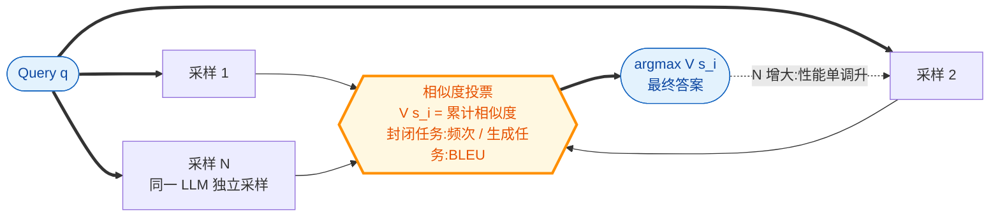

# More Agents Is All You Need（Agent Forest 采样-投票规模律）

- arXiv: https://arxiv.org/abs/2402.05120
- Source: https://arxiv.org/abs/2402.05120
- Project: https://github.com/MoreAgentsIsAllYouNeed/AgentForest
- 本地 PDF：`papers/rl/agentic-algo/MoreAgents_2402.05120.pdf`
- Year: 2024 (TMLR 10/2024)
- Category: rl
- Priority: medium

## 一句话总结

腾讯（Junyou Li 等）的极简但影响深远的经验研究：**仅靠 sampling-and-voting（"Agent Forest"：同一 LLM 采样 N 次再相似度投票选出累计相似度最高的答案），性能随 agent 数 N 单调上升且不饱和（到 N=40）**；该方法与 CoT、Self-Consistency、Debate、Refine、Diversity、PMoC 等复杂方法正交可叠加；增益与任务难度强相关——简单任务（MMLU 类）几近零增益，难任务（GSM8K 上 Llama2-13B 0.35→0.59、GPT-3.5 0.73→0.85）增益 12-24 个点。TMLR 2024，365+ 引用——它是"多智能体有没有用"这场争论的基线锚点：在讨论任何精巧的多智能体拓扑之前，先问有没有打过这条免费（只需推理算力）的规模律。对当前 2026 年的多智能体研究而言，它是 MAPoRL/GoA 等工作的"必须引用且必须对比"的朴素上限。

## 九问速览

1. **Problem**：多 agent/集成类方法（Debate、CoT-SC）各自报告有效，但"单纯增加 agent 数量"这一零设计基线的规模律从未被系统刻画。
2. **Bottleneck**：社区默认增益来自协作机制设计；没人隔离出"采样宽度本身"的贡献。
3. **Insight**：把多智能体退到最简形式（同模型独立采样 + 相似度投票），扫 N∈[2,40]×多任务×多模型——曲线单调不饱和即证明规模律独立存在。
4. **Method**：Agent Forest = 采样 N 个答案 → 封闭任务按出现频率/生成任务按 BLEU 计累计相似度 V(s_i) → 取 argmax 为最终答案。
5. **Evidence**：Table 2——Llama2-13B GSM8K 0.35→0.59、MATH 0.03→0.09、MMLU 0.42→0.51；GPT-3.5 GSM8K 0.73→0.85；多模型多任务全一致正向。
6. **Ablation**：与 Deberta-SC/CoT-SC/Debate/Refine/Diversity/PMoC 叠加全部有增益（正交性）；增益与任务难度相关（难度分级后难子集增益大）；采样温度与多样性方法的作用被分解。
7. **Assumption**：答案空间存在可聚类的"正确模态"且相似度度量能识别它（生成任务用 BLEU 是明显弱点）。
8. **Failure**：简单/饱和任务近乎无效（MMLU 增益 ~2-9 点且小模型已饱和时趋零）；BLEU 相似度对代码类生成判别力弱；无法处理需要真分工的任务（工具调用、长 horizon）。
9. **Opportunity**：没有模型间协作、没有学习——它定义的"免费增益带"正是后续训练方法（MAPoRL）与组织方法（GoA）必须超越的下界。

| 维度 | 论文答案 |
|---|---|
| Perception | 每个 agent 独立看同一个 query，无任何信息交换 |
| Closed-loop | 无——纯开环并行采样 |
| Correction | 投票即纠错：少数模态被多数模态吸收 |
| Deployment | 工程上最易部署：并发调用 + 计数器；成本 = N 倍推理 |

## 核心技术

*架构速览：零协作拓扑的多智能体下界——同模型独立采样 N 份，按答案间累计相似度投票；N 到 40 仍不饱和，增益集中在难任务*

1. **Agent Forest 投票**：与 Self-Consistency 的多数投票不同，用累计相似度 V(s_i)=Σ_j≠i sim(s_i,s_j)（封闭任务=出现频次，生成任务=BLEU）——选出"离群最小"的答案而非硬众数，对生成任务更平滑。
2. **规模律实验设计**：N∈{2..40}（Debate 组合时限 10——通信成本让堆 N 不可行，这本身就是横向证据）；10 次独立重复取均值报标准误。
3. **正交性验证**：与六种增强方法两两组合（含 Debate——AF 包住 Debate 后仍随 N 涨），证明采样宽度与协作机制是两个独立维度。
4. **难度相关性**：按正确率分层，增益集中在低正确率（难）区间——解释了为什么强模型/简单任务上多 agent 方法常"无效"。

## 底层原理与数学推导

**采样-投票的统计本质**。设单次采样答对概率 p，N 次采样中正确模态占比 X~Bin(N,p)/N。累计相似度投票等价于选经验众数（正确答案相似度聚为一类、错误答案分散时），最终答对概率 ≈ P(X > max 错误模态占比)。当错误答案分散（低 p、错误空间大）时，正确模态只需占比超过分散错误的最高峰——**这正是"越难的任务增益越大"的机理**：p 小时单次命中率低，但正确模态的相对密度仍高于任何单个错误模态，N 增大使经验众数的估计噪声下降，P(选对) → p/(p+(1-p)/K) 型上界（K 为错误模态有效数）。饱和条件：p 已高（简单任务）或错误答案高密度聚集在少数模态（系统性偏差，采样救不了）。

**与温度的关系**：采样温度控制分布熵——温度 0 时 N 个样本全同，AF 失效；温度过高则正确模态密度被摊薄。论文分解了多样性方法（如 Diversity prompting）与采样宽度的独立贡献。

## 物理直觉解释

问路：一个人不确定时，问他 40 次，取出现最多的那个答案——如果他的错误是随机犯的（每次错得不一样）而对的那个总是同一个，多数票就能把随机性滤掉。但如果他系统性地记错某条路（每次都自信地错成同一个），问多少次都一样错。这就是规模律的两个边界：**随机错误可投票滤除，系统性错误不可**。任务难度对应"错误分散程度"——难题错误五花八门（好滤），简单题要么对要么犯同一个典型错（难滤但本来正确率也高）。

## 工程细节与实操指南

- 实现成本≈零：并发 N 次 chat completion + Counter；生成任务用 BLEU 聚类时注意 n-gram 平滑。
- 部署建议：作为任何复杂多智能体系统的**第一基线**——先测 AF-40 的分数再谈架构设计；实时场景用 N 的准确率-延迟曲线选工作点。
- 代码：github.com/MoreAgentsIsAllYouNeed/AgentForest。
- 与 best-of-N + verifier 的区别：AF 不需要外部 verifier（用答案间自相似度），当有可信 verifier 时 BoN 更优——两者适用面不同。
- 成本侧：N 倍推理算力换单调增益，2024-2026 推理降价使 AF-100 在生产中越来越现实（与 test-time scaling 浪潮同向）。

## 实验协议清单

- 任务五类：GSM8K、MATH（算术推理）、MMLU、Chess（通用推理/棋局状态追踪）、HumanEval（代码生成）。
- 模型：Llama2-13B、Llama2-70B、GPT-3.5-Turbo（GPT-4 仅作单次参照）；10 次重复、标准误报告。
- 规模扫描：N 到 40（Debate 组合时 10）；accuracy- ensemble size 曲线（Figure 3）。
- 正交组合：Deberta-SC、CoT-SC、Debate、Refine、Diversity、PMoC 六方法叠加。
- 难度分层分析：按任务/正确率分层报增益分布。

## 消融实验与分析

- **主规模律**（Figure 3/Table 2）：五任务三模型全单调；量化增益——GSM8K：13B +24、70B +20、GPT-3.5 +12 点；MATH：+6/+6/+10；HumanEval：+4/+9/+6；MMLU 最小（+9/+5/+11 但绝对值小）。
- **小模型越级打大模型**：Table 2 加粗处 AF-40 的 13B 在 GSM8K (0.59) 超 70B 单次 (0.54)——"宽度换深度"的早期证据（后来的 test-time scaling 线将其放大）。
- **正交性**：六种叠加组合全部额外增益，增益幅度与基础方法独立。
- **难度相关**：分层后增益集中于难子集；Chess（难）上 13B +4 但 GPT-3.5 +4 仍随 N 涨——非饱和。
- **温度敏感性**：不同温度下结论稳健（附录）。

## 技术权衡（Trade-off）

- **零协作 vs 零分工**：AF 的 agent 间无任何信息交换——不能处理需要互补信息的任务（检索分工、工具调用），这正是 MAPoRL/GoA 类工作的存在理由。
- **推理成本线性**：N 倍调用；对延迟敏感场景需并行化与预算截断。
- **生成任务判别弱**：BLEU 聚类对语义等价但表面不同的代码/文本识别差——用 embedding 相似度可改进（论文未做）。
- **只修随机错误**：系统性错误（幻觉共识、共犯偏差）完全免疫——多模型池（GoA 的多样性）或训练（MAPoRL）才是解。

## 技术价值与演进定位

给"多智能体有效性"争论立了一根标尺：**任何 2025-2026 年的多智能体方法，其报告的增益若不超过同预算的 AF 基线，设计本身就不成立**（GoA 论文正是这么对比的）。同时它是 test-time scaling（o1 式推理算力换性能）在多 agent 语言上的最早形态之一——采样宽度与推理长度是同一个轴的两个方向。对本库主线：机器人侧对应"多 rollout 投票执行"（best-of-N 执行 + 成功聚类），在做 VLA 的 test-time scaling 时可直接套用其难度相关规律。

## 与其他论文的关系

- **goa**（库内，同期拉取）：GoA 的六个 multi-agent 基线里 Self-Consistency 就是 AF 的众数特例；GoA 证明"3 个组织好的 > 6 个堆的"，AF 证明"40 个堆的也很强"——两篇合起来是多智能体设计的成本-效果前沿。
- **maporl / dr-mas**（库内，同期拉取）：AF 是无学习的上界基线；MAPoRL 训练后的协作增益必须对照 AF 同预算才能归因于"协作"而非"宽度"。
- **tongyi-deepresearch 的 Heavy Mode**（库内）：并行 n agent + 综合模型——AF 的"投票"换成"LLM 综合"，本质同族（宽度换性能）。
- **arlarena**（库内）：单智能体 RL 的稳定性维度分解；AF 提示 RL 采样组大小 N 的选择也遵循同样的难度相关规律。
- **Self-Consistency (CoT-SC)**：最直接前驱；AF 把"思维链众数"推广到任意任务的相似度投票并首次系统扫 N。

## 精读问题

1. 错误模态的聚集度 K（系统性偏差程度）能否在线估计——从而预测"这个任务/模型上 AF 还有多少增益空间"？
2. 把采样宽度换成"多温度采样"或"多 prompt 变体采样"（增大分布多样性）能否加速收敛——与 Diversity prompting 的组合已初验，理论口径是什么？
3. AF 与 BoN+verifier 的交叉点：verifier 准确率多差时相似度投票反超？（verifier 噪声 vs 答案聚类噪声的竞争）
4. 机器人执行版：N 次 rollout 的"相似度"用什么度量（状态轨迹 DTW？任务级成功判据？）——投票执行的安全性边界在哪？
5. 40 不饱和是算力截断还是真不饱和——外推 N=1000 的理论曲线形状（对数？幂律？）论文未拟合。
