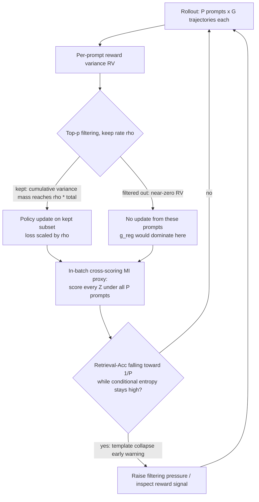

# RAGEN-2: Reasoning Collapse in Agentic RL

- arXiv: https://arxiv.org/abs/2604.06268
- Source: https://arxiv.org/abs/2604.06268
- Project: https://ragen-ai.github.io/v2/
- Local PDF: `papers/rl/agentic-algo/RAGEN2_2604.06268.pdf`
- Year: 2026
- Category: rl
- Priority: high

## 一句话总结

RAGEN-2 发现多轮 agent RL 存在一类对熵完全不可见的失败模式——template collapse（推理在单个输入内看似多样、跨输入却完全 input-agnostic），并把推理质量沿信息论分解为 within-input diversity（条件熵 $H(Z|X)$）与 cross-input distinguishability（互信息 $I(X;Z)$）两个轴：用 in-batch cross-scoring 构造无需外部模型的 MI proxy 家族做在线诊断（Trajectory MI-ZScore 与最终性能的 Spearman 相关 +0.39，熵类指标反而为 -0.11~-0.14），用 SNR 机制解释成因（低 reward variance 削弱任务梯度、使输入无关的 KL/entropy 正则主导更新），再用 SNR-Aware Filtering（按 reward variance 保留 top-p prompt，默认 $\rho=0.9$）干预——在 PPO/DAPO/GRPO/Dr. GRPO × Qwen2.5 0.5B~7B × 文本/视觉模态的 11 组设置上平均增益全为正（+0.8~+35.8），RV 计算开销仅占迭代时间 <0.1%，过滤还使每步时间下降 26-41%。

## 核心技术

1. **Template collapse 定义与四象限分类** — 以 $H(Z|X)$（within-input diversity）与 $I(X;Z)$（input dependence）为两轴划分四种推理状态：Diverse Reasoning（双高，理想 regime）、Template Collapse（高 $H(Z|X)$、低 $I(X;Z)$，现有稳定性指标的系统性盲区）、Compressed Reasoning（低 $H(Z|X)$、高 $I(X;Z)$，input-faithful 但过度确定）、Low-Entropy Collapse（双低，完全退化）。熵类指标只覆盖第一轴：塌缩发生时条件熵可以全程保持高位（图 5c），监控完全失明。
2. **MI proxy 家族（在线诊断）** — 对 batch 内 $P$ 个 prompt、每个 $G$ 条推理，teacher-forcing 计算 scoring matrix $L_{i,k,j}=\log p_\theta(Z_{i,k}\mid X_j)$，抽取 matched（真 prompt 下 per-token log-prob）与 marginal（均匀 prompt 混合下的 log-prob）两个基础量，派生六种代理：Retrieval-Acc（离散、可解释，塌缩时趋于 chance level $1/P$，$P=64$ 时为 1.56%）、Recall@$k$（$k\in\{2,4,8\}$）、MI-Est、MI-Seq-Est、MI-ZScore、MI-ZScore-EMA（连续、鲁棒，z-score + EMA 平滑，$\epsilon=10^{-3}$、$\alpha=0.9$）。全部复用训练 rollout 已有的 $(X_i, Z_{i,k})$ 对，不需要额外模型或推理 pass；first-turn 变体只用第一轮，trajectory 变体跨轮均匀采样。
3. **SNR 机制（成因解释）** — 把策略更新梯度做三噪声分解 $g_{total} = g_{signal} + g_{task\text{-}noise} + g_{reg}$：signal 与 task-noise 都在 prompt 级波动（不可直接控制，只能靠选择 prompt），$g_{reg}$（KL、entropy 正则）在 chain 级施加与输入无关的均匀收缩（可调 $\lambda_{KL}, \lambda_{ent}$）。实测（图 3，六个 RV 分位桶）：任务梯度范数随桶内 RV 单调上升、正则梯度范数跨桶平坦、最低桶里更新几乎全部由正则驱动。低 RV 时任务梯度上界 $\|g_{task}\|\le\sqrt{RV}\cdot C$ 趋零而 $g_{reg}$ 不变——更新被输入无关方向占据，$I(X;Z)\to 0$ 而 $H(Z|X)$ 不必下降。
4. **SNR-Aware Filtering（干预）** — 每次迭代用 episode return 的组内样本方差 $\widehat{\mathrm{Var}}(R\mid X)$ 作 SNR 轻量代理，按方差降序累积"方差质量"、保留累计质量达到 $\rho$ 倍总量的最小前缀（nucleus/top-p 式，但排序对象是 per-prompt 方差而非 token 概率），只在高信号子集上计算参数更新，并把 per-step loss 乘 $\rho$ 保持优化步长可比。Top-k（固定比例）、min-p（相对最大方差阈值）、reverse top-p（反向选低方差，作诊断基线）为变体；可选 `include_zero=False` 先剔除零方差组。
5. **训练监控协议** — MI 的下降显著早于任务成功率退化（图 5），构成 template collapse 的早期预警；format validity 与 MI 大体解耦（图 12），结构性正确不能替代内容敏感诊断；RV 与条件熵（Spearman -0.14）、响应长度（0.12）仅弱相关、与任务奖励强相关（0.63）——RV 是独立于表面统计的第三条控制轴，与 KL/entropy 调参正交且可叠加。

## 底层原理与数学推导

**信息论分解。** 推理多样性的边际熵按标准恒等式分解为

$$H(Z) = I(X;Z) + H(Z|X)$$

其中 $I(X;Z)$ 是 input dependence，$H(Z|X)$ 是 within-input diversity。现有熵指标只代理 $H(Z|X)$；策略完全可以维持高 $H(Z|X)$ 同时让 $I(X;Z)$ 归零。两个基础量定义为

$$\mathrm{matched}_{i,k} = \frac{L_{i,k,i}}{|Z_{i,k}|}, \qquad \mathrm{marginal}_{i,k} = \frac{1}{|Z_{i,k}|}\log\frac{1}{P}\sum_{j=1}^{P}\exp(L_{i,k,j})$$

$\mathrm{matched}$ 是推理 $Z_{i,k}$ 在真实源输入下的 per-token 对数似然，$\mathrm{marginal}$ 用 batch 内均匀 prompt 混合近似 $\log p_\theta(Z_{i,k})$。连续代理即 $\hat I(X;Z) = \frac{1}{PG}\sum_{i,k}(\mathrm{matched}_{i,k}-\mathrm{marginal}_{i,k})$，再做 z-score 与 EMA 得 MI-ZScore-EMA。离散代理 Retrieval-Acc 为 $\mathrm{Acc} = \frac{1}{PG}\sum_{i,k}\mathbb{1}[i=\arg\max_j L_{i,k,j}]$——推理若真的塌缩成模板，"从推理反推 prompt"应退化为瞎猜，chance level $1/P$ 给出绝对参照线。

**任务梯度受 RV 控制（Theorem H.2）。** 对输入 $x$ 采 $G$ 条轨迹，优势 $A^g = R^g - \bar R(x)$，任务梯度为 $g_{task}(x) = \frac{1}{G}\sum_g A^g \nabla_\theta \log\pi_\theta(\tau^g\mid x)$。取基线 $b(x)=\mathbb{E}[R\mid X=x]$（优势组内零均值，$\mathbb{E}[A^2\mid X=x]=\mathrm{RV}(x)$），对任意单位向量用 Cauchy-Schwarz：

$$\|g_{task}(x)\| \le \sqrt{\mathrm{RV}(x)}\cdot\sqrt{\mathbb{E}[\|s(z;x)\|^2 \mid X=x]}, \qquad s(z;x)=\nabla_\theta\log\pi_\theta(z\mid x)$$

**SNR 上界（Theorem H.3）。** 在奖励分解 $R=\mu(x,z)+\varepsilon$、$\mathrm{Var}(\varepsilon)=\sigma^2(x)$ 的假设下，$G$-sample Monte Carlo 梯度估计器的信噪比满足

$$\mathrm{SNR}(x) \le \sqrt{G}\cdot\sqrt{\frac{\mathrm{RV}(x)}{\sigma(x)}}$$

即信号上限由 $\sqrt{RV}$ 控制、噪声下界由 $\frac{1}{G}\sigma^2(x)\mathbb{E}\|s\|^2$ 控制。**GRPO 归一化放大低 RV 噪声（Proposition N.1）**：GRPO 把优势除以 $\sqrt{RV(x)}$，导致估计器方差下界按 $RV^{-1}$ 放大——$\mathbb{E}\|\hat g_{GRPO}-g_{GRPO}\|^2 \ge \frac{1}{K}\cdot\frac{\sigma^2(x)}{RV(x)}\cdot\mathbb{E}\|s\|^2$，低 RV prompt 在 GRPO 下受害更重。**零均值噪声仍致漂移（Theorem H.4）**：零均值的低 SNR 更新虽不系统性推错方向，但 $\mathbb{E}\|\theta_T-\theta_0\|^2 = \eta^2 T v$——参数以步数线性速率随机游走远离初始化。**模板混合侵蚀互信息（Lemma I.1）**：条件分布被 prompt 无关成分 $q(z)$ 以权重 $\alpha$ 污染后，由 KL 的联合凸性得 $I_\alpha(X;Z)\le(1-\alpha)I(X;Z)$——哪怕部分模板化也按比例侵蚀 input dependence。**熵 bonus 可能适得其反（Theorem M.2）**：$\Delta I = \Delta_{marg} - \Delta_{in}$，entropy bonus 抬升组内散度 $\Delta_{in}$ 却不保证同幅抬升边际多样性 $\Delta_{marg}$，故 $I$ 反而下降。**KL 约束只保不增（Theorem L.1）**：$\sup_x KL(\pi_\theta\|\pi_0)\le\varepsilon$ 时经 Pinsker + Fannes-Audenaert 有 $|I_\theta - I_0|\le f(\varepsilon)\to 0$——强 KL 把策略锚在参考分布附近，保住但不提升 input dependence。

**过滤算子。** 形式化为（分组函数、组统计量、阈值掩码、过滤后目标）四元组，过滤在采样之后只做梯度掩码、不改变 rollout 分布。Top-p 选择取

$$k^* = \min\left\{k:\sum_{j=1}^{k}\widehat{\mathrm{Var}}(R\mid X=x_{\sigma(j)}) \ge \rho\sum_{i=1}^{P}\widehat{\mathrm{Var}}(R\mid X=x_i)\right\}$$

其中 $\sigma$ 为按方差降序的排列；过滤后目标 $L_\rho(\theta) = \frac{1}{k^*}\sum_{i\in S}\sum_{j\in B_i}L_\theta(\xi_j)$。**过滤降低梯度估计 MSE（Theorem J.1）**：保留集 $S$ 上的过滤估计器对过滤后均值无偏，$\mathbb{E}\|\bar g_S - \hat{\bar g}_S\|^2 = \frac{1}{n^2}\sum_{i\in S}\sigma_i^2$——丢掉高噪声（低 RV）组直接压低估计误差；但对未过滤均值一般有偏，除非 $S$ 的选取与 $\{g_i\}$ 独立。

## 物理直觉解释

**熵是"字迹多样性"，不是"答案相关性"**。把 RL 训练中的 agent 想成一个正在刷题的学生：entropy 监控相当于只检查他每份卷子的字迹是不是千变万化——写得花哨就放心。Template collapse 是这个学生背会了十几个万能开头模板，每份卷子随机排列组合，字迹层面每份都不一样（高 $H(Z|X)$），但你随便抽一份答案去反推它对应哪道题，永远猜不中（$I(X;Z)\to 0$，Retrieval-Acc 跌到 1/64）。阅卷老师如果只看"字迹方差"（传统熵监控），会一路给学生打高分，直到期末考（任务评测）才发现他什么都没学会——这就是"MI 先跌、成功率后跌"这个早期预警窗口的价值。

**低 RV 的 prompt 是"没有选择压力的环境"**。进化需要变异与环境筛选同时存在：reward variance 就是环境筛选的力度——同一道题的多条 rollout 同赏同罚（$\mathrm{RV}\to 0$）时，任务梯度没有区分"哪条推理更好"的素材，强度上界 $\sqrt{RV}$ 压到零。但 KL/entropy 正则是不看题目的背景温室：它恒定地要求"推理要流畅、要多样、别离参考策略太远"。信号灯灭了、温室灯还亮着，植物就朝着温室灯的方向长——推理朝着"满足正则约束的通顺模板"生长，而与输入无关。Theorem H.4 进一步说明这种更新即使无系统性偏向，参数也会以 $\eta^2 T v$ 的速率随机游走，长期积累同样有害。

**Top-p 过滤像"只批改有区分度的考场"**。一个 batch 里既有全班都会的送分题（低 RV，批改了也学不到谁好谁坏）也有能拉开差距的题（高 RV）。Top-p 过滤把梯度预算集中到后者，且与 nucleus sampling 一样是"按质量累积"而非"按固定数量"：当整个 batch 都是送分题时，top-p 可以整批拒收（论文原文明确指出这一 natural safeguard），而 top-k 固定保留 $k$ 个，信号再烂也硬吃进去——这正是图 6 中 top-p 一致优于 top-k 的原因。它也不与 KL/entropy 调参冲突：正则调的是"字迹多样性"（$H(Z|X)$ 轴），过滤调的是"考题区分度"（信号强度轴），两个旋钮各管一轴。

**RV 过滤有效的边界条件本身可预测**。环境随机性注入实验（图 9）展示了机制的边界：随机性 0~50% 时过滤优势清晰，80~100% 时优势消失——当环境噪声大到连高努力 prompt 的回报都是纯噪声时，RV 自身失去了判别力，机制"预测了恰好这个边界条件"。Std(RV)/Mean(RV) 比值（表 8）则是训练前就能算出的廉价判据：比值高说明 RV 分布双峰、过滤能干净切分信号与噪声；比值趋零说明所有 prompt 一样"没信号"，过滤只是随机丢数据。

## 工程细节与实操指南

- 训练栈：veRL/HybridFlow，Qwen2.5 系列 + Llama3.2-3B + Qwen2.5-VL-3B，PPO/DAPO/GRPO/Dr. GRPO，最多 400 次 rollout-update 迭代
- 采样预算：每次迭代 $K = P\times G = 128$ 条轨迹/环境，默认 $P=8$、$G=16$；启用过滤后有效 minibatch 缩小、per-step loss 乘 $\rho$ 补偿
- 优化超参：update batch 32、per-GPU minibatch 4；GAE $(\gamma,\lambda)=(1.0,1.0)$；Adam $(\beta_1,\beta_2)=(0.9,0.999)$；actor LR $1\times10^{-6}$、critic LR $1\times10^{-5}$；entropy 系数 $\beta=0.001$；非对称裁剪 $\epsilon_{low}=0.2$、$\epsilon_{high}=0.28$；格式惩罚 -0.1（缺 `<think>`/`<answer>` 标签）
- 早停条件（二选一触发）：RV 跌破基线方差（前 10 迭代均值）的 10% 且连续 5 迭代；或验证成功率连续 5 个 checkpoint 低于 1%
- 评测：每环境固定 512 条验证 prompt，采样温度 $T=0.5$
- MI 监控参数：z-score $\epsilon=10^{-3}$、EMA $\alpha=0.9$；条件熵 $H(Z|X)=-\frac{1}{PG}\sum \mathrm{matched}_{i,k}$ 与边际熵 $H(Z)=-\frac{1}{PG}\sum\mathrm{marginal}_{i,k}$ 并行记录，满足 $H(Z)=\hat I(X;Z)+H(Z|X)$（log-likelihood 单位下的 scorer 代理，非严格 Shannon 恒等）
- 过滤实现：top-p 累积阈值判定加 $\varepsilon=0.01$ 保证数值稳定；`include_zero=False` 可先剔除全同奖励组；min-p 阈值 $\tau = p\cdot\max_i \widehat{Var}$；reverse top-p 用于反向消融
- 七环境测试台奖励设计：Sokoban（+1/箱入目标、-1/箱离目标、+10 完成、-0.1/步）；FrozenLake（2% 滑动随机，稀疏 +1）；MetaMathQA（首次答对 1.0、每重试减半 0.5/0.25/...）；Countdown（对 1.0、数字对结果错 0.1、格式错 0）；SearchQA/WebShop（多轮稠密）；DeepCoder（按通过测试数给奖励）
- 轮次结构：Sokoban/FrozenLake 最多 5 轮 × 每轮 2 动作 = 10 动作/轨迹；Countdown/MetaMathQA 单轮单动作
- 计算开销：RV 计算 <0.1% 迭代时间；过滤后梯度计算组数减少，步时间下降 26-41%（表 5）；$G\ge 4$ 且过滤的配置即可匹配或超过 128×1 基线

## 消融实验与分析

主结果矩阵（论文 Table 4，基线峰值 + 过滤增益；%）：

| 配置（PPO 除注明外） | Sokoban | FrozenLake | MetaMathQA | Countdown | 平均 |
|------|------|------|------|------|------|
| Qwen2.5-3B | 12.9 (+16.0) | 67.0 (+10.9) | 92.6 (+0.6) | 97.9 (+0.0) | 67.6 (+6.9) |
| DAPO, Qwen2.5-3B | 16.2 (+5.1) | 66.8 (+2.1) | 90.8 (+2.8) | 95.7 (+1.6) | 67.4 (+2.9) |
| Dr. GRPO, Qwen2.5-3B | 12.1 (-0.4) | 23.2 (+0.6) | 91.2 (+1.4) | 96.5 (+1.4) | 55.8 (+0.8) |
| Qwen2.5-0.5B | 3.3 (+22.9) | 19.5 (+0.0) | 10.0 (-0.2) | 23.0 (-0.7) | 14.0 (+5.5) |
| Llama3.2-3B | 24.4 (+18.8) | 84.6 (-0.2) | 86.1 (+3.7) | 99.2 (-1.2) | 73.6 (+5.3) |
| Qwen2.5-VL-3B (V) | 65.0 (+12.0) | 19.5 (+59.5) | - | - | 42.3 (+35.8) |

过滤指标消融（论文 Table 9，Sokoban + Qwen2.5-3B；Perf 为峰值成功率、MI 为峰值步的 retrieval accuracy）：

| 过滤指标 | Task Perf | MI Proxy | Entropy | 训练稳定 |
|------|------|------|------|------|
| 无过滤（基线） | 0.17 | 0.54 | 2.76 | 崩溃 |
| Reward Variance | 0.38 (+0.20) | 0.84 (+0.29) | 1.64 (-1.12) | 稳定 |
| Reward Sum | 0.24 (+0.07) | 0.80 (+0.26) | 4.18 (+1.42) | 崩溃 |
| Entropy | 0.20 (+0.02) | 0.41 (-0.14) | 2.20 (-0.56) | 崩溃 |
| Length | 0.16 (-0.02) | 0.91 (+0.36) | 1.65 (-1.10) | 崩溃 |
| Keep Smallest（反向对照） | 0.29 (-0.15) | 0.47 (-0.42) | 5.31 (+3.84) | 稳定 |

RV 四分位因果消融（论文 Table 6，Sokoban，Q1 最高 RV，每步只更新 25% prompts）：

| 四分位 | RV 范围 | Task Perf (%) | MI Proxy | Entropy |
|------|------|------|------|------|
| Q1 | [4.4-5.6] | 21.1 | 0.95 | 2.02 |
| Q2 | [1.5-4.2] | 19.5 | 0.93 | 1.53 |
| Q3 | [0.0-0.2] | 10.7 | 0.81 | 1.41 |
| Q4 | [0.0-0.1] | 11.0 | 0.73 | 1.87 |

其余关键消融数字：prompt 级 vs trajectory 级（Table 7）——无过滤 12.9%/MI 0.83，prompt 级 RV（$\rho=0.9$）23.6%/1.80，trajectory 级（每 prompt 留 top-8/bottom-8）16.8%/0.20；可预测性判据（Table 8）——Sokoban 14B Std/Mean(RV)=1.29 → 过滤 +4.6%，Sokoban 3B 1.16 → +3.2%，FrozenLake 3B (GRPO) 0.33 → -5.0%。

**核心结论：** (1) 四分位消融给出因果链——Q1→Q4 任务性能 21.1→11.0、MI 0.95→0.73 单调退化，配合定理 H.2 的 $\|g_{task}\|\le\sqrt{RV}\cdot C$，确立 reward variance → 梯度质量 → 输入依赖推理的因果方向，而非仅相关；(2) 过滤指标的选择是决定性的——RV 是唯一同时提升性能（+0.20）且防止崩溃的指标，entropy 过滤使 MI 降到基线之下（-0.14），length 过滤 MI 虽最高（0.91）但性能最低（0.16）且照常崩溃——"保多样性"与"保输入依赖"是两个独立目标；(3) 反向对照（keep smallest：0.44→0.29、熵 1.47→5.31）证明高方差组本身携带训练信号，不是过滤的间接副作用；prompt 级（23.6%）显著优于 trajectory 级（16.8%），说明收益来自"选择天然有区分度的 prompt"，而非"丢弃困难轨迹"；(4) 启用过滤前可先算 Std(RV)/Mean(RV)：>1 时有效（+3.2%~+4.6%），约 0.33 时随机丢数据（-5.0%）——这是一个训练前即可决策的免费诊断；(5) 模型越小、模态越难（VL-3B FrozenLake +59.5）过滤收益越大，能力强的模型/简单任务的 RV 本来就高，过滤空间小。

## 技术权衡（Trade-off）

| 优势 | 劣势与工程代价 |
|------|------|
| 诊断近乎免费：MI proxy 复用训练 rollout 的 (X, Z) 对，无需外部模型或额外推理 pass | $I(X;Z)$ 是 in-batch 经验代理：batch 内 prompt 同质时 retrieval 任务本身就容易，MI 估计的绝对值不可跨 batch 比较 |
| 过滤即插即用：RV 计算 <0.1% 迭代时间，还附带 26-41% 步时间节省 | 依赖 reward variance 是可靠的信号代理——稀疏/高噪声奖励下退化（FrozenLake GRPO 上 -3.0，表 4；噪声注入 80-100% 时优势消失） |
| 与 KL/entropy 正交可叠加：正则调 $H(Z\mid X)$ 轴，过滤提信号轴，DAPO 可视为 $\rho\to 1.0$ 的固定特例 | SNR 分解假设 signal 与正则噪声干净分离，实践中二者经梯度积累耦合（论文自述局限） |
| 跨 4 算法 × 4 规模 × 2 模型族 × 2 模态平均增益全为正 | 激进过滤收窄探索覆盖，keep mass $\rho$ 需按任务调；能力强的模型可能人为拉高 reward variance 骗过过滤（长期风险待监测） |

## 技术价值与演进定位

RAGEN-2 的价值在于把"agent RL 不稳定"从一句经验之谈推进为可测量、可解释、可干预的三段式框架。测量层面，它指出整个社区默认的监控量（熵）测的是推理质量两个正交轴中无关紧要的那个——四象限分类里 Template Collapse 恰好是"熵高 + 输入无关"的盲区象限，而 MI proxy 用 in-batch retrieval 这种零成本构造把这个盲区照亮，Spearman +0.39 对 -0.11~-0.14 的方向性反差说明熵不只是弱、而是会误导。解释层面，SNR 机制把塌缩归因到梯度层面（低 RV 削弱任务信号、reward-agnostic 正则恒定收缩），并给出四个可证伪的预测（RV 因果干预、噪声注入、prompt vs trajectory 级、Std/Mean 边界条件），全部被实验证实——这是一套少见的"现象学 + 机制 + 边界条件"完整闭环。干预层面，SNR-Aware Filtering 刻意做得极其轻量（不引入模型、不改 rollout、可选叠加在任意 policy gradient 算法上），与 DAPO 的关系（固定阈特例）说明它可以统一理解这一族"动态采样"技巧。在算法与稳定性子线里，它回答的问题是 credit assignment 讨论经常跳过的前置问题：当同组 rollout 根本分不出好坏时，任何更细粒度的优势估计都无米下锅——先保证更新里有信号，再谈信号怎么分。

## 与其他论文的关系

- RAGEN（arXiv 2504.20073，前作）：本作沿用其测试台（Sokoban/FrozenLake/MetaMathQA/Countdown + veRL 栈）与 StarPO 训练默认值——前作记录了多轮 RL 自演化的不稳定现象，本作将其推进到"量化指标（MI proxy）+ 机制（SNR）+ 干预（filtering）"的完整框架。
- reasoning-to-agentic（信用分配综述线，notes/rl/reasoning-to-agentic.md）：综述线回答"有信号时如何把功劳分到步"，本作回答"信号本身何时消失"——低 RV 时任何 step-level credit assignment 都在噪声上运算，两线构成前置依赖关系。
- GTR / EPO（论文引用 [61][62]）：GTR 用 guided thought reward 给推理链加外部奖励对抗 thought collapse、EPO 用熵正则化策略优化——都是"加约束/加信号"路线；本作证明这两类方法移动的是 $H(Z|X)$ 轴，对 $I(X;Z)$ 轴的塌缩基本无效（图 13 三干预对比）。
- DAPO（论文引用 [68]）：其动态采样/接受步可解读为本框架的固定选择特例（top-P 且 $P\to 1.0$）；SNR-Aware Filtering 提供显式可调的 $\rho$ 旋钮与 MI 监控回路。
- arlarena / polar（同库 agentic RL 稳定性线）：arlarena 做统一稳定训练框架、polar 做 harness 无关的规模化训练——均在系统层面对抗不稳定；本作提示这类框架应接入 MI 类监控，否则 template collapse 会在 reward/entropy 双稳定的表象下持续。
- lite-researcher / harness-1（search agent RL，同批）：多轮搜索推理 agent 同样以 reasoning 质量决定任务成败——RV 过滤 <0.1% 的开销使其可作为这两个训练框架的默认插件；MI 早期预警窗口（MI 先于成功率下跌）为长训 run 提供止损信号。
- dataprm（process reward 线，同批）：process reward 通过给中间步加稠密信号提高区分度，与本作"选择高区分度 prompt"是抬高 SNR 的两条不同入口；RV 判据（Std/Mean）也可用来决定何时值得引入 process reward。
- harbor / enpire（机器人侧对照）：机器人自改进训练同样监控熵与成功率——"策略多样但输入无关"的塌缩模式在机器人遥操作/自训练数据上是否同样出现、MI 的 cross-scoring 在视觉 observation 下如何构造，是本作诊断框架向具身侧迁移的开放问题。

## 精读问题

1. MI proxy 的 in-batch cross-scoring 依赖 batch 内 prompt 有足够主题差异——当任务分布高度同质（如同一模板生成的数学题）时，retrieval 任务本身就接近随机猜，MI 估计的偏差如何随 batch 组成漂移？是否需要一个跨 batch 的固定 prompt 锚池来校准？
2. 论文自述 SNR 分解假设 signal 与正则噪声干净分离、实践中经梯度积累耦合——在引入 process reward 或 reward shaping（如 dataprm 线）后，shaping 噪声会被 RV 当作"信号"保留下来，此时 $\widehat{Var}(R|X)$ 作为 SNR 代理是否会系统性失效？
3. "能力强的模型人为拉高 reward variance 骗过过滤"这一风险，在多长的训练尺度下会实际显现？是否可以通过监控"RV 高但 MI 不升"的解离模式作为模型 gaming 过滤器的早期信号？
4. MI 下降先于成功率退化的预警窗口有多长（图 5 中约几十步）？在窗口内介入（提高过滤压力/回滚）能挽回多少最终性能——论文只展示了相关性，没有给出干预时机-收益曲线？
5. Compressed Reasoning（低 $H(Z|X)$、高 $I(X;Z)$）象限是 RL 专业化的自然终点还是另一种病理？论文对该 regime 着墨很少——什么任务分布下"高输入依赖 + 低多样性"是不可接受的？
6. 视觉模态实验（Qwen2.5-VL-3B）中 $I(X;Z)$ 的 cross-scoring 在图像 prompt 上如何实现、token 开销多大？+59.5 的巨大增益是否部分来自视觉 rollout 的原始 RV 天然更高（环境随机性更大）而非过滤机制本身？
